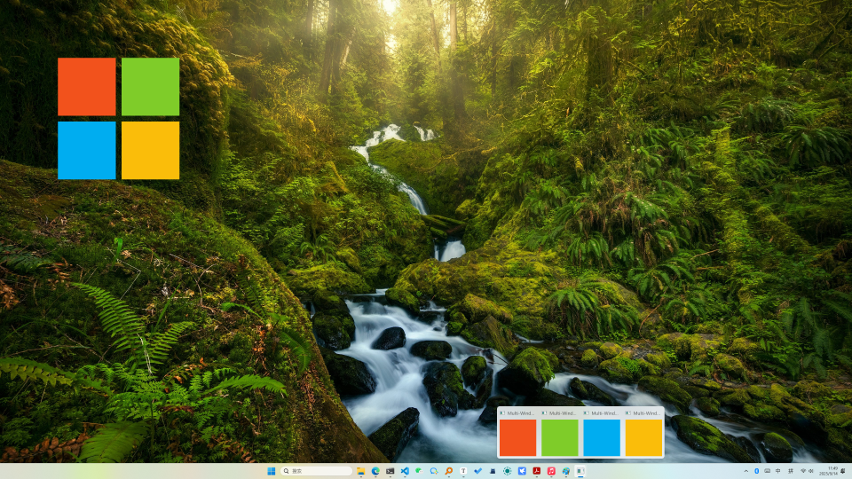

# Hello glbinding

之前一直使用 glad 作为 opengl 的函数加载器，但是其提供的调试功能十分有限，特别是多线程和多context下的调试（虽然主要都是通过 `glGetError`，但是每次手动添加这句话就很繁琐）。经过一番搜索，发现另外一个 opengl 加载库 [glbinding](https://github.com/cginternals/glbinding)，相对于 glad 能提供更多实用功能。

下面展示了通过 glbinding 绘制 [glfw 样例 windows](https://github.com/glfw/glfw/blob/3.4/examples/windows.c) 所需要做的改动

```diff
index 1589ffb..3d0745e 100644
--- "a/.\\examples\\windows.c"
+++ "b/..\\examples\\windows.c"
@@ -23,14 +23,16 @@
 //
 //========================================================================
 
-#define GLAD_GL_IMPLEMENTATION
-#include <glad/gl.h>
+#include <glbinding/gl/gl.h>
+#include <glbinding/glbinding.h>
 #define GLFW_INCLUDE_NONE
 #include <GLFW/glfw3.h>
 
 #include <stdio.h>
 #include <stdlib.h>
 
+using namespace gl;
+
 int main(int argc, char** argv)
 {
     int xpos, ypos, height;
@@ -80,7 +82,7 @@ int main(int argc, char** argv)
         glfwSetInputMode(windows[i], GLFW_STICKY_KEYS, GLFW_TRUE);
 
         glfwMakeContextCurrent(windows[i]);
-        gladLoadGL(glfwGetProcAddress);
+        glbinding::initialize(glfwGetProcAddress);
         glClearColor(colors[i].r, colors[i].g, colors[i].b, 1.f);
     }
```

主要改动点有3处：

1. 调整 glad 头文件为 glbinding头文件，`glbinding/gl/gl.h` 和 `glbiinding/glbinding.h`
2. 使用命名空间 `using namespace gl;`
3. 调整 glad 的函数加载语句为 `glbinding::initilize`

其他的使用则和 glad 一样，直接使用相关的 opengl 函数即可（从这个案例看上去似乎没什么区别，用 glad 还更简单，毕竟是 header-only 的），在后续的小节中会不断介绍 glbinding 提供的实用功能。

编都编了，顺便展示一下吧（才...才不是因为好看才放出来的🤐）



<!-- more -->


# Debug Facility

使用 glbinding 的一个重要的原因就是相对于 glad，其提供的调试功能更加完善，尤其是在多线程-多context的场景下，下面就简单介绍下如何开启 glbinding 的调试功能。


# Use with Conan 

pass

