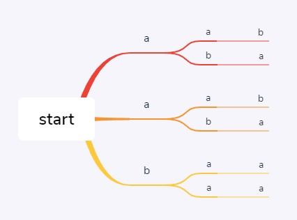

# 剑指 Offer 38. 字符串的排列

题意：

输入一个字符串，打印出该字符串中字符的所有排列。

你可以以任意顺序返回这个字符串数组，但里面不能有重复元素。

思路：

这题是个很常规的题目，面试时也会经常问道，对于排列组合类的题目，首先想到的思路就是DFS，通过回溯找到所有的解。这一题除了输出所有的排列外，还给出了一个新的要求，不能包含重复元素

<!-- more -->

例如输入`aab`，三位的全排列应该是6个，即

```
a1 a2 b
a1 b a2
a2 a1 b
a2 b a1
b a1 a2
b a2 a1
```

但由于此时字符串中a1和a2是相同字符，因此去除重复元素之后仅包含三种排列，即



aab

aba

baa

因此这题的思路也非常清晰了，下面给出两种解法

思路1：

找出包含重复的全部排列，再使用Set进行去重

思路2：

在查找时进行剪枝，不进行重复的搜索

常规的全排列算法如下

```java
void dfs(StringBuilder sb,String s,List<String> res,boolean[] visited,int n,int p){
    if(p == n){
        res.add(sb.toString());
        return;
    }
    for(int j=0;j<n;++j){
        if(!visited[j]){
			sb.append(s.charAt(j));
            visited[j] = true;
            dfs(sb,s,res,visited,n,p+1);
            sb.deleteCharAt(s.length()-1);
            visited[j] = false;
        }
    }
}
```

可绘制搜索树如下：


对于解法1而言，只需要将存储结果的List转换成Set，就可以实现去重，但是算法本身会进行很多重复搜索，从而降低算法效率，使用Set只是治标不治本

解法一代码：

```java
void dfs(StringBuilder sb,String s,Set<String> res,boolean[] visited,int n,int p){
    if(p == n){
        res.add(sb.toString());
        return;
    }
    for(int j=0;j<n;++j){
        if(!visited[j]){
			sb.append(s.charAt(j));
            visited[j] = true;
            dfs(sb,s,res,visited,n,p+1);
            sb.deleteCharAt(s.length()-1);
            visited[j] = false;
        }
    }
}
```

从搜索树中可以看到，只要字符串中存在相同的字符，就一定会进行重复搜索，因此需要剪枝

解法二代码：

```java
// 还需要提前对s进行排序
void dfs(StringBuilder sb,String s,List<String> res,boolean[] visited,int n,int p){
    if(p == n){
        res.add(sb.toString());
        return;
    }
    for(int j=0;j<n;++j){
        if(visited[j] || (j>0 && !visited[j-1] && s.charAt(j-1) == s.charAt(j))){
			continue;
        }
        sb.append(s.charAt(j));
        visited[j] = true;
        dfs(sb,s,res,visited,n,p+1);
        sb.deleteCharAt(s.length()-1);
        visited[j] = false;
    }
}
```

剪枝代码：`visited[j] || (j>0 && !visited[j-1] && s.charAt(j-1) == s.charAt(j))`