之前都是在知乎上写博客，这样看的人也多，方便讨论，但是知乎的 markdown 编辑器不是很好用，本地写完后还需要一张一张上传图片，太麻烦了，就自己搭一个博客，又不想进行域名备案啥的，服务器也要出钱 :( 。最后搜到 Github 有提供免费的静态页面部署功能，这样写完 markdown 笔记可以直接上传到 Github，还可以通过网页访问，nice！(白嫖的感觉真好)

# Github Pages

## 创建主页仓库

通过 [Github Pages](https://pages.github.com/)，我们可以将 markdown 撰写的笔记转换成静态网页，并进行部署。其创建流程也十分简单，只需要创建一个名为 `<username>.github.io` 的仓库，如下图所示

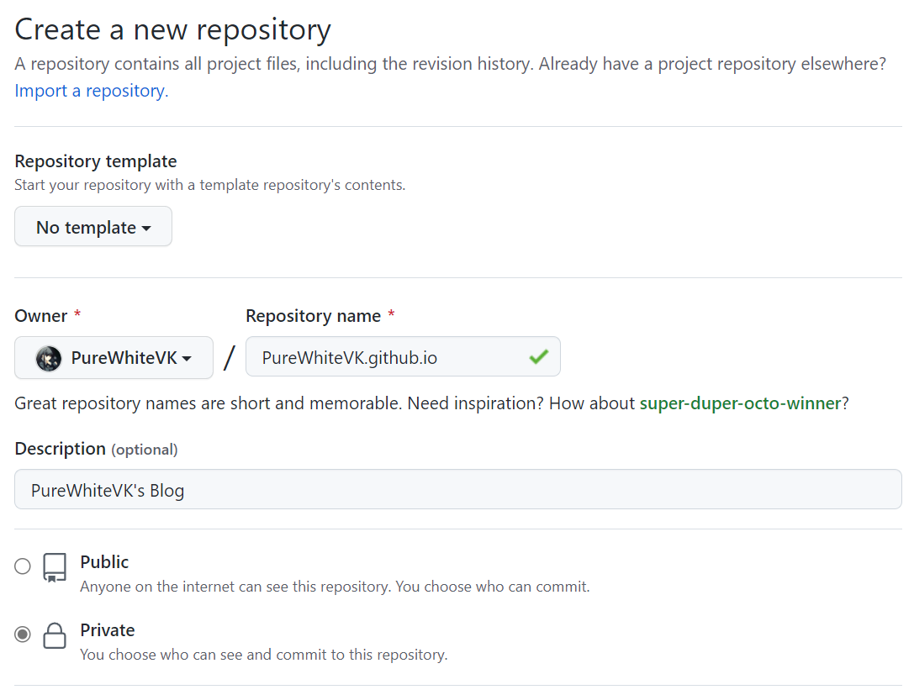

此处我们选择的是 Private 仓库，只有我们能进行修改，但是主页是公开访问的，这样可以保证笔记源文件安全 :) 。

<!-- more -->

创建完成后仓库中什么都没有

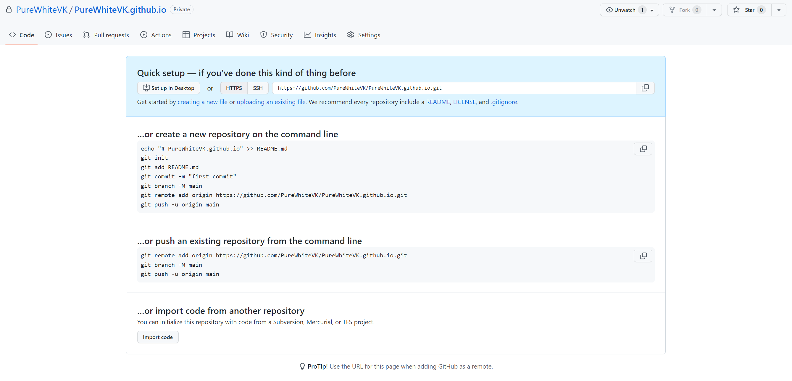

此时我们在浏览器中输入 [https://purewhitevk.github.io](https://purewhitevk.github.io) （URL不区分大小写，直接用小写即可），显示404，页面不存在。

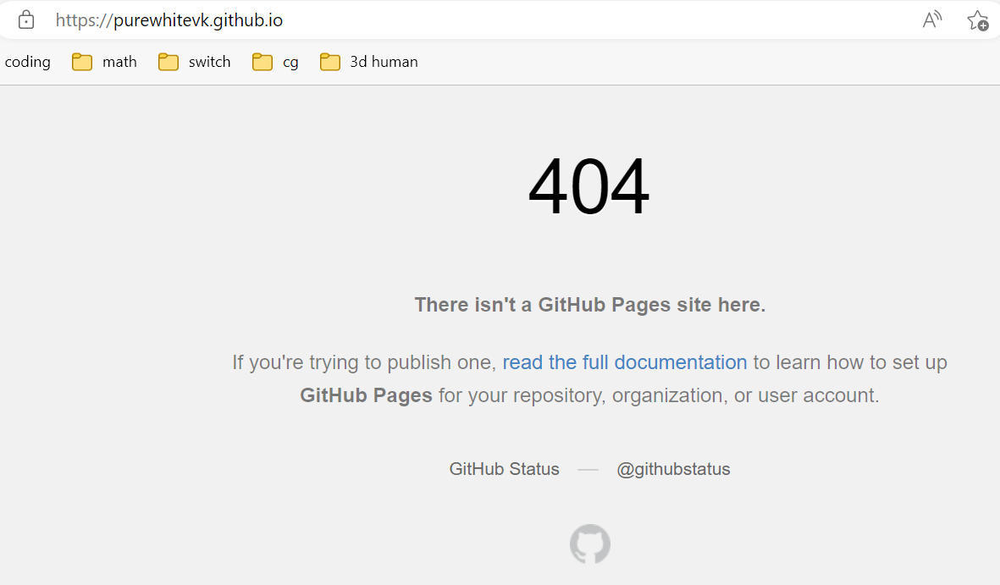

别心急，很快就可以看到博客页面了。

## 静态博客框架

在网上搜了一下，有很多博客框架，例如 wordpress 等，但是 wordpress 需要数据库，还需要单独配服务器进行部署，太麻烦了，满足我们需求的有三个

- Jekyll（Github 原生支持）

  使用 Ruby 实现

- Hexo

  使用 Node.js 实现

- Hugo

  使用 Go 实现

三者在功能上大同小异，都可以直接将 `.md` 文件转换成`html` 文件，且支持部署在 Github Pages 上。个人比较推荐 [Hexo](https://hexo.io/)，其环境搭建起来比较方便，且插件较多，操作起来比较简单。

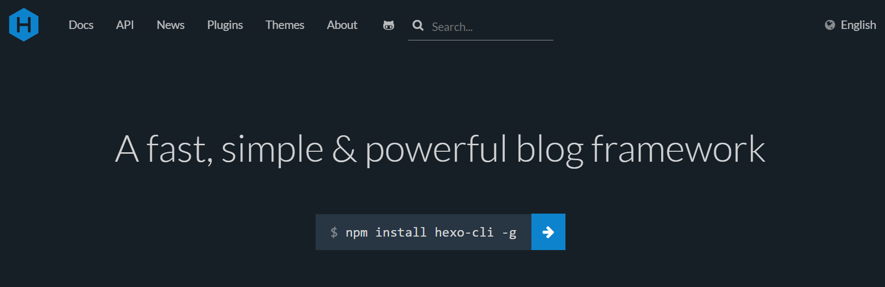


# hexo环境配置

## 安装

1. 全局安装 hexo-cli，这样我们可以直接调用 hexo 的命令行命令

   ```bash
   npm install hexo-cli -g
   ```

2. 将我们的主页仓库 clone 到本地，此处我们将其放到文件夹 `Note` 下

   ```bash
   git clone https://github.com/PureWhiteVK/PureWhiteVK.github.io.git Note
   ```

3. 下载 [hexo-starter](https://github.com/hexojs/hexo-starter) 并解压到本地仓库中

   点击右侧  `Code`  按钮，直接下载 ZIP 压缩包即可（其实我们也可以直接 fork 这个仓库，但是这样我们的仓库就不能是 private 了）

   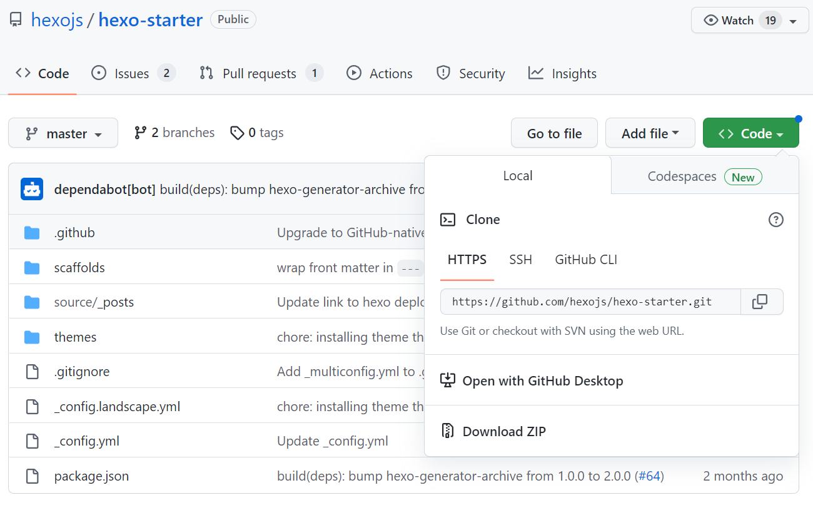

4. 使用  `npm install`  安装依赖

5. 输入 `hexo server` 进行运行本地服务

   ```bash
   (base) PS D:\Code\Note> hexo server
   INFO  Validating config
   INFO  Start processing
   INFO  hexois running at http://localhost:4000/ . Press Ctrl+C to stop.
   ```

   在浏览器中打开 `localhost:4000`，就可以预览生成后的静态页面效果了

   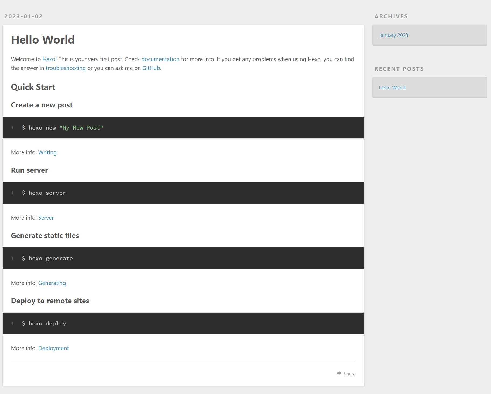
   
   

## 主题

hexo 上有很多精美的主题，这里我们选择 [next](https://github.com/theme-next/hexo-theme-next) 作为博客主题，其比较稳定，功能也很全。

直接使用 npm 进行安装即可

```bash
npm install --save hexo-theme-next
```

安装之后，我们需要将主题配置文件 `node_modules/hexo-theme-next/_config.yml` 拷贝至根目录下，并重命名为 `_config.next.yml`

最终修改根目录下的 `_config.yml` 即可，将其更换为我们需要的主题

```yml
# Extensions
## Plugins: https://hexo.io/plugins/
## Themes: https://hexo.io/themes/
theme: next
```

最后清理之前生成的文件，并重建部署一下

```bash
hexo clean && hexo server
```

主题效果如下

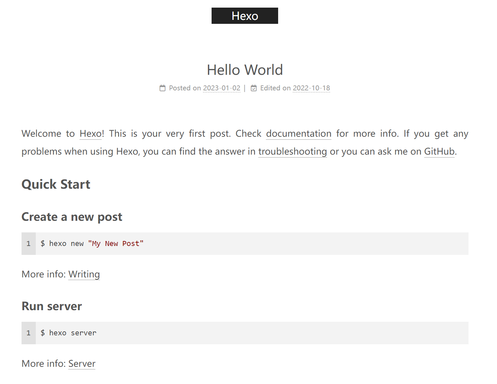


## 插件

hexo 提供了很多插件来简化我们的操作，并提供一些其他的功能。由于 hexo 是基于 node.js 实现的，我们可以通过 npm 来安装和卸载 hexo 插件。

安装插件命令

```bash
npm install --save <plugin-name>
```

删除插件命令

```bash
npm uninstall --save <plugin-name>
```

我们使用了以下几个插件（具体配置可以直接参考 hexo-next-theme 的插件使用文档：[Third-party Plugins | NexT](https://theme-next.js.org/docs/third-party-services/) 即可）

- hexo-generator-searchdb：实现搜索功能，支持html文件检索
- hexo-abbrlink：自动生成文章的永久链接
- hexo-word-counter：统计文章字数

## 配置

hexo的配置文件位于根目录下的 `_config.yml`，下面列举了我们需要修改的一些关键配置项

### 网站基本设置

```yml
title: "PureWhite's Blog"
subtitle: ''
description: ''
keywords:
author: PureWhiteVK
language: zh-CN
timezone: Asia/Shanghai
```

### URL设置

```yml
url: https://purewhitevk.github.io
# 这样我们笔记永久链接为 https://purewhitevk.github.io/posts/43fc/
permalink: posts/:abbrlink/ 
# 我们使用了 hexo-abbrlink 插件，其通过对名称以及时间戳使用 crc16 算法，生成四位的一个唯一编码
# 四位十六进制可以表示 65536 篇文章，这对于我们博客而言已经绰绰有余了
abbrlink:
  alg: crc16
  rep: hex
permalink_defaults:
pretty_urls:
  # 末尾的index后缀
  trailing_index: false
  # 末尾的.html后缀
  trailing_html: false
```

### 写作相关配置

这里我们主要调整生成 hexo 生成的 markdown 文件名称

```yml
# File name of new posts
new_post_name: :year/:month/:day/:title.md
```

hexo 添加 post 命令

```bash
hexo new [layout] <title>
```

示例

```bash
(base) PS D:\Code\Note> hexo new post "Hello World"
INFO  Validating config
INFO  Created: D:\Code\Note\source\_posts\2023\01\02\Hello-World.md
```

markdown 文件内容如下

```markdown
---
title: Hello World
date: 2023-01-02 17:03:17
tags:
---
```

其会默认包含一些内容，其中用三横线包裹起来的是 Front Matter，其用来标识 markdown 文档的一些属性，例如标题、创建日期、标签（tags）、类别（categories）、永久链接等，hexo 通过读取 Front Matter 来控制生成的 html 文件。

### next 主题配置

前面提到，我们从 `node_modules` 中将 next 的配置拷贝至了根目录，并重命名为 `_config.next.yml`，主题相关的配置直接在这个文件中进行修改即可，next 中提供了非常多的配置项，就不一一介绍了，详细可以直接参考Next主题文档：[NexT - Theme for Hexo](https://theme-next.js.org/)

## 图片

由于 markdown 和 html 在使用上的区别（markdown 本地，html 网络），我们在 markdown 中插入图片

```markdown

```

会被直接转换成 html 的 `img` 标签

```html

```

但是一个是本地路径，一个是网络 URI，直接这么转换肯定会问题。

参考 hexo 的[资源管理文档]([Asset Folders | Hexo](https://hexo.io/docs/asset-folders))，在 hexo 中，最简单的图片管理方式就是将图片文件放置在 `source/images` 文件夹下，这样在网页中我们可以直接通过 `/images/<image-name>` 进行访问。

> Assets are non-post files in the `source` folder, such as images, CSS or JavaScript files. For instance, If you are only going to have a few images in the hexoproject, then **the easiest way is to keep them in a `source/images` directory.** Then, you can access them using something like 
>
> ````markdown
> 
> ````

markdown 写法

```markdown

```

> 注意images前面的 `/` ，必须包含这个斜杠，否则图片路径就变成了相对当前URL的路径，会导致图片访问出错。加上`/` 就表示是相对域名的URL，即 `https://purewhitevk.github.io/images/image.jpg`；而不加`/`时就是相对当前网址的URL，假设我们当前网址为 `https://purewhitevk.github.io/posts/abcd` ，那么对应的图片URL为  `https://purewhitevk.github.io/posts/abcd/images/image.jpg`，这样就会导致找不到图片。（通过相对路径读取图片文件也是一种可行的方式）

对应生成的 html 代码

```html

```

但是这样我们在本地使用 typora 编写 markdown 时就会有问题，好在 typora 也给出了解决方案：[Images in Typora - Typora Support](https://support.typora.io/Images/#relative-path-to-certain-folder)。只需要在 markdown 的 Front Matter 中添加两个属性，将 markdown 中所有的图片路径都修改成相对某个路径的绝对路径即可（也就是`/relative/to/some-image.png`的形式）。

```yml
# 设置相对的路径，设置根目录为 source
typora-root-url: ../../../../
# 插入图片时自动拷贝图片到 source/images/ 下
typora-copy-images-to: ../../../../images
```

我们的文章都位于 `source/_posts/<year>/<month>/<day>` 路径下，图片存储路径为`source/images`下，通过设置`typora-root-url`，当我们在markdown中插入一张路径为 `/images/image.jpg` 时，其会自动将 `typora-root-url`和该路径进行拼接，最终结果就是 `../../../../images/image.jpg`，正确读取到图片。另外一个便捷的功能就是插入图片时自动拷贝到指定文件夹，这样我们可以丝滑的添加图片了，不需要手动上传并设置链接。

我们可以将这两个配置项添加到 markdown 模板中（hexo 中称为 scaffold，脚手架），就不用每次都手动添加，修改 `scaffolds/post.md` 如下

```yml
---
title: {{ title }}
date: {{ date }}
tags:
category:
mathjax: false
typora-root-url: ../../../../
typora-copy-images-to: ../../../../images
---
# 此处 more 标签用于 next 主题显示摘要
<!-- more -->
```

这样我们通过 `hexo new post <title>` 时就会默认配置好 typora。

附：typora的图像存储相关设置

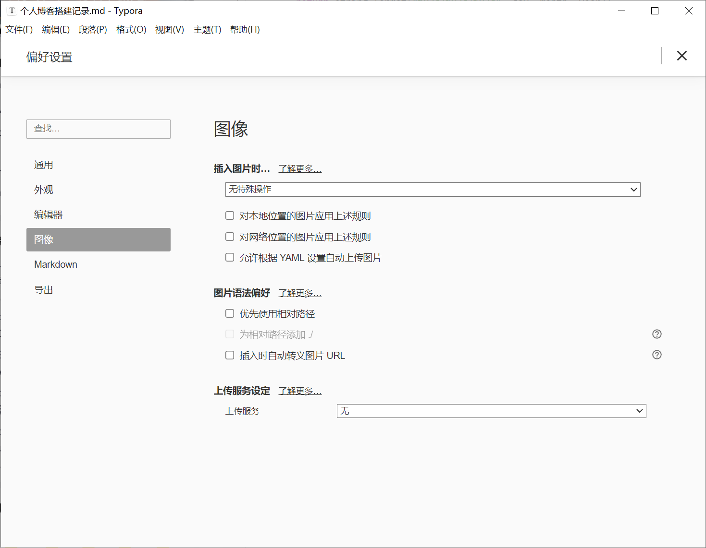

由于我们使用 Front Matter 进行配置，在图像处就不需要任何配置了。

## 公式

另外一个比较令人头疼的就是公式渲染问题，latex 公式在语法上和 markdown 存在一些冲突，如果使用默认的 `hexo-renderer-marked ` 渲染引擎进行生成会导致最终渲染出来的 latex 公式是错误的，我们需要将 markdown 渲染引擎替换为 `hexo-renderer-pandoc`。

```bash
# 首先删除原来的渲染器
npm uninstall --save hexo-renderer-marked
# 安装新的渲染器
npm install --save hexo-renderer-pandoc
```

然后在 next 主题的配置文件 `_config.next.yml` 中开启 mathjax 的支持

```yml
math:
  # Default (false) will load mathjax / katex script on demand.
  # That is it only render those page which has `mathjax: true` in front-matter.
  # If you set it to true, it will load mathjax / katex script EVERY PAGE.
  every_page: false

  mathjax:
    enable: true # <--- 将此处 false 修改为 true
    # Available values: none | ams | all
    tags: none

  katex:
    enable: false
    # See: https://github.com/KaTeX/KaTeX/tree/master/contrib/copy-tex
    copy_tex: false
```

写一个简单的公式测试一下效果

```latex
$$
\int _0 ^\pi \sin x \,\mathrm{d} x = 2
$$
```

对应渲染结果
$$
\int _0 ^\pi \sin x \,\mathrm{d} x = 2
$$
如果可以正确看到公式就说明公式配置成功。

## 部署

在 hexo 官网中给出了 Github Pages 的部署方式：[GitHub Pages | Hexo](https://hexo.io/docs/github-pages)，由于我们会将源代码也上传至  Github 仓库，我们使用 Github Workflow 的方式来自动执行部署过程。

其部署过程很简单

1. 提交代码 （push）
2. 执行 workflow 中指定的操作，安装 node.js，执行相关命令生成静态页面
3. 通过 Github Pages 展示静态页面

由于我们将hexo的markdown渲染器修改为`hexo-renderer-pandoc`，其需要提前安装好 pandoc 并添加到环境变量，我们需要在官方提供的workflow中修改一下，在容器中安装好 pandoc，网上一搜发现也有大佬已经分享了 pandoc 的配置命令：[nikeee/setup-pandoc](https://github.com/nikeee/setup-pandoc)，直接拿过来用即可

```yml
- uses: nikeee/setup-pandoc@v1
  with:
    pandoc-version: '2.7.3' # The pandoc version to download (if necessary) and use.
```

最后根据本地使用的 node.js 和 pandoc 版本，将其修改成对应的版本即可

```bash
(base) PS D:\Code\Note> node --version
v18.12.1
(base) PS D:\Code\Note> pandoc --version
pandoc.exe 2.19.2
Compiled with pandoc-types 1.22.2.1, texmath 0.12.5.2, skylighting 0.13,
citeproc 0.8.0.1, ipynb 0.2, hslua 2.2.1
Scripting engine: Lua 5.4
User data directory: C:\Users\xiao\AppData\Roaming\pandoc
Copyright (C) 2006-2022 John MacFarlane. Web:  https://pandoc.org
This is free software; see the source for copying conditions. There is no
warranty, not even for merchantability or fitness for a particular purpose.
```

完整的 workflow 配置代码如下

```yml
name: Pages

on:
  push:
    branches:
      - main  # default branch

jobs:
  pages:
    runs-on: ubuntu-latest
    steps:
      - uses: actions/checkout@v3
        with:
          token: ${{ secrets.GITHUB_TOKEN }}
          submodules: recursive
      - name: Use Pandoc 2.19.2
        uses: nikeee/setup-pandoc@v1
        with:
          pandoc-version: "2.19.2"
      - name: Use Node.js 18.12.1
        uses: actions/setup-node@v2
        with:
          node-version: "18.12.1"
      - name: Cache NPM dependencies
        uses: actions/cache@v2
        with:
          path: node_modules
          key: ${{ runner.OS }}-npm-cache
          restore-keys: |
            ${{ runner.OS }}-npm-cache
      - name: Install Dependencies
        run: npm install
      - name: Build
        run: npm run build
      - name: Deploy
        uses: peaceiris/actions-gh-pages@v3
        with:
          github_token: ${{ secrets.GITHUB_TOKEN }}
          publish_dir: ./public
```


由于我们仓库实际上还没有初始化，需要使用 git 初始化一下仓库再进行提交，初始化命令如下

```bash
git init
git add .
git commit -m "Initial commit"
git branch -M main
git remote add origin https://github.com/PureWhiteVK/PureWhiteVK.github.io.git
git push -u origin main
```

提交之后代码后，我们可以在 Actions 面板中看到正在执行的 Workflows

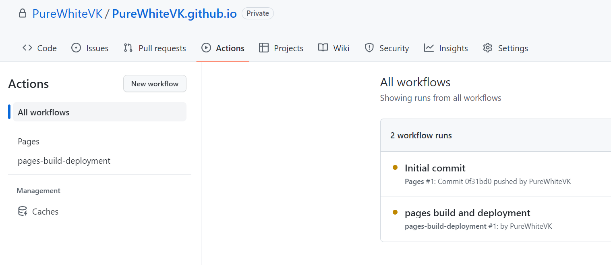

第一次 pages build and deployment 一定会执行失败，因为我们还没设置 Github Page 部署时使用的分支，hexo 的 workflow 在执行后会单独创建一个分支（gh-pages）来存放静态网页，我们在设置中切换一下即可。

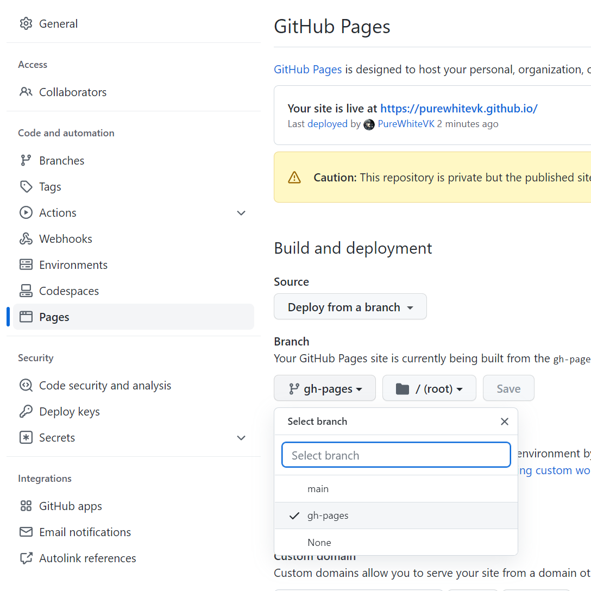

调整完成后，可以看到提示我们网站已经上线了（Your site is live at [https://purewhitevk.github.io](https://purewhitevk.github.io)），进入 [https://purewhitevk.github.io](https://purewhitevk.github.io) 就可以访问到部署好的博客页面了。（github.io访问速度可能较慢，最好挂梯子）

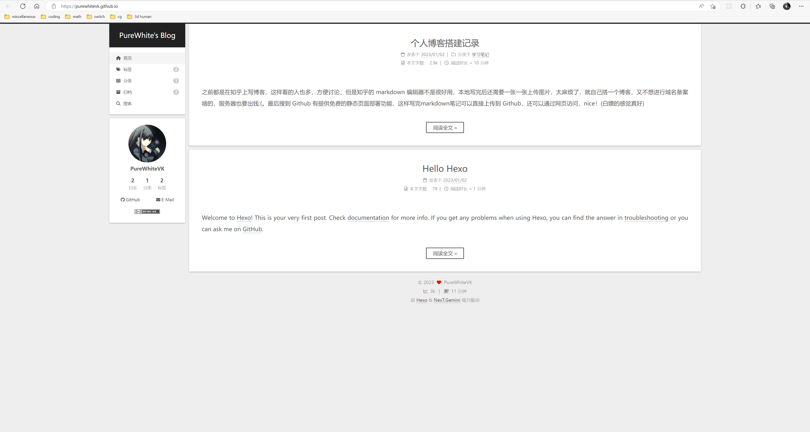

