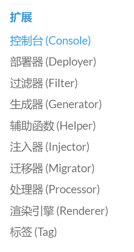
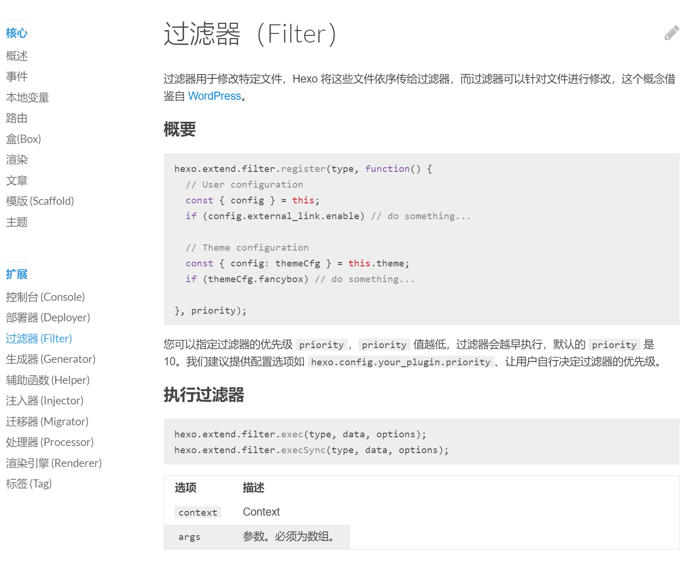
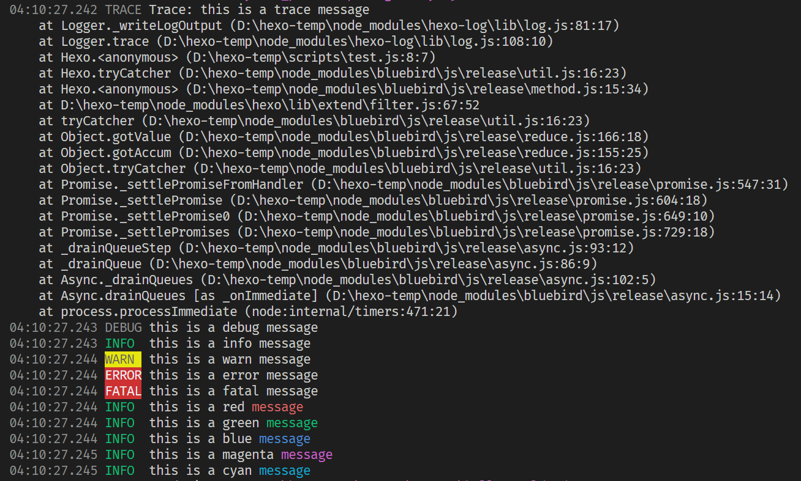
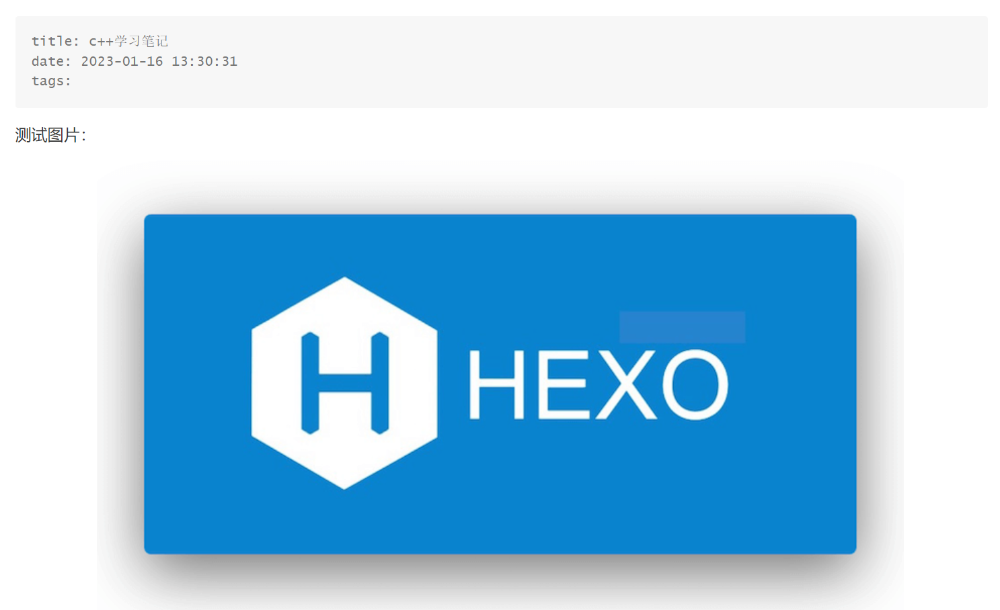
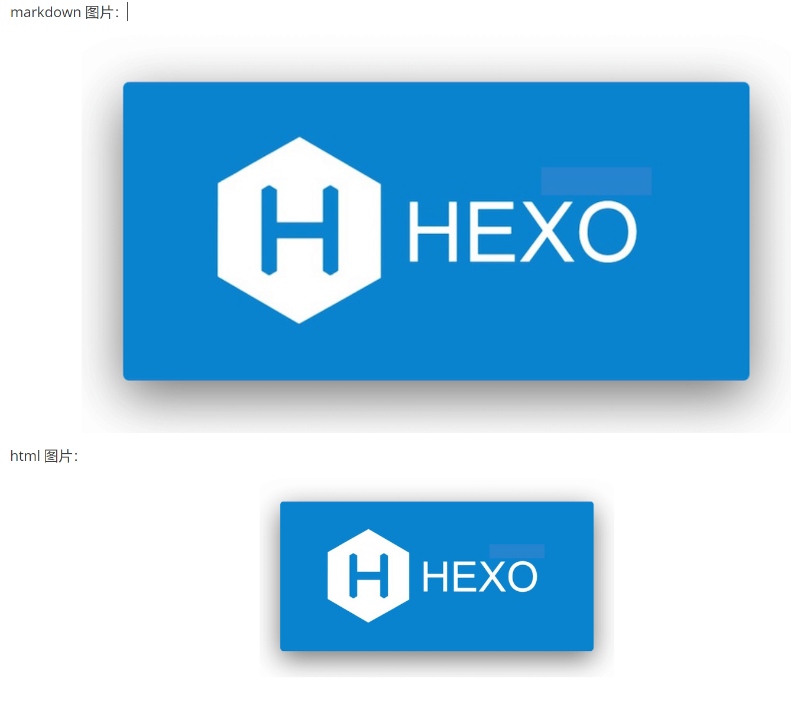

# Hexo Plugin

参考官方[文档](https://hexo.io/zh-cn/docs/plugins)，我们有两种创建插件方式

1. 以脚本（Scripts）形式（单个文件）
2. 以 npm package 形式创建（支持多文件）

对于一般的插件而言，如果代码并不复杂且依赖较少，可以直接写成脚本形式，放在 hexo 根目录下的 `scripts` 文件夹即可（不存在直接创建一个即可），在介绍插件具体写法之前，先看一个简单的例子：

文件：`scripts/test.js`

```js
hexo.extend.filter.register('before_post_render', (data) => {
  const {log} = hexo;
  log.debug("hello from test.js!!!");
  return data;
});
```

然后执行下列命令查看效果

```bash
hexo clean && hexo generate --debug
```

这一条命令包含两个子命令，`hexo clean` 清除之前的生成文件，之后的 `hexo generate` 用来生成静态页面文件。

（`--debug` 标志会使 hexo 在终端显示调试信息，在所有的 hexo-cli 命令中都可以使用） 

<!-- more -->

输出结果

```bash
(base) PS D:\hexo-temp> hexo clean && hexo generate --debug
INFO  Validating config
INFO  Deleted database.
INFO  Deleted public folder.
03:05:12.393 DEBUG Writing database to D:\hexo-temp\db.json
03:05:12.401 DEBUG Hexo version: 6.3.0
...
03:05:12.483 INFO  Validating config
...
03:05:12.651 DEBUG Script loaded: scripts\test.js
03:05:12.652 INFO  Start processing
...
03:05:12.717 DEBUG hello from test.js!!!
...
03:05:12.742 INFO  Files loaded in 90 ms
...
03:05:12.915 INFO  Generated: archives/2023/index.html
...
03:05:12.922 INFO  17 files generated in 180 ms
03:05:12.924 DEBUG Database saved
```

从输出中我们可以看到，在 `Validating config` 过程中加载了我们创建的脚本，而在 `Start processing` 后执行了我们的脚本，并通过 debug 输出了对应的语句。

这样我们就实现了一个简单的 hexo 插件（十分简单，没有对输入的数据做任何处理，打印一条语句后就退出了）。


## plugin 写法

参考官方[文档](https://hexo.io/zh-cn/api)的扩展部分，其给出了所有插件的种类



例如我们之前写的 filter 插件，其[文档](https://hexo.io/zh-cn/api/filter)如下



所有的插件都可以采用类似的方式实现，通过 `hexo.extend.xxx.register` 来注册插件，指定好对应的处理函数即可。


## 基本模板

```js
hexo.extend.<extend-type>.register(name,<args>,function(){
	...
},<extend-args>)
```

考虑到箭头函数和普通函数的区别，在函数内部我们获取 hexo 变量的方式不一样，在箭头函数中没有 this 指针，我们需要通过一个全局 hexo 变量进行访问即可，而普通函数会包含 this 指针，而 hexo 在调用函数时会将自身绑定到 this 指针上，这样我们可以直接通过 this 访问 hexo 相关变量。

对应代码如下

```js
'use strict'
const arrow_function1 = (data) => {
  const {log} = this;
  log && log.debug("hello from arrow_function1!!!");
  return data;
}

const arrow_function2 = (data) => {
  const {log} = hexo;
  log && log.debug("hello from arrow_function2!!!");
  return data;
}

const normal_function1 = function(data) {
  const {log} = this;
  log && log.debug("hello from normal_function1!!!");
  return data;
}

const normal_function2 = function(data) {
  const {log} = hexo;
  log && log.debug("hello from normal_function2!!!");
  return data;
}

hexo.extend.filter.register('before_post_render', arrow_function1);
hexo.extend.filter.register('before_post_render', arrow_function2);
hexo.extend.filter.register('before_post_render', normal_function1);
hexo.extend.filter.register('before_post_render', normal_function2);
```

对应执行结果（`hexo clean && hexo generate --debug` )

```js
...
03:55:44.819 DEBUG hello from arrow_function2!!!
03:55:44.819 DEBUG hello from vanilla_function1!!!
03:55:44.820 DEBUG hello from vanilla_function2!!!
...
```

从执行结果中可以看到，在箭头函数（arrow function）中不包含 this 指针，我们无法通过 this 来访问 hexo 的变量，但是可以直接通过 hexo 全局变量来访问，对于普通函数（normal function）而言，可以通过 this 来访问 hexo，也可以直接通过全局变量 hexo 来访问。

由于脚本模式实际上实在 js 中通过字符串形式执行的，最好在开头处添加 `use strict` 来标识，确保插件能正常执行。

注：导入包的时候我们只能使用 common js 的包，并不支持 es6 模式的包，即我们不能通过一下模式导入包

```js
import { unified } from 'unified';
```

(unified 是一个[纯 es6 模块](https://gist.github.com/sindresorhus/a39789f98801d908bbc7ff3ecc99d99c)，不支持 comman js 导入)

而必须使用 common js 的导包方式

```js
const { red } = require('picocolors');
```


## 日志输出

通过 `hexo.log` 我们可以拿到 hexo 的日志输出对象，其具体实现在 [hexo-log](https://github.com/hexojs/hexo-log) 中，和普通的日志输出模块类似，其也支持不同级别的日志输出和颜色输出，具体通过 `picocolors` 库来控制输出的颜色，示例如下

```js
'use strict'

const {log} = hexo;
const {red,green,blue,magenta,cyan} = require('picocolors');

hexo.extend.filter.register('before_post_render', (data) => {
  log.trace("this is a trace message");
  log.debug("this is a debug message");
  log.info("this is a info message");
  log.warn("this is a warn message");
  log.error("this is a error message");
  log.fatal("this is a fatal message");
  
  log.info("this is a red",red("message"));
  log.info("this is a green",green("message"));
  log.info("this is a blue",blue("message"));
  log.info("this is a magenta",magenta("message"));
  log.info("this is a cyan",cyan("message"));
  return data;
});
```

对应输出结果




# Pandoc Renderer

## 目的

在前一篇文章中，我们配置好了 hexo 的静态文件处理方式，将所有的图片都放置在了 `source/images` 路径下，并通过设置 markdown 的 front matter 使得 typora 可以正确显示图片。

但是这种方法**耦合性太强**，所有图片都放在 images 文件夹不说，如果我们换一个 markdown 编辑器，就无法实现正确的预览了。

为此，我们需要调整 hexo 中图片资源管理方式，将 markdown 文件中图片链接全部替换为相对路径。


## 问题

首先我们需要对之前的配置进行一些调整，修改 `_config.yaml`，开启资源文件后处理

```yaml
post_asset_folder: true
```

参考官方文档，其会在创建 post文件 的同时创建和 post文件 同名的文件夹，用来存储资源文件，而后在生成站点时将图片拷贝到默认文件夹下。

修改配置后，我们创建一个 post 来查看一下效果

```bash
hexo new post "c++学习笔记"
```

（取这个名字还有一个就是文件名实际上和文章的标题不一定会对应，如果包含特殊的字符会进行调整）

运行结果

```bash
(base) PS D:\hexo-temp> hexo new post "c++学习笔记"
INFO  Validating config
INFO  Created: D:\hexo-temp\source\_posts\c-学习笔记.md
```

可以看到 markdown 文件名变成了 `c-学习笔记`，将 `++` 替换成了 `-`，同时在当前目录下也创建了 `c-学习笔记` 文件夹

```bash
(base) PS D:\hexo-temp\source\_posts> tree /F
卷 Data 的文件夹 PATH 列表
卷序列号为 4000-728D
D:.
│  c-学习笔记.md
│  hello-world.md
│
└─c-学习笔记
        hexo.png
```

（在 powershell 中也提供了 `tree` 命令，使用方式和 linux 下的差别较大，传参居然是用 `/<argument>` 的形式，怪怪的，查看帮助使用 `/?` 而不是 linux 中的 `--help` 或 `-h`）

此时我们在 markdown 文档中插入一张图片测试一下

```markdown
---
title: c++学习笔记
date: 2023-01-16 13:30:31
tags:
---

测试图片：


```

本地预览结果



生成静态页面

```bash
hexo clean && hexo generate
```

生成的文件位于根目录的  `public`  下

```bash
(base) PS D:\hexo-temp> tree /F public
卷 Data 的文件夹 PATH 列表
卷序列号为 00000048 4000:728D
D:\HEXO-TEMP\PUBLIC
│  index.html
│
├─2023
│  └─01
│      ├─15
│      │  └─hello-world
│      │          index.html
│      │
│      └─16
│          └─c-学习笔记
│                  hexo.png
│                  index.html
...
```

可以看到，我们插入的图片也被拷贝到了 public 下的同名文件中，但是在生成的 `index.html` 中我们可以看到，图片链接不对，在网页中自然无法正确显示

```html
<div class="e-content article-entry" itemprop="articleBody">
  <p>测试图片：</p>
  <p>
    
  </p>
</div>
```

其中 `%E5%AD%A6%E4%B9%A0%E7%AC%94%E8%AE%B0` 是中文 `学习笔记` 进行 UTF-8 编码后的 URL 表示形式 (urlencode)

```bash
(base) PS D:\hexo-temp> python
Python 3.9.12 (main, Apr  4 2022, 05:22:27) [MSC v.1916 64 bit (AMD64)] :: Anaconda, Inc. on win32
Type "help", "copyright", "credits" or "license" for more information.
>>> s = "学习笔记"
>>> s.encode("utf-8")
b'\xe5\xad\xa6\xe4\xb9\xa0\xe7\xac\x94\xe8\xae\xb0'
>>> from urllib.parse import quote    
>>> quote(s)
'%E5%AD%A6%E4%B9%A0%E7%AC%94%E8%AE%B0'
```

如果我们对文章采用了永久编码，例如 `hexo-abbrlink` 等，在 public 下文章名就会对应变成永久链接名称。

此时我们已经发现问题了，**图片对应的URI应该是 `<post-perm-link>/<pic-name>`，但是我们在 markdown 中填写的路径是`<post-md-name>/<pic-name>`**，如果直接转 html 就会出现问题。

特别的，在 typora 中，当我们调整过图片大小后，其会将原始的 markdown 图片语法切换为 html 的 img 标签形式。

hexo-renderer-marked 可以对 markdown 中图片链接进行转换，但是对于 HTML 文档而言就无能为力了，毕竟 html 此时就相当于是纯文本了。

要想完美实现图片链接的处理，就需要我们通过插件方式进行自行实现

```markdown
---
title: c++学习笔记
date: 2023-01-16 13:30:31
tag:
---

markdown 图片：


html 图片


```

预览效果



## 解决思路

搞清楚问题后，我们就可以考虑如何解决问题了，主要问题有两个

1. 无法实现自动图片链接转换
2. 对于 img 标签形式的图片链接也需要进行转换

此时通过正则表达式进行替换的方式实现起来太复杂，不够稳定。例如，对于 markdown 文本中的代码段，如果在代码段中也包含一段图片链接，采用文本替换的方式也会对这个链接进行替换，虽然95%情况下能用，但是还是有5%的不适用场景，个人不推荐这样实现。

另一个比较好的解决思路就是通过**语法分析**获取到 markdown 文档的抽象语法树，对于 html 部分的图片链接也同样进行处理（毕竟我们最终目标是将 markdown 转换成 html，对 html 文档进行解析生成抽象语法树也是一样的）。

拿到抽象语法树之后，我们只需要调整 img 标签对应的 src 属性即可，此时进行替换可以确保我们一定是替换的图片链接，而不会错误地替换代码段中的链接。

这样我们的思路就很清楚了：

1. 通过 markdown 语法分析器进行语法分析，生成抽象语法树
2. 遍历抽象语法树，调整 img 节点对应链接属性，修改为永久链接
3. 将抽象语法树转换成 html 文档

目前有很多 js 实现的 markdown 分析器，但是根据我们的需求

1. 能同时进行 markdown 和 html 文档的语法分析
2. markdown 和 html 文件能具有统一的中间表示形式

纯 js 的解决方案目前只找到 [remark.js](https://github.com/remarkjs/remark) 一个，但是其仅支持 es6，在 hexo 中仅支持 common js 导入。

最后查到 pandoc 支持通过 lua 脚本的形式进行后处理（也就是 pandoc filter），似乎完美契合我们需求，那么接下来只需要学习如何编写 pandoc filter 即可。

> [Pandoc - Pandoc filters](https://pandoc.org/filters.html)
>
> 转换流程
>
> ```bash
> INPUT -> reader -> AST -> filter -> AST -> writer -> OUTPUT
> ```


## plugin

在调用 filter 之前，我们首先将 pandoc 集成到 hexo 中。幸运的是已经有大佬写了相关调用插件了（[hexo-renderer-pandoc](https://github.com/wzpan/hexo-renderer-pandoc)），其代码也很简单，不到200行，可以直接通过脚本集成到 hexo 中。

由于 pandoc 是一个单独的可执行文件，在 js 中实际上就是调用 pandoc 可执行文件，并获取其输出。在 node.js 调用其他命令需要 `child_process` 库的 `spawn`，`exec` 或 `fork`

这三类都可以实现外部命令的执行，由于我们需要对 pandoc 提供 markdown 文本输入并获取 html 输出，数据量较大，`spawn` 是最符合我们需求的，为了满足跨平台要求，我们可以使用 `cross-spawn`来执行命令。

`spawn`  是一个异步函数，其输入和输出是通过 `stdin`、`stdout` 以及 `stderr` 三个`Stream` 实现的，我们需要注册相应回调才能拿到结果。

```js
'use strict'
const { spawn } = require('node:child_process');
const main = async () => {
  return new Promise((resolve, reject) => {
    const task = spawn('pandoc', ['--version'], {
      env: process.env,
      cwd: process.cwd()
    });
    const encoding = 'utf-8';
    const stdout_chunks = [];
    const stderr_chunks = [];
    task.stdout.on('data', chunk => stdout_chunks.push(Buffer.from(chunk)));
    task.stdout.on('error', err => log.error(err));
    task.stderr.on('data', chunk => stderr_chunks.push(Buffer.from(chunk)));
    task.stderr.on('error', err => log.error(err));
    // task.stdin.end(data.text, encoding);
    task.on('close', code => {
      let stderr_msg = Buffer.concat(stderr_chunks).toString(encoding);
      if (code) {
        const e = new Error(`pandoc process exited with code ${code}.${stderr_msg.length > 0 ? `\n${stderr_msg}` : ''}`);
        e.code = code;
        return reject(e);
      }
      if (stderr_msg.length > 0) {
        log.debug(`Pandoc:\n%s`, stderr_msg.trim());
      }
      let stdout_msg = Buffer.concat(stdout_chunks).toString(encoding);
      resolve(stdout_msg);
    });
  });
}
main().then(output => console.log(`output from spawn:\n${output.trim()}`)).catch(e => console.log(e));
```

输出结果

```bash
➜  Node node test.js
output from spawn:
pandoc 3.0.1
Features: +server +lua
Scripting engine: Lua 5.4
User data directory: /home/xiao/.local/share/pandoc
Copyright (C) 2006-2023 John MacFarlane. Web:  https://pandoc.org
This is free software; see the source for copying conditions. There is no
warranty, not even for merchantability or fitness for a particular purpose.
```

上面的代码实际上就是调用了 `pandoc --version` 命令，并通过 CacheStream 获取到了调用命令后的输出结果，以便进行下一步的调用。

如果我们需要向 pandoc 传输数据（例如待处理的 markdown 文本流），我们可以直接在 `stdin` 中直接写入，同时注意写入完成后**记得关闭输入流**，否则 pandoc 进程会一直等待输入。

```js
task.stdin.end(data.text, encoding);
```

在 pandoc 进行 markdown 转换的命令如下

```bash
pandoc --from=gfm --to=html5 --mathjax
```

其中：

1. `--from` 表示输入格式
2. `--to` 表示输出格式
3. `--mathjax` 表示开启 mathjax 公式支持

输入后 pandoc 就会等待 stdin 输入，输出到 stdout 中，同时将错误信息输出到 stderr 中。

例如我们写一个简单的 `h1` 标题，其 markdown 代码为 `# This is h1` ，对应 html 代码为 `<h1>This is h1</h1>`

```js
const task = spawn('pandoc', ['--from=gfm','--to=html5','--mathjax'], {
    env: process.env,
    cwd: process.cwd()
});
...
task.stdin.end('# This is h1', encoding);
...
```

执行结果

```bash
➜  Node node test.js
output from spawn:
<h1 id="this-is-h1">This is h1</h1>
```

可以看到，通过 spawn 我们可以正确调用 pandoc 并实现从 markdown 到 html 的转换。最后只需要编写 pandoc filter 就可以完成插件了。


## pandoc filter

### hello，lua filter

在 [Pandoc 官网](https://pandoc.org/lua-filters.html) 中给出了一个简单的示例

文件：`smallcaps.lua`

```lua 
return {
  {
    Strong = function (elem)
      return pandoc.SmallCaps(elem.c)
    end,
  }
}
```

其将所有的 Strong 标签（粗体，在 markdown 就是 `**A**`，**A**）转换 Small Caps 形式，测试 markdown 如下

将其保存为 `test.md`

```markdown
**hello world!**
```

命令如下

```bash
pandoc --lua-filter=smallcaps.lua -o test.html test.md
```

如果不指定输出格式，其默认使用 html 格式输出，对应输出结果如下

```html
<p><span class="smallcaps">hello world!</span></p>
```

可以看到，在 html 中并不能原生支持 smallcaps 样式，但是 pandoc 为其指定了一个 css 类名，通过类名这个我们可以手动实现 smallcaps 效果。

### filter 写法

上面的代码第一眼看上有点奇怪，怎么以来就是一个 `return` 语句，返回的 `{}` 怎么直接套了一个 `{xxx = xxx}`

首先解释后面一点，在 lua 中，列表和字典都使用 `{}` 表示，那么最外层的就是一个列表，然后内层的是一个字典，我们可以看到其指定了一个键为 `Strong` 的函数，表示对 `Strong` 这个节点的处理函数。

那么最开始的 `return` 就表示这个脚本可以作为包被外部使用，就有点类似于 common js 中模块写法

```js
module.exports ={
	Strong = function(elem){...}
};
```

然后在 pandoc 内部调用时，直接使用下面语句

```lua
local f = require("smallcaps")
```

即可导入使用

在 Pandoc 中定义了很多种抽象语法树的节点类型，例如 Block、String、Inline等，对于每一个节点类型我们都可以编写对应的处理函数对其进行处理，同时根据列表的顺序还可以控制抽象语法树的遍历方式。

```lua
local function Meta(meta) 
   print("process meta") 
end

local function Para(para)
    print("process para")
end

local function Image(image)
    print("process image")
end

return {
    {Meta = Meta},
    {Para = Para},
    {Image = Image}
}
```

测试 markdown 

```markdown
---
title: 测试 markdown
---

hello


```

测试命令

```bash
pandoc --lua-filter test.lua -o test.html test.md
```

在控制台的输出如下

```bash
(base) PS D:\Code\Lua\pandoc-filter> pandoc --lua-filter test.lua -o test.html test.md
process meta
process para
process para
process image
```

从输出结果上我们可以看到，首先处理的是 meta，之后是两个 para，最后是 image，其对应的文档结构如下

```html
<meta>...</meta>
<p>hello</p>
<p></p>
```

注：**如果函数中没有返回任何值（或者返回 nil），表示该函数不会对抽象语法树进行修改**。


## final filter

参考 pandoc 对于 [image](https://pandoc.org/lua-filters.html#type-image) 标签的描述，通过 `src` 字段可以读取到图片的链接信息，我们只需要修改 url 值即可，根据之前的描述，我们可以编写一个简单的 filter

```
local url_prefix

local function Meta(meta) 
  url_prefix = meta.url_prefix 
end

local function Image(image)
   image.src = url_prefix ..'/'.. image.src
   print("image.src: ",image.src)
   return image
end

return {
   {Meta = Meta},
   {Image = Image}
}
```

同时在命令行中通过 `--metadata=key:value` 来指定元数据信息

转换命令如下

```bash
pandoc --metadata=url_prefix:test --lua-filter test.lua -o test.html test.md
```

输出

```bash
image.src:      test/test.jpg
```

转换后的 html 代码

```html
<p>hello</p>
<figure>

<figcaption aria-hidden="true">test-image</figcaption>
</figure>
```

可以看到 `src` 部分已经替换成了我们需要的链接，并且还对图片添加了 figcaption 

之前我们提到，在 markdown 文档中可能存在 html 代码，对于这一部分我们也想要进行处理，默认 pandoc 会将其解析为 RawBlock，即不做任何处理，但也可以使用 `pandoc.read` 进行解析，生成抽象语法树，这样我们就可以对 html 形式的图片进行解析了。

完整代码如下

文件：`image-asset.lua`

```lua
--[[
    Reference: 
    [1] https://pandoc.org/lua-filters.html
    [2] http://www.lua.org/manual/5.4/
]]

local logging = require('logging')

local new_path
local path_prefix

local function Meta(meta)
    -- logging.temp('Meta',meta)
    local meta_path = meta['path']
    local meta_title = meta['title']
    if (meta_path == nil or meta_title == nil) then
        logging.temp('Meta','no meta data found, ignored.')
        return
    end    
    new_path = pandoc.utils.stringify(meta_path)
    path_prefix = pandoc.utils.stringify(meta_title) .. '/'
end

local function Image(image)
    if (new_path == nil or path_prefix == nil) then
        return
    end
    local length = pandoc.text.len(path_prefix)
    local prefix = pandoc.text.sub(image.src,1,length)
    local postfix = pandoc.text.sub(image.src,length+1)
    if (prefix == path_prefix) then
        image.src = new_path .. postfix
    end
    -- delete image caption info and title (just a hack)
    image.caption = {}
    image.title = ''
    return image
end

local function RawBlock (raw)
    if raw.format:match('html') then
        local res = pandoc.read(raw.text,'html')
        -- https://pandoc.org/lua-filters.html#type-blocks
        if ( #res.blocks == 1 ) then
            -- convert Plain to Para
            return pandoc.Para(res.blocks[1].content)
        end
    end
end

-- function Pandoc(pandoc)
--     logging.temp('Pandoc',pandoc)
-- end

-- return in global scope (can be loaded via `require`)
return {
    { RawBlock = RawBlock },
    { Meta = Meta },
    { Image = Image },
    -- { Pandoc = Pandoc }
}
```

最后给出完整的插件代码

```js
// code modified from https://github.com/wzpan/hexo-renderer-pandoc/blob/master/index.js

'use strict';

const { spawn } = require('node:child_process');
const path = require('node:path')
const assert = require('node:assert');
const { yellow } = require('picocolors');

hexo.config.pandoc = Object.assign({
    pandoc_bin: 'pandoc',
    math_engine: 'mathjax',
    markdown_mode: 'gfm',
    filters: [],
    lua_filters: [],
    extra: [],
}, hexo.config.pandoc);

// must have the `?.lua` specified!
const pandoc_env = { ...process.env, LUA_PATH: path.join(process.cwd(), 'lua', '?.lua') };

const argument = (name, value = undefined) => {
    if (value) {
        return `--${name}=${value}`;
    }
    return `--${name}`;
};

const is_string = obj => typeof (obj) === 'string';

const is_array = obj => Array.isArray(obj);

const is_object = obj => typeof (obj) === 'object';

const get_cache = (stream, encoding) => {
    const buf = stream.getCache();
    stream.destroy();
    if (!encoding) return buf;
    return buf.toString(encoding);
}

const renderer = (data, options) => {
    const { log } = hexo;

    let config = hexo.config.pandoc;

    const filters = [];
    const lua_filters = [];
    const extra = [argument('metadata', 'pagetitle:ignored')];
    // To satisfy pandoc's requirement that html5 must have a title.
    // Since the markdown file is only rendered as body part,
    // the title is never used and thus does not matter
    const pandoc_bin = config.pandoc_bin;
    const math_engine = argument(config.math_engine);
    const markdown_mode = config.markdown_mode;

    if (!is_array(config.filters)) {
        config.filters = [config.filters];
    }

    if (!is_array(config.lua_filters)) {
        config.lua_filters = [config.lua_filters];
    }

    if (!is_array(config.extra)) {
        config.extra = [config.extra];
    }

    config.filters.forEach((filter) => {
        filters.push(argument('filter', filter));
    });

    config.lua_filters.forEach((filter) => {
        lua_filters.push(argument('lua-filter', filter));
    });

    config.extra.forEach((item) => {
        if (is_string(item)) {
            extra.push(argument(item));
        } else if (is_object(item)) {
            assert(Object.keys(item).length === 1, `item in extra must be a key-value tuple or string`);
            const [key, value] = Object.entries(item)[0];
            if (is_array(value)) {
                value.forEach((v) => {
                    extra.push(argument(key, v));
                });
            } else {
                extra.push(argument(key, value));
            }
        } else {
            throw new TypeError(`unknown extra config for pandoc: ${item}`);
        }
    });

    const POST_MODEL = hexo.model('Post');

    const source = data.path.substring(hexo.source_dir.length).replace(/\\/g, '/');

    const current_post = POST_MODEL.findOne({ source });

    if (current_post) {
        // manually add root path
        const post_path = `/${current_post.path}`;
        // the filename (xxx.md) may not correspond to title field in Markdown Front Matter
        const filename = path.basename(data.path, '.md');
        log.debug('Filename: %s', yellow(filename));
        // const title = current_post.title;
        extra.push(argument('metadata', `path:${post_path}`));
        extra.push(argument('metadata', `title:${filename}`));
    }

    // if we are rendering a post,
    // `data` has the key `path`
    // https://github.com/hexojs/hexo/blob/2ed17cd105768df379dad8bbbe4df30964fe8f2d/lib/hexo/post.js#L269
    // otherwise (e.g., rendering a tag),
    // `path` is not present in `data`.
    // https://github.com/hexojs/hexo/blob/2ed17cd105768df379dad8bbbe4df30964fe8f2d/lib/extend/tag.js#L173
    // https://github.com/hexojs/hexo/blob/a6dc0ea28dddad1b5f1bad7c6f86f1e0627b564a/lib/plugins/tag/blockquote.js#L64
    // are we rendering a standalone post?
    if (data.path) {
        // only apply template when rendering post, not tags
        if (config.template) {
            extra.push(argument('template', config.template, true));
        }
        // do not apply `--standalone`,
        // header/footer are to be added by Hexo
        // also set a metavariable to let concerned
        // pandoc filters know
        extra.push(argument('metadata', 'standalone:true'));
    } else {
        // or some thing to be embedded in a post,
        // like tags?
        extra.push(argument('metadata', 'standalone:false'));
    }

    const args = [
        argument('from', markdown_mode),
        argument('to', 'html5'),
        math_engine,
        ...extra,
        ...lua_filters,
        ...filters,
    ];

    log.debug('Pandoc command: %s', yellow(`${pandoc_bin} ${args.join(' ')}`));

    return new Promise((resolve, reject) => {
        const task = spawn(pandoc_bin, args, {
            env: pandoc_env,
            cwd: process.cwd(),
            stdio: 'pipe'
        });
        const encoding = 'utf-8';

        const stdout_chunks = [];
        const stderr_chunks = [];

        task.stdout.on('data', chunk => stdout_chunks.push(Buffer.from(chunk)));
        task.stdout.on('error', err => log.error(err));

        task.stderr.on('data', chunk => stderr_chunks.push(Buffer.from(chunk)));
        task.stderr.on('error', err => log.error(err));

        task.stdin.end(data.text, encoding);

        task.on('close', code => {
            let stderr_msg = Buffer.concat(stderr_chunks).toString(encoding);
            if (code) {
                const e = new Error(`pandoc process exited with code ${code}.${stderr_msg.length > 0 ? `\n${stderr_msg}` : ''}`);
                e.code = code;
                return reject(e);
            }
            if (stderr_msg.length > 0) {
                log.debug(`Pandoc:\n%s`, yellow(stderr_msg.trim()));
            }
            const output = Buffer.concat(stdout_chunks).toString(encoding);
            const length = output.length;
            log.debug(`Pandoc Output Size: ${length} bytes`);
            log.debug(`Pandoc Output Preview:\n%s`, yellow(length > 100 ? output.substring(length - 100, length).trim() : output.trim()));
            resolve(output);
        });
    });
};

hexo.extend.renderer.register('md', 'html', renderer, true);
hexo.extend.renderer.register('markdown', 'html', renderer, true);
hexo.extend.renderer.register('mkd', 'html', renderer, true);
hexo.extend.renderer.register('mkdn', 'html', renderer, true);
hexo.extend.renderer.register('mdwn', 'html', renderer, true);
hexo.extend.renderer.register('mdtxt', 'html', renderer, true);
hexo.extend.renderer.register('mdtext', 'html', renderer, true);
```


# 总结

写了很多，大概记录了一下 hexo 自定义插件过程，还有很多没有详细介绍的，有兴趣的话参照下方的链接自行编写即可，弄清楚逻辑后代码写起来还是很快的。


# 参考

1. [插件 | Hexo](https://hexo.io/zh-cn/docs/plugins)
2. [wzpan/hexo-renderer-pandoc: A pandoc-markdown-flavor renderer for hexo. (github.com)](https://github.com/wzpan/hexo-renderer-pandoc)
3. [Child process | Node.js v18.13.0 Documentation (nodejs.org)](https://nodejs.org/docs/latest-v18.x/api/child_process.html#child_processspawncommand-args-options)
5. [Pandoc - Pandoc Lua Filters](https://pandoc.org/lua-filters.html)
6. [wlupton/pandoc-lua-logging: Pandoc lua filter logging support (github.com)](https://github.com/wlupton/pandoc-lua-logging)
7. [Lua 5.4 Reference Manual - contents](http://www.lua.org/manual/5.4/)

