***Encodings should be known, not divined.***

## 问题描述

在前一篇我们使用 pandoc 的 lua filter 解决了 markdown 转 html 中链接问题，但是在调试代码的过程中发现了一个问题，在不同的 shell 中执行 lua 脚本时，输出中文有时会乱码，有时又不会乱码，搞得有点烦，本篇就针对字符串问题做一个探究，搞清楚乱码的源头以及解决方案。

首先看一个简单的示例，下面是一段简单的 c 语言 hello world

```c
#include <stdio.h>

int main(int argc,char** argv) {
    printf("你好，世界！😉");
    return 0;
}
```

文件保存格式为：`UTF-8`（注意看 vscode 的右下角，写着 UTF-8）

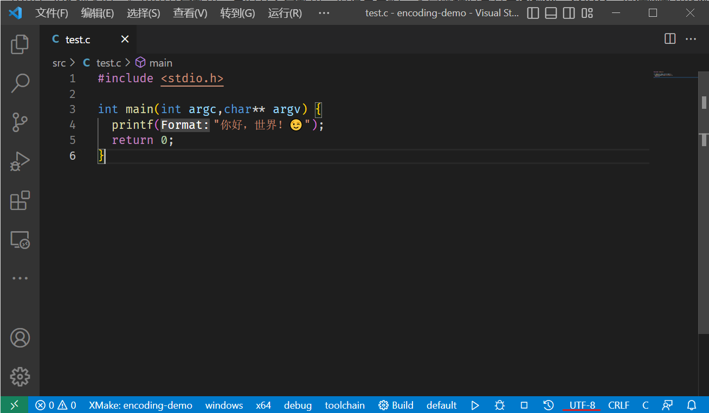

<!-- more -->

使用 msvc 编译后，分别在 git bash、msys2、powershell上运行后输出结果如下

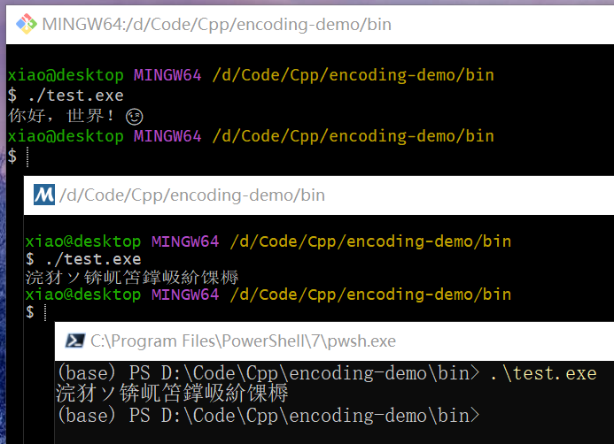

> 注：使用 msvc 编译 UTF-8 文件时，需要添加 `/utf-8`  参数，否则会使用本机默认编码进行编译，有可能导致编译失败。
>
> 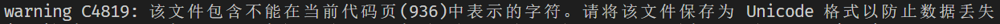

可以看到，仅在 git bash 中能正确输出中文，如果我们将编码保存为 GBK，再编译运行

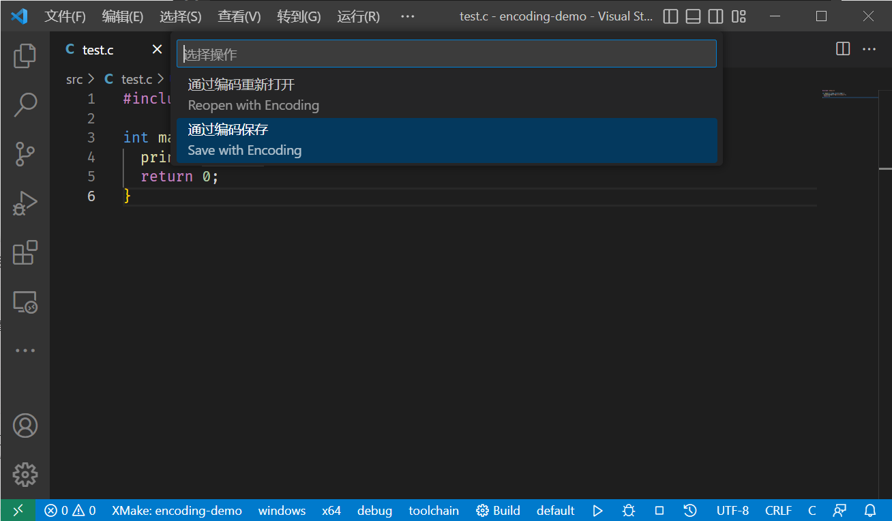

输出结果如下：

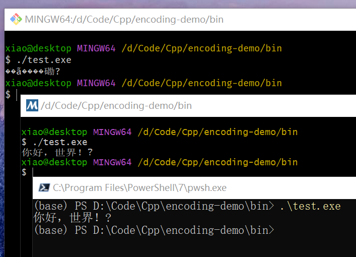

可以看到此时在 Git Bash 中输出乱码了，而在 msys2 和 powershell 中可以正确输出中文了，但是 emoji 的输出还是有问题（变成了问号）

再使用 python 输出上面那句话看看效果

```python
print("你好，世界！😉")
```

分别在三个终端中进行测试，输出结果如下

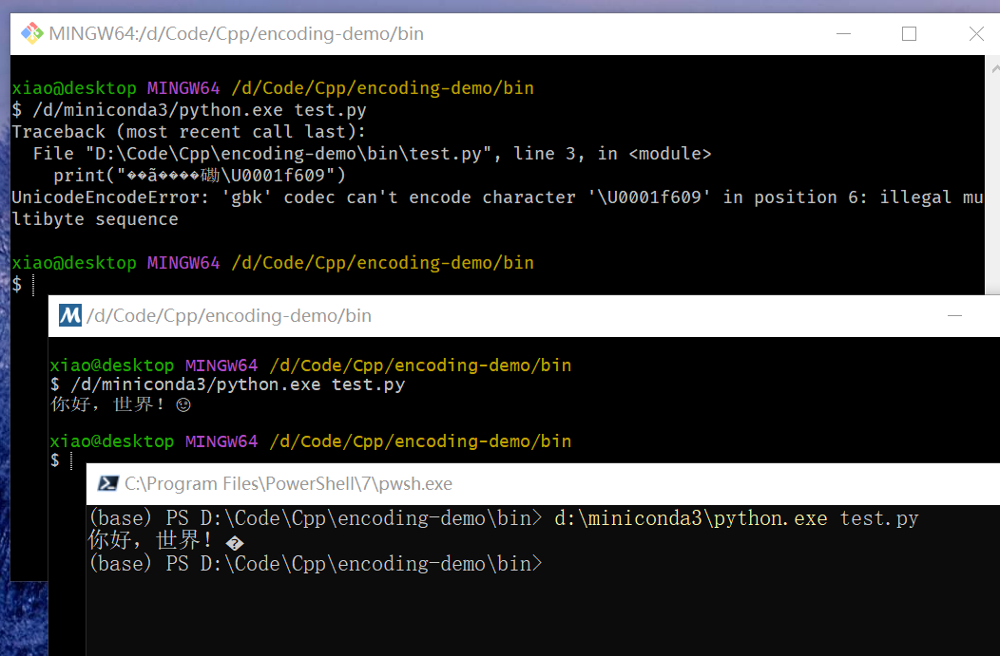

此时 git bash 中直接报错，说 GBK 无法解析 `U+1F609` 也就是笑脸 😉 ，而在 msys2 和 powershell 中均可以正确输出中文，但是 powershell 中无法输出 emoji 表情，而 msys2 可以正确输出。

这个结果更令人费解了，C 语言和 Python 输出结果不一致，在不同终端下输出也不一样。


## 编码简史

关于编码的发展过程，下面这篇文章做了很好的介绍

> [The Absolute Minimum Every Software Developer Absolutely, Positively Must Know About Unicode and Character Sets (No Excuses!) – Joel on Software](https://www.joelonsoftware.com/2003/10/08/the-absolute-minimum-every-software-developer-absolutely-positively-must-know-about-unicode-and-character-sets-no-excuses/)

参考这篇文章，我们做一个简单的总结。

### ASCII

在计算机中，所有数据都是以二进制形式存储的，我们在屏幕上阅读的文字如 “A”，“你好” 等也需要以二进制形式存储。**编码描述的就是我们如何将可阅读的字符存储在计算机中**。 ASCII ( /ˈæski/ ) 编码是早期常用的一种编码（现在也很常用，只不过是其他编码兼容该编码罢了）。其包含128个字符，使用 8 位存储（剩下的 128 - 255 部分称为扩展 ASCII 编码，不过并不常用），下图展示了所有的ASCII字符及其对应的编码值（图片来自：[http://www.asciicharstable.com/](http://www.asciicharstable.com/)）


例如大写字母 `A` 对应的 ASCII 十进制编码就是 `65`，也即二进制的 `0b01000001` 和十六进制的 `0x41`。

从表中可以看到，仅包含大小写字母，而中文、俄语等文字并不包括在内。为了解决这个问题，一些厂家就自定义了一套编码格式，从而支持其他语言的字符显示。但是厂家自定义的编码并不能跨平台，例如在 IBM 上编写的文档就有可能无法在 Mach 上打开，因为他们使用的编码不同。

### ANSI

厂家自定义编码太杂乱，为了实现跨平台，后来就统一了编码（车同轨，书同文？），称为 ANSI 编码。ANSI 编码并不将所有的字符都编码到一张表上，其仅确保前 128 个字符（也就是 ASCII 编码部分）是一致的，后面部分的编码由代码页（code page）决定，不同地区使用不同的代码页，从而在不同地区显示不同的文字。目前 Windows 仍然支持的这种编码方式，可以在控制面板的时钟和区域中进行设置。

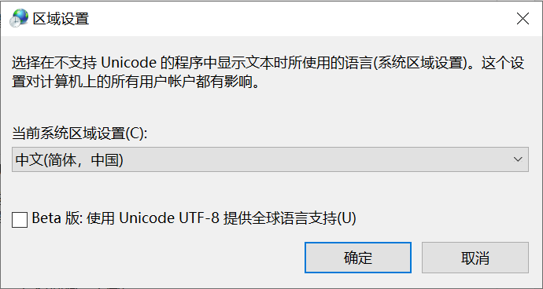

对于中日韩文而言，其使用的是表意文字（ideograph），可能包含数万个字符，仅使用 8 位显然是无法表示这些字符的。后面就将 ANSI 编码扩展到了两个字节，其中 `0x80` 至 `0xFFFF` 部分由代码页来决定编码。中文对应的编码方式有 GB 2312 及其扩展 GBK（**G**uo jia **B**iao zhun **K**uo zhan，国家标准扩展）。

> 注：GBK 和 ANSI 的关系：GBK 属于 ANSI 的一部分，其专门负责对中文进行编码，而其他字母等仍使用 ASCII 编码，例如一段话
>
> `Hi, 你好`，对应的 GBK ANSI 编码为，其中 `Hi,` 仍是单字节编码，而后面的 `你好` 则是双字节编码
>
> ```bash
> [0x48,0x69,0x20,0xC4,0xE3,0xBA,0xC3]
> ```
> GBK 实际上是一个定长编码，其描述的所有字符都是双字节，但是此时 ANSI 就是一个变长编码，其既包含单字节字符，也包含双字节字符。 

在 Windows 下，可以使用 `chcp` 命令查看当前控制台使用的 ANSI 代码页（同时也可以使用该命令切换控制台使用的代码页）

```bash
(base) PS C:\Users\xiao> chcp
活动代码页: 936
```

在程序中可以使用 `GetACP()` 函数来查询程序中使用的代码页（需要调用 Windows API）

```c++
#include <windows.h>
#include <winnls.h>
#include <stdio.h>

int main(int argc,char** argv) {
    printf("current Windows ANSI code page identifier is: %u",GetACP());
    return 0;
}
```

运行结果

```bash
(base) PS D:\Code\Cpp\encoding-demo\bin> .\test.exe    
current Windows ANSI code page identifier is: 936
```

在微软 win32 文档中给出了代码页标识符的相关描述：[Code Page Identifiers - Win32 apps | Microsoft Learn](https://learn.microsoft.com/en-us/windows/win32/intl/code-page-identifiers)

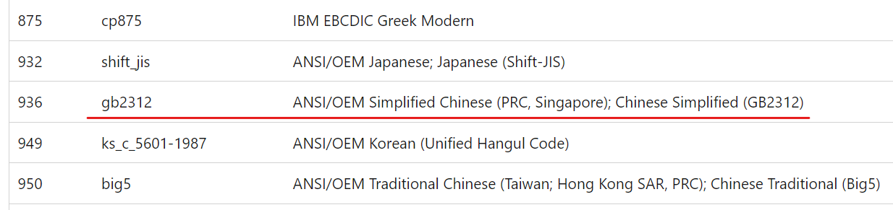

可以看到，本机 Windows 的ANSI代码页编号为 936，对应 GB2312 编码，而后续 GBK 发布后更新了 GBK 部分的字符，因此也常称为 GBK 编码。

采用代码页的方式在单语言场景下足够使用了，但是有时我们可能会浏览其他语言的网站，或接收到其他语言的邮件，我们的系统上就无法显示这些字符了（代码页并不能随便切换）。

**彩蛋：”烫烫烫烫烫烫烫烫...“？**

在 GBK 编码中，烫的编码为 `[0xCC,0xCC]`，在 MSVC 的调试模式下，会自动将未初始化的内存设置为 `0xCC`（字节），用来进行 [运行时错误检查](https://learn.microsoft.com/zh-cn/cpp/build/reference/rtc-run-time-error-checks?view=msvc-170)。

添加 `/RTC1` 编译标志即可开启检查功能，我们进行调试时，就会看到如下字样

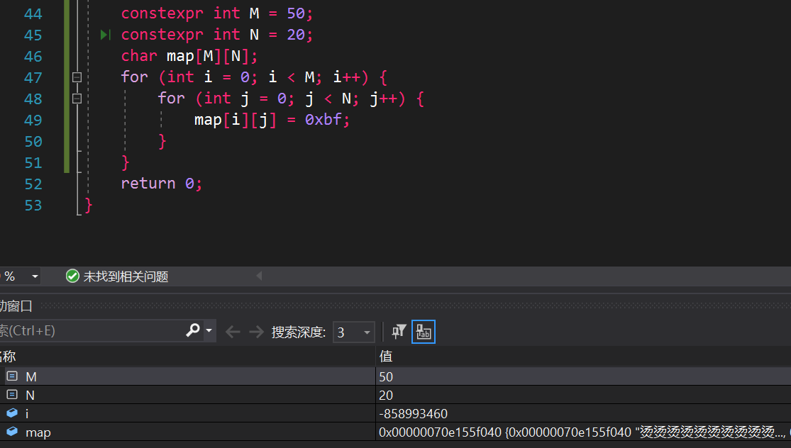

下面是测试代码

```c++
// 此处故意不初始化
uint32_t v;
uint8_t *arr = reinterpret_cast<uint8_t *>(&v);
std::string s(arr, arr + 4);
std::cout << s << std::endl;
```

输出结果就为 `烫烫`

除了 `烫`，还有可能出现 `屯屯屯屯`，因为 MSVC 在调试时会将动态分配的内存值初始化为 `0xCD`，而 `屯` 的 GBK 编码刚好是 `[0xCD,0xCD]`

```python
>>> "烫".encode("gbk")
b'\xcc\xcc'
>>> '屯'.encode('gbk')
b'\xcd\xcd'
```


### Unicode

为了解决在同一系统上的跨语言显示问题，就只能将全部字符编码到一张表上，这种表示方式称为 Unicode，中文称为 **统一码**，不过一般直接说 Unicode 即可。注意这里我们用的表述是 字符的**表示方式**，而不是编码方式。Unicode 为每一个字符分配一个 code point（码点），就唯一表示一个字符，例如 `你` 的 Unicode 码点为 `U+4F60`，`U+` 前缀就表示这是一个 Unicode 码点，后面的十六进制就表示具体的代码值。

**码点和编码之间并不是一一对应关系，码点只是一个形式化的表示方式（可以理解为字符在字符空间中的一个坐标），其并不关心具体如何在计算机中存储的**。UTF (**U**nicode **T**ransformation **F**ormat，Unicode 传输格式) 才是决定具体如何在计算机中存储和传输的，根据使用场景不同，包含以下六类：

- UTF-8
- UTF-8 with BOM
- UTF-16 LE
- UTF-16 BE
- UTF-32 BE
- UTF-32 LE

注：BOM 表示 **B**yte **O**rder **M**ark，字节顺序标志，LE 和 BE 分别代表 Little Endian （小端）以及 Big Endian （大端）

#### 大小端与字节顺序

大小端描述的是字节在多字节数据中的存储顺序，例如一个 `uint32_t` 是 4 个字节，例如 `0x1f2f3f4f`，其各字节信息如下：

```txt
Value(uint32_t): 0x1f2f3f4f
Byte View:
+------+----------+----------+----------+----------+
| bits |   0..7   |   8..15  |  16..23  |  24..31  |
+------+----------+----------+----------+----------+
| byte |  byte[0] |  byte[1] |  byte[2] |  byte[3] |
+------+----------+----------+----------+----------+
|  hex |    4f    |    3f    |    2f    |    1f    |
+------+----------+----------+----------+----------+
|  bin | 01001111 | 00111111 | 00101111 | 00011111 |
+------+----------+----------+----------+----------+
```

而其实际在内存中存储按字节顺序可以分为两种存储顺序

- **按内存地址从低到高，字节顺序从低字节到高字节存储**  

  这种字节排列顺序称为小端，因为低位字节（小值）优先存储

  ```txt
  Little Endian Memory View:
  +------+---------------+---------------+---------------+---------------+
  | addr | 0x1fdd3356050 | 0x1fdd3356051 | 0x1fdd3356052 | 0x1fdd3356053 |
  +------+---------------+---------------+---------------+---------------+
  |  hex |       4f      |       3f      |       2f      |       1f      |
  +------+---------------+---------------+---------------+---------------+
  |  bin |    01001111   |    00111111   |    00101111   |    00011111   |
  +------+---------------+---------------+---------------+---------------+
  ```

- **按内存地址从低到高，字节顺序从高字节到低字节存储**

  这种字节排列顺序称为大端，因为高位字节（大值）优先存储

  ```txt
  Big Endian Memory View:
  +------+---------------+---------------+---------------+---------------+
  | addr | 0x1fdd3356550 | 0x1fdd3356551 | 0x1fdd3356552 | 0x1fdd3356553 |
  +------+---------------+---------------+---------------+---------------+
  |  hex |       1f      |       2f      |       3f      |       4f      |
  +------+---------------+---------------+---------------+---------------+
  |  bin |    00011111   |    00101111   |    00111111   |    01001111   |
  +------+---------------+---------------+---------------+---------------+
  ```

注：**无论是大端还是小端，一个字节中的 bit 的排列顺序永远都是从低位到高位**

> 大端和小端出自 Jonathan Swift 的《格列佛游记》（Gulliver's Trabels）一书，其中交战的两个派别无法就应该从哪一端（小端还是大端）打开一个半熟的鸡蛋达成一致。
>
> 一下是 Jonathan Swift 在1726年关于大小端之争的历史描述：
>
> *“......下面要告诉你的是，Lilliput 和 Blefuscu 这两大强国在过去36个月里一直在苦战。战争开始是由于以下的原因：我们大家都认为，吃鸡蛋前，原始的方法是打破鸡蛋较大的一端，可是当今皇帝的祖父小时候吃鸡蛋，一次按古法打鸡蛋是碰巧将一个手指弄破了，因此他的父亲，当时的皇帝，就下了一道敕令，命令全体臣民吃鸡蛋时打破鸡蛋较小的一端，违令者重罚。老百姓们对这项命令极为反感。历史告诉我们，由此曾发生过六次叛乱，其中一个皇帝送了命，另一个丢了王位。这些叛乱大多都是由 Blefuscu 的国王大臣们煽动起来的。叛乱平息后，流亡的人总是逃到那个帝国去寻救避难。据估计，先后几次有11000人情愿受死也不肯去打破鸡蛋较小的一端。关于这一争端，曾出版过几百本大部著作，不过大端派的书一直是受禁的，法律也规定该派的任何人不得做官。”*
>
> *（此段译文摘自网上蒋剑锋译的 《格列佛游记》第一卷第4章。）*
>
> ![Little Endians, Middle Endians, and Big Endians - The Norwegian American](data:image/jpeg;base64,/9j/4AAQSkZJRgABAQAAAQABAAD/2wCEAAoHCBIUEhcVEhUYFxcZGRoXGRoZGhocIB0aGBciHRgaIBoaICwkICEpIhoZJDYkKS0vNDMzGSI4PjgzPSwyMzUBCwsLDw4PHhISHTMjIiM6Ly8vMzM6Mi8yOjIvMjI0LzQ0LzIyMi8yMjIzLzIyMjo7MjQyLzQ0MjIzMjIyMjIvL//AABEIAJ8BPgMBIgACEQEDEQH/xAAbAAEBAAMBAQEAAAAAAAAAAAAABgEEBQMHAv/EAEcQAAEDAgQDBQMICAMHBQAAAAEAAgMEEQUSITEGQVETIjJhcRSBkQcjM0JSYqGxFSQ0Q1NyksGisvEWF0Rjg8LRNoKT0vD/xAAaAQEAAwEBAQAAAAAAAAAAAAAAAQIDBAUG/8QALhEBAAICAQMCBAMJAAAAAAAAAAECAxEEEiExQVEiYYGRE6HwFCMyQmJxscHx/9oADAMBAAIRAxEAPwD7MiIgIiICIiAiIgIiICIiAiIgIiICIiAiIgIiICIiAiIgIiICIiAiIgIiICIiAiIgIiICIiAiIgIiIMIpziDjKiozkkkzynwwxjPITyGUbX+8QuGcVxqr/Z4Y6CI7ST9+W1tCIho0+Th71S161jdp0a2vS4AXOgXEr+LsOhJEtXC0jdoe1zv6W3Km/wDYNkuuIVVTVnS7XyFkd/KNm3xXYoeFsPht2VJC0jmY2ud/U+5/FctubjjxuV4pLSf8qOE7MlfIfuQyn82hef8AvQouUNWR17A/+VTsaG+EBvoLfkv3nPUrOef7V/M6EzH8qGFbPlkjP34ZB/laV38N4loanSCpikP2Q8Zv6Tr+C9HsDtHAOHmAfzXDxLg/DqgHtKWK5+sxuR39Udj8VavPr6wdCvRfOxw/iFH3sOrHSRjU09Wc7bdGybs05aDqVv8ACPyhUta7sX2hqAS3s3ODmvI37N40d6b9LjVddMtckbrKsxpbIiLRAiIgIiICIiAiIgIi5eMY7S0jc1VMyIcg494/ytHed7gg6aKDPHss+mG0E9QOUkloYzfmHP39NF+XRY/P46ilpAdhFGZXgdCZO78Cs75aV8ymImV8sr587g+pf9Pitc4/8pzYh8G3WBwBTfWqa5x6mod/9VjPMxR6p6ZfQUXz48AQj6Orr4z1bUH+7Vn/AGbxKK3suKzG31ahjZQfIuOvvsleXin10dMvoCKBbxFi9L+20bamMby0Zu4AczE7U+6wVJgHE9JWtvTShzh4mHuvb/Mw6j12810VtW0bidqu2iIrAiIgIiICwsqR4o4uFO8U1LH7RWP8MTTowH68jvqtG9ufkNVEzodnHMcpqOIy1MgY3YX1c49GtGpPoo51TimJ+HNh9IeZ/aJGnoPqA9d/ULawXhQ9r7ViL/aao6i+scXPLGw6afat/dVS4M3M9KfdpWvu4+A8NUlGPmIwHnxSu70jidyXnXXoLDyXXRF51rTadzO1ojQiIqJEREBfmWRrGlzyGtaCXOJsABqSSdgv0of5RMPqpBG9rXTUcZDqinjJbI8A3vmF87RvlFtve3XFSL21M6RM6edRUTYy90VO50WHtOWWYaPqCN42X2byJ58+i79fwlRS0raYxBjGD5tzNHsd9tr9819Te9+d1tcPYjS1FO11G5vZABoa0BuSw8BZ9UjoumtL5bVnVfh1+u6NJThvHaimqG4diTsznD9VqdhM0fUd0kGnrsdbF16pfibA462ndE/uu8UTxuyQeB4I19fK68+A8dfUwvhqNKqmd2U4+0R4ZB5OAOvUG2ll6XGz/i17+YUtGlaiIulUREQEREGFyce4gpaKPtKmRrB9UbucejWjUqexvjGR8xpMKjFRUDR8h+ih5Xe4bnfujpzOi4OKYdHh8Zq6h5rcRlIjhdIL/Ou0aI49mtbe/wCAteyyvlrWdeZn0TEMxcW4jidU+mo2miiYA6WV7c0oafCMp7rXO5DewJvou9hPBVFA7tHNNRMdTLUHtHk9e9oPcL+a2OEcC9jpgxxzzSEyzv3LpH6uN+YGw+PMruLzeRybWtqs9l61ZWERca4iIoBERBlTuPcJQVLhKwugqW6sni7rwfvW8Y9dbc1QotKXtSd1lExtM4BxRNFO2ixUNbOfoZm6MnA/Br+o015C4vcKa4gwOGsgdDMNN2OHiY8eF7TyI/EaLR4IxyYukoK4/rVPazv40P1ZRfc6gH1HO4Hr8fkRljXrDOY0tERF0qiIo/5QMaliiipqQ/rVW/soz9hv7yTyyg78r35KJnQ1OIOJ5ppnUOF2dONJpzqynGx12c/ew69SDbf4b4chomEMu+R/elmfq+R25JJ1tfl+ZuV7cPYJDRU7YYRoNXuPie8+J7jzJ/AWHJdNeRyOTN51Xw0rXQiIuNcREQEREBERAWVhEEljXC8rJTV4Y9sNT+8jP0c43s9uwd978jqt3hviiOqLoXtMFVHpLA/RwI3LftN53HIjqCtjiXiGGiiD33fI85YomavkfsGtHS5Fz58zYHlcOcPSun9vxCzqpwtGweGnZrZjertTc8rnzK6/4se8n0n1/wCKevZWqNx39SxOlrW6RzkUdT0u76GQ+YIsSeTLc1ZLgcd4f7RhtTHa5EZkb1zR99tvXLb3qvGydGSJ+ibRuFki5HC2Impoaec7yRMc7+a1n/4gV117bIREQeUkjWtLnEAAEkk2AA3JJ2C+eV2L1OLSOgoHGGjack1UNHSW8UcXl97z6aO866WTGal8THubhsDsshYbGplbqWh32B1G+/MFtpTU7I2NjjYGMYA1rWiwAHIBcXJ5P4favn/C9a7a2D4RBSRCKnjDGD4uP2nO3cfMqV4l+Yxajq6jv05a6BhO0Ez9nn+ba52segVwuBxpLReySR10rIo5GkC+rsw1a5jBcuINjoOS4MN5m/fvvtPv3WmOygWFMfJ5ic89Cz2hjw9ncD3tLe1YPA8ZtTcWBPUX5qnWeSnRaa+yYERFmkREQEREBERAUhx7SPjbFiNOPnqN2Zw2zwHSRhPSxJ8hmVevzJG17S1wu1wLXA82kWI94WuHJOO8TCJjcNvD6xk0TJYzdkjGvafuuFx+a2lC/JhK6OKooXm7qOd8bb7mJ5Lo3H179vIK5XvRO42xF89wv9axqsqHaspWMpIugeQXSkeYOZvo5fQl8++TkXjrXnxPr6ku/wAP/wC965+VbpxStXyr0RF4jUREQEREBERAREQFxOJuI46Nje6ZJnnLDCzV73nbQahvV3wudF21xeJOG4K2MB+ZkjDmjmZpIx3Ihw3F92/kbEa4ujq+Pwid+jm8M8NSCU1uIuElY8aDdkDT+7YNr2Ni71sTcudWKMwviOelmbSYtZrzpDVDSOYcg47Mf1/G2hdaK2eL9W5+ntr5FdMI5gcC07HQ+h0KJmA1Ow1PuWMeUpv5I3H9FRsP7uSaP4SuP/crdQ/yRAnC2PP7yWZ498pH/aVcL6NgwpP5R8WfT0LhD9NO9tNFbfPLoSDyIaHWPWyrFCcXfO4vhkJ8LO3qHD7zGDIfcR+Kra2qzPsO1gWFMpKaOnj8MbQ0n7Tt3u9S4k+9b5Om1/Ic/LVEXgWmZnctnzXiDjarFQKbJ+jWO09oqWOeTt4AwOj573I+8FQcPcKULSKnP7bK7X2iR4lufu6lrbctyOqpqiBkjCyRjXsdoWvaHNPq06FStVwHA15koJZaKQ7mFxLHdM0bjYjyBA12XTGWk16Y+H9fdXUq5FCYHxBiArzQythq8gBkniLmdm374y5c/wBxoGp33tdrDLjmk6laJ2IiLJIiIgIiICIiAiIglMI+a4hqWDaoo45j/NE4RjT0zFXqgXf+o4bbigfm9O2db8VfFe/gneOv9mM+RfPeEfmK/EqN2h7f2tn3mTgE28mnI2/Ur6EojjrC5mSRYlRszT04LZIx+9gOr2abltyR6ncgBM2PrpNSJ1KlRaGC4xDVwNmp35mu+LXc2OHJw6e/Zb68K1ZrOpbbERFUEREBERAREQERCeqDUxPDYamJ0VQwSRu3B68iDuCORGqh48VlwaaOlqZDUUshtA+4dPHrYMdGO89mtgQPTk1dGv4rlqZHU2ENEsg0kqXfQx+h+u7oBcfzarocPcJxUzzNI91RVO1fPJq6/MMB8LeWmttL20XZX93XWTxPp/v5KeZ7KIFcHjnEvZsOqJL2d2ZjZ1zydxtvTNf3LvKNxke3YrT0bdYqUirqTyzj6GM+etyDuHHoqcbH15I+6bdoVnCmGmloaeAixZEwO/nIu/8AxErsoi9tkwoTic5Maw158MjKiG/R2S7R7yQrtSnyhYRJUUmen/aKd7aiG25fHqW+dxfTmQFW9eqsx7ph2lhczh3Go6ymZURbPHebza8eNh9D8RY81018/es1nUtYkUlxLjsz5vYMP1qXC8sm7aeM7vcftkEWHmOZCrVIcZ4bLHIzEqQXngFpGD99B9dp6lo1H/kBaYOnr7/T236Is7XDuBQ0UAiiBJJzPe7xPed3uPXy5LqrTwnEYqmCOeF2Zj25genItPQg3BHULcVLzabT1eUwIiKiRERAREQEREBEWrileynhkmk8ETHPd55RoB5k2A8yrREzOoE/w+O2x2slA7tPBFSg8i557R3vBaR/qrxR3yZYe9lD2030tXI+qk/6h7g9MoBt94qxXv0r01iPZgyiIriFxng+WOZ1XhLxDM7WSF30M3q0eFx6jz2JJX5wfjGN8ns9ZG6jqtuzk0a/zZJ4XA8vwvurtczGsDpquPs6qJsjeVxq09WuGrT5grDLgpk8+fdMWmH6WFHuwHFMP1oZPbKcf8PO60jR0jl/sdPIrawzjeklf2U+ekn2MVQMhuTbuvPddflsT0Xm5OJenzhpF4lTIiLlWERFAIiIChPlKZKDA6V7xh+cMqmx91/eNmuc7csvYED8SRa7XlU07JGOjkaHMe0tc07FpFiFthv0XiyJ7vLDKSGKJjKdjWRgAsDPDY65vO+9zqbraUXwdPJTVM2FvcZGRN7WB+5bE46Rv6OGYW8vKy7XEnEkFEwdpd8j9I4Wd573HYBo2F+f5nRWyYrTfUd9oiezHFWPso4M9s8ryI4YxqZJHaNAA5AkE/Dche3BHD7qSnLpzmqZnGWof1e7XLfo29ul7nmtDhjhyd8/6QxKxqCLRRDVtOw8h1eb6nzKtl6nHwRir858qWnbKIi6FRERBAY1gNVRzvrMMb2jZDmqaTYPPOSPo/fTnrvey6nD/ElNWtPYvs9uj4njK9hGhDmHodLi4VUpniPg2lrHCXvQ1DdWTxHK8EdbeIctdbbELmzcauXv4laLadRfmWRrGlz3BrRqXOIAA6knRR0mM4jh3dxGI1EA2q4BqB1kj5eZFh6rgcTshqJWYg2R1fQtt21O2RwMP/MEYI0G5a4A9dDdvDHEtFtT2hbqbnDGKRRYpJT0BdPRzHO7s2OLaeY+KzrZezdYbaC46a/Rlo4NJTOgjdSdn2LhdvZgNbb0Gx5EHUHdbyxz3i1vGk1ERFgsIiICIiAiIgKK4hccRrmYZHcwxFs1a4bZWm8cN+pNiR6fZK3+J+IXxvbSUTe0rZBZjRqImneR52AA1AP+vY4S4dZQ0/ZhxfK9xkmlO75Haucb625Af3JK9Licfv12+il7ejvMaAAALAaADkv2iL0mYiIgIiIC52KYPT1TMlTCyRvLO0Ej0O4PmCuiiCCdwJLT64XWywD+DJ87F6AO1b66lef6Wxim0qqBtQ0by0j7n/4394n4L6AiyvhpfzCYmYQMHyhYeSGzOkpn/Yniewj3gEfiu3SY9Ry/RVML/wCWVl/he67tRTskGV7GuHRzQ4fArhVfA2FSXzUcNz9luT/JZc1uDjnxMwt1y6LXA7G/pqv1lPQqZPyX4UPBHJH/ACTSj83FY/3Z0P8AEqrdO3es/wBg/q/JPWo5JGtF3uDR1cQB+Knca43oKZjvn45JADljjdnc59u63uXAubbr9R/JjhQIL4XyEfxJZHfhmAVBhuAUdN+z08UZ6tY0H+q1/wAVenBrE952ibvl/CFPjEjJHwwCCSokMs1XUDXc5WxxEXytB0zXGp2FlecO8GwUrzM9zqiqd455Tmd5hoOjR6a20uqhF2xWIncQoyiIrAiIgIiICIiDBCkMX4BpJZO2gz0s/wDFgOS998zPC4HntdWCIPkWFYBi+ESvdE0VtNIS6SOOzHB322sPhd5NuCNOQIoqHjygkdkle6mk5x1DDGR7z3fxV0tLEMMp6huWeKOVvSRjXfC40XPl41Mk7nytFphrwyNe3MxzXtPNpDh8Qv2puo+TWguXUzp6R5+tBK5v4OuPhZeR4WxaP9nxUuA2bPCx/wAXjX8FyX4E/wAsrRdUrKlDBxEw/wDASj/qsJ/sgqsfG9FSn0nI/NZTwcnyT1wqkUsZuIHaNpKOPzfK93+VY/QWOzW7augpxzFPEXH0DpLEeqmvByT51B1woq+uhgaXzyMjYPrPcGj3X3PkFJu4gq8QJjwmMsjJs+slaWsA59mwi73eo9w3XVw/5PaJjxJUmSsl+3UvMnwZ4beoKrmMDQA0AAaADQAei68fDpWdz3lWbzLhcL8LwULHZC6SV5vLNIbvkPmTsPL8zqqFEXYoIiICIiAiIgIiIOXX47SwPyTTMY4NDyHG1mkkBxOwF2nU9CtptZGXOYHtLmsbI4X2Y8nK4+Ryu18ionia4raoGofTiSjhYCyLtM5zz3aBkcbjMNG698eS8J6KeVk7Wwlj3YfQgxC/1JJXSwAu3JZdmp+sLoK+i4io5niOKdj3OuWgHxBuriwnR4H3br3xDF6eBzWzSNY5wLmg3JIaQHGwGwzD4rhP4lD5qVlLZzXSZJWOglDo2lhIJdcNiILcuVwJObTYr88STOZiFO8S9iPZqhucx5xcywkMtyJyk/8AtKChgxSB72xtkaXujEzW37xiJsH2Otr6LynxylY3M+VoHaOhvqfnGXzM0G4yu+BUziVC+pre1p3DtY6SKWnlIIaXiWW7HaeB7TlcN7OB3AWlRVVm0s0rHxD9JVUj2vabx54pxZ2W/wBZwF9jcdUFpHjVK6J0zZmGJhIc8OuGkGxDrbG5Gh6rYlrY2SMic9ofIHFjCdXBgu+w52BCh8YvM2vnhjeInwwxgmNzO1lZI8ue1rgHOAa5jc9tbaXAWcabWPnqKuGFrm074xGS94kLaYl84jiEZDu07SSPxi+UeSC3irY3SPia9pfHlL2g6tDxdhI6EA/BelLUslY2SNwcxwu1w2IUY+nkNXU1lM0uljdC4NAt20LoGl8Vzz0zN6PaORK7fBQP6Pp7hzfm9nCxGp0I5FB30REBERAREQEREBa8VUxz3sa4FzMudvNuYXbf1Gq2FKU2IxQ19YJXZM5gy3a6zrRWNiBbdB1KriGkjBMkzGgF7STewMZs8E20sd15v4oomtzunaG66kOA0AJ1I8wuBVxOOF4o0Nddz66wsbm5daw53Xb4zaXYZVhoJJp5QANSSYzoAEG7S4zTSFojka4uJa0ai5a3M4C45NN0rsapoXiOWVrHlucNNyct7XsBtfRcvH6hsdVRSPJDGmbM6xIGaKwvYG1yubiOIg17ZY6jsmOpbB5iLw4iZ3d1GhFigrKrEYYo+1keGx93vG9u+QG/EkD3rXbjlKWB4laGukbECbtBkd4WagalcvjSTPQtex1h21I8PDS6zRUxuz5dyAO9byWliwjq4II3vFS01bGyEMLBlcx/1eVrjXrYoKmpxGGMuD5GtLIzK+5tljF7vPlofgvCgxymmdkimY91s2W9nZftBp1I81EV0dTavima9748NlibJl0maTIY3i277ENcPtNJGhC7E9UyqkomU4c58UrZXyZHBsbGxua8F7gBd+bJkBJ1vawugopcWp2wGofKxsQuDITZos/Jufvaeq9Zq6Jj42Pe1r5cwjaTq4tGZwb1sNVCQQzywUtMyFsgDqieVkrnRsLGzPZGxzhG83Ln5wMv7rdI6KSpbRQVAcyWEVMLpBqWSwtYIpWuIFyQGPBsL3ItqQgvo6ljnvY1wLmWDwN2lwzC/qNVsKT4QkndPWGojLJc8TX6Wa5zIQ0vYebXWzDmAbHUKsQEREBERAREQEREGLJZZRBiyyiIMWSyyiDFllEQYssoiAiIgIiICIiAiIgIiICIiDFkssogxZZREGLJZZRBiyWWUQEREBERB//Z)


大小端在日常使用中两者都有可能遇到，但在网络传输中 TCP/IP 规定数据包字节序为大端，如果是小端机器，那么在传输过程中就需要先将小端数据转换成大端数据再进行发送，同时在接受数据时也需要先将数据转换成小端再进行读取（仅针对多字节数据，例如 `short`，`int`，`double`等 ），字节序和字符串编码一样，**我们在使用前必须提前知道处理的数据字节序情况**，否则就会出问题。


#### UTF-8 & UTF-8 with BOM

前面提到，UTF-8 后面的 8 表示其编码单位是 8 位，即我们可以使用 `char` 来存储 UTF-8 字符串，但是很明显 8 位存不下所有的 Unicode 字符，那么就使用多个编码单位来表示一个字符。

为了确保我们可以从字节流中准确还原出 Unicode 字符，UTF-8 编码规则如下（RFC3629）

1. 确定 Unicode 字符所需要的字节数
2. 在首字节中添加长度标识前缀（`110`，`1110`，`11110`)，在剩下字节中添加标识前缀（`10`）
3. 对于单字节字符，直接使用 ASCII 编码，对于多字节字符，从低位到高位开始，每次选取 6 位填入编码中（从后向前）

下表展示了 Code 和 UTF-8 编码之间的转换关系

```txt
UTF-8 <-> Unicode Conversion
+---------------------+----------+----------+----------+----------+
|    Unicode Range    |  Byte[0] |  Byte[1] |  Byte[2] |  Byte[3] |
+---------------------+----------+----------+----------+----------+
| U+000000 ~ U+00007F | 0xxxxxxx |          |          |          |
+---------------------+----------+----------+----------+----------+
| U+000080 ~ U+0007FF | 110xxxxx | 10xxxxxx |          |          |
+---------------------+----------+----------+----------+----------+
| U+000800 ~ U+00FFFF | 1110xxxx | 10xxxxxx | 10xxxxxx |          |
+---------------------+----------+----------+----------+----------+
| U+010000 ~ U+10FFFF | 11110xxx | 10xxxxxx | 10xxxxxx | 10xxxxxx |
+---------------------+----------+----------+----------+----------+
```

> 注：实际上使用 4 个字节的 UTF-8 编码最大可以表示到 U+1FFFFF（21位的 Unicode 字符），且 UTF-8 最多可以使用 6 个字节来表示一个 Unicode 字符，但是为了和 UTF-16 的表示范围一致，其将最大可表示范围限制到了 `U+10FFFF`（也就是 20 位的 Unicode 字符）

下面来几个转换样例（编码）：

`A`：U+0041

对于在 `U+0000` 到 `U+007F` 之间的字符，直接使用 ASCII 码即可

```txt
+---------------------+----------+
|       Unicode       |  Byte[0] |
+---------------------+----------+
| U+000000 ~ U+00007F | 0xxxxxxx |
+---------------------+----------+
|       U+000041      |  1000001 |
+---------------------+----------+
|       U+000041      | 01000001 |
+---------------------+----------+
|       U+000041      |   \x41   |
+---------------------+----------+
```

`α`：U+03B1

```txt
+---------------------+----------+----------+
|       Unicode       |  Byte[0] |  Byte[1] |
+---------------------+----------+----------+
| U+000080 ~ U+0007FF | 110xxxxx | 10xxxxxx |
+---------------------+----------+----------+
|       U+0003B1      |    01110 |   110001 |
+---------------------+----------+----------+
|       U+0003B1      | 11001110 | 10110001 |
+---------------------+----------+----------+
|       U+0003B1      |   \xce   |   \xb1   |
+---------------------+----------+----------+
```

`你`：U+4F60

```txt
+---------------------+----------+----------+----------+
|       Unicode       |  Byte[0] |  Byte[1] |  Byte[2] |
+---------------------+----------+----------+----------+
| U+000800 ~ U+00FFFF | 1110xxxx | 10xxxxxx | 10xxxxxx |
+---------------------+----------+----------+----------+
|       U+004F60      |     0100 |   111101 |   100000 |
+---------------------+----------+----------+----------+
|       U+004F60      | 11100100 | 10111101 | 10100000 |
+---------------------+----------+----------+----------+
|       U+004F60      |   \xe4   |   \xbd   |   \xa0   |
+---------------------+----------+----------+----------+
```

`🧐`：U+1F9D0

```txt
+---------------------+----------+----------+----------+----------+
|       Unicode       |  Byte[0] |  Byte[1] |  Byte[2] |  Byte[3] |
+---------------------+----------+----------+----------+----------+
| U+010000 ~ U+1FFFFF | 11110xxx | 10xxxxxx | 10xxxxxx | 10xxxxxx |
+---------------------+----------+----------+----------+----------+
|       U+01F9D0      |      000 |   011111 |   100111 |   010000 |
+---------------------+----------+----------+----------+----------+
|       U+01F9D0      | 11110000 | 10011111 | 10100111 | 10010000 |
+---------------------+----------+----------+----------+----------+
|       U+01F9D0      |   \xf0   |   \x9f   |   \xa7   |   \x90   |
+---------------------+----------+----------+----------+----------+
```

Unicode 转 UTF-8 代码实现（C++），通过简单的位运算就可以实现了

```c++
std::vector<uint8_t> encode_utf8(uint32_t u) {
  std::vector<uint8_t> res;
  if (u < 0x80) {
    res.emplace_back(u);
  } else if (u < 0x800) {
    res.emplace_back(0xc0 | (u >> 6));
    res.emplace_back(0x80 | (u & 0x3f));
  } else if (u < 0x10000) {
    res.emplace_back(0xe0 | (u >> 12));
    res.emplace_back(0x80 | ((u >> 6) & 0x3f));
    res.emplace_back(0x80 | (u & 0x3f));
  } else if (u < 0x10ffff) {
    res.emplace_back(0xf0 | (u >> 18));
    res.emplace_back(0x80 | ((u >> 12) & 0x3f));
    res.emplace_back(0x80 | ((u >> 6) & 0x3f));
    res.emplace_back(0x80 | (u & 0x3f));
  } else {
    std::cerr << fmt::format("Failed to encode {} to UTF-8, replaced with U+FFFD",
                             unicode(u))
              << std::endl;
    res.emplace_back(0xef);
    res.emplace_back(0xbf);
    res.emplace_back(0xbd);
  }
  return res;
}
```

对于 UTF-8 字符串的解码，也是类似，我们首先判断当前字节流前缀信息，得出当前字符的字节位数，然后根据这个信息读取后续的字节数据。

```c++
bool one_byte = (curr_byte >> 7) == 0x0; 
bool two_bytes = (curr_byte >> 5) == 0x6;
bool three_bytes = (curr_byte >> 4) == 0xE;
bool four_bytes = (curr_byte >> 3) == 0x1E;
```

完整 UTF-8 转 Unicode 代码如下：

```c++
std::vector<uint32_t> decode_utf8(const std::string &s) {
  std::vector<uint32_t> res;
  for (auto it = s.begin(); it != s.end(); it++) {
    uint32_t c = 0;
    uint8_t curr = *it;
    if ((curr >> 7) == 0x0) {
      res.emplace_back(curr);
    } else if ((curr >> 5) == 0x6) {
      c |= (curr & 0x1f) << 6; assert(++it != s.end());
      c |= (*it & 0x3f);
      res.emplace_back(c);
    } else if ((curr >> 4) == 0xE) {
      c |= (curr & 0xf) << 12; assert(++it != s.end());
      c |= (*it & 0x3f) << 6;  assert(++it != s.end());
      c |= (*it & 0x3f);
      res.emplace_back(c);
    } else if ((curr >> 3) == 0x1E) {
      // get 3 bit from value
      c |= (curr & 0x7) << 18; assert(++it != s.end());
      c |= (*it & 0x3f) << 12; assert(++it != s.end());
      c |= (*it & 0x3f) << 6;  assert(++it != s.end());
      c |= (*it & 0x3f);
      res.emplace_back(c);
    } else {
      std::cerr << fmt::format("Failed to decode byte {} at index: {}",
                               hex(*it), it - s.begin())
                << std::endl;
      assert(false);
    }
  }
  return res;
}
```

> 注：对于 UTF-8 的解码，还有很多加速算法，这里就不做过多的介绍了，详细可以参考这篇博客：[A Branchless UTF-8 Decoder (nullprogram.com)](https://nullprogram.com/blog/2017/10/06/)


最后我们再简单介绍一下 UTF-8 with BOM，从名字上就可以知道，UTF-8 with BOM 就是在 UTF-8 的基础之上添加了一个 BOM（字节序标志），这个标志的 Unicode code point为  `U+FEFF` ，表示 ”零宽无间断间隔“，仅在传输过程中用来确认字节顺序，打印时不占字宽，（但在控制台打印等宽表格中会计算其长度，导致输出有问题，这一点需要注意）。

```txt
UTF-8 encoding of U+00FEFF
+---------------------+----------+----------+----------+
|       Unicode       |  Byte[0] |  Byte[1] |  Byte[2] |
+---------------------+----------+----------+----------+
| U+000800 ~ U+00FFFF | 1110xxxx | 10xxxxxx | 10xxxxxx |
+---------------------+----------+----------+----------+
|       U+00FEFF      |     1111 |   111011 |   111111 |
+---------------------+----------+----------+----------+
|       U+00FEFF      | 11101111 | 10111011 | 10111111 |
+---------------------+----------+----------+----------+
|       U+00FEFF      |   \xef   |   \xbb   |   \xbf   |
+---------------------+----------+----------+----------+
```

将文件手动保存为 UTF-8 with BOM

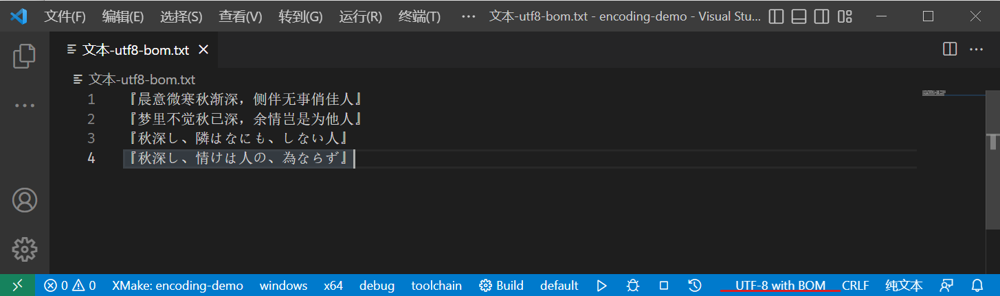

以二进制形式读取文件（`rb`），我们可以看到文件的前三个字节为固定的 `[0xEF,0xBB,0xBF]`

```txt
+----------------+--------------+-----------------+
|      file      | size (bytes) |  first 3 bytes  |
+----------------+--------------+-----------------+
| UTF-8 with BOM |     207      | b'\xef\xbb\xbf' |
|     UTF-8      |     204      | b'\xe3\x80\x8e' |
+----------------+--------------+-----------------+
```

由于 UTF-8 的编码单位为字节，实际上完全没必要考虑字节顺序的问题，因此并不推荐使用 UTF-8 with BOM ，甚至在某些情况下 UTF-8 with BOM 还会导致代码无法运行（例如 PHP）。


**彩蛋：”锟斤拷“ 是怎么来的？**

对于编码失败的情况，UTF-8 编码器会直接将其转换成 `U+FFFD` ，显示为 `�`，其对应的 UTF-8 编码如下：

```txt
UTF-8 encoding of U+00FFFD
+---------------------+----------+----------+----------+
|       Unicode       |  Byte[0] |  Byte[1] |  Byte[2] |
+---------------------+----------+----------+----------+
| U+000800 ~ U+00FFFF | 1110xxxx | 10xxxxxx | 10xxxxxx |
+---------------------+----------+----------+----------+
|       U+00FFFD      |     1111 |   111111 |   111101 |
+---------------------+----------+----------+----------+
|       U+00FFFD      | 11101111 | 10111111 | 10111101 |
+---------------------+----------+----------+----------+
|       U+00FFFD      |   \xef   |   \xbf   |   \xbd   |
+---------------------+----------+----------+----------+
```

即 `[0xEF,0xBF,0xBD]`，在编码错误的情况下，就可能会连着出现，也就是

```txt
[...,0xEF,0xBF,0xBD,0xEF,0xBF,0xBD,...]
```

由于 **GBK 编码是双字节编码**，其会将其解析为三个汉字，而这三个字就是 `锟斤拷` 

```python
>>> b'\xef\xbf\xbd\xef\xbf\xbd'.decode('gbk')
'锟斤拷'
```

在中文环境下，出现 `锟斤拷` 就基本上就表示我们将一个原本是正常编码的文件**采用 UTF-8 编码打开并以 UTF-8 保存**，由于 UTF-8 编码无法对文件中字符进行编码，就全部替换成了 `�`，此时我们再通过 GBK 打开时就会出现满屏的 `锟斤拷` 了，而且这种错误是不可逆的，因为无法编码的字符已经被替换成了 `�`，我们再也无法找回之前的编码了。

下面给出了一个具体示例：

文件初始内容：

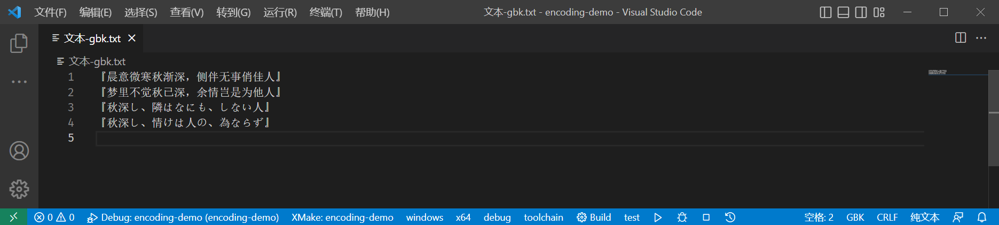

我们原本的文件是 GBK 编码的，我们将窗口关闭，再打开。由于 VS Code 并不知道文件的编码，便默认使用 UTF-8 编码打开，内容如下：

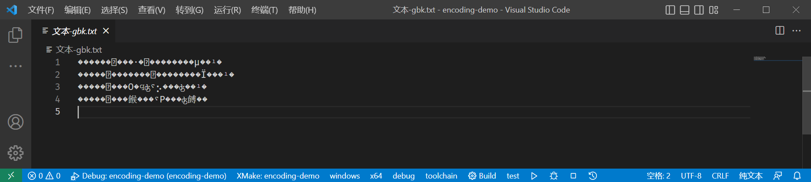

如果此时我们手贱，将文件保存的话（<kbd>Ctrl</kbd> + <kbd>S</kbd>），文件就会以 UTF-8 编码保存，而其中 `�` 就会直接写入到文件中。

假如我们又看到了文件名中的 `文本-gbk`，知道文件的正确编码为 GBK，再次使用 GBK 编码打开时，文件内容如下：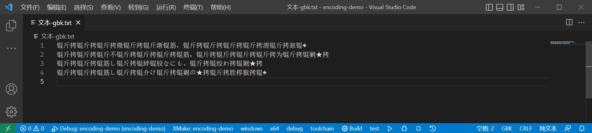

我们永远也不知道文件里写了什么了！😭

> *“白色相簿”什么的，已经无所谓了。* 
>
> *因为已经不再有歌，值得去唱了。* 
>
> *传达不了的恋情，已经不需要了。* 
>
> *因为已经不再有人，值得去爱了。*

血的教训告诉我们：**当打开不知道编码的文件时，千万不要手贱按下保存，保存后很有可能无法还原了！**


#### UTF-16 & UTF-32

UTF-16 的编码单位为 16 位，即 2 字节，而 UTF-32 的编码单位为 32 位，4字节。

> 注：编码单位（code uint）是编码中每个字符编码的基本元素，对于定长编码中，编码单位大小就等于字符大小，例如 GBK 中编码单位为 2 字节，其可表示的所有字符都是 2 字节；对于变长编码，一个字符的编码可以由多个编码单位进行表示。

由于 UTF-16 和 UTF-32 的编码单位为多字节，必定要考虑字节顺序问题。我们可以手动指定字节顺序（和 UTF-8 with BOM 类似，在文件开头添加 `U+FEFF` 来自动判断编码），也可以直接使用 `LE` 后缀或`BE`后缀的编码来表示，例如 UTF-16LE 和 UTF-16BE。

在 UTF-16 编码中，一个字符由1个或2个16位整数表示，最大可表示字符为 `U+10FFFF`，**参考 UTF-16 规范（RFC2781）**，其编码和解码规则如下：

1. 对于 `U+0000 ~ U+FFFF` 的字符，其直接使用1个16位整数表示即可，且值等于 Unicode Code Point 值。
2. 对于 `U+010000 ~ U+10FFFF` 的字符，使用2个16位整数表示（称为 surrogate pair，代理对，意为16位整数对表示一个字符），每个部分存储 Unicode Code Point 的10 位（需要进行特殊处理），再在前面添加前缀（6 位），第一个前缀为 `110110`，第二个前缀为 `110111`
3. 对于 `> U+10FFFF` 的字符无法使用 UTF-16 编码表示（目前并不存在）

> 为了保证 UTF-16 解码的唯一性，对于 `U+D800 ~ U+DFFF` 的 Unicode 字符不做编码。

同样，下面给出了一个转换示例

`🧐`：U+1F9D0

1. 首先减去 `0x10000`，确保 `U'` 的范围在 `0xFFFFF` 之间（最多支持 20 位）

   ```txt
   U' = U - 0x10000
      = 0xf9d0
   ```

2. 分别取出 `U'` 的 前10位和后10位，填充到两个16位整数中

   ```txt
   w0 = (U' >> 10) & 0x3ff
      = 0b0000111110
   w1 = U' & 0x3ff
      = 0b0111010000
   ```

3. 最后添加6位的前缀

   ```txt
   w0 = w0 | 0xd800
      = 0b1101100000111110
      = 0xd83e
   w1 = w1 | 0xdc00
      = 0b1101110111010000 
      = 0xddd0
   ```

最终得到 `🧐` 的 UTF-16 编码为 `[0xd83e,0xddd0]`

- UTF-16LE： `b'\x3e\xd8\xd0\xdd'`
- UTF-16BE： `b'\xd8\x3e\xdd\xd0'`


代码写起来就十分简单了，将上面的过程翻译成 C++ 位运算即可

```c++
std::vector<uint16_t> encode_utf16(uint32_t u) {
  std::vector<uint16_t> res;
  if (u < 0xd800 || (u > 0xdfff && u <= 0xffff)) {
    res.emplace_back(u);
  } else if (u > 0xffff && u <= 0x10ffff) {
    u -= 0x10000;
    res.emplace_back(((u >> 10) & 0x3ff) | 0xd800);
    res.emplace_back((u & 0x3ff) | 0xdc00);
  } else {
    std::cerr << fmt::format(
                     "Failed to encode {} to UTF-16, replaced with U+FFFD",
                     unicode(u))
              << std::endl;
    res.emplace_back(0xfffd);
  }
  return res;
}
```

对于解码也是一样，不过我们需要验证一下 surrogate 的有效性（必须成对存在）

```c++
std::vector<uint32_t> decode_utf16(const std::vector<uint16_t> &s) {
  std::vector<uint32_t> res;
  for (auto it = s.begin(); it != s.end(); it++) {
    uint16_t w0 = *it;
    if (w0 < 0xd800 || w0 > 0xdfff) {
      res.emplace_back(w0);
      continue;
    }
    assert(++it != s.end());
    uint16_t w1 = *it;
    if (w1 < 0xdc00 || w1 > 0xdfff) {
      std::cerr << fmt::format("Failed to decode word {:#04x} at index {}", w1,
                               it - s.begin())
                << std::endl;
      assert(false);
    }
    res.emplace_back(0x10000 + ((w0 & 0x3ff) << 10) | (w1 & 0x3ff));
  }
  return res;
}
```


> 注：UTF-16、UTF-16LE、UTF-16BE 的区别：
>
> - UTF-16 类似于 UTF-8 with BOM，在文件开头添加 `U+FEFF` 标记，用来标识存储内容的字节顺序
> - 而 UTF-16LE 和 UTF-16BE则是在编码时就约定好字节顺序，不需要通过 BOM 来确定。
>
> 对于 UTF-32、UTF-32LE、UTF-32BE 也是类似，和 UTF-8 with BOM 类似，一般直接使用 LE 或 BE 版本即可，最好不要在文件开头添加 BOM（有可能影响文件解析）


而对于 UTF-32 编码，就简单很多了，目前最大的 Unicode 字符也就到 `U+10FFFF`，使用 32 位来表示完全足够了（即 Unicode code point 就是 UTF-32 编码值）。但是代价也很明显，存储代价太大了，对于纯 ASCII 的代码，需要 4 倍的存储空间。而在 Python 中就采用了 Latin-1（ASCII）、UTF-16 和 UTF-32 的混合表示方式（代价是性能，但是其字符串操作上十分便捷）。


## Unicode in C++

目前 Windows 并不支持 UTF-8（使用的 UTF-16），如果我们编写了一段 c++ 程序输出 UTF-8 字符串，我们会看到乱码的结果。**除此之外，对于文件的读写、命令行参数的传递也会出现同样的问题**。如果我们想编写跨平台应用程序，最好保证使用的所有字符串都是 UTF-8。通过 `Boost.Nowide` 库可以实现这个转换。（单纯输出乱码的话可以使用 `fmt::print` 来解决乱码问题）

使用时我们需要**确保在程序中使用的 `char*` 和 `std::string`  都是 UTF-8 编码的**，进行文件I/O、解析命令行命令以及 stdout、stdin、stderr 时统一使用nowide库进行操作，就基本可以屏蔽掉大部分的坑。

对于命令行命令的解析，有一点小坑，我们需要手动链接 `shell32.dll` ，这个在 Windows SDK 中自带，只需要链接上即可。

```c++
#include <boost/nowide/args.hpp>
#include <boost/nowide/iostream.hpp>
#include <fmt/core.h>
#include <fmt/ranges.h>

namespace nw = boost::nowide;

int main(int argc, char **argv) {
  nw::args _(argc, argv);
  std::vector<std::string> args(argv, argv + argc);
  nw::cout << fmt::format("arguments: {}", args) << std::endl;
  return 0;
}
```

对应的 xmake

```lua
target("nw")
    set_kind("binary")
    set_languages("cxx17")
    add_files("src/nw.cpp")
    add_packages("fmt","tabulate","boost")
    if is_plat("windows") then 
        add_cxxflags("/utf-8",{tools="cl"})
        add_cxxflags("/RTC1",{tools="cl"})
        add_defines("BOOST_USE_WINDOWS_H","NOMINMAX")
        add_links("shell32")
    end
    set_installdir(path.join(os.scriptdir()))
```

输出结果

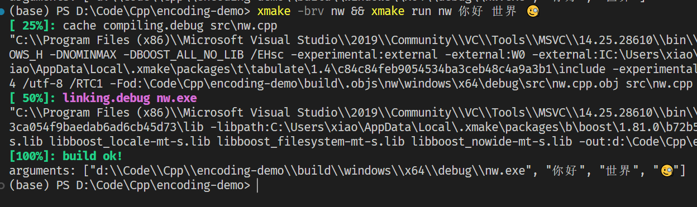

此处链接 `shell32.dll` 十分关键，如果没有就会报错 LNK2019：无法解析的外部符号 `__imp_CommandLineToArgvW`

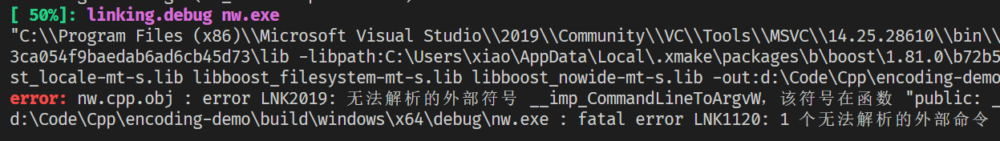

这个函数实际上就是 Windows 提供的命令行参数编码转换函数，具体可以参考：[CommandLineToArgvW function (shellapi.h) - Win32 apps | Microsoft Learn](https://learn.microsoft.com/en-us/windows/win32/api/shellapi/nf-shellapi-commandlinetoargvw)


还有另外一种解决方案，就是开启 UTF-8 实验性功能，这样 Windows 强制所有编码都是 UTF-8，就是对一些老应用不友好，特别是之前编译的中文应用，因为其使用的可能是 GBK 编码。


将其勾上然后重启电脑就可以了，这样我们直接通过 `std::cout` 以及 `std::fstream` 打开文件时就不会乱码了，但是无法确保其他人也这么做，所以还是老老实实使用 Nowide 库比较靠谱。


# 参考

1. [The Absolute Minimum Every Software Developer Absolutely, Positively Must Know About Unicode and Character Sets (No Excuses!) – Joel on Software](https://www.joelonsoftware.com/2003/10/08/the-absolute-minimum-every-software-developer-absolutely-positively-must-know-about-unicode-and-character-sets-no-excuses/)
2. [UTF-8 遍地开花 (utf8everywhere.org)](https://utf8everywhere.org/zh-cn)
3. [Boost.Nowide: Boost.Nowide - 1.81.0](https://www.boost.org/doc/libs/1_81_0/libs/nowide/doc/html/index.html)
4. [GetACP function (winnls.h) - Win32 apps | Microsoft Learn](https://learn.microsoft.com/en-us/windows/win32/api/winnls/nf-winnls-getacp)
5. [Code Pages - Win32 apps | Microsoft Learn](https://learn.microsoft.com/en-us/windows/win32/intl/code-pages?source=recommendations)
6. [Code Page Identifiers - Win32 apps | Microsoft Learn](https://learn.microsoft.com/en-us/windows/win32/intl/code-page-identifiers)
7. [visual c++ - Getting error LNK2019: unresolved external symbol when compiling SDL2 code in Windows using MSVC - Stack Overflow](https://stackoverflow.com/questions/61449854/getting-error-lnk2019-unresolved-external-symbol-when-compiling-sdl2-code-in-wi)
8. [c# - What does "Beta: Use Unicode UTF-8 for worldwide language support" actually do? - Stack Overflow](https://stackoverflow.com/questions/56419639/what-does-beta-use-unicode-utf-8-for-worldwide-language-support-actually-do)

