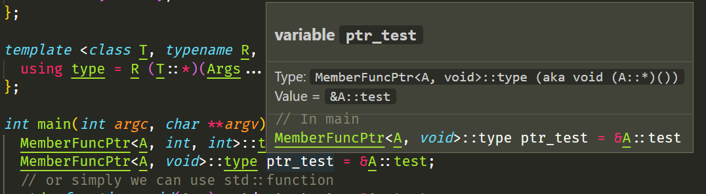
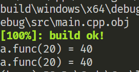
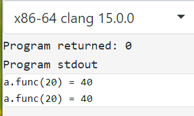
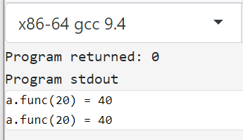
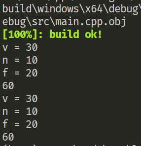
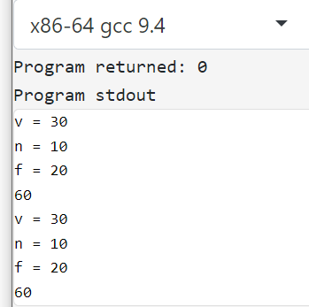
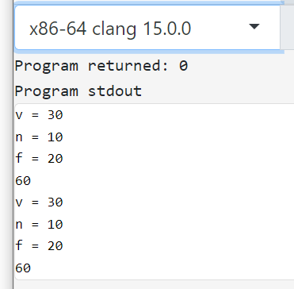
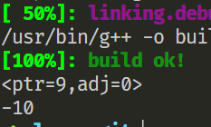
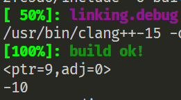

# 虚函数执行原理理解

刷牛客时经常能刷到面向对象相关的题目，多态作为面向对象中的一个重要特性（封装，继承和多态），在八股中经常考察其实现原理。为了方便理解，我们给出一个简单的多态样例

```c++
class A {
public:
  virtual int func1(int v) { return value + v; }
  virtual int func2(int v) { return value - v; }
  int func3(int v) { return value * v; }
  static int func4(int v) { return v * 2; }

public:
  int value{0xfeff};
};

class B : public A {
public:
  int func1(int v) override { return value + 2 * v; }
  int func3(int v) { return value * 2 * v; }

public:
  int value{0xfffd};
};
```

接下来就是经典调用函数写输出

```c++
int main(int argc, char **argv) {
  B b;
  b.value = 2;
  A *a = &b;
  a->value = 4;
  int v = 20;
  fmt::print("b.A::value={}\nb.B::value={}\n", b.A::value, b.B::value);
  fmt::print("a->func1({}) = {}\n", v, a->func1(v));
  fmt::print("a->func2({}) = {}\n", v, a->func2(v));
  fmt::print("a->func3({}) = {}\n", v, a->func3(v));
  fmt::print("a->func4({}) = {}\n", v, a->func4(v));
  return 0;
}
```

<!-- more -->

执行如下

```bash
(base) PS D:\Code\Cpp\learn-git> xmake -brv learn-git && xmake run learn-git
[100%]: build ok!
b.A::value=4
b.B::value=2
a->func1(20) = 42
a->func2(20) = -16
a->func3(20) = 80
a->func4(20) = 40
```

执行结果不难想到，根据虚函数运行时绑定的特性（晚绑定），通过基类调用虚函数时会根据实际类型调用对应的函数。对于非虚函数则是直接调用普通的成员函数（是 A 类时调用 `A::func3`，是 B 类时调用 `B::func3`），且需要调用的函数在编译期间就已经确定好了。


## 成员函数指针

例子就介绍到这，下面我们要简单理解 C++ 中实现原理，首先从成员函数指针来看，对于任意一个类别的成员函数，我们可以使用类似与函数指针的表达方式，即`void(T::*)()`，写成模板形式的话如下（当然，使用 `auto` 是最简单的，就是容易变成 auto script，然后导致代码理解起来有困难）

```c++
template <class T, typename R, typename... Args> struct MemberFuncPtr {
  using type = R (T::*)(Args...);
};
```

例如 `A::func1` 就可以采用如下的定义方式

```c++
  MemberFuncPtr<A, void>::type ptr_test = &A::test;
```



可以看到，其实际上就是 `void (A::*)()`，但是这样比写函数指针稍微舒服一点，我们可以通过 `.*` 和 `->*` 的方式来调用成员函数指针

```c++
(a->*ptr_test)();
((*a).*ptr_test)();
```

除此之外，我们也可以使用 `std::function` 的方式来封装封装成员函数，在函数的入参添加 `A*` 或 `A&` 参数接口（对于 `const` 的函数还需要添加 `const` 修饰符

```c++
std::function<void(A*)> std_ptr_test = &A::test;
```

然后在调用这个函数时将对象指针也作为参数传递过去即可

```c++
std_ptr_test(a);
```

最后总结一下调用成员函数的几种方式（***”茴“字的 4 种写法***）

```c++
// 正常版
a->test();
// 指针版
MemberFuncPtr<A,void>::type ptr_test = &A::test;
(a->*ptr_test)();
// std::function 版
std::function<void(A*)> std_ptr_test = &A::test;
```

之所以出现后面两种写法，主要就是为了实现 `Delegate`，当我们需要由代码来决定成员函数的调用时机时（例如事件响应等），我们就可以使用后面两种调用方式，不过在我们这里主要是探究虚函数的调用机制。


## 成员函数指针的大小？

当我们通过 `&A::test` 拿到成员函数的地址时，我们自然将其联想到和普通函数指针大小一致，但是不然，**其大小与不同的编译器有关（或者更准确的说，与 C++ Compiler ABI 有关）。**

我们在 [Compiler Explorer](https://godbolt.org) 中进行运行测试（不支持 MSVC Compiler 的运行测试，但是可以测试 Clang 和 GCC）

```c++
#include <iostream>
class A {
public:
    virtual void func(){}
};

int main() {
    using namespace std;
    cout << "sizeof &A::func = " << sizeof(&A::func) << endl;
    return 0;
}
```

测试结果如下表所示

| Compiler                                        | Output |
| :---------------------------------------------- | ------ |
| x86-64 gcc 9.4                                  | 16     |
| x86-64 clang 15.0.0                             | 16     |
| x86-64 msvc v19.25.28614 (default)              | 8      |
| x86-64 msvc v19.25.28614 (single_inheritance)   | 8      |
| x86-64 msvc v19.25.28614 (multiple_inheritance) | 16     |
| x86-64 msvc v19.25.28614 (virtual_inheritance)  | 24     |

> 注：关于 MSVC 的成员函数指针大小的设置，参考[pointers_to_members pragma | Microsoft Learn](https://learn.microsoft.com/zh-cn/cpp/preprocessor/pointers-to-members?view=msvc-160)，可以手动指定成员函数指针形式
>
> ```
> #pragma pointers_to_members( full_generality, virtual_inheritance )
> ```
>
> - single_inheritance 表示单继承
> - multiple_inheritance 表示多继承
> - virtual_inheritance 表示虚继承
>
> 如果不指定，就是根据函数类型自动选择空间最小的表示方式（也就是混合上面三种表示方式）


## 虚表和虚指针

对于一个包含虚函数的类而言，其会在类的起始处添加一个指向虚表的指针（vtable），称为虚指针（vptr）（在 MSVC C++ 中称为 vftable 和 vfptr）

虚表中存储了各种各样的类别数据信息（RTTI等），也存储了虚函数的实际地址，通过虚指针和虚表，我们就可以在运行过程中动态解析函数地址并进行调用。

MSVC、Clang 以及 GCC 中都提供了类内存布局查看的命令

```bash
# gcc 调用命令
g++ -fdump-lang-class=- test.cpp
# clang 查看命令 （-Xclang 表示传递后面的参数给 clang compiler） 
clang++-15 -Xclang -fdump-record-layouts test.cpp
clang++-15 -Xclang -fdump-vtable-layouts test.cpp
# msvc 查看命令
cl /d1 reportAllClassLayout test.cpp
```

我们可以使用一个简单的类测试

```c++
class A {
public:
    virtual void func(){}
public:
    int n{0xfffd};
};

int main() {
    A a;
    a.func();
    return 0;
}
```

x86-64 gcc 9.4 输出结果

```txt
➜  src g++ -fdump-lang-class=- test.cpp
Vtable for A
A::_ZTV1A: 3 entries
0     (int (*)(...))0
8     (int (*)(...))(& _ZTI1A)
16    (int (*)(...))A::func

Class A
   size=16 align=8
   base size=12 base align=8
A (0x0x7ff174281420) 0
    vptr=((& A::_ZTV1A) + 16)
```

x86-64 clang 15.0.7 输出结果

```txt
➜  src clang++-15 -Xclang -fdump-record-layouts test.cpp

*** Dumping AST Record Layout
         0 | class A
         0 |   (A vtable pointer)
         8 |   int n
           | [sizeof=16, dsize=12, align=8,
           |  nvsize=12, nvalign=8]
             
*** Dumping IRgen Record Layout    
...
➜  src clang++-15 -Xclang -fdump-vtable-layouts test.cpp
Vtable for 'A' (3 entries).
   0 | offset_to_top (0)
   1 | A RTTI
       -- (A, 0) vtable address --
   2 | void A::func()

VTable indices for 'A' (1 entries).
   0 | void A::func()
```

x86-64 msvc 19.25.28614 输出结果

```txt
(base) PS D:\Code\Cpp\learn-git> cl /d1 reportAllClassLayout test.cpp
...
class A size(16):
        +---
 0      | {vfptr}
 8      | n
        | <alignment member> (size=4)
        +---

A::$vftable@:
        | &A_meta
        |  0
 0      | &A::func

A::func this adjustor: 0
```

从图中我们可以看出，三个编译器给出的虚表结构以及内存布局基本一致，虚指针都位于类的前8字节，可以使用 `reinterpret_cast` 来读取，而虚表本质上是一个指针数组。我们可以尝试直接从虚表中拿到虚函数的真实地址进行调用。代码如下

```c++
#include <iostream>
class A {
public:
  virtual int func(int v) { return v + 20; }
};

int main() {
  A a;
  // 读取类的前8字节，拿到虚表指针
  uintptr_t *vptr = *reinterpret_cast<uintptr_t **>(&a);
  // 从虚表中拿到虚函数的地址
  uintptr_t ptr_func = vptr[0];
  using Func = int (*)(A *, int);
  Func f = reinterpret_cast<Func>(ptr_func);
  int res = f(&a, 20);
  std::cout << "a.func(20) = " << res << std::endl;
  res = a.func(20);
  std::cout << "a.func(20) = " << res << std::endl;
  return 0;
}
```

> `uintptr_t` 表示和指针大小一致的整型数，在 64 位平台上就为 `uint64_t`，使用这个方便跨平台使用

如果调用调用正确，我们可以看到两行一样的输出



输出的确如我们所愿（x86-64 msvc 19.25.28614）

再在 compiler explorer 上跑下 GCC 和 Clang 的结果



GCC 执行结果



这个例子比较简单，没有考虑继承情况，以及最关键的 this 指针问题，下面给一个稍微复杂一点的例子

```c++
#include <iostream>
class A {
public:
  A(int n) : n(n) {}

  virtual int func(int v) {
    std::cout << "v = " << v << std::endl;
    std::cout << "n = " << n << std::endl;
    return v + n;
  }

public:
  int n{0xfffd};
};

class B : public A {
public:
  B(int n, int f) : A(n), f(f) {}
  virtual int func(int v) {
    std::cout << "v = " << v << std::endl;
    std::cout << "n = " << n << std::endl;
    std::cout << "f = " << f << std::endl;
    return v + n + f;
  }

public:
  int f{0xfffd};
};

int main() {
  B b(10, 20);
  A *a = &b;
  uintptr_t *vptr = *reinterpret_cast<uintptr_t **>(&b);
  uintptr_t ptr_func = vptr[0];
  using Func = int (*)(A *, int);
  Func f = reinterpret_cast<Func>(ptr_func);
  int res = f(a, 30);
  std::cout << res << std::endl;
  res = a->func(30);
  std::cout << res << std::endl;
  return 0;
}
```

MSVC 执行结果



GCC 执行结果



Clang 执行结果




## 虚函数调用过程

最后，我们尝试理解成员函数指针到底是什么？为什么其比寻常的函数指针更大？

我们直接将其转换成字节数组，然后读取其值

```c++
#include <iomanip>
#include <iostream>

class A {
public:
  virtual void func() {}
};

template <class T, typename Ret, typename... Args> struct MemberFuncPtr {
  using type = Ret (T::*)(Args...);
};

int main() {
  A a;
  constexpr size_t size_a = sizeof(&A::func);
  uint8_t bytes[size_a];
  MemberFuncPtr<A, void>::type ptr = &A::func;
  std::copy(&ptr, &ptr + size_a, bytes);
  std::cout << "[ ";
  for (uint8_t v : bytes) {
    std::cout << std::setbase(16) << std::setw(2) << (uint32_t)v << " ";
  }
  std::cout << "]" << std::endl;
  return 0;
}
```

这个结果会随着编译器不同有所改变，在 MSVC 下，输出结果如下

```txt
[ 4d 40 8c 7a f7 7f  0  0 ]
```

而在 Clang 和 GCC 下，二者输出都是

```txt
[  1  0  0  0  0  0  0  0  0  0  0  0  0  0  0  0 ]
```

一个好像看不出什么结果，我们多弄点类和继承，再来看看效果

测试代码

```c++
#include <array>
#include <iomanip>
#include <iostream>

class A {
public:
  virtual void func1() {}
  virtual void func2() {}
};

class B {
public:
  virtual void func3() {}
  virtual void func4() {}
};

class C: public A, public B {

};

template <class T, typename Ret, typename... Args> struct MemberFuncPtr {
  using type = Ret (T::*)(Args...);
};

template <class T, typename Ret, typename... Args>
void print_bytes(typename MemberFuncPtr<T, Ret, Args...>::type func_ptr) {
  constexpr size_t size = sizeof(func_ptr);
  std::array<uint8_t, size> content;
  uint8_t *arr = reinterpret_cast<uint8_t *>(&func_ptr);
  std::copy(arr, arr + size, content.begin());
  std::cout << "[ ";
  for (uint8_t v : content) {
    std::cout << std::setbase(16) << std::setw(2) << (uint32_t)v << " ";
  }
  std::cout << "]" << std::endl;
}

int main() {
  A a;
  std::cout << "&A::func1" << std::endl;
  print_bytes<A, void>(&A::func1);
  std::cout << "&A::func2" << std::endl;
  print_bytes<A, void>(&A::func2);
  std::cout << "&B::func3" << std::endl;
  print_bytes<B, void>(&B::func3);
  std::cout << "&B::func4" << std::endl;
  print_bytes<B, void>(&B::func4);
  std::cout << "&C::func1" << std::endl;
  print_bytes<C, void>(&C::func1);
  std::cout << "&C::func2" << std::endl;
  print_bytes<C, void>(&C::func2);
  std::cout << "&C::func3" << std::endl;
  print_bytes<C, void>(&C::func3);
  std::cout << "&C::func4" << std::endl;
  print_bytes<C, void>(&C::func4);
  return 0;
}
```

输出结果

msvc （添加 `/RTC1` 标志，将所有未初始化的栈上内存标记为 `0xcc` ）

```txt
&A::func1
[ a2 40 4e 34 f6 7f  0  0 ]
&A::func2
[ 87 1a 4e 34 f6 7f  0  0 ]
&B::func3
[ b8 2a 4e 34 f6 7f  0  0 ]
&B::func4
[ bf 3c 4e 34 f6 7f  0  0 ]
&C::func1
[ a2 40 4e 34 f6 7f  0  0  0  0  0  0 cc cc cc cc ]
&C::func2
[ 87 1a 4e 34 f6 7f  0  0  0  0  0  0 cc cc cc cc ]
&C::func3
[ b8 2a 4e 34 f6 7f  0  0  8  0  0  0 cc cc cc cc ]
&C::func4
[ bf 3c 4e 34 f6 7f  0  0  8  0  0  0 cc cc cc cc ]
```

GCC / Clang

```txt
&A::func1
[  1  0  0  0  0  0  0  0  0  0  0  0  0  0  0  0 ]
&A::func2
[  9  0  0  0  0  0  0  0  0  0  0  0  0  0  0  0 ]
&B::func3
[  1  0  0  0  0  0  0  0  0  0  0  0  0  0  0  0 ]
&B::func4
[  9  0  0  0  0  0  0  0  0  0  0  0  0  0  0  0 ]
&C::func1
[  1  0  0  0  0  0  0  0  0  0  0  0  0  0  0  0 ]
&C::func2
[  9  0  0  0  0  0  0  0  0  0  0  0  0  0  0  0 ]
&C::func3
[  1  0  0  0  0  0  0  0  8  0  0  0  0  0  0  0 ]
&C::func4
[  9  0  0  0  0  0  0  0  8  0  0  0  0  0  0  0 ]
```

C++ 代码

```c++
print_bytes<A, void>(&A::func1);
```

可以对应到下面的汇编

MSVC

```c++
lea     rcx, OFFSET FLAT:[thunk]:A::`vcall'{0,{flat}}' }'            ; A::`vcall'{0}'
call    void print_bytes<A,void>(void (__cdecl A::*)(void)) ; print_bytes<A,void>
```

GCC 对应调用的汇编

```c++
mov     r12d, 1
mov     r13d, 0
mov     rcx, r12
mov     rbx, r13
mov     rax, r12
mov     rdx, r13
mov     rax, rdx
# 最终 rdi = 1, rsi = 0，也就是输入到函数的参数
mov     rdi, rcx
mov     rsi, rax
call    void print_bytes<A, void>(MemberFuncPtr<A, void>::type)
```

Clang 对应汇编

```c++
mov     qword ptr [rbp - 24], 0
mov     qword ptr [rbp - 32], 1
# 最终 rdi = 1, rsi = 0，也就是输入到函数的参数 
mov     rdi, qword ptr [rbp - 32]
mov     rsi, qword ptr [rbp - 24]
call    void print_bytes<A, void>(MemberFuncPtr<A, void>::type)
mov     rdi, qword ptr [rbp - 160]      # 8-byte Reload
```

从结果中可以很清楚的看到，MSVC 和 GCC、Clang 的输出结果完全不一样，但从 MSVC 的结果上来看，存储的确实应该是一个指针，对于多继承情况下还包含一个4字节（`uint32_t`）的偏移量，而 GCC 和 Clang 是两个64位的值。

根据网上搜集的资料，我们可以得到这两个结构体的含义

- [MSVC C++ ABI Member Function Pointers « Rants from Vas (vastheman.com)](https://rants.vastheman.com/2021/09/21/msvc/)

- [Itanium C++ ABI (itanium-cxx-abi.github.io)](https://itanium-cxx-abi.github.io/cxx-abi/abi.html#member-pointers)

MSVC C++ ABI member function pointer 结构体

```c++
// single inheritance
struct member_func_info {
  // thunk function pointer
  uintptr_t ptr;  
};

// muiltiple inheritance
struct member_func_info {
    // thunk function pointer
    uintptr_t ptr;
    // adjustor
    uint32_t adj;
};
```

GCC / Clang Itanium C++ ABI member function pointer 结构体

```c++
// gcc / clang
struct member_func_info {
    // function pointer / vtable offset in bytes
    uintptr_t ptr;
    // adjustor
    ptrdiff_t adj;
};
```

**在 x86-64 上，通过 ptr 的最后一位判断是否是虚函数，因为虚函数指针大小为 8 字节，也就是说 ptr 的值一定是偶数，即 ptr 的最后一位永远都是 0，这样对于普通函数而言，这个值就为偶数，而虚函数则是奇数。**

**在 arm 上，对于虚函数的判断方式转换成了 adj，通过 adj 的最后一位标识是否是虚函数**

> 这一点我们同样可以从汇编代码上看出来
>
> C++代码 
>
> ```
> print_bytes<A, void>(&A::func1);
> ```
>
> 对应 ARM64 汇编
>
> ```txt
> movs    r3, #0
> str     r3, [r7, #8]
> movs    r3, #1
> str     r3, [r7, #12]
> add     r3, r7, #8
> ldm     r3, {r0, r1}
> # 最终传入的值为 {0x0,0x1}
> bl      void print_bytes<A, void>(MemberFuncPtr<A, void>::type)
> ```

这样，我们可以尝试解析成员函数指针并进行调用（仅限于 Itanium C++ ABI，也就是 GCC 和 Clang，对于 MSVC 实在是没办法，居然是又新增了一段跳转函数，属实是恶心人了）

```c++
#include <array>
#include <cstdint>
#include <iomanip>
#include <iostream>

class A {
public:
  A(int n) : n(n) {}
  virtual int func1(int v) { return n + v; }
  virtual int func2(int v) { return n - v; }

  int n{0xfffd};
};

template <class T, typename Ret, typename... Args> struct MemberFuncPtr {
  using type = Ret (T::*)(Args...);
};

struct member_func_info {
  uintptr_t ptr;
  ptrdiff_t adj;
};

template <class T, typename Ret, typename... Args>
member_func_info
from_raw(typename MemberFuncPtr<T, Ret, Args...>::type func_ptr) {
  return *reinterpret_cast<member_func_info *>(&func_ptr);
}

template <class T, typename Ret, typename... Args>
Ret invoke(T *obj, typename MemberFuncPtr<T, Ret, Args...>::type func_ptr,
           Args &&...args) {
  uintptr_t ptr_this = reinterpret_cast<uintptr_t>(obj);
  member_func_info func_info = from_raw<T, Ret, Args...>(func_ptr);
  std::cout << "<ptr=" << func_info.ptr << ",adj=" << func_info.adj << ">"
            << std::endl;
  uintptr_t adj_this = ptr_this + func_info.adj;
  uintptr_t vptr = *reinterpret_cast<uintptr_t *>(adj_this);
  uintptr_t func_address = vptr + func_info.ptr & (~0x1);
  /*
  // arm case
  uintptr_t adj_this = ptr_this + func_info.adj >> 1;
  uintptr_t vptr = *reinterpret_cast<uintptr_t *>(adj_this);
  uintptr_t func_address = vptr + func_info.ptr;
  */
  // call function
  using Func = Ret (*)(T *, Args...);
  Func f = *reinterpret_cast<Func *>(func_address);
  return f(obj, std::forward<Args>(args)...);
}

int main() {
  A a{10};
  // 主打的就是一个脱裤子放屁
  std::cout << invoke<A, int>(&a, &A::func2, 20) << std::endl;
  // 等价于 a.func2(20);
  return 0;
}
```

执行结果



对于 clang 也是一样




## 总结

**虚函数的出现是因为我们无法在静态编译过程中确定要执行的函数，需要动态查找待执行的函数**。具体而言就是通过对象示例中存储的一个指向虚函数表（vtable）的虚指针（vptr），结合待调用的虚函数信息（在 vtable 上的偏移量）获取到实际的函数地址，最后调用函数。

对于普通的函数而言，在静态编译过程中能够获取到函数地址，而虚函数则多了一个查找的过程（虚继承情况可能还要再多一次虚基的寻址过程）。

