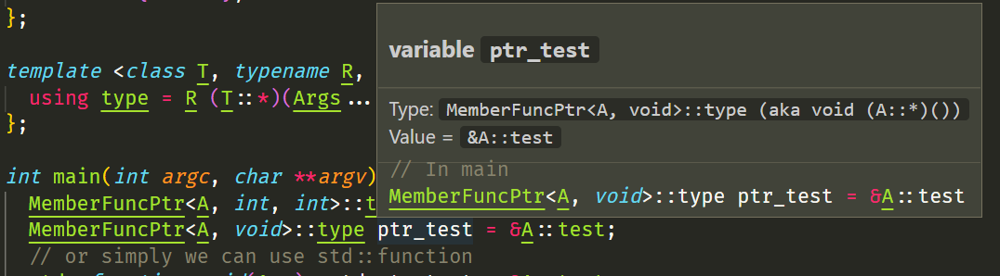
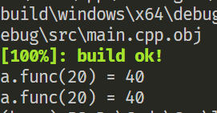
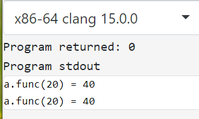
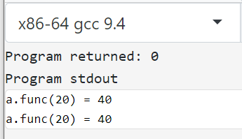
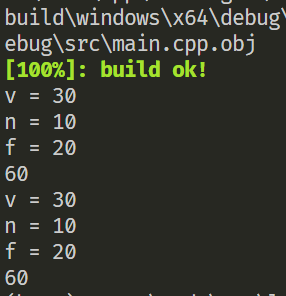
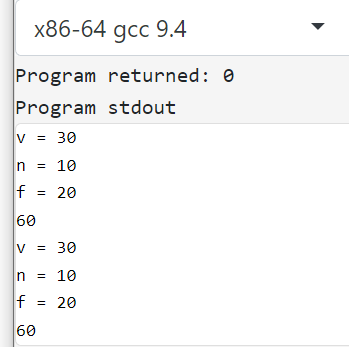
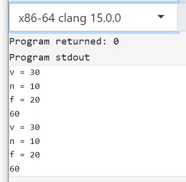
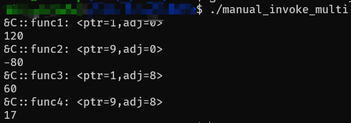

刷牛客时经常能刷到面向对象相关的题目。多态作为面向对象中的重要特性（封装、继承和多态），在八股中经常考察其实现原理。为了方便理解，先给出一个简单的多态样例：

```c++
class A {
public:
  virtual int func1(int v) { return value + v; }
  virtual int func2(int v) { return value - v; }
  int func3(int v) { return value * v; }
  static int func4(int v) { return v * 2; }
  void test() {} // 供后文“成员函数指针”一节示例使用

public:
  int value{0xfeff};
};

class B : public A {
public:
  int func1(int v) override { return value + 2 * v; }
  int func3(int v) { return value * 2 * v; }

public:
  int value{0xfffd};
};
```

接下来是一个经典示例：调用不同性质的函数并打印输出：

```c++
int main(int argc, char **argv) {
  B b;
  b.value = 2;
  A *a = &b;
  a->value = 4;
  int v = 20;
  fmt::print("b.A::value={}\nb.B::value={}\n", b.A::value, b.B::value);
  fmt::print("a->func1({}) = {}\n", v, a->func1(v));
  fmt::print("a->func2({}) = {}\n", v, a->func2(v));
  fmt::print("a->func3({}) = {}\n", v, a->func3(v));
  fmt::print("a->func4({}) = {}\n", v, a->func4(v));
  return 0;
}
```

<!-- more -->

执行如下：

```bash
(base) PS D:\Code\Cpp\learn-git> xmake -brv learn-git && xmake run learn-git
[100%]: build ok!
b.A::value=4
b.B::value=2
a->func1(20) = 42
a->func2(20) = -16
a->func3(20) = 80
a->func4(20) = 40
```

输出可以分为两类：`func1`/`func2` 是虚函数，按对象的实际类型在运行时绑定；`func3`/`func4` 的调用目标在编译期就确定了。main 里先 `b.value = 2` 再 `a->value = 4`，前者写 B 自己的成员，后者写 A 子对象的成员，二者互不干扰——理解下面的数字需要先知道这一点。下面与输出逐行对应：

1. `b.A::value = 4`：A 子对象的成员被 `a->value = 4` 改写，所以读到 4。
2. `b.B::value = 2`：B 自己的成员仍是 `b.value = 2` 写入的值，与 A 子对象互不干扰。
3. `a->func1(20) = 42`：虚调用落到 B 覆盖后的 `B::func1`，其内部读到 B 的 `value`（2），即 2 + 2×20。
4. `a->func2(20) = -16`：同样是虚调用，但 B 没有覆盖 `func2`，执行的是 `A::func2`，其内部读到 A 的 `value`（4），即 4 − 20。
5. `a->func3(20) = 80`：非虚，按静态类型 A 绑定 `A::func3`，即 4×20。
6. `a->func4(20) = 40`：静态成员函数，与对象无关，即 20×2。


## 成员函数指针

考虑一个实际场景：事件回调。在界面上有一个“保存”按钮，用户点击需要执行 `window->save()`。但事件系统在设计时并不知道将来是谁来处理这次点击，它只负责“到点触发一个动作”。因此我们需要把 `window->save()` 这个动作先存下来、注册进去，等点击发生时再调用。

最简单的思路就是类似于普通的函数，直接保存成员函数指针（例如 `&A::test`），在真正需要调用的时候指定对象进行调用（实际开发中也可以用 `std::function` + lambda 把对象和动作一起打包，这里先从更基础的成员函数指针看起），`&A::test` 的类型类似于普通的函数指针`void(*)()`，只不过加上了类的限定符`A::`，即 `void(A::*)()`，写成模板定义就是如下形式：

```c++
template <class T, typename R, typename... Args> struct MemberFuncPtr {
  using type = R (T::*)(Args...);
};
```

例如 `A::test` 就可以这样定义：

```c++
  MemberFuncPtr<A, void>::type ptr_test = &A::test;
```



可以看到它实际上就是 `void (A::*)()`，比直接写出整个函数指针类型简洁一些。假设下面已经存在一个 `A *a`，调用成员函数指针可以使用 `.*` 和 `->*`：

```c++
(a->*ptr_test)();
((*a).*ptr_test)();
```

当我们通过 `&A::test` 拿到成员函数指针时，很自然会以为它和普通函数指针一样大，但实际上不一定——**其大小取决于实现所遵循的 C++ ABI**（例如 GCC/Clang 使用 Itanium C++ ABI，MSVC 使用自家 ABI），C++ 标准并不规定它的大小。

我们在 [Compiler Explorer](https://godbolt.org) 中进行运行测试（它不支持运行 MSVC，但可以运行 Clang 和 GCC）：

```c++
#include <iostream>
class A {
public:
    virtual void func(){}
};

int main() {
    using namespace std;
    cout << "sizeof &A::func = " << sizeof(&A::func) << endl;
    return 0;
}
```

输出结果如下表所示：

| Compiler                                        | Output |
| :---------------------------------------------- | ------ |
| x86-64 gcc 9.4                                  | 16     |
| x86-64 clang 15.0.0                             | 16     |
| x86-64 msvc v19.25.28614 (default)              | 8      |
| x86-64 msvc v19.25.28614 (single_inheritance)   | 8      |
| x86-64 msvc v19.25.28614 (multiple_inheritance) | 16     |
| x86-64 msvc v19.25.28614 (virtual_inheritance)  | 24     |

> [!NOTE]
>
> MSVC 成员函数指针的大小可以通过 [pointers_to_members pragma | Microsoft Learn](https://learn.microsoft.com/zh-cn/cpp/preprocessor/pointers-to-members?view=msvc-160) 手动指定：
>
> ```
> #pragma pointers_to_members( full_generality, virtual_inheritance )
> ```
>
> - single_inheritance 表示单继承
> - multiple_inheritance 表示多继承
> - virtual_inheritance 表示虚继承
>
> 如果不指定，编译器会根据函数类型自动选择空间最小的表示方式（也就是混合使用上面三种表示方式）。

普通函数指针在 x86-64 上只有 8 字节，而 GCC/Clang 的成员函数指针固定是 16 字节，MSVC 还会随继承方式在 8/16/24 字节之间变化。这说明**成员函数指针存的不一定是真正的函数地址**（在 MSVC 单继承模式下，虚成员函数指针大小也是 8 字节，和普通函数一样，但其实际存储的是一个编译器生成的辅助跳转函数（vcall thunk）地址，而不是最终函数地址）。

带着这个疑问，我们首先了解一下虚函数的实际函数地址究竟存在哪里？

---

## 虚表与虚指针

包含虚函数的类，其对象起始处会多存一个指针：它指向一张按槽位存放虚函数入口地址的表。这张表称为虚函数表（vtable，简称虚表），对象里指向它的指针称为虚指针（vptr）（MSVC 文档里分别称为 vftable 和 vfptr）。

> [!NOte]
>
> 这里的 vptr 与上一节的“成员函数指针”不是一回事：
>
> - 成员函数指针是用户保存下来的“指向某个成员函数”的值，
>
> - vptr 则是对象自身携带、指向整张虚表的指针。

虚表本质是一张按槽位组织的函数地址表，除虚函数入口地址外，还会放 RTTI 等辅助信息。

### 虚函数调用方式

虚调用的基本原理可以概括成：调用方不直接持有最终函数地址，而是从对象取出 vptr → 找到该对象实际类型对应的虚表 → 按固定的槽位取出函数地址再调用。**基类和派生类把同一个虚函数放在相同槽位，但槽里存的是各自实际实现的地址，所以同一段调用代码作用于不同对象时，实际执行的函数不同**。

还是以开头的案例为例进行说明，编译器为 `a->func1(v)`（`a` 是 `A*`，实际指向 `B` 对象）生成的调用，概念上等价于：

```text
A *self = a;                             // 单继承且基类偏移为 0，this 无需修正
auto fn = self->vptr[0];                 // func1 的槽位在编译期固定为 0
fn(self, v);                             // 间接调用，落到谁由 vptr 决定
```

实际汇编大概是这样（x86-64，示意）：

```asm
mov  rcx, [a]        ; rcx = a（指向 b）
mov  rax, [rcx]      ; rax = b.vptr → B 的虚表
call qword ptr [rax] ; 间接调用 vptr[0]（rcx 作为 this 传入）
```

对照开头的例子：

- `a->func1` 的槽位是 vptr[0]，b 的虚表这一槽是 `B::func1`，所以得到 42；

- `a->func2` 的槽位是 vptr[1]，B 的虚表这一槽仍指向 `A::func2`，所以得到 -16。

调用点的指令对 A、B 完全一样，区别只出现在 `mov rax, [rcx]` 读到的 vptr 上——这也是“动态绑定”中“动态”二字真正发生的地方。

### 查看虚表和类布局

下面先用三个编译器的布局输出验证这张表的结构。

MSVC、Clang 以及 GCC 都提供了查看虚表和类内存布局的命令，分别如下：

```bash
# gcc 调用命令
g++ -fdump-lang-class=- test.cpp
# clang 查看命令（-Xclang 表示把后面的参数传给 Clang 编译器）
clang++-15 -Xclang -fdump-record-layouts test.cpp
clang++-15 -Xclang -fdump-vtable-layouts test.cpp
# MSVC 查看命令
cl /d1 reportAllClassLayout test.cpp
```

用下面的简单类来验证：

```c++
class A {
public:
    virtual void func(){}
public:
    int n{0xfffd};
};
```

下面分别是三个编译器对类 A 的虚函数表和类布局输出：

**x86-64 gcc 9.4 输出结果**

```txt
➜  src g++ -fdump-lang-class=- test.cpp
Vtable for A
A::_ZTV1A: 3 entries
0     (int (*)(...))0
8     (int (*)(...))(& _ZTI1A)
16    (int (*)(...))A::func

Class A
   size=16 align=8
   base size=12 base align=8
A (0x0x7ff174281420) 0
    vptr=((& A::_ZTV1A) + 16)
```

从输出中可以看到，GCC 的虚表 `_ZTV1A` 一共有三项：偏移 0 是 offset-to-top（值为 0），偏移 8 是 RTTI 指针（`&_ZTI1A`），偏移 16 才是第一个虚函数 `A::func`。对象里的 vptr 指向 `&_ZTV1A + 16`，也就是虚表中 `A::func` 所在的位置，而不是虚表开头。对象布局显示 vptr 在偏移 0、成员变量 `A::n` 从偏移 8 开始、对象总大小 16 字节。

**x86-64 clang 15.0.7 输出结果**

```txt
➜  src clang++-15 -Xclang -fdump-record-layouts test.cpp

*** Dumping AST Record Layout
         0 | class A
         0 |   (A vtable pointer)
         8 |   int n
           | [sizeof=16, dsize=12, align=8,
           |  nvsize=12, nvalign=8]
             
*** Dumping IRgen Record Layout    
...
➜  src clang++-15 -Xclang -fdump-vtable-layouts test.cpp
Vtable for 'A' (3 entries).
   0 | offset_to_top (0)
   1 | A RTTI
       -- (A, 0) vtable address --
   2 | void A::func()

VTable indices for 'A' (1 entries).
   0 | void A::func()
```

从输出中可以看到，上半部分是对象布局：vptr 在偏移 0、成员变量 `A::n` 从偏移 8 开始；下半部分是虚表：第 0、1 项是 offset_to_top 和 RTTI，第 2 项才是 `A::func`；最后的 `VTable indices` 表示 func 的槽位索引是 0。整体结构和 GCC 的 dump 一致，只是展示形式不同。

**x86-64 msvc 19.25.28614 输出结果**

```txt
➜  src cl /d1 reportAllClassLayout test.cpp
...
class A size(16):
        +---
 0      | {vfptr}
 8      | n
        | <alignment member> (size=4)
        +---

A::$vftable@:
        | &A_meta
        |  0
 0      | &A::func

A::func this adjustor: 0
```

从输出中可以看到，上半部分是对象布局：`{vfptr}` 在偏移 0、成员变量 `A::n` 从偏移 8 开始，后面补 4 字节对齐，布局与前面两份一致；下半部分是虚表：`&A_meta` 是 RTTI 元数据，`&A::func` 是第一个虚函数槽；`this adjustor: 0` 表示当前类调用虚函数无需修正 this。

> [!NOTE]
>
> 三份 dump 的展示格式不同，但关键结论一致——无论虚表开头有没有 offset-to-top、RTTI 等辅助项，**对象里的 vptr 都指向“第一个虚函数槽”**（GCC 输出里的 `vptr=((& A::_ZTV1A) + 16)` 就是这个意思），所以后面代码里 `vptr[0]` 恰好是第一个虚函数。

多继承场景也是类似：每个类各有一张虚表，虚函数按声明顺序占槽位；派生类覆盖某个虚函数时替换对应槽位，没覆盖的槽位沿用基类实现。

回到开头的 A/B 例子：

```text
A 的虚表：[0] A::func1    [1] A::func2
B 的虚表：[0] B::func1    [1] A::func2   // func1 被覆盖，func2 沿用基类实现
```

虚函数不把函数地址存进对象，对象只存一个 vptr，由构造函数写入并指向真实类型对应的虚表：

- 构造 B 对象之后（例如 `B b{};`），`b` 的 vptr 就指向 B 类的虚表；
- `A *a = &b;` 只是让基类指针 `a` 指向子类对象，以统一的方式进行存储和使用，不会改对象也不会改 vptr；
- 基类调用虚函数时 `a->func1()` 就可以通过虚函数表调用到 `B::func1`。

除开头元数据信息外，三个编译器的虚函数表布局基本一致，虚指针都位于类的前 8 字节。

### 通过 vptr 手工调用虚函数

根据类结构和vptr的定义，我们可以用 `reinterpret_cast` 把 vptr 读出来，手动从虚表取实际函数地址再进行调用——把编译器自动做的事手工做一遍。代码如下：

```c++
#include <cstdint>
#include <iostream>
class A {
public:
  virtual int func(int v) { return v + 20; }
};

int main() {
  A a;
  // 读取类的前 8 字节，拿到虚表指针
  uintptr_t *vptr = *reinterpret_cast<uintptr_t **>(&a);
  // 从虚表中拿到虚函数的地址
  uintptr_t ptr_func = vptr[0];
  using Func = int (*)(A *, int);
  Func f = reinterpret_cast<Func>(ptr_func);
  int res = f(&a, 20);
  std::cout << "a.func(20) = " << res << std::endl;
  res = a.func(20);
  std::cout << "a.func(20) = " << res << std::endl;
  return 0;
}
```

> `uintptr_t` 是大小与指针一致的整型，在 64 位平台上就是 `uint64_t`，用它便于跨平台。

如果调用正确，两行输出应当完全一致：



输出的确如我们所愿（x86-64 msvc 19.25.28614）。

再在 Compiler Explorer 上跑一下 GCC 和 Clang：



GCC 执行结果



上面的例子比较简单，既没有继承，也没有处理更关键的 this 指针问题，下面给出一个稍复杂的例子：

```c++
#include <cstdint>
#include <iostream>
class A {
public:
  A(int n) : n(n) {}

  virtual int func(int v) {
    std::cout << "v = " << v << std::endl;
    std::cout << "n = " << n << std::endl;
    return v + n;
  }

public:
  int n{0xfffd};
};

class B : public A {
public:
  B(int n, int f) : A(n), f(f) {}
  virtual int func(int v) {
    std::cout << "v = " << v << std::endl;
    std::cout << "n = " << n << std::endl;
    std::cout << "f = " << f << std::endl;
    return v + n + f;
  }

public:
  int f{0xfffd};
};

int main() {
  B b(10, 20);
  A *a = &b;
  uintptr_t *vptr = *reinterpret_cast<uintptr_t **>(&b);
  uintptr_t ptr_func = vptr[0];
  using Func = int (*)(A *, int);
  Func f = reinterpret_cast<Func>(ptr_func);
  int res = f(a, 30);
  std::cout << res << std::endl;
  res = a->func(30);
  std::cout << res << std::endl;
  return 0;
}
```

MSVC 执行结果



GCC 执行结果



Clang 执行结果



三种编译器下都得到 `60`，解释和前面一致：b 的 vptr 指向 B 的虚表，第 0 槽是 `B::func`。

> [!Note]
>
> **上述手动调用方式仅适用于单继承场景，不适用于多继承场景**。
>
> 把 `a` 直接当作 this 传给取出的 `B::func` 是安全的。而在多继承下，第二个及以后的基类子对象不在偏移 0，调用前必须先把 this 修正到对应子对象。

---

## 成员函数指针里存了什么

既然虚函数的最终地址要等运行时才知道，那么 `&A::func` 这种成员函数指针里存的又是什么？为什么 GCC/Clang 下它比普通函数指针大、MSVC 下它大小一样却不是实际的函数地址？

下面先看 ABI 是怎么定义它的，再结合实际场景进行验证。

### 结构体定义

普通函数指针可以直接存“目标函数的地址”，调用时拿到地址就能跳转执行。而成员函数指针不行：它还要处理隐含的 this 指针，而且如果指向虚函数，最终地址在编译期根本不知道。**所以它存的是一份“怎么找到并调用目标”的信息，具体字段由 ABI 决定**。如下所示：

GCC/Clang 使用的 Itanium C++ ABI 布局：

```c++
// gcc / clang —— Itanium C++ ABI
struct member_func_info {
  // 普通成员函数：ptr 就是最终函数地址；
  // 指向虚函数时：ptr 存“虚表槽的字节偏移 + 1”
  // （最低位的 1 是“这是虚函数”的标记，调用前要把它去掉）
  uintptr_t ptr;
  // this 修正量：多继承时先把 this 定位到对应子对象，单继承为 0
  ptrdiff_t adj;
};
```

MSVC 自家 ABI 则是另一种布局：

```c++
// MSVC —— 单继承
struct member_func_info {
  // vcall thunk 地址（8 字节）
  uintptr_t ptr;
};

// MSVC —— 多继承
struct member_func_info {
  // vcall thunk 地址（8 字节）
  uintptr_t ptr;
  // this 修正量（4 字节，整体按 16 字节对齐）
  uint32_t adj;
};
```

> [!NOTE]
> 普通成员函数的 `ptr` 就是函数地址（x86-64 上按 8 字节对齐，所以最低位恒为 0）；指向虚函数的 `ptr` 是“槽字节偏移 + 1”，所以最低位为 1。这类技巧依赖具体平台的 ABI，上述判别方式只适用于 x86-64 下的 Itanium ABI；部分 ARM 平台上函数地址的最低位另有用途，不能照搬，分析时应以对应平台的文档为准。

参考文档：

- [MSVC C++ ABI Member Function Pointers](https://rants.vastheman.com/2021/09/21/msvc/)
- [Itanium C++ ABI — member pointers](https://itanium-cxx-abi.github.io/cxx-abi/abi.html#member-pointers)

#### 实验一：单继承的虚函数

把 `&A::func` 的字节打出来：

```c++
#include <algorithm>
#include <iomanip>
#include <iostream>

class A {
public:
  virtual void func() {}
};

template <class T, typename Ret, typename... Args> struct MemberFuncPtr {
  using type = Ret (T::*)(Args...);
};

int main() {
  A a;
  constexpr size_t size_a = sizeof(&A::func);
  uint8_t bytes[size_a];
  MemberFuncPtr<A, void>::type ptr = &A::func;
  uint8_t *ptr_bytes = reinterpret_cast<uint8_t *>(&ptr);
  std::copy(ptr_bytes, ptr_bytes + sizeof(ptr), bytes);
  std::cout << "[ ";
  for (uint8_t v : bytes) {
    std::cout << std::setbase(16) << std::setw(2) << (uint32_t)v << " ";
  }
  std::cout << "]" << std::endl;
  return 0;
}
```

MSVC 下，输出结果如下：

```txt
[ 4d 40 8c 7a f7 7f  0  0 ]
```

Clang 和 GCC 下，输出结果如下：

```txt
[  1  0  0  0  0  0  0  0  0  0  0  0  0  0  0  0 ]
```

参照 ABI 进行解读：

- GCC/Clang 的 16 字节正好拆成 `ptr` 和 `adj`两个字段，值是 `ptr = 1、adj = 0`。按模型 `ptr = 槽字节偏移 + 1`，`A` 只有一个虚函数 `func`（槽 0、偏移 0），所以恰是 1；`adj = 0` 对应单继承无需修正 this 指针。

- MSVC 的 8 字节对应 `ptr`，按模型它是 vcall thunk 的地址而不是 `A::func` 函数体的地址。

#### 实验二：多继承的虚函数

A类和B类各有两个虚函数，C类同时继承两者（A类子对象在偏移 0、B类子对象在偏移 8）。

```c++
#include <array>
#include <iomanip>
#include <iostream>

class A {
public:
  virtual void func1() {}
  virtual void func2() {}
};

class B {
public:
  virtual void func3() {}
  virtual void func4() {}
};

class C : public A, public B {

};

template <class T, typename Ret, typename... Args> struct MemberFuncPtr {
  using type = Ret (T::*)(Args...);
};

template <class T, typename Ret, typename... Args>
void print_bytes(typename MemberFuncPtr<T, Ret, Args...>::type func_ptr) {
  constexpr size_t size = sizeof(func_ptr);
  std::array<uint8_t, size> content;
  uint8_t *arr = reinterpret_cast<uint8_t *>(&func_ptr);
  std::copy(arr, arr + size, content.begin());
  std::cout << "[ ";
  for (uint8_t v : content) {
    std::cout << std::setbase(16) << std::setw(2) << (uint32_t)v << " ";
  }
  std::cout << "]" << std::endl;
}

int main() {
  A a;
  std::cout << "&A::func1" << std::endl;
  print_bytes<A, void>(&A::func1);
  std::cout << "&A::func2" << std::endl;
  print_bytes<A, void>(&A::func2);
  std::cout << "&B::func3" << std::endl;
  print_bytes<B, void>(&B::func3);
  std::cout << "&B::func4" << std::endl;
  print_bytes<B, void>(&B::func4);
  std::cout << "&C::func1" << std::endl;
  print_bytes<C, void>(&C::func1);
  std::cout << "&C::func2" << std::endl;
  print_bytes<C, void>(&C::func2);
  std::cout << "&C::func3" << std::endl;
  print_bytes<C, void>(&C::func3);
  std::cout << "&C::func4" << std::endl;
  print_bytes<C, void>(&C::func4);
  return 0;
}
```
GCC / Clang 输出：

```txt
&A::func1
[  1  0  0  0  0  0  0  0  0  0  0  0  0  0  0  0 ]
&A::func2
[  9  0  0  0  0  0  0  0  0  0  0  0  0  0  0  0 ]
&B::func3
[  1  0  0  0  0  0  0  0  0  0  0  0  0  0  0  0 ]
&B::func4
[  9  0  0  0  0  0  0  0  0  0  0  0  0  0  0  0 ]
&C::func1
[  1  0  0  0  0  0  0  0  0  0  0  0  0  0  0  0 ]
&C::func2
[  9  0  0  0  0  0  0  0  0  0  0  0  0  0  0  0 ]
&C::func3
[  1  0  0  0  0  0  0  0  8  0  0  0  0  0  0  0 ]
&C::func4
[  9  0  0  0  0  0  0  0  8  0  0  0  0  0  0  0 ]
```

下表展示了各个函数指针结构体的字段含义：

| 成员函数指针 | ptr（前 8 字节） | adj（后 8 字节） | 含义 |
| --- | --- | --- | --- |
| `A::func1` | 1 | 0 | A 虚表槽 0（偏移 0 + 1） |
| `A::func2` | 9 | 0 | A 虚表槽 1（偏移 8 + 1） |
| `B::func3` | 1 | 0 | B 虚表槽 0 |
| `B::func4` | 9 | 0 | B 虚表槽 1 |
| `C::func1` | 1 | 0 | A 子对象在 C 里偏移 0，A 虚表槽 0 |
| `C::func2` | 9 | 0 | A 子对象在 C 里偏移 0，A 虚表槽 1（偏移 8 + 1） |
| `C::func3` | 1 | 8 | B 子对象在 C 里偏移 8，B 虚表槽 0 |
| `C::func4` | 9 | 8 | B 子对象在 C 里偏移 8，B 虚表槽 1（偏移 8 + 1） |

此时眼尖的小伙伴可能会发现，为什么 `A::func1`、`B::func3`、`C::func1` 的内容完全一样？

因为**成员函数指针存是“运行时要怎么找到它”的相对信息**。这三者都是“槽 0 + 无需修正 this”，编码自然相同。类身份不需要在运行期保存——C++ 类型系统在编译期就保证 `A::*` 只能配合 A 及其派生类对象使用，运行期再让对象自己的 vptr 来解释这份编码。反过来，槽位不同会体现在 `ptr`（1 → 9），子对象位置不同会体现在 `adj`（0 → 8）。

MSVC 输出（添加 `/RTC1` 标志，将所有未初始化的栈上内存标记为 `0xcc`）：

```txt
&A::func1
[ a2 40 4e 34 f6 7f  0  0 ]
&A::func2
[ 87 1a 4e 34 f6 7f  0  0 ]
&B::func3
[ b8 2a 4e 34 f6 7f  0  0 ]
&B::func4
[ bf 3c 4e 34 f6 7f  0  0 ]
&C::func1
[ a2 40 4e 34 f6 7f  0  0  0  0  0  0 cc cc cc cc ]
&C::func2
[ 87 1a 4e 34 f6 7f  0  0  0  0  0  0 cc cc cc cc ]
&C::func3
[ b8 2a 4e 34 f6 7f  0  0  8  0  0  0 cc cc cc cc ]
&C::func4
[ bf 3c 4e 34 f6 7f  0  0  8  0  0  0 cc cc cc cc ]
```

MSVC 的字段布局和 GCC/Clang 不一样：

- A/B 是单继承表示，只有 8 字节（thunk 指针）；
- C 是多继承表示，结构体包含 padding 后的大小为 16 字节，实际有意义的只有前 12 字节——8 字节 thunk 指针 + 4 字节 `adj`，最后 4 字节是按 16 对齐产生的填充（本次运行里是未初始化栈上的 `0xcc`）。

按这个结构把输出拆开，如下表所示：

| 成员函数指针 | thunk 地址（前 8 字节） | adj | 含义 |
| --- | --- | --- | --- |
| `A::func1` | `a2 40 4e 34 f6 7f 00 00` | — | A 槽 0 的 vcall thunk（汇编里的 `A::vcall'{0}'`） |
| `A::func2` | `87 1a 4e 34 f6 7f 00 00` | — | A 槽 1 的 vcall thunk |
| `B::func3` | `b8 2a 4e 34 f6 7f 00 00` | — | B 槽 0 的 vcall thunk |
| `B::func4` | `bf 3c 4e 34 f6 7f 00 00` | — | B 槽 1 的 vcall thunk |
| `C::func1` | 与 `A::func1` 相同 | 0 | 复用 A 槽 0 的 vcall thunk；A 子对象在 C 里偏移 0 |
| `C::func2` | 与 `A::func2` 相同 | 0 | 复用 A 槽 1 的 vcall thunk；A 子对象在 C 里偏移 0 |
| `C::func3` | 与 `B::func3` 相同 | 8 | 复用 B 槽 0 的 vcall thunk；B 子对象在 C 里偏移 8 |
| `C::func4` | 与 `B::func4` 相同 | 8 | 复用 B 槽 1 的 vcall thunk；B 子对象在 C 里偏移 8 |

从表里能读出两个关键点：槽位不同的虚函数对应不同的 thunk（A 的两行地址不同）；继承到 C 后，thunk 本身可以复用，差异全部体现在 `adj` 上——A 子对象在偏移 0，所以 `adj = 0`；B 子对象在偏移 8，所以 `adj = 8`。

#### 汇编代码

前面从结构体定义出发解读了字节输出，下面结合汇编代码加深理解。

以 `&A::func1` 为例，源代码是这样一行：

```c++
print_bytes<A, void>(&A::func1);
```

MSVC 对应汇编：

```asm
lea     rcx, OFFSET FLAT:[thunk]:A::`vcall'{0,{flat}}' }'            ; A::`vcall'{0}'
call    void print_bytes<A,void>(void (__cdecl A::*)(void)) ; print_bytes<A,void>
```

这里的 `thunk` 是编译器自动生成的一小段机器码：MSVC 单继承下成员函数指针只有 8 字节，放不下“虚表槽位”这个信息，于是对每个虚函数生成一个 vcall thunk——调用时它先取出对象的 vptr，再按编译期写死在 thunk 指令里的槽位，跳转到真正的虚函数。

**所以 `&A::func1` 在 MSVC 下取到的是这个 thunk 的地址，而不是函数体的地址。**

GCC 对应汇编：

```asm
mov     r12d, 1
mov     r13d, 0
mov     rcx, r12
mov     rbx, r13
mov     rax, r12
mov     rdx, r13
mov     rax, rdx
# 最终 rdi = 1, rsi = 0，也就是输入到函数的参数
mov     rdi, rcx
mov     rsi, rax
call    void print_bytes<A, void>(MemberFuncPtr<A, void>::type)
```

GCC 这段只表达一件事：最终传给函数的是 `1` 和 `0`，也就是 `ptr = 1、adj = 0`；中间那些 `mov` 只是编译器在腾寄存器，可以忽略。

Clang 对应汇编：

```asm
mov     qword ptr [rbp - 24], 0
mov     qword ptr [rbp - 32], 1
# 最终 rdi = 1, rsi = 0，也就是输入到函数的参数
mov     rdi, qword ptr [rbp - 32]
mov     rsi, qword ptr [rbp - 24]
call    void print_bytes<A, void>(MemberFuncPtr<A, void>::type)
mov     rdi, qword ptr [rbp - 160]      # 8-byte Reload
```

Clang 也一样：在栈上写入 `0` 和 `1`，再分别作为 `adj`、`ptr` 传给函数。

---

### 手动解析虚函数指针调用虚函数

根据前面的结构体理解，现在可以手动解析虚函数指针结构体调用虚函数：不用 `->*` 运算符，直接按 `ptr/adj` 编码查虚表并调用。

**下面代码只适配 x86-64 的 Itanium ABI（GCC/Clang）**

类沿用前面的 A/B/C 设定：A 只有两个虚函数，B 多带一个数据成员 `f`（这样 `func3`/`func4` 的结果依赖 this 是否传对），C 同时继承二者。由于 A 子对象在 C 中偏移 0、B 子对象仍从偏移 8 开始，下面会看到 `C::func1/2` 的 `adj = 0`、`C::func3/4` 的 `adj = 8`，和前面表格里的编码一致。

手工调用分四步，对应前面的编码规则：

1. `obj + adj`：先把 this 修正到“要找虚表的那个子对象”（`C::func1/2` 是 0，`C::func3/4` 是 8）；
2. 读出该子对象首部的 `vptr`（指向虚表槽 0）；
3. 去掉 `ptr` 最低位的虚函数标记（`& ~1`），剩下的就是槽的字节偏移，`vptr + 偏移` 得到目标槽的地址；
4. 从槽里取出真正的函数地址，并**把修正后的 `sub_obj` 作为 this 传入**——此时它已经指向正确的 A/B 子对象。

```c++
#include <cstdint>
#include <iostream>
#include <utility>

class A {
public:
  virtual int func1(int v) { return v + 100; }
  virtual int func2(int v) { return v - 100; }
};

class B {
public:
  B(int f) : f(f) {}
  virtual int func3(int v) { return f * v; }
  virtual int func4(int v) { return v - f; }

  int f;
};

class C : public A, public B {
public:
  C(int f) : B(f) {}
};

template <class T, typename Ret, typename... Args> struct MemberFuncPtr {
  using type = Ret (T::*)(Args...);
};

struct member_func_info {
  uintptr_t ptr;
  ptrdiff_t adj;
};

template <class T, typename Ret, typename... Args>
member_func_info
from_raw(typename MemberFuncPtr<T, Ret, Args...>::type func_ptr) {
  return *reinterpret_cast<member_func_info *>(&func_ptr);
}

template <class T, typename Ret, typename... Args>
Ret invoke(T *obj, typename MemberFuncPtr<T, Ret, Args...>::type func_ptr,
           Args &&...args) {
  uintptr_t obj_addr = reinterpret_cast<uintptr_t>(obj);
  member_func_info func_info = from_raw<T, Ret, Args...>(func_ptr);
  std::cout << "<ptr=" << func_info.ptr << ",adj=" << func_info.adj << ">"
            << std::endl;

  // 1. 修正 this：定位到存放 vptr 的子对象
  uintptr_t sub_obj = obj_addr + func_info.adj;
  // 2. 读出 vptr（指向虚表槽 0）
  uintptr_t vptr = *reinterpret_cast<uintptr_t *>(sub_obj);
  // 3. 最低位 1 是“虚函数”标记，去掉后得到槽的字节偏移
  uintptr_t slot_addr = vptr + (func_info.ptr & ~uintptr_t(1));
  // 4. 槽里存的是真正的函数地址；成员函数的 this 在 ABI 层就是第一个参数，
  //    这里传入修正后的 sub_obj
  using Func = Ret (*)(void *, Args...);
  Func f = *reinterpret_cast<Func *>(slot_addr);
  return f(reinterpret_cast<void *>(sub_obj), std::forward<Args>(args)...);
}

int main() {
  C c{3};
  std::cout << "&C::func1: " << invoke<C, int>(&c, &C::func1, 20) << std::endl;
  std::cout << "&C::func2: " << invoke<C, int>(&c, &C::func2, 20) << std::endl;
  std::cout << "&C::func3: " << invoke<C, int>(&c, &C::func3, 20) << std::endl;
  std::cout << "&C::func4: " << invoke<C, int>(&c, &C::func4, 20) << std::endl;
  return 0;
}
```

执行结果（GCC）



这个结果说明手工调用读到了正确的方法和正确的数据：

- `func1`：按 `ptr = 1` 找到 `A::func1`，参数 `v = 20` 算出 `100 + 20 = 120`；
- `func2`：按 `ptr = 9` 找到 `A::func2`，算出 `20 - 100 = -80`；
- `func3`：this 修正到偏移 8 的 B 子对象后读到 `f = 3`，算出 `3 × 20 = 60`；
- `func4`：同样读到 `f = 3`，算出 `20 - 3 = 17`。

前两个说明槽位查对了；后两个依赖成员 `f`，数值正确说明 this 修正（`adj = 8`）和虚表读取都对——它们和 `(c.*(&C::func1))(20)` 这类编译器自动生成的调用结果完全一致，打印出的 `ptr/adj`（1/0、9/0、1/8、9/8）也和前面字节实验里的编码一一对应。

> [!NOTE]
> **上面样例只覆盖非虚多重继承**：手工调用依赖“虚表槽偏移 + 固定 `adj`”，而**虚继承**会合并重复的基类子对象，共享虚基类的位置取决于最派生类型，运行期还要借助额外指针、vcall offset 或 thunk 才能定位。


### 虚函数的二级寻址

此时我们可以回答最开头提出的问题：`&A::func` 为什么没法存储最终的函数地址？

因为最终地址要等运行时、由对象的实际类型决定，编译期根本拿不到。**虚函数指针能存下来的只有“定位规则”——Itanium 存“虚表槽的字节偏移 + adj”，MSVC 存“vcall thunk 地址 + adj”（多继承时才有 adj），本质上都不是函数体地址，而是“下一次该往哪查”的信息**。

调用时先经对象的 vptr 找到虚表槽，槽里才是真正的函数地址，也就是要隔着一层虚表才能拿到最终地址，所以叫**二级寻址**。这也是它能跨继承复用的原因：同一份“定位规则”配上不同的对象 vptr，就能落到不同的函数上。

## 总结

把一次虚函数调用拆开看，分以下三个阶段：

1. **编译期**：编译器不为虚函数写死函数地址，只确定虚函数在 vtable 里的槽位（以及多继承下 this 需要的修正），并在调用点生成“取 vptr → 按槽位取函数地址 → 调用”的代码。
2. **构造期**：构造函数把 vptr 写入对象，指向该对象**实际类型**对应的虚表。覆盖函数替换对应槽位，未覆盖的槽位继续指向基类实现。
3. **调用期**：调用点取出 vptr，按编译期确定的槽位加载函数地址并调用。a 指向 A 的对象就查到 A 的虚表，指向 B 的对象就查到 B 的虚表——这就是“动态/晚绑定”发生的时刻。

### 虚调用的开销

虚调用相比普通调用，概念上多做了两件事：先取 vptr（一次访存），再按编译期确定的槽位取函数地址（第二次依赖访存），最后间接调用——也就是“先查表，再跳转”。真正容易被低估的是另外两点：

- 调用目标在编译期未知，函数体无法内联，跨函数优化（常量传播、寄存器分配等）也会被阻断，对热路径的影响往往大于那一次访存本身；
- 间接调用的目标来自内存，分支预测的难度高于直接 `call`。

this 修正并不属于虚调用的固有开销：单继承且基类位于偏移 0 时修正值为 0；只有多继承/虚继承下才需要额外调整（可能经 thunk），而且非虚调用同样可能遇到。另外，当编译器能证明实际类型（例如类标记了 `final`、或通过静态类型已知的对象直接调用）时，它也可能做 devirtualization，把虚调用优化成直接调用——这是语义不变前提下的优化，虚调用的机制本身仍按上文三步理解。

### 延伸：虚继承为什么更复杂

普通多重继承里，各基类子对象在派生类中的偏移是编译期固定的，所以成员函数指针的 `adj` 可以直接写死（例如前面 C 里的 B 子对象恒为偏移 8）。

虚继承解决的则是菱形继承里的“重复基类”问题：

```cpp
class A {
public:
  virtual ~A() {}
  int x;
};

class B : public virtual A {};
class C : public virtual A {};
class D : public B, public C {};
```

如果不加 `virtual`，D 会从 B、C 各自继承一份 A；声明 `virtual` 后，D 里只保留一份共享的 A。代价是这份 A 相对 B/C 子对象的位置不再固定——同一个 `B*` 可能指向独立的 `B` 对象，也可能指向 `D` 中的 B 子对象，A 的偏移会随最派生对象的完整布局而变化，编译期无法写死。

所以运行期需要借助额外的指针、虚表里的 vcall offset 等定位信息，虚表槽里也可能放 thunk；构造期间还会使用 construction vtable，保证对象尚未完全构造时虚调用也能分派到当前阶段正确的实现。这也是上文手工 `invoke` 只覆盖非虚多重继承的原因。

> [!TIP]
> 实际上这种菱形虚继承在工程里出现得并不多：多数场景可以用组合或更扁平的继承结构避开。它带来共享祖先状态的同时，也付出了布局动态化、this 定位复杂、构造期间特殊处理等代价，只有在确实需要“多个基类共享同一份祖先状态”时才值得使用。标准库的 `iostream` 就是这样的典型例子：`istream` 与 `ostream` 虚继承同一个 `basic_ios`，使读、写两侧共享同一份流状态。

### 延伸：dynamic_cast 与 RTTI

dynamic_cast 与虚调用共享同一套基础设施（多态类要有 vptr，RTTI 信息也挂在虚表附近），但开销模式不同：它不是按固定槽位取函数地址，而是“读 RTTI → 沿继承图检查类型 → 可能失败”，多继承/虚继承下的跨类转换还需要路径搜索和指针修正，所以通常比虚调用更重（编译器也可能把它优化成 no-op 或一次类型指针比较）。

这也是不少性能敏感项目自己实现轻量 RTTI 的原因：例如用整型 `type_id` 加静态继承链做 is-a 判定，牺牲 dynamic_cast 的通用性，换取确定、可控的判定开销，以及反射/序列化等额外能力。
