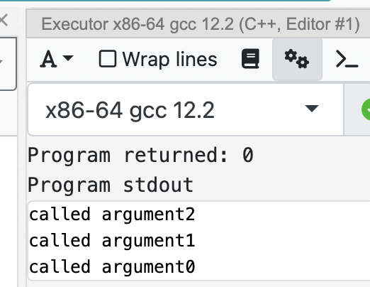

最近刷牛客的 C++ 语言专项练习（选择题），本来以为 C++ 掌握的还不错吧，一做题就全露馅了，细节太多了（ C++ 本身的 **未定义行为 undefined behavior** 以及 C++这么多年来的更新带来的包袱太多了）

基本上所有的问题都可以在 [cppreference.com](https://en.cppreference.com/w/) 上面找到答案，还有样例，比较权威，然后实现相关的可以使用 [Compiler Explorer (godbolt.org)](https://godbolt.org/) 查看编译细节。

## C++ 语法细节

### 自增/自减运算符的重载

***题1***：如果定义了一个类myclass, 则为myclass类对象以成员函数形式重载 **后 ++ 运算符** 的声明应该是：

A. `myclass operator++()`

B. `myclass operator++(int)`

C. `myclass &operator++()`

D. `myclass &operator(int)`

***答案***：B

***解析***：这题纯纯考察自增/自减的重载，没什么难点，单纯是不记得这个写法了

<!-- more -->

> #### Increment and decrement
>
> When the postfix increment or decrement operator appears in an expression, the corresponding user-defined function (operator++ or operator--) is called with an integer argument `0`. Typically, it is implemented as T operator++(int) or T operator--(int), where the argument is ignored. The postfix increment and decrement operators are usually implemented in terms of the prefix versions:

```c++
#include <iostream>
class A {
public:
    // 前置自增
    A& operator++() {
        std::cout << "called ++A" << std::endl;
        return *this;
    }
    // 后置自增，相比前置版本的函数签名，就差了一个 int
    A& operator++(int) {
        std::cout << "called A++" << std::endl;
        return *this;
    }
};

int main() {
    A a;
    a++;
    ++a;
    return 0;
}
```

运行结果


关键点就是：**后置自增函数相比于前置自增函数需要添加一个 `int` 参数进行区别**

注：对于前置自增/自减和后置自增/自减运算符本身也是常考察的内容：

- `i++` 的含义是 **将 i 增加 1，返回加之前的值**，用一个函数来表示就是

  ``` c++
  int prefix_increment(int& v) {
      int temp = v;
      v += 1;
      return temp;
  }
  ```

- `++i` 的含义是 **将 i 增加 1，返回加之后的值**，用于用函数来表示就是

  ```c++
  int postfix_increment(int& v) {
      return v+= 1;
  }
  ```

从我们代码实现上也可以看出，***在未优化的情况下***，后置自增会比前置自增多用一个临时变量，从而造成性能开销，**但是现在的编译器都很智能了，对于这个基本上都会直接优化掉**（开启 `-O2` 优化）。***所以在平时写的时候怎么舒服怎么来就行，只要确保可读性就行***。


### 转义字符

***题2***：有转义字符如下：`'\0X41'`、`'\0x41'`、`'\X41'`、`'\x41'`、`'\a'`、`'\b'`、`'\c'`、`'\r'` 其中错误的转义字符个数是（

***解析***：这题也是考察的 C++ 语法，错误的有 4 个，`\0X41`、`\0x41`、`\X41`、`\c`

详细参考：[Escape sequences - cppreference.com](https://en.cppreference.com/w/cpp/language/escape)

**1. 简单转义字符**

```txt“
\' 表示 '
\" 表示 "
\\ 表示 \
\? 表示 ?
\a 表示 蜂鸣器（主板上）
\b 表示 退格
\f 表示 新一页
\n 表示 换行 (Line Feed)
\r 表示 回车 (Carriage Return)
\t 表示 水平制表符
\v 表示 垂直制表符
```

注：`\n\r` 在 CRLF （Carriage Return / Line Feed）表示回车换行，一般在 Windows 下的纯文本中常用，而在 Unix 系统下常用 `\n` 即 换行，在 VS Code 中也可以进行设置


**2. 数值表示形式**

char 本质上也是一个整数，那么我们可以使用数值编码也是一样的

- 八进制形式：`\<nnn>`，例如 `\141` 表示 ASCII 字符 `'a'`
- 十六进制形式：`\x<nn>`，例如 `\x61` 表示 ASCII 字符 `'a'`（这个是区分大小写的，只能使用小写的`\x`，但是后面的十六进制大小写都可以），例如 `\x3F` 和 `\x3f` 都行

代码如下

```c++
#include <iostream>

int main() {
    const char* v0 = "\x61";
    const char* v1 = "\141";
    const char* v2 = "a";
    std::cout << v0 << std::endl;
    std::cout << v1 << std::endl;
    std::cout << v2 << std::endl;
    return 0;
}
```

**3. Unicode 表示形式**

- `\u<nnnn>`，表示 `U+<nnnn>`的 Unicode，这种方式只能表示到 `U+FFFF`，对于 Emoji 等只能使用下面这种完整形式了
- `\U<nnnnnnnn>`，表示 `U+<nnnnnnnn>`的 Unicode，可以完整的表示 Unicode（`U+FFFFFFFF`），就是表示起来比较麻烦

而对于上面提到的 `\c` ，其在 C++ 中有定义，但是具体实现有关，没有一个统一的含义，因此不能算在转义字符行列中


### 域解析操作符

***题3***：外部变量可以供其所在的程序文件中的任何函数使用（）

1. 正确

2. 错误

***解析***：这一题一眼 **错误**，因为在函数中使用同名的变量就会将其覆盖掉，这样就无法使用外部变量了，但是看到评论中提到可以使用 `::<variable>`来访问外面作用域。这个查了一下，称为 Scope Resolution Operator（作用域解析运算符），那么我们可以写成这样

```c++
#include <iostream>
int v = 10;
void func() {
    int v = 0;
    std::cout << ::v << std::endl;
    std::cout << v << std::endl;
}
int main() {
    func();
    return 0;
}
```

运行结果


对于命名空间、类空间中定义的变量和静态函数都可以使用这个方式访问


### 纯虚函数的函数体

***题4***：（多选）c/c++中，有关纯虚函数说法正确的是（   ）

1. 子类中必须覆盖基类的纯虚函数

2. 含有纯虚函数的类不能被实例化

3. 基类的纯虚函数没有函数体

4. 含有纯虚函数的类一定是抽象类

***解析***：这题主要考察 ***虚函数*** 相关的一些概念，正确的有 2，4

对于 1 ，如果我们需要层层抽象的话，就可能会在子类中包含纯虚函数，因此子类不一定需要覆盖基类的纯虚函数

对于 4 ，乍一看好像是对的，我们都 ***声明*** 其是纯虚函数了，为啥还要 ***定义*** 函数方法呢？

这一部分其实在 cppreference 上也有介绍

> The definition of a pure virtual function may be provided (and must be provided if the pure virtual is the [destructor](https://en.cppreference.com/w/cpp/language/destructor)): the member functions of the derived class are free to call the abstract base's pure virtual function using qualified function id. This definition must be provided outside of the class body (the syntax of a function declaration doesn't allow both the pure specifier **`= 0`** and a function body).
>
> Making a virtual call to a pure virtual function from a constructor or the destructor of the abstract class is undefined behavior (regardless of whether it has a definition or not).
>
> [Abstract class - cppreference.com](https://en.cppreference.com/w/cpp/language/abstract_class)
>
> 翻译一下就是：
>
> 纯虚函数可以提供函数定义（如果是析构函数的话必须要提供），但是不能以类内的方式存在，需要在类外部进行定义。`=0` 语法就已经禁止函数定义了。
>
> 并且在抽象类的构造/析构函数中调用 **纯虚函数** 是 ***未定义行为*** ,千万不要这么做。 

说起来有点抽象，举个例子吧

```c++
#include <iostream>
class Abstract {
public:
    // 声明纯虚函数
    virtual void func() = 0;
};
// 只能采用类外定义的方式进行定义
void Abstract::func() {
    std::cout << "calling Abstract::func\n";
}
class Derived : public Abstract {
public:
    // 子类要么继续保持抽象类，要么重写 func
    void func() override {
        std::cout << "calling Derived::func\n";
        Abstract::func();
    }
};
int main() {
    Abstract* a = new Derived();
    std::cout << "result of a->Abstract::func():\n";
    a->Abstract::func();
    std::cout << "result of a->func():\n";
    a->func();
    return 0;
}
```

运行结果


由于 C++ 中没有引入类似 `abstract` 这类的关键字，我们只能通过声明虚函数的方式来讲一个类设置为抽象类，并且我们需要强制子类实现某个函数，但是有时为了代码复用，又想提供一个默认的函数实现时，就可以采用这种方法。


### void 的大小？

***题5***：32位编译器下，`sizeof(void)` 的值是多少？

***解析***：void 的大小和编译器以及语言有关在。

- C 中，`sizeof(void)` 值和编译器有关，有可能为0，有可能为1

- C++ 中，`sizeof(void)` 会直接报错

  

那么对于 `void*` 指针而言，我们将其自增，地址值会如何变化呢？

由于我们无法取得 `void` 的大小，**自然也就无法对其进行指针运算了**，要想实现运算，只能通过强制类型转换。


为了跨平台方便，在头文件 `cstdint` 中定义了 `uintptr_t`来表示和指针同样大小的整形类型，用来显式表示地址值

```c++
#include <iostream>
#include <iomanip>
#include <cstdint>

int main() {
    constexpr size_t size = 20;
    char* v = new char[size];
    void* v1 = reinterpret_cast<void*>(v);
    uintptr_t v2 = reinterpret_cast<uintptr_t>(v1);
    std::cout << "address of v1 = "
              << v1 << "\n";
    std::cout << "address of v2 = " 
              << std::setbase(16)
              << std::showbase
              << v2 << "\n";
    std::cout << "address of v2 + 1 = " 
              << std::setbase(16)
              << std::showbase
              << v2 + 1 << "\n";
    return 0;
}
```

（std::cout 这张流式输出方式真的太繁琐了，还不如使用 `fmt` 库）

运行结果


当然，我们也可以将 `uintptr_t` 强制类型转换到指针，然后读取其内容，不过十分危险，容易出错，日常不推荐这样使用。


### 类变量初始化和析构顺序

***题6***：给出下列代码的实际运行结果

```c++
#include<iostream>
class Base {
public:
	Base(const char* p_szName):m_szName(p_szName) {std::cout << m_szName << ",";}
	virtual ~Base() { std::cout <<"~"<<m_szName << ", ";}
private:
	const char* m_szName;
};
class Derived : public Base {
public:
    Derived(const char*p_szName)
      :m_szName(p_szName)
      ,m_objA((const char*)"A")
      ,m_objB((const char*)"B")
      ,Base((const char*)"C"){
        std::cout << m_szName << ",";
    }
    virtual ~Derived() {
        std::cout <<"~"<<m_szName << ",";
    }
private:
	const char* m_szName;
	Base m_objB;
	Base m_objA;
};
int main() {
    Base* p = new Derived("D");
    delete p;
    return 0;
}
```

***解析***：这道题就考察的类变量初始化和析构的顺序问题，如果没有写代码测试的话确实不知道运行结果是怎么样的。

同样在 cppreference 上有详细的介绍：[Constructors and member initializer lists - cppreference.com](https://en.cppreference.com/w/cpp/language/constructor)

> #### Initialization order
>
> The order of member initializers in the list is irrelevant: the actual order of initialization is as follows:
>
> 1) If the constructor is for the most-derived class, virtual bases are initialized in the order in which they appear in depth-first left-to-right traversal of the base class declarations (left-to-right refers to the appearance in base-specifier lists)
> 2) Then, direct bases are initialized in left-to-right order as they appear in this class's base-specifier list
> 3) Then, non-static data member are initialized in order of declaration in the class definition.
> 4) Finally, the body of the constructor is executed
>
> (Note: if initialization order was controlled by the appearance in the member initializer lists of different constructors, then the [destructor](https://en.cppreference.com/w/cpp/language/destructor) wouldn't be able to ensure that the order of destruction is the reverse of the order of construction)
>
> 简单翻译一下就是：
>
> ***类成员初始化的顺序*** 与在类构造函数中 ***成员初始化列表*** 的顺序***没有任何关系***，其取决于以下四点：
>
> 1. 对于多层嵌套继承，使用DFS，从左到右的顺序初始化基类（继承树的遍历）
> 2. 对于直接基类按从左到右的顺序初始化基类
> 3. 对于非静态的数据成员将会按照 ***类定义时的声明顺序*** 进行初始化
> 4. 最终执行构造函数体
>
> 注：如果 **成员初始化顺序** 由 **成员初始化列表** 来控制的话，就无法确保析构顺序为 **构造顺序的逆序** 了

讲了这么多，关键就一点：**类内非静态成员的初始化顺序是按照声明时的顺序进行初始化，在析构时则按照相反的顺序进行析构**

由此，我们可以轻松知道代码执行的结果了

`Derived` 继承了 `Base`，那么在初始化之前必须要初始化基类，因此首先初始化 `Base`，那么首先就会输出 `C`，之后按顺序初始化 `B`、初始化 `A`，最终执行函数体 `D`，

那么在析构时则按照构造的相反顺序，首先执行函数体`D`，后析构`A`，再析构 `B`，最后析构基类 `C`

最终输出如下

```c++
C,B,A,D,~D,~A,~B,~C,
```

而带代码实际运行结果也是如此


### 函数重载方式

***题7***：以下不是double compare(int,int)的重载函数的是()

1. `int compare(double,double)`
2. `double compare(double,double)`
3. `double compare(double,int)`
4. `int compare(int,int)`

***解析***：这题考察的是函数重载的定义方式，在 C++ 中支持同名函数，使用不同的参数调用不同的重载函数。具体通过 name mangling 实现。**而重载函数的区别主要在于函数入参数量以及入参类型**。

而 1 和 2 仅在函数返回类型上不一致，调用时我们就不知道如何调用了。


### 指针和引用

***题8***：关于引用以下说法错误的是（）。

1. 引用必须初始化，指针可以不初始化
2. 引用初始化以后不能被改变，而指针可以改变指向
3. 不存在指向空值的引用，但是存在指向空值的指针
4. 一个引用可以看作是某个变量的一个“别名”
5. 引用传值，指针传地址
6. 函数参数可以声明为引用或指针类型

***解析***：答案是 5，传递引用实际上就是传递指针，这一点从汇编代码上可以看出来

通过 compiler explorer 查看输出如下：

```c++
void func1(int& a) {}
void func2(int* a) {}
int main() {}
```

使用 GCC 12.2 编译代码如下

```txt
func1(int&):
        push    rbp
        mov     rbp, rsp
        mov     QWORD PTR [rbp-8], rdi
        nop
        pop     rbp
        ret
func2(int*):
        push    rbp
        mov     rbp, rsp
        mov     QWORD PTR [rbp-8], rdi
        nop
        pop     rbp
        ret
main:
        push    rbp
        mov     rbp, rsp
        mov     eax, 0
        pop     rbp
        ret
```


### 数组入参

***题8***：在32位环境下，以下程序的输出结果是？

```c++
#include<iostream>
using namespace std;
class Base {
public:
    virtual int foo(int x) {
        return x * 10;
    }
    int foo(char x[14]) {
        return sizeof(x) + 10;
    }
};
class Derived: public Base {
    int foo(int x) {
        return x * 20;
    }
    virtual int foo(char x[10]) {
        return sizeof(x) + 20;
    }
};
int main() {
    Derived stDerived;
    Base *pstBase = &stDerived;
    char x[10];
    printf("%d\n", pstBase->foo(100) + pstBase->foo(x));
    return 0;
}
```

***解析***：这题主要考察的是虚函数调用以及数组作为参数调用函数的一些细节：

这一部分在 cppreference 上有介绍：[Array declaration - cppreference.com](https://en.cppreference.com/w/cpp/language/array)

> #### Array-to-pointer decay
>
> There is an [implicit conversion](https://en.cppreference.com/w/cpp/language/implicit_conversion) from lvalues and rvalues of array type to rvalues of pointer type: it constructs a pointer to the first element of an array. This conversion is used whenever arrays appear in context where arrays are not expected, but pointers are:
>
> 翻译一下就是：当我们使用数组作为入参调用函数时，数组会隐式退化成指针

那么如果我们有一个函数，想要遍历数组的所有元素时，**我们是绝对不能使用 `sizeof` 来获取数组的长度的，因此此时数组已经退化为指针了！**

```c++
#include <iostream>
void print_array(int x[10]) {
    int length = sizeof(x) / sizeof(x[0]);
    std::cout << "(print_array) sizeof(x) = " << sizeof(x) << "\n";
    std::cout << "(print_array) length(x) = " << length << "\n";
    std::cout << "[ ";
    for(int i=0;i<length;i++) {
        std::cout << x[i] << " ";
    }
    std::cout << "]\n";
}
int main() {
    int x[10]{0,1,2,3,4,5,6,7,8,9};
    std::cout << "sizeof(x) = " << sizeof(x) << "\n";
    int length = sizeof(x) / sizeof(x[0]);
    std::cout << "length(x) = " << length << "\n";
    print_array(x);
    return 0;
}
```

并不会如我们期待的输出数组中所有的元素，而是输出前 8 个元素值


（不过我们都用数组了，数组的长度肯定是已知的，这样低级错误应该还是不会犯的，况且现代编译器都会提示这个问题）


回到这一题，前一个函数符合虚函数调用，会调用子类的 `int foo(int)`，输出结果 2000，而后面一个由于不是虚函数，则会直接调用父类定义的 `int foo(int x[14])`，并且在其中使用 `sizeof(x)`，32位环境下指针大小为 4，那么最终结果就是 2000+14 = 2014


### 函数入参求值顺序

***题9***：阅读C语言代码输出（）

```c++
int main() {
    int arr[]={1,2,3,4,5,6,7};
    int *p=arr;
    *(p++)+=89;
    printf("%d,%d\n",*p,*(++p));
    return 0;
}
```

***解析***：这一题直接考察 printf 的求值顺序，但是实际上这是一个 ***未定义行为***，不同编译器下结果不一致，这题的目的在于：**我们不能理所当然的假设参数的求值顺序就是从左到右或从右到左，也千万不要写出类似的代码**

GCC 下输出为 


Clang下输出如下，还对我们的调用给出了警告（这说明编译器的警告有时候还是要看看的，不是说编译过了就行）


同样，在函数调用时的参数求值顺序也不能假设，示例如下

```c++
int arg0() { 
    std::cout << "called argument0\n";
	return 0;
}
int arg1() { 
    std::cout << "called argument1\n";
	return 0;
}
int arg2() { 
    std::cout << "called argument2\n";
	return 0;
}
void func(int,int,int) {}
int main() {
    func(arg0(),arg1(),arg2());
    return 0;
}
```

在不同的编译器下输出结果不一致，我们不能假定其一定是从左到右进行求值，也有可能从右向左求值。

Clang 15.0 输出结果


GCC 12.2 输出结果




## STL

### 迭代器失效

***题9***：会导致下列的代码片段崩溃的 `CONTAINER` 类型是？

```c++
CONTAINER::iterator iter, tempIt;
for (iter = cont.begin(); iter != cont.end();) {
    tempIt = iter;
    ++iter;
    cont.erase(tempIt);
}
```

假设cont是一个 `CONTAINER` 的实例，里面包含数个元素，那么当 `CONTAINER` 为： 

  1、vector  2、list  3、map  4、deque 

  会导致上面的代码片段崩溃的 `CONTAINER` 类型是？

***解析***：这题考察的是STL容器的迭代器，我们尝试对容器进行修改然后继续使用修改之前的迭代器，这样子的操作非常容易出问题，因为对于 vector 和 deque 这样的顺序存储容器而言，其数据存储是连续的，当我们进行 remove 的时候有可能影响迭代器，从而使迭代器失效，而访问一个失效的迭代器就会使程序崩溃。

对于任何一种迭代器，我们都不要尝试对其修改后再使用之前的迭代器，实际上 `erase` 函数会返回修改后的迭代器，我们要写代码可以正确运行，直接使用这个即可。即

```c++
CONTAINER::iterator iter, tempIt;
for (iter = cont.begin(); iter != cont.end();) {
    iter = cont.erase(iter);
}
```

这样可以保证代码的正确运行


## C 库函数

### 查找字符串

***题6***：从字符串中寻找一串字符的函数是（）

A. `strcmp`

B. `strstr`

C. `strcat`

D. `strfind`

**解析**：看函数名字就想选 `strfind`，但是这个函数实际上是 matlab 的字符串查找函数，而在 C 库中对应的是 `strstr`。

（主要还是没用过，不知道）

其函数签名如下

```c++
char* strstr(char* s1,const char* s2);
```

其作用就是返回 s2 在 s1 中第一次出现的位置

```c++
#include <cstring>
#include <iostream>
int main() {
    const char* s = "bar";
    const char* sub = "foobar";
    // 此处我们拿到的 v 就是 sub 中的一个指针
    const char* v = strstr(sub,s);
    uintptr_t s0 = reinterpret_cast<uintptr_t>(sub);
    uintptr_t v0 = reinterpret_cast<uintptr_t>(v);
    std::cout << "address of sub = " << s0 << "\n";
    std::cout << "address of strstr(sub,s) = " << v0 << "\n";
    return 0;
}
```

运行结果


