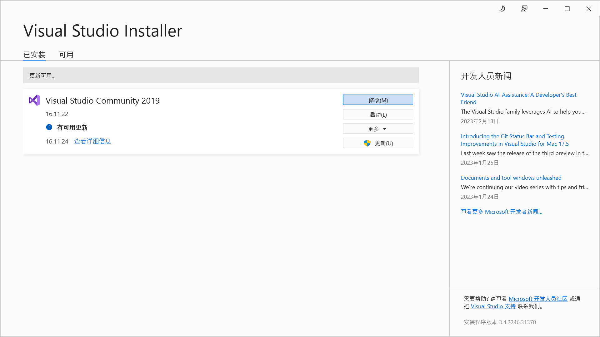
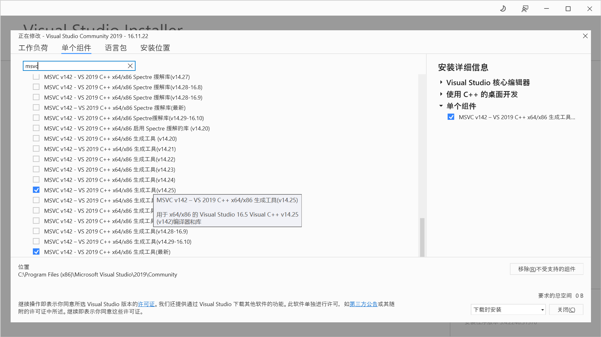
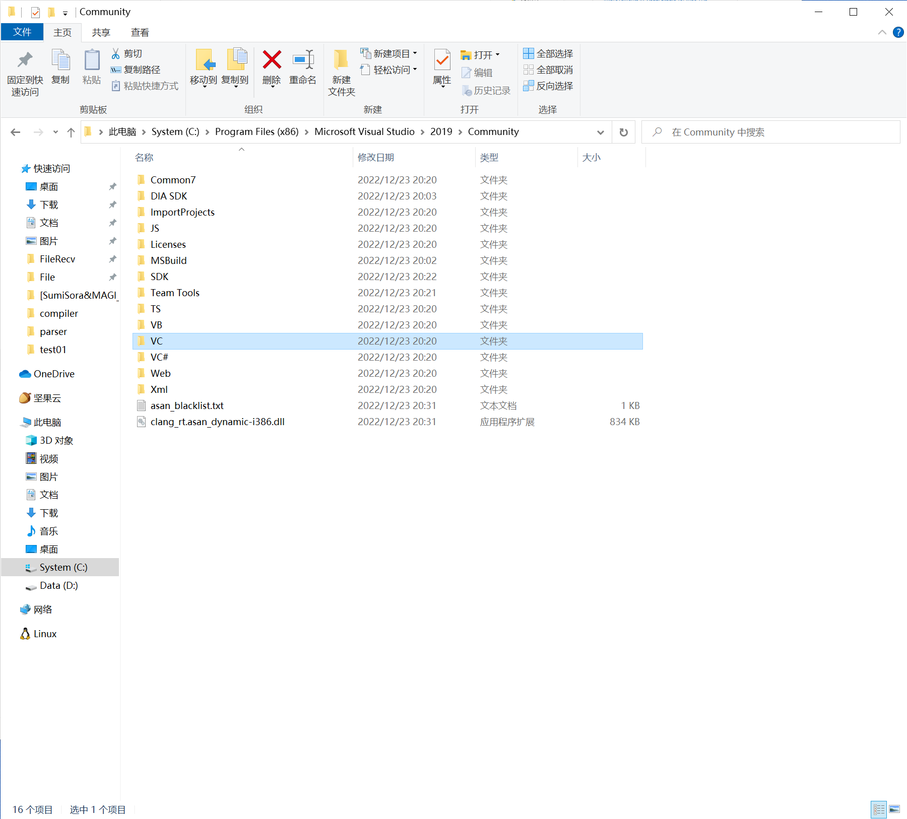
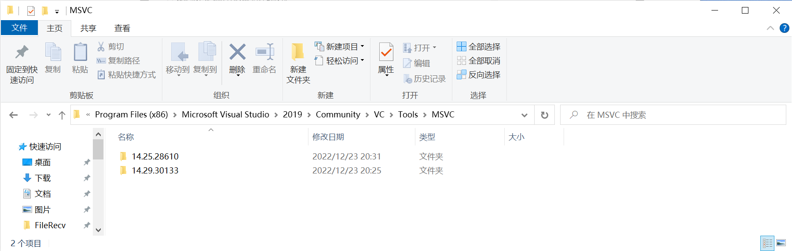
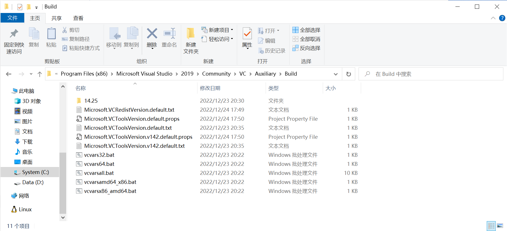

在 WIndows 下跑 Python 深度学习代码时，需要编译 C++ 库（点名 Pytorch3d），但是使用最新版本的 MSVC 进行编译的时候会报错，去 Github 看 Issue 时有提到降级可能有效，我们可以通过添加组件的方式直接下载指定版本的 MSVC 编译器。然后手动修改进行切换。为了怕后面遇到类似问题时忘记怎么搞，还是简单记录一下吧，具体操作如下：

1. 首先打开 Visual Studio Installer，点击 `修改` 按钮

   

   <!-- more -->

2. 在 `单个组件` 菜单中，找到指定版本的 MSVC

   注意编译器的名称是 `MSVC v<xxx> - VS <xxxx> C++ x64/86 生成工具(v<xx>.<xx>)`，千万不要下错了

   

3. 下载完成后，我们找到 Visual Studio 的安装目录， 其中 `VC` 目录就包含了 MSVC 相关的文件

   

4. 进入 `VC` 目录，在 `Tools\MSVC` 我们就可以找到安装的所有 MSVC 编译器

   

5. 我们可以进入一个子目录，进入 `bin\Hostx64\x64` 文件夹，然后在这个文件夹下打开 Developer PowerShell，输入 `.\cl.exe` 查看版本

   ```bash
   (base) PS C:\Program Files (x86)\Microsoft Visual Studio\2019\Community\VC\Tools\MSVC\14.29.30133\bin\Hostx64\x64> cl
   用于 x64 的 Microsoft (R) C/C++ 优化编译器 19.25.28614 版
   版权所有(C) Microsoft Corporation。保留所有权利。
   
   用法: cl [ 选项... ] 文件名... [ /link 链接选项... ]
   (base) PS C:\Program Files (x86)\Microsoft Visual Studio\2019\Community\VC\Tools\MSVC\14.29.30133\bin\Hostx64\x64> .\cl.exe
   用于 x64 的 Microsoft (R) C/C++ 优化编译器 19.29.30147 版
   版权所有(C) Microsoft Corporation。保留所有权利。
   
   用法: cl [ 选项... ] 文件名... [ /link 链接选项... ]
   ```

   可以看到，当我们直接输入 `cl` 时，调用的是环境变量中设置的 MSVC 编译器，而输入 `.\cl.exe` 直接调用当前目录下的 `cl.exe` 时就会调用当前目录的 MSVC 编译器

6.  最后我们只需要切换当前环境变量中使用的 `cl` 就行，这里需要进入 `<vs-path>\VC\Auxiliary\Build` 路径，在这个路径下面就制定了默认使用的 MSVC 版本

   

   我们只需要修改其中的包含 `VCToolsVersion` 和 `VCRedistVersion` 字样的文件，将其中对应版本全部替换成我们需要的 MSVC 版本即可

   `Microsoft.VCToolsVersion.default.props`

   ```xml
   <?xml version = "1.0" encoding="utf-8"?> 
   <Project ToolsVersion = "4.0" xmlns="http://schemas.microsoft.com/developer/msbuild/2003"> 
     <PropertyGroup> 
       <VCToolsVersion Condition = "'$(VCToolsVersion)' == ''" >14.25.28610</VCToolsVersion> 
       <VCToolsRedistVersion Condition = "'$(VCToolsRedistVersion)' == ''" >14.25.28508</VCToolsRedistVersion> 
     </PropertyGroup>      
   </Project>     
   ```

   `Microsoft.VCToolsVersion.default.txt`（这个文件实际上就一个版本号，直接改掉就可以）

   ```txt
   14.25.28610
   ```

7. 切换完成后，我们再使用 Developer Powershell 打开时就不会出问题了

注：上面的更改仅适用于命令行，在 Visual Studio 中可以直接手动更换，具体参考官方教程：[How to: Modify the Target Framework and Platform Toolset | Microsoft Learn](https://learn.microsoft.com/en-us/cpp/build/how-to-modify-the-target-framework-and-platform-toolset?view=msvc-170)

使用命令行是因为 Python 编译 C 库需要从命令行调用，所以只能这样修改，而 cmake 等编译工具实际上也只需要指定版本即可，具体可以参考官方文档：[MSVC_VERSION — CMake 3.26.0-rc4 Documentation](https://cmake.org/cmake/help/latest/variable/MSVC_VERSION.html)