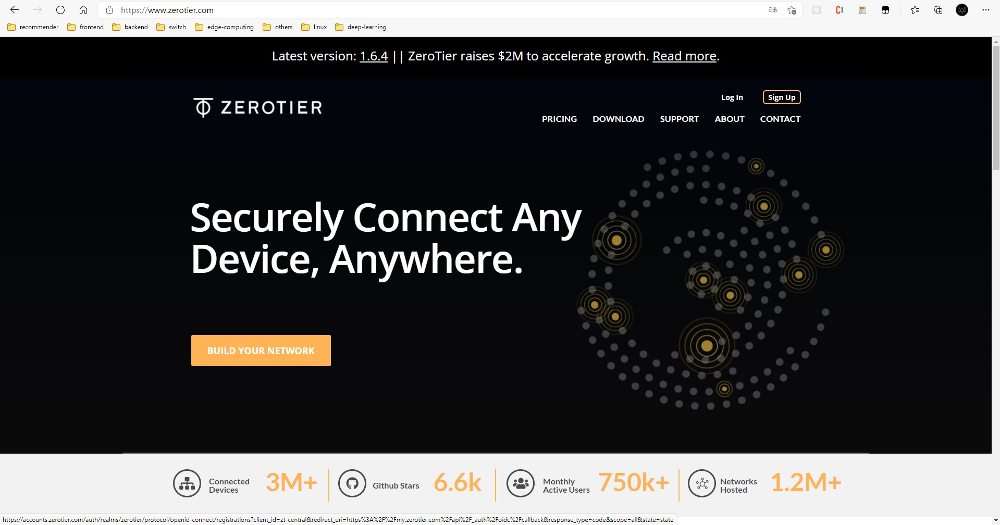
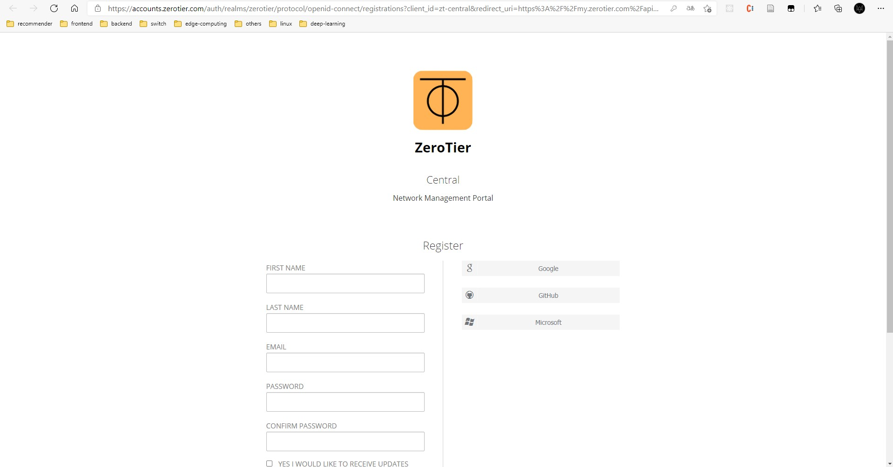
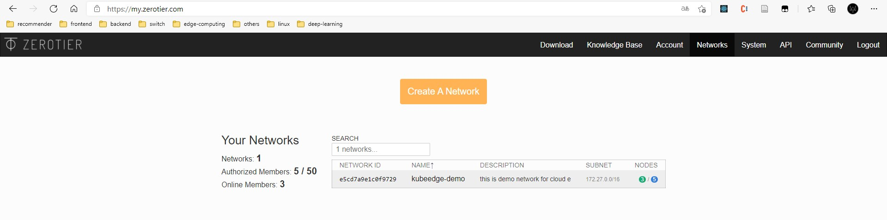
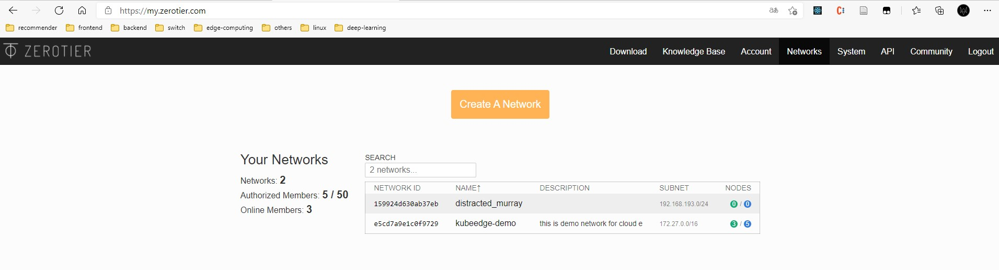
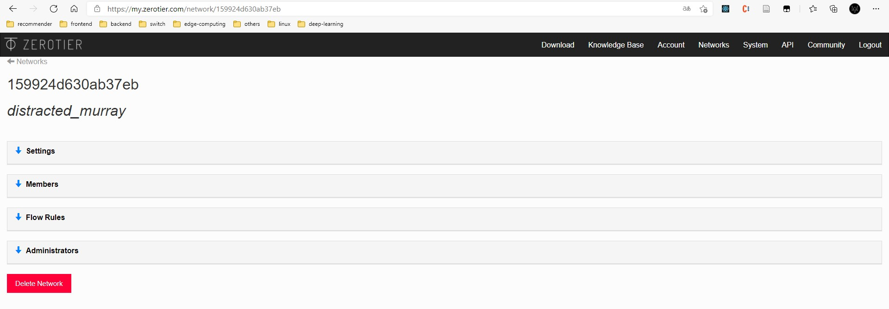
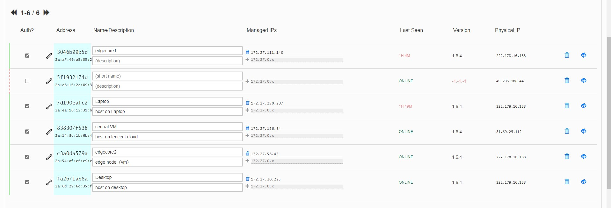

# zerotier 实现内网穿透

zerotier 可以将不同局域网下的主机连接到同一个虚拟局域网内（即内网穿透），使用之前需要注册一个 zerotier账号，所有对虚拟网络的操作（设备管理、ip设置等）都需要在 web 端进行。官方网址：https://www.zerotier.com/

## 注册 Zerotier 账号

> 注：zerotier 服务器在国外，访问的时候可能需要挂梯子。

进入[官网](https://www.zerotier.com/)



点击右上角的 Sign Up 按钮就可以进入注册页面

<!-- more -->



填写好相关信息后就会收到确认邮件，点击邮件中的链接即可激活账号。之后就可以创建虚拟网络进行相关配置了。

## 创建虚拟局域网

登入账号后我们会直接进入虚拟网络管理界面：[ZeroTier Central](https://my.zerotier.com/)



点击黄色按钮就可以创建一个新的虚拟局域网



网络名称是随机生成的，但网络ID是唯一的。点击网络名称便可以进入网络管理页面，我们可以进行相关的设置



主要包括：

- 网络相关信息修改（名称，描述，IP区段）
- 节点的添加和删除
- 路由规则

一般而言，如果不需要将虚拟网络和外网联通，并不需要设置路由规则，因此只需要管理成员的加入（分配 ip 地址）即可


## 客户端安装

对 windows 端和 macos 端，安装起来很方便，只需要从官网下载对应的安装包即可。

对于 Linux 端而言，稍微复杂一点，不过官网也直接给出了安装命令，我们按照命令进行安装即可。

option 1: ssl 命令安装

```bash
curl -s https://install.zerotier.com | sudo bash
```

option 2: 添加 apt 软件源安装（支持更新）

```bash
curl -s 'https://raw.githubusercontent.com/zerotier/ZeroTierOne/master/doc/contact%40zerotier.com.gpg' | gpg --import && \
if z=$(curl -s 'https://install.zerotier.com/' | gpg); then echo "$z" | sudo bash; fi
```

第二种方式我们可以通过 apt 进行软件的更新，因此较为推荐使用。

添加软件源之后使用 `sudo apt update` 更新软件源，然后使用下列命令搜索 zerotier

```bash
sudo apt search zerotier
```

如果运行结果类似如下，则说明我们添加成功，使用 `sudo apt install zerotier-one` 即可完成安装

```bash
(base) ➜  ~ sudo apt search zerotier
Sorting... Done
Full Text Search... Done
zerotier-one/bionic,now 1.10.3 amd64 [installed]
  ZeroTier network virtualization service
```

安装完成后我们可以使用下列命令查看（必须要添加 sudo，否则会报错）

```bash
sudo zerotier-cli info
```

运行结果

```bash
(base) ➜  ~ sudo zerotier-cli info
200 info 86dcfa11b5 1.10.3 ONLINE
```

如果不添加 sudo，运行如下

```bash
(base) ➜  ~ zerotier-cli info
zerotier-cli: authtoken.secret not found or readable in /var/lib/zerotier-one (try again as root)
```

提示我们无法读取 `authtoken.secret` 文件，要求使用 root 再次尝试


## 加入虚拟局域网

zerotier上加入网络也十分简单，需要两步

1. 客户端发起加入网络请求
2. web 端网络管理界面通过请求

在任意一个平台下都可以使用下面命令发起加入网络请求（linux 和 macos 有可能需要添加 sudo）

```bash
zerotier-cli join <network ID>
```

例如

```shell
root@VM-0-17-ubuntu:/home/ubuntu# zerotier-cli join e5cd7a9e1c0f9729
200 join OK
```

然后需要在web端同意加入网络



其中没有打勾的那一个节点就是等待添加的节点，打上勾就会自动添加并分配ip地址，在主机上使用`ifconfig` （linux,macos）/ `ipconfig` (windows) 命令查看分配到的ip地址

```bash
root@VM-0-17-ubuntu:/home/ubuntu# ifconfig
...
ztppixkcjv: flags=4163<UP,BROADCAST,RUNNING,MULTICAST>  mtu 2800
        inet 172.27.98.228  netmask 255.255.0.0  broadcast 172.27.255.255
        inet6 fe80::fa:60ff:fe11:d5b3  prefixlen 64  scopeid 0x20<link>
        ether 2a:c8:16:2e:89:37  txqueuelen 1000  (Ethernet)
        RX packets 0  bytes 0 (0.0 B)
        RX errors 0  dropped 0  overruns 0  frame 0
        TX packets 11  bytes 866 (866.0 B)
        TX errors 0  dropped 0 overruns 0  carrier 0  collisions 0
```

其中那个 zt 开头的就是我们添加的虚拟网络了，我们可以查看到分配好的虚拟网络地址，此时我们可以使用 ping 来测试虚拟区域网中设备的连通性

```bash
root@VM-0-17-ubuntu:/home/ubuntu# ping 172.27.58.47
PING 172.27.58.47 (172.27.58.47) 56(84) bytes of data.
64 bytes from 172.27.58.47: icmp_seq=1 ttl=64 time=1729 ms
64 bytes from 172.27.58.47: icmp_seq=2 ttl=64 time=728 ms
64 bytes from 172.27.58.47: icmp_seq=3 ttl=64 time=353 ms
64 bytes from 172.27.58.47: icmp_seq=4 ttl=64 time=349 ms
64 bytes from 172.27.58.47: icmp_seq=5 ttl=64 time=346 ms
64 bytes from 172.27.58.47: icmp_seq=6 ttl=64 time=344 ms
^C
--- 172.27.58.47 ping statistics ---
7 packets transmitted, 6 received, 14.2857% packet loss, time 6007ms
rtt min/avg/max/mdev = 343.977/641.470/1728.966/505.726 ms, pipe 2
```

其中 `172.27.58.47` 是运行在本地虚拟机的节点，由于zerotier根服务器设置在国外，第一次连接时需要通过根服务器找到对应主机信息，通过 UDP 建立连接，建立 P2P 网络，因此第一次连接较慢，但整体时延仍然很高，国内可以通过添加 `MOON` 节点来加速网络连接。


## (optional) 添加 MOON 节点

### 云服务器配置

由于zerotier的根服务器设置在国外，在国内组网时网络时延较高，因此可以通过设置 **带有公网IP的云服务器** 作为 `MOON` 节点作为根节点，降低网络时延

官网教程：[Private Root Servers | ZeroTier Documentation](https://docs.zerotier.com/zerotier/moons/)（有一说一，官网这个教程写的真是...，第一次搞硬是没搞对，看了别人的教程才知道哪里有问题）

对于云服务器的配置和带宽，由于 MOON 节点仅用来建立连接，并不参与实际的网络数据交换，选择最丐的1核2G+1mbps带宽足够了。

配置过程分为以下4步：（在 zerotier 根目录下执行，全程 sudo）

1. 根据本机 `identity.public`生成 `moon.json` 

2. 修改 `moon.json` 文件，添加主机公网IP
3. 从 `moon.json` 生成 `moon` 文件，并拷贝到 `moons.d` 文件夹下
4. 重启 zerotier 服务

zerotier应用的根目录（linux下）位于`/var/lib/zerotier`，其目录内容如下

```bash
➜  ~ ls /var/lib/zerotier-one
authtoken.secret  identity.public  moons.d     peers.d  zerotier-cli     zerotier-one      zerotier-one.port
controller.d      identity.secret  networks.d  planet   zerotier-idtool  zerotier-one.pid  zerotier-one.te
```

其中 `identity.public` 以及 `identity.secret` 就是用来表示本机的公钥和私钥了，使用这个 `identity.public` 我们就可以生成 `moon.json`，调用命令

```bash
sudo zerotier-idtool initmoon identity.public >> moon.json
```

生成的 moon.json 内容如下

```c++
{
 "id": "5f1932174d",
 "objtype": "world",
 "roots": [
  {
   "identity": "5f1932174d:0:cf7728b3e66e4f207e537bfdee885c736d3430806c6cb279ce345103cef2302f42891547b73425793d0ea5cd7f18fd4c4a3aabf75193a23a609641d472ca01c6",
   "stableEndpoints": []
  }
 ],
 "signingKey": "03f731a23d88171014e862dc222745b02f263eb58f72637a12a00a60175cd41dac20b91be0dc69ac233da8d8f119a3d4397228f89036d651d179469e373a8285",
 "signingKey_SECRET": "76e23ef7ba06eeec08c85592bff86415143fd27c89efd0009a64ae0be864a9ba5ba592a8262cfe55210371499849a6c725eecaaf17e88d9ee2293a9eceb50dad",
 "updatesMustBeSignedBy": "03f731a23d88171014e862dc222745b02f263eb58f72637a12a00a60175cd41dac20b91be0dc69ac233da8d8f119a3d4397228f89036d651d179469e373a8285",
 "worldType": "moon"
}
```

然后在 `stableEndpoints` 一栏处填写服务器的公网IP以及端口号（一定要在云服务器中放通端口，具体百度即可，关键词：**服务器安全组**）

数据格式为

```
"xxx.xxx.xxx.xxx/xxxx"
```

完整示例如下

```c++
{
 "id": "5f1932174d",
 "objtype": "world",
 "roots": [
  {
   "identity": "5f1932174d:0:cf7728b3e66e4f207e537bfdee885c736d3430806c6cb279ce345103cef2302f42891547b73425793d0ea5cd7f18fd4c4a3aabf75193a23a609641d472ca01c6",
   "stableEndpoints": ["49.235.186.44/9993"]    <-- 修改此处
  }
 ],
 "signingKey": "03f731a23d88171014e862dc222745b02f263eb58f72637a12a00a60175cd41dac20b91be0dc69ac233da8d8f119a3d4397228f89036d651d179469e373a8285",
 "signingKey_SECRET": "76e23ef7ba06eeec08c85592bff86415143fd27c89efd0009a64ae0be864a9ba5ba592a8262cfe55210371499849a6c725eecaaf17e88d9ee2293a9eceb50dad",
 "updatesMustBeSignedBy": "03f731a23d88171014e862dc222745b02f263eb58f72637a12a00a60175cd41dac20b91be0dc69ac233da8d8f119a3d4397228f89036d651d179469e373a8285",
 "worldType": "moon"
}
```

最后保存，使用下列命令生成 moon 文件

```bash
zerotier-idtool genmoon moon.json 
```

执行结果

```bash
root@VM-0-17-ubuntu:/var/lib/zerotier-one# zerotier-idtool genmoon moon.json 
wrote 0000005f1932174d.moon (signed world with timestamp 1617851943432)
```

然后将该文件拷贝到 `moons.d` 文件夹下

```bash
mkdir -p moons.d && mv moon moons.d/
```

最后重启一下服务

```bash
sudo service zerotier-one restart
```


### 客户端配置

在客户端上直接使用 `orbit` 即可

```bash
zerotier-cli orbit 5f1932174d 5f1932174d
```

然后使用

```bash
zerotier-cli peers
```

查看我们是否配置成功（是否有 MOON 节点出现，且能否显示 MOON 节点的公网 IP）

```bash
root@VM-0-4-ubuntu:/var/lib/zerotier-one# zerotier-cli orbit 5f1932174d 5f1932174d
200 orbit OK
root@VM-0-4-ubuntu:/var/lib/zerotier-one# zerotier-cli peers
200 peers
<ztaddr>   <ver>  <role> <lat> <link> <lastTX> <lastRX> <path>
3a46f1bf30 -      PLANET   135 DIRECT 2209     2073     185.180.13.82/9993
5f1932174d 1.6.4  MOON       4 DIRECT 159      155      49.235.186.44/38167
62f865ae71 -      PLANET   206 DIRECT 2209     2007     50.7.252.138/9993
778cde7190 -      PLANET   213 DIRECT 2209     1995     103.195.103.66/9993
992fcf1db7 -      PLANET   225 DIRECT 2209     1968     195.181.173.159/9993
c3a0da579a 1.6.4  LEAF      42 DIRECT 2560     2516     222.178.10.188/48425
e5cd7a9e1c 1.6.4  LEAF     329 DIRECT 2209     10660    35.236.84.174/32150
fa2671ab8a 1.6.4  LEAF      41 DIRECT 2943     2902     222.178.10.188/63370
```

可以看到peers中第二个的role已经变成了MOON，此时再来ping，可以发现网络延时降低很多

```bash
root@VM-0-17-ubuntu:/var/lib/zerotier-one# ping 172.27.126.84
PING 172.27.126.84 (172.27.126.84) 56(84) bytes of data.
64 bytes from 172.27.126.84: icmp_seq=1 ttl=64 time=16.8 ms
64 bytes from 172.27.126.84: icmp_seq=2 ttl=64 time=4.37 ms
64 bytes from 172.27.126.84: icmp_seq=3 ttl=64 time=4.49 ms
64 bytes from 172.27.126.84: icmp_seq=4 ttl=64 time=4.53 ms
64 bytes from 172.27.126.84: icmp_seq=5 ttl=64 time=4.55 ms
^C
--- 172.27.126.84 ping statistics ---
5 packets transmitted, 5 received, 0% packet loss, time 4009ms
rtt min/avg/max/mdev = 4.368/6.955/16.842/4.943 ms
```

原本 ping 是 300+ ms 的时延，配置了 moon 节点后直接 10ms 以内

**注：两个 MOON 节点不要互相 orbit**


使用 zerotier-one 的主要目的就是在宿舍远程控制实验室的服务器（虽然有很多现成的远程控制软件，但是大多都是远程图形界面的，写起来还是卡卡的，这种搞法既支持远程控制，也支持 ssh 直连）