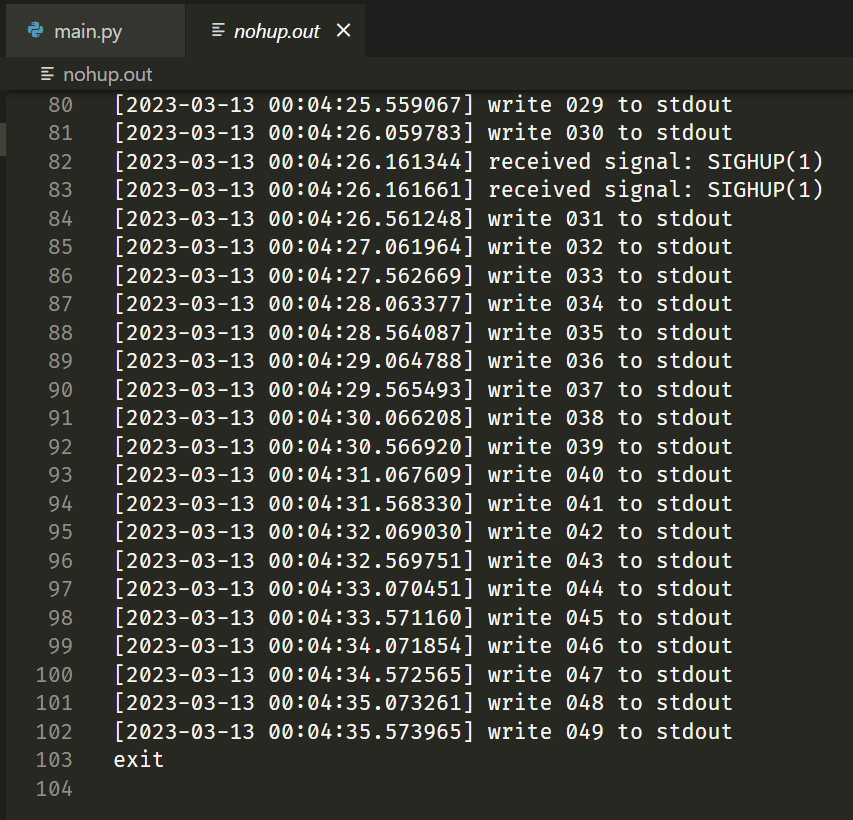

# nohup 命令使用

最近需要在服务器上跑模型，需要长时间运行，但是服务器是通过 ssh 连接的，如果我们中途断开连接，正在跑的代码也会自动关闭。实在是有点整蛊，要想 ssh 断开连接后代码还可以继续执行，需要使用 `nohup` 命令。

使用 `nohup --help`，我们可以得到帮助信息

```txt
(base) ➜  ~ nohup --help
Usage: nohup COMMAND [ARG]...
  or:  nohup OPTION
Run COMMAND, ignoring hangup signals.

      --help     display this help and exit
      --version  output version information and exit

If standard input is a terminal, redirect it from an unreadable file.
If standard output is a terminal, append output to 'nohup.out' if possible,
'$HOME/nohup.out' otherwise.
If standard error is a terminal, redirect it to standard output.
To save output to FILE, use 'nohup COMMAND > FILE'.

NOTE: your shell may have its own version of nohup, which usually supersedes
the version described here.  Please refer to your shell's documentation
for details about the options it supports.

GNU coreutils online help: <https://www.gnu.org/software/coreutils/>
Report nohup translation bugs to <https://translationproject.org/team/>
Full documentation at: <https://www.gnu.org/software/coreutils/nohup>
or available locally via: info '(coreutils) nohup invocation'
```

其中第三行解释了 nohup 命令的作用

> *Run COMMAND, ignoring hangup signals.*

从描述中我们可以看到，其作用其实很简单，就是忽略 `hup` 信号。那么现在问题来了，`hup` 信号是什么？有什么作用？

<!-- more -->


## SIGNAL

信号可以理解成一种操作系统和进程之间的交互方式（IPC），当用户进程接收到信号时，其需要对信号进行响应，例如停止运行等（因此也可以理解为软件中断）

通过 `kill -l` 命令，我们可以查询到当前系统支持的所有信号（前 15 个信号为固定语义信号，后面的和具体实现有关，不同的 linux 之间不一致。

```txt
(base) ➜  test-nohup kill -l
HUP INT QUIT ILL TRAP ABRT BUS FPE KILL USR1 SEGV USR2 PIPE ALRM TERM STKFLT CHLD CONT STOP TSTP TTIN TTOU URG XCPU XFSZ VTALRM PROF WINCH POLL PWR SYS
```

> 具体信号含义以及对应的数字值可以参考：
>
> [signal(7) - Linux manual page (man7.org)](https://www.man7.org/linux/man-pages/man7/signal.7.html) 中 Standard signals 部分

也可以使用  `kill` 命令向进程发送信号，例如 `kill -9 <PID> ` 就表示强制杀死进程号为 `PID` 的进程

下面展示几个比较常用的信号

| signal name | signal number | description                                                  | 描述                                       |
| :---------- | :-----------: | :----------------------------------------------------------- | ------------------------------------------ |
| SIGHUP      |       1       | Hangup detected on controlling terminal or death of controlling process | 检测到控制程序或命令行挂起                 |
| SIGINT      |       2       | Interrupt from keyboard                                      | 键盘中断（<kbd>Ctrl</kbd> + <kbd>C</kbd>） |
| SIGKILL     |       9       | Kill signal                                                  | 杀死信号                                   |
| SIGSEGV     |      11       | Invalid memory reference                                     | 无效的内存引用（访问）                     |

在 python 中，我们可以使用 `signal` 库来响应信号（也可以用来忽略信号，但是跨平台就难做了）

```python
import asyncio
import sys
import signal
from datetime import datetime

async def main():
    for i in range(1000):
        print(f'[{datetime.now().strftime("%Y-%m-%d %H:%M:%S.%f")}] write {i:03d} to stdout',file=sys.stdout)
        await asyncio.sleep(0.5)
        print(f'[{datetime.now().strftime("%Y-%m-%d %H:%M:%S.%f")}] write {i:03d} to stderr',file=sys.stderr)

def on_signal(signum:int,frame):
    _signal = signal.Signals(signum)
    e = OSError()
    e.errno = 0
    e.strerror = f'[{datetime.now().strftime("%Y-%m-%d %H:%M:%S.%f")}] received signal: {_signal.name}({_signal.value})'
    raise e

if __name__ == '__main__':
    signal.signal(signal.SIGINT,on_signal)
    asyncio.run(main())
```

通过 `python main.py` 运行后，再通过键盘输入 <kbd>Ctrl</kbd> + <kbd>C</kbd>，就可以看到响应输出，同时程序也结束了（手动抛出了一个异常）


对于 SIGHUP 信号，我们也可以同样进行测试，**通过终端运行代码，然后关闭终端**，就可以在输出中看到结果。稍微修改一下代码，将 stdout 和 stderr 重定向到文件中便于查看

```python
import asyncio
import sys
import signal
from datetime import datetime

async def main():
    for i in range(50):
        print(f'[{datetime.now().strftime("%Y-%m-%d %H:%M:%S.%f")}] write {i:03d} to stdout',file=sys.stdout)
        await asyncio.sleep(0.5)
        print(f'[{datetime.now().strftime("%Y-%m-%d %H:%M:%S.%f")}] write {i:03d} to stderr',file=sys.stderr)

def on_signal(signum:int,frame):
    _signal = signal.Signals(signum)
    print(f'[{datetime.now().strftime("%Y-%m-%d %H:%M:%S.%f")}] received signal: {_signal.name}({_signal.value})')

if __name__ == '__main__':
    signal.signal(signal.SIGHUP,on_signal)
    with open('output.log','w') as f:
        sys.stdout = f
        sys.stderr = f
        asyncio.run(main())
        print('exit')
```

运行结果如下


我们的代码只是接受信号并输出一句话，并没有看到预期的 exit，说明程序被操作系统关闭了，如果需要命令在终端关闭后还能继续执行，就需要通过 `nohup` 命令来确保进程能在后台继续执行。


## nohup 简单使用

`nohuo` 命令使用起来很简单，在待执行的命令之前添加一个 `nohup` 即可

```bash
nohup <your-command>
```

示例如下，还是之前的  python 代码，但是我们通过 `nohup` 来执行，然后关闭终端，测试运行效果

```bash
nohup python main.py
```

运行后终端会提示一句话


同时我们会在当前目录下看到 `nohup.out` 文件，虽然里面没有任何东西（因为我们将 python 的输出重定向到了 `output.log`）


我们可以看到程序是执行完循环后主动退出的，而不是由操作系统关闭，说明 `nohup` 命令起作用了。

为了更清楚的看到 `nohup` 的作用，我们将 python 代码中的输出重定向去掉

```python
import asyncio
import sys
import signal
from datetime import datetime

async def main():
    for i in range(50):
        print(f'[{datetime.now().strftime("%Y-%m-%d %H:%M:%S.%f")}] write {i:03d} to stdout',file=sys.stdout)
        await asyncio.sleep(0.5)
        print(f'[{datetime.now().strftime("%Y-%m-%d %H:%M:%S.%f")}] write {i:03d} to stderr',file=sys.stderr)

def on_signal(signum:int,frame):
    _signal = signal.Signals(signum)
    print(f'[{datetime.now().strftime("%Y-%m-%d %H:%M:%S.%f")}] received signal: {_signal.name}({_signal.value})')

if __name__ == '__main__':
    signal.signal(signal.SIGHUP,on_signal)
    # with open('output.log','w') as f:
    #     sys.stdout = f
    #     sys.stderr = f
    asyncio.run(main())
    print('exit')
```

然后再次执行，并关闭命令行

命令行输出如下


但是程序本身的输出并没有出现在这里，查看 `nohup.out`，我们可以在 `nohup.out`  中看到完整的输出结果




可以看到程序最后输出了 `exit`，表示程序正常退出，但我们同样接受到了 `SIGHUP` 信号，此时却没有被系统杀死，这就是 `nohup` 在起作用了。


## 后台运行程序

当我们通过 `nohup` 执行应用程序时，当前终端并不能进行交互，但是我们也看不到进程的任何输出（因为 `nohup` 将其重定向到 `nohup.out` 里了），与其让终端等待进程执行完，不如将进程放在后台执行，然后使用终端进行其他操作。

后台执行程序也十分简单，只需要在命令后添加一个 `&` 即可，然后在终端中就会输出后台执行命令的 `PID`

```python
import asyncio
import sys
import signal
from datetime import datetime

async def main():
    for i in range(50):
        print(f'[{datetime.now().strftime("%Y-%m-%d %H:%M:%S.%f")}] write {i:03d} to stdout',file=sys.stdout)
        await asyncio.sleep(0.5)
        print(f'[{datetime.now().strftime("%Y-%m-%d %H:%M:%S.%f")}] write {i:03d} to stderr',file=sys.stderr)

def on_signal(signum:int,frame):
    _signal = signal.Signals(signum)
    print(f'[{datetime.now().strftime("%Y-%m-%d %H:%M:%S.%f")}] received signal: {_signal.name}({_signal.value})')

if __name__ == '__main__':
    signal.signal(signal.SIGHUP,on_signal)
    with open('output.log','w') as f:
        sys.stdout = f
        sys.stderr = f
        asyncio.run(main())
        print('exit')
```

运行结果


此时终端就可以不等待进程执行完，立即返回了，**但是如果进程有输出的话，还是会继续输出到命令行中，让我们无法进行交互，因此后台执行的进程最好将输出都给重定向一下**

我们也可以对其进行测试

```python
import asyncio
import sys
import signal
from datetime import datetime

async def main():
    for i in range(50):
        print(f'[{datetime.now().strftime("%Y-%m-%d %H:%M:%S.%f")}] write {i:03d} to stdout',file=sys.stdout)
        await asyncio.sleep(0.5)
        print(f'[{datetime.now().strftime("%Y-%m-%d %H:%M:%S.%f")}] write {i:03d} to stderr',file=sys.stderr)

def on_signal(signum:int,frame):
    _signal = signal.Signals(signum)
    print(f'[{datetime.now().strftime("%Y-%m-%d %H:%M:%S.%f")}] received signal: {_signal.name}({_signal.value})')

if __name__ == '__main__':
    signal.signal(signal.SIGHUP,on_signal)
    # with open('output.log','w') as f:
    #     sys.stdout = f
    #     sys.stderr = f
    asyncio.run(main())
    print('exit')
```

运行结果


此时我们按什么都没用，因为我们无法直接和进程交互，可以通过 `kill` 方式向进程发送信号，然后停止进程（由于 stdout 一直有输出，命令行交互的体验极差，让人想直接把他 kill 掉）

```bash
kill -HUP 1688
```


```bash
kill -9 1850
```


此时我们可以发现，`nohup` 命令和后台运行简直是绝配，既可以将输出重定向到文件，且可以保证终端关闭后代码也能继续执行，完整代码就是

```bash
nohup <your-command> &
```


## 输出重定向（pipe操作）

`nohup` 命令自动帮我们配置好了输出重定向，有时候我们也想将输出保存到文件，从而便于我们观察输出结果（尤其是 gcc 编译结果，一报错出特别多，stdout 溢出了也看不到结果），此时我们就需要手动进行输入输出的重定向了。

在代码中，有三个特殊的文件，分别是 `stdin`、`stdout` 以及 `stderr`，在 python 中可以使用 `sys.stdin` 以及 `sys.stdout` 和 `sys.stderr` (之前的代码中也有使用，我们分别向 stderr 和 stdout 中输出了结果)

由于这三个是特殊的文件，自然也可以使用其他文件来代替，此时就是重定向了，而在 unix 环境下（其实 powershell 目前也支持了）可以在操作系统层面进行重定向，这样我们就不需要修改代码了。

下面列举了常用的重定向操作符

| operator   | name      | description            |
| ---------- | --------- | ---------------------- |
| `[a]>[b]`  | output to | 将 a 的内容输出到 b 中 |
| `[a]>>[b]` | append to | 将 a 的内容追加到 b 中 |
| `[a]<[b]`  | read from | 将 b 的内容读取到 a 中 |
| `[a]|[b]`  | pipeing   | 将 a 输出输入到 b 中   |

实例如下

```python
import sys

if __name__ == '__main__':
    print('hello to stdout',file=sys.stdout)
    print('hello to stderr',file=sys.stderr)
```

执行命令

```bash
python main.py > stdout.log
```

如果不加上任何符号，则默认将 stdout 重定向到 stdout.log 中，但是 stderr 还是会在终端中输出

运行结果


同时 `stdout.log` 结果


和我们的预期结果一样

要想指定输入输出流的文件，我们可以使用数字来代指（可以理解为指针），其中 `0` 表示 `stdin`， `1` 表示 `stdout`，`2` 表示 `stderr` 

还是上面的代码，但是我们调整一下调用命令

```bash
python main.py 1>stdout.log 2>stderr.log
```

> 注意： 数字和符号之间没有空格，即 `1>`，`0<` 的形式

运行结果


两个文件结果


最后，我们可以将 stderr 重定向到 stdout，不过写法稍微特殊一点，可以理解为 C 语言的取地址（`&1` 相当于是拿到 stdout 实际输出地址）

```bash
python main.py > stdout.log 2>&1
```

这样 stdout 和 stderr 的结果就都会出现在 stdout.log 里面了


而对于 `|` ，一个很常用的例子就是检索（通过 `grep` 实现），例如我们想查询当前 python 环境中是否安装 `numpy`，可以使用一下命令进行查看

```bash
python -m pip list | grep numpy
```

运行结果


还有很多高级用法，但是基本使用就介绍到这里


> 注：为什么要有两个输出 `stdout` 和 `stderr`？
>
> 例如 pandoc 程序 ，其可以接受一个 md 文档并将其转换成 html，如果我们只是使用 pandoc 做其中一步操作，还需要后续操作的话，我们就可以使用 stdout 读取其输出结果，而通过 stderr 拿到其日志输出、警告的信息。这也是为什么即使我们优先输出到 stdout，然后再输出到 stderr，最终仍然是 stderr 的结果优先输出，因为 stderr 是**无缓冲的**，有结果就直接输出了。
