# Dockerfile常见环境使用

## ubuntu(国内镜像)

由于网内网络环境的问题，ubuntu不换源的话基本没法用，我们首先参考普通 ubuntu 系统如何换源，然后将其转换成命令形式，便于应用于 dockerfile 中。

随便在网上搜 "ubuntu换源"，可以搜出一大堆教程，这里我们直接参考阿里云开源镜像站的[官方教程](https://developer.aliyun.com/mirror/ubuntu)，官方教程中给出了操作办法，就是手动将所有的源地址替换为阿里云的镜像地址：

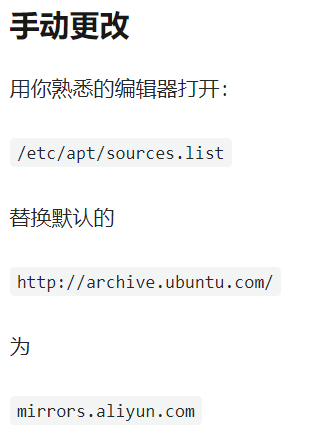

首先我们使用 docker 跑一个 ubuntu 的镜像看下基本情况：

```bash
docker run -it --rm ubuntu:20.04 /bin/bash
```

注：后面也会出写一个笔记记录常用的 docker 命令。

在 ubuntu 下使用 `sudo apt-get install xxx` 安装软件，所有 `apt` 相关的配置项存储在 `/etc/apt` 文件夹下，其内容如下

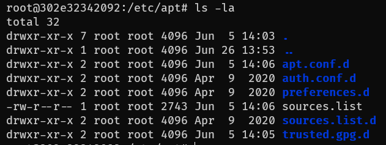

<!-- more -->

其中 `sources.list` 以及 `sources.list.d` 就涉及软件源的配置信息，`sources.list` 用来存储默认的软件源信息（或者说官方源），而 `sources.list.d` 则用来存储第三方软件源，例如 docker 软件源、nvidia 驱动源等，一般安装软件我们只需要配置 `sources.list` 即可，第三方源的配置和官方源的配置差不太多。

使用 `cat` 命令查看 `sources.list` 文件内容（较长，可能显示不全）

```txt
root@302e32342092:/etc/apt# cat sources.list
# See http://help.ubuntu.com/community/UpgradeNotes for how to upgrade to
# newer versions of the distribution.
deb http://archive.ubuntu.com/ubuntu/ focal main restricted
# deb-src http://archive.ubuntu.com/ubuntu/ focal main restricted

...

deb http://security.ubuntu.com/ubuntu/ focal-security main restricted
# deb-src http://security.ubuntu.com/ubuntu/ focal-security main restricted
deb http://security.ubuntu.com/ubuntu/ focal-security universe
# deb-src http://security.ubuntu.com/ubuntu/ focal-security universe
deb http://security.ubuntu.com/ubuntu/ focal-security multiverse
# deb-src http://security.ubuntu.com/ubuntu/ focal-security multiverse
```

我们可以看到其软件源就是通过以下格式指定的

```sources.list
deb <apt source>
```

从源的URL链接中不难发现，这些链接实际上都是同一个域名底下的，我们换源是可以只更换前面的域名（即最后一个`/`之前的所有即可）。

既然都是替换了，那么肯定不能使用文本编辑器一个一个替换，最好的办法就是通过 `sed` 命令进行替换

> `sed` 命令的简单介绍（from [GNU sed - GNU Project - Free Software Foundation](https://www.gnu.org/software/sed/)）
>
> sed (stream editor) is a non-interactive command-line text editor.
>
> 其功能十分强大，目前我们只用到了其 `s` 命令
>
> ```
> s/regexp/replacement/[flags]
> (substitute) Match the regular-expression against the content of the pattern space. If found, replace matched string with replacement.
> ```
>
> 例如将文本中所所有的`foo`替换成`bar`就可以使用如命令
>
> ``` bash
> sed -i s/foo/bar/g test.txt
> ```
>
> 测试如下
>
> 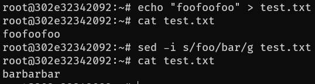
>
> 其中 `-i` 表示 inplace，即直接在当前文件中替换文本
>
> 还有一个好处是可以随意指定分隔符，只需要确保一致即可，其格式如下所示
>
> ```bash
> s<delimiter>regexp<delimiter>replacement<delimiter>[flags]
> ```
>
> 例如我们需要替换文本中所有的 `a/b/c` 为 `e/f/g`，就可以使用如下命令：
>
> ```bash
> sed -i s@a/f/g@e/f/g@g test.txt
> ```
>
> 测试如下
>
> 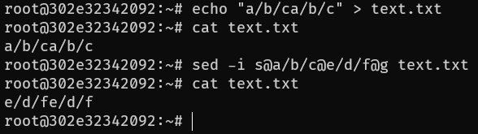

我们通过文本替换就可以实现，命令如下

```bash
sed -i s/archive.ubuntu.com/mirrors.aliyun.com/g /etc/apt/sources.list
```

这条命令将所有的 `archive.ubuntu.com` 替换为 `mirrors.aliyun.com`，对于`security.ubuntu.com`也是一样，虽然我们并不会对容器中的 ubuntu 进行安全更新，但是`security.ubuntu.com`会严重影响我们的更新速度，因此也需要一同替换掉，最终完整的换源命令如下：

```bash
sed -i s/archive.ubuntu.com/mirrors.aliyun.com/g /etc/apt/sources.list && \
sed -i s/security.ubuntu.com/mirrors.aliyun.com/g /etc/apt/sources.list
```

通过 `&&` 将两条命令合并成一条执行，最后通过 `apt-get update` 更新软件源即可

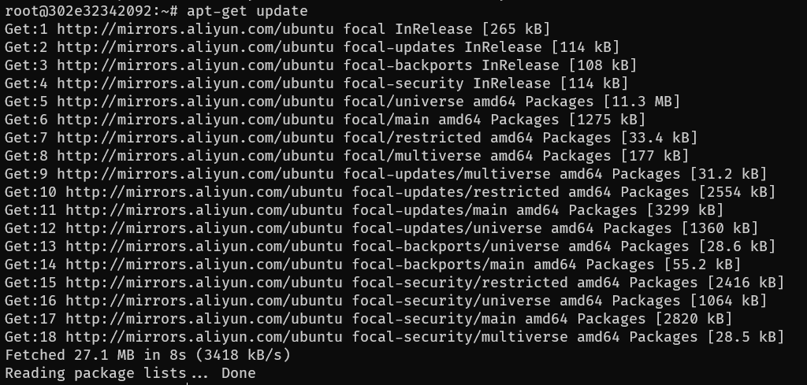

此时可以看到软件源更新速度就很快了。


## ssh 服务器

启动 docker 容器后，有可能需要连接到容器中修改代码什么的（一般用于深度学习模型训练环境，部署代码的话最好不要这么做），最朴素的办法就是安装一个命令行的文本编辑器，例如 vi，vim，nano 等，命令用熟了还是很轻松的，但是学习成本太高了，后面发现 vscode 的 Remote SSH 插件可以通过 SSH 连接到主机，之后就像本地代码一样进行调试运行等，简直不要太方便（实际上还有更好的办法，直接通过 vscode 的 Dev Containers 插件直接连接到容器中），不过设置 SSH 通用性更高，例如搭建 hadoop 等环境进行测试时就可以使用。

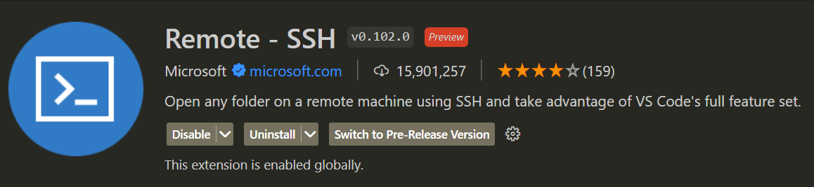


在配置脚本安装之前，我们首先看看手动如何安装 ssh 服务器（openssh-server），直接通过apt安装即可，运行如下命令

```
apt-get install openssh-server
```

之后提示我们具体需要安装哪些包，以及是否确定安装

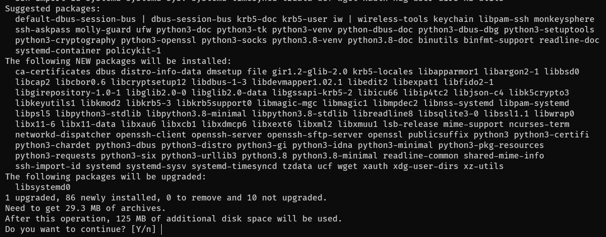

但是我们可以看到，建议安装了一堆包，实际上有些包我们可以不装的，可以通过参数 `--no-install-recommends` 来取消安装这些包，运行命令

```
apt-get install openssh-server --no-install-recommends
```

结果如下

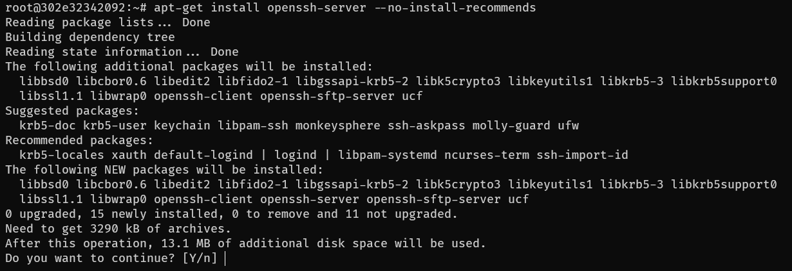

相比之前我们所需要安装的依赖就少多了

但是还有一个问题，安装过程中有一个 `Do you want to continue? [Y/n]` ，提示我们是否确定，但是我们需要用命令完成自动化安装过程，安装过程中是完全无交互的，因此需要默认安装，可以通过 `-y` 来进行默认安装（具体可以参考 apt-get 的 [man 页面](https://linux.die.net/man/8/apt-get)）

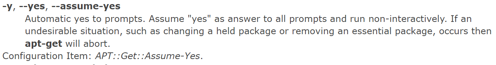

```
apt-get install openssh-server --no-install-recommends -y
```

这样当我们输入命令后就会自动安装了。

可以编写一个完整的安装 ssh 的 Dockerfile

```dockerfile
FROM ubuntu:20.04

RUN sed -i s/archive.ubuntu.com/mirrors.aliyun.com/g /etc/apt/sources.list && \
    sed -i s/security.ubuntu.com/mirrors.aliyun.com/g /etc/apt/sources.list && \
    apt-get clean && apt-get update && \
    apt-get install --no-install-recommends -y -q \
    openssh-server && \
    rm -rf /var/lib/apt/lists/*

EXPOSE 22

CMD [ "service","ssh","start","-D" ]
```

其暴露一个端口 22（SSH的默认端口），而且使用 `service ssh start -D` 来确保命令前台运行（保证容器不会被杀死）

 我们先尝试能否成功构建镜像，使用命令

```bash
docker build -t openssh-server:ubuntu20.04 .
```

进行构建，然后通过以下命令创建容器

```bash
 docker run -d --rm -p 54132:22 openssh-server:ubuntu20.04
```

其中 `-d` 表示 detach，将容器列入后台运行，由于我们在 `CMD` 中已经指定了一个前台应用，容器不会立刻被docker杀死，`--rm` 表示容器运行结束后会被直接删除（常用于测试场景），`-p 54132:22` 表示将宿主机的54132端口绑定到容器的22端口（即SSH端口上，这样我们就可以通过 54132端口连接到容器的SSH服务了）。

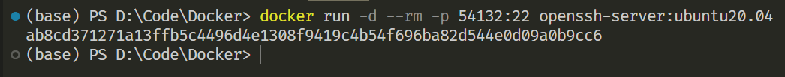

 最后我们使用 ssh 连接命令尝试连接到容器中

```
ssh -p 54132 root@localhost
```

首先会提示我们是否需要建立连接（这一步可以说明SSH端口是通的）

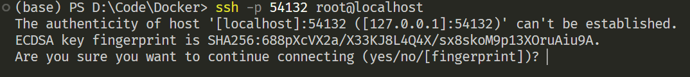

但是此时直接提示我们输入密码，但是我们似乎并没有设置过 root 账户的密码，这就意味着我们永远无法连接到容器

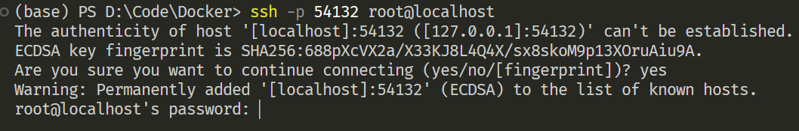

我们可以通过一下命令连接到容器进行修改

```
docker exec -it <container-id> /bin/bash
```

然后输入一下命令设置明文密码

```
echo "root:123" | chpasswd
```

之后我们再尝试通过 SSH 进行连接，结果如下

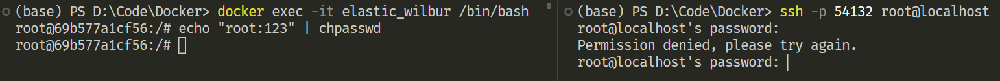

提示我们 Permission denied，这是因为 SSH 默认是不允许 root 用户通过密码登录的，我们需要修改 `/etc/ssh/sshd_config`

通过 `cat /etc/ssh/sshd_config` 可以看到这一点

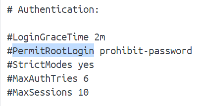

再查看 sshd_config 的相关配置选项（查看其相关的 [man 页面](https://man7.org/linux/man-pages/man5/sshd_config.5.html) 即可，注意查看版本，我们使用的 ubuntu 版本比较新，老的配置文档不一定适用）

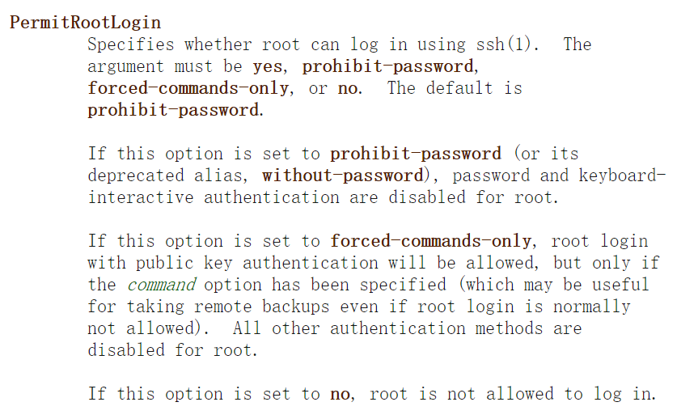

可以看到 `PermitRootLogin` 的可选参数有四个：`yes`，`prohibit-password`，`forced-commands-only`，`no`

> 注：其中 `yes`，`prohibit-password`以及 `no` 的含义比较直观，但是 `forced-commands-only` 还不太理解，其限定 `root` 用户通过秘钥进行登录，但是只能执行特定的 `command` ，这个 `command` 实际上需要在 ssh 登录的时候指定，即 `authorized_keys` 中指定，例如
>
> ```
> command=”/bin/ps” ssh-rsa AAAAB3NzaC1yc2EAAAABIwAAAQEAt0BETg9J6hZb5Kqxy+yfNtKHfwxUELz7PqGtGiM5eNb8DHC8kj02SCFoql5rpaecMGybWRiSK8/k+EsK7TMgd4O+p6WkNyLD3WZrmVzUEPaxAdYf1eeCQooTJ+B1TKXDNlF9t8xTVsHd67HmPWYU6i3+kaDSX7cbrz2ds2zUGSozj1UQ8AJDJMbGOqpjs3nVh2EpSDgY7znqmUDnygVPiM4c3OfEzs5iCxVd4ggpPhH8d0bwy8RmPsooxJYUY4rE1C5iWCvB7P810yUFB0OilxiX9AfZa9shC3n5bqaX0ioY1eC44hFFPL602fJyKMj6w/zxN5aIeFO03Sl9+FU4YQ== root@iZ23wan41azZ
> ```
>
> 就限定通过 `root` 私钥登录的时候只能执行 `/bin/ps`，无法执行其他命令，在运维场景下较为实用

```bash
echo "PermitRootLogin yes" >> /etc/ssh/sshd_config
```

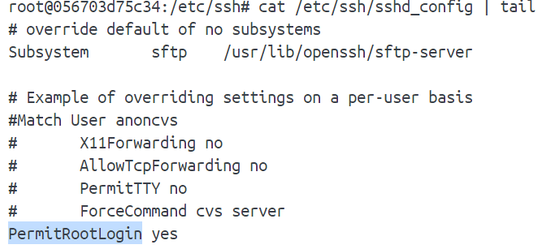

然后重启一下 ssh 服务

```bash
service ssh restart
```

（此处重启时由于没有前台应用，容器会被 docker 给杀死，再重启一下容器即可）

再尝试登录的时候就可以成功了，提示我们输入密码

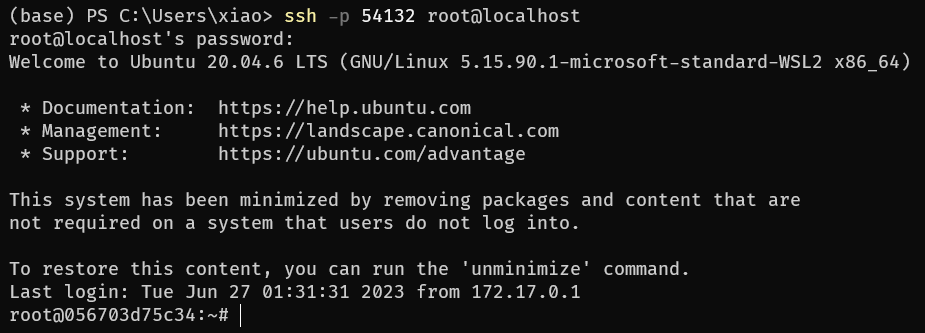

每次登录都输入密码还是有点麻烦（可以通过 `sshd_config` 设置密码可为空来绕过，但是还会提示用户进行交互，无法实现自动化远程登录），为此我们需要配置远程登录，首先通过 `ssh-keygen` 创建一对秘钥 	

```bash
ssh-keygen -t rsa -f ~/key -N ""
```

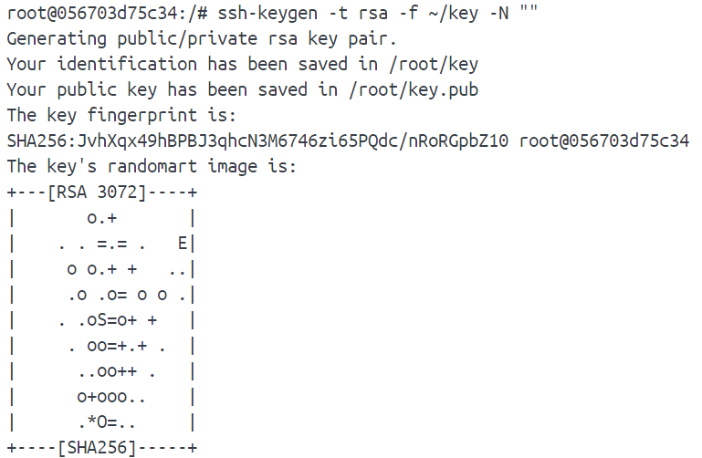

其中 `-t rsa` 指定加密算法为 rsa，输出私钥路径为 `~/key` ，公钥路径会在私钥后添加 `.pub`，即 `~/key.pub`  

（此处创建的秘钥是可以复用的）

然后将公钥信息拷贝到 `~/.ssh/authorized_keys` 里即可

```bash
mkdir ~/.ssh
cat ~/key.pub >> ~/.ssh/authorized_keys
```

然后再重启一下 ssh，最终使用私钥登录测试

```bash
ssh -p 54132 -i key root@localhost
```

结果

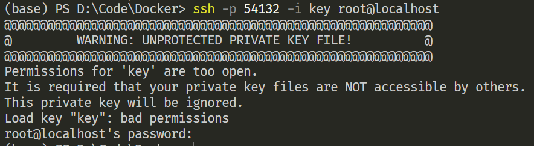

提示我们权限不对，需要调整 key 的权限，按照下面的方式调整权限即可

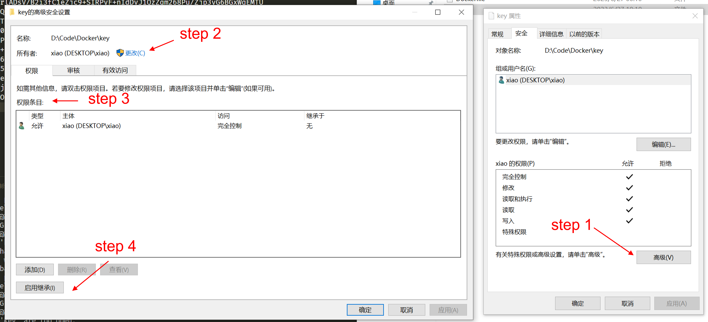

再尝试登录的时候就可以登陆了

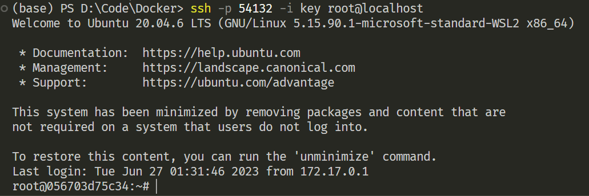

最后给出一个完整的 Dockerfile

```dockerfile
FROM ubuntu:20.04

# 配置 ubuntu 软件源
RUN sed -i s/archive.ubuntu.com/mirrors.aliyun.com/g /etc/apt/sources.list && \
    sed -i s/security.ubuntu.com/mirrors.aliyun.com/g /etc/apt/sources.list && \
    apt-get clean && apt-get update && \
    apt-get install --no-install-recommends -y \
    openssh-server && \
    rm -rf /var/lib/apt/lists/*

# 拷贝公钥和私钥，便于后续使用
COPY public-key.pem /root/public-key.pem
COPY private-key.pem /root/private-key.pem

# 将公钥拷贝到 authorized_keys 中，其中设置权限是必须的
RUN mkdir /root/.ssh && \
    touch /root/.ssh/authorized_keys && \
    chmod 700 /root/.ssh && \
    chmod 600 /root/.ssh/authorized_keys && \
    cat /root/public-key.pem >> /root/.ssh/authorized_keys

EXPOSE 22

CMD [ "service","ssh","start","-D" ]
```


## miniconda(python)

<待续>

## cmake

<待续>


## 总结

个人理解 dockerfile 实际上就是运维脚本的另外一种形式，关键还是在于脚本语言的熟悉程度，linux 命令较为熟悉的话就可以很轻松的构建出合适的镜像。

参考资料

1. [ubuntu镜像_ubuntu下载地址_ubuntu安装教程-阿里巴巴开源镜像站 (aliyun.com)](https://developer.aliyun.com/mirror/ubuntu?spm=a2c6h.13651102.0.0.3e221b11uhvFDQ)
2. [apt-get(8) - Linux man page (die.net)](https://linux.die.net/man/8/apt-get)
3. [sshd_config(5) - Linux manual page (man7.org)](https://www.man7.org/linux/man-pages/man5/sshd_config.5.html)
4. [sshd_config 中 PermitRootLogin 的探讨_huigher的博客-CSDN博客](https://blog.csdn.net/huigher/article/details/52972013)
5. [Linux下service xxx start/stop/restart启动服务、关闭服务、重启服务深入理解@_service start_King-Long的博客-CSDN博客](https://blog.csdn.net/u011095110/article/details/81020839)
6. [windows ssh Permissions for “xxx“ are too open错误详细解决方案_菜到不知所措的博客-CSDN博客](https://blog.csdn.net/weixin_40415591/article/details/121661857)

