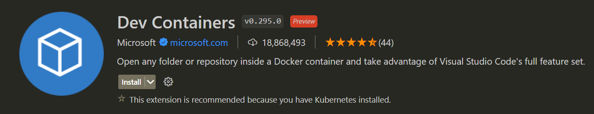

# Dockerfile常见环境使用

## ubuntu(国内镜像)

由于网内网络环境的问题，ubuntu不换源的话基本没法用，我们首先参考普通 ubuntu 系统如何换源，然后将其转换成命令形式，便于应用于 Dockerfile 中。

随便在网上搜 "ubuntu换源"，可以搜出一大堆教程，这里我们直接参考阿里云开源镜像站的[官方教程](https://developer.aliyun.com/mirror/ubuntu)，官方教程中给出了操作办法，就是手动将所有的源地址替换为阿里云的镜像地址：


首先我们使用 docker 跑一个 ubuntu 的镜像看下基本情况：

```bash
docker run -it --rm ubuntu:20.04 /bin/bash
```

注：后面也会出写一个笔记记录常用的 docker 命令。

在 ubuntu 下使用 `sudo apt-get install xxx` 安装软件，所有 `apt` 相关的配置项存储在 `/etc/apt` 文件夹下，其内容如下


<!-- more -->

其中 `sources.list` 以及 `sources.list.d` 就涉及软件源的配置信息，`sources.list` 用来存储默认的软件源信息（或者说官方源），而 `sources.list.d` 则用来存储第三方软件源，例如 docker 软件源、nvidia 驱动源等，一般安装软件我们只需要配置 `sources.list` 即可，第三方源的配置和官方源的配置差不太多。

使用 `cat` 命令查看 `sources.list` 文件内容（较长，可能显示不全）

```txt
root@302e32342092:/etc/apt# cat sources.list
# See http://help.ubuntu.com/community/UpgradeNotes for how to upgrade to
# newer versions of the distribution.
deb http://archive.ubuntu.com/ubuntu/ focal main restricted
# deb-src http://archive.ubuntu.com/ubuntu/ focal main restricted

...

deb http://security.ubuntu.com/ubuntu/ focal-security main restricted
# deb-src http://security.ubuntu.com/ubuntu/ focal-security main restricted
deb http://security.ubuntu.com/ubuntu/ focal-security universe
# deb-src http://security.ubuntu.com/ubuntu/ focal-security universe
deb http://security.ubuntu.com/ubuntu/ focal-security multiverse
# deb-src http://security.ubuntu.com/ubuntu/ focal-security multiverse
```

我们可以看到其软件源就是通过以下格式指定的

```sources.list
deb <apt source>
```

从源的URL链接中不难发现，这些链接实际上都是同一个域名底下的，我们换源是可以只更换前面的域名（即最后一个`/`之前的所有即可）。

既然都是替换了，那么肯定不能使用文本编辑器一个一个替换，最好的办法就是通过 `sed` 命令进行替换

### `sed` 命令简单介绍

from [GNU sed - GNU Project - Free Software Foundation](https://www.gnu.org/software/sed/)

> sed (stream editor) is a non-interactive command-line text editor.

其功能十分强大，目前我们只用到了其 `s` 命令

```
s/regexp/replacement/[flags]
(substitute) Match the regular-expression against the content of the pattern space. 
If found, replace matched string with replacement.
```

例如将文本中所所有的`foo`替换成`bar`就可以使用如命令

``` bash
sed -i s/foo/bar/g test.txt
```

测试如下


其中 `-i` 表示 inplace，即直接在当前文件中替换文本，最后的 `g` 表示对所有的匹配项进行替换

对于某些特殊字符，我们可以通过随意指定分隔符来避免频繁的转义，其格式如下所示

```bash
s<delimiter>regexp<delimiter>replacement<delimiter>[flags]
```

例如我们需要替换文本中所有的 `a/b/c` 为 `e/f/g`，就可以使用如下命令：

```bash
sed -i s@a/f/g@e/f/g@g test.txt
```

测试如下


### 替换链接

那么这样我们就可以我们通过文本替换实现换源，命令如下

```bash
sed -i s/archive.ubuntu.com/mirrors.aliyun.com/g /etc/apt/sources.list
```

这条命令将所有的 `archive.ubuntu.com` 替换为 `mirrors.aliyun.com`，对于`security.ubuntu.com`也是一样，虽然我们并不会对容器中的 ubuntu 进行安全更新，但是 `security.ubuntu.com` 会严重影响软件源的更新速度，因此也需要一同替换掉，最终完整的换源命令如下：

```bash
sed -i s/archive.ubuntu.com/mirrors.aliyun.com/g /etc/apt/sources.list && \
sed -i s/security.ubuntu.com/mirrors.aliyun.com/g /etc/apt/sources.list
```

通过 `&&` 将两条命令合并成一条执行，最后执行 `apt-get update` 更新软件源即可


此时可以看到软件源更新速度就很快了。

> 注：上面的方法仅适用于 ubuntu x86_64 架构的版本，对于其他版本（arm64、RISC-V等）则需要使用另外的软件源，不过替换方法都是一致的，找到需要替换的链接，然后通过 `sed` 进行替换即可。
>
> 例如在 arm 版的 ubuntu 中，其软件源为 `http://ports.ubuntu.com/ubuntu-ports/`，其对应的阿里云镜像为 `https://mirrors.aliyun.com/ubuntu-ports/`，我们同样使用 `sed` 进行替换
>
> ```bash
> sed -i s/ports.ubuntu.com/mirrors.aliyun.com/g /etc/apt/sources.list
> ```
>
> (阿里云镜像地址来自： https://developer.aliyun.com/mirror/ubuntu-ports)


## ssh 服务器

启动 docker 容器后，有可能需要连接到容器中修改代码什么的（一般用于深度学习模型训练环境，部署代码的话最好不要这么做），最朴素的办法就是安装一个命令行的文本编辑器，例如 vi，vim，nano 等，命令用熟了还是很轻松的，但是学习成本太高了，后面发现 vscode 的 Remote SSH 插件可以通过 SSH 连接到主机，之后就像本地代码一样进行调试运行等，简直不要太方便（实际上还有更好的办法，直接通过 vscode 的 Dev Containers 插件直接连接到容器中），不过设置 SSH 通用性更高，例如搭建 hadoop 等环境进行测试时就可以使用。




在配置脚本安装之前，我们首先看看手动如何安装 ssh 服务器（openssh-server），直接通过apt安装即可，运行如下命令

```
apt-get install openssh-server
```

之后提示我们具体需要安装哪些包，以及是否确定安装


但是我们可以看到，建议安装了一堆包，实际上有些包我们可以不装的，可以通过参数 `--no-install-recommends` 来取消安装这些包，运行命令

```
apt-get install openssh-server --no-install-recommends
```

结果如下


相比之前我们所需要安装的依赖就少多了

但是还有一个问题，安装过程中有一个 `Do you want to continue? [Y/n]` ，提示我们是否确定，但是我们需要用命令完成自动化安装过程，安装过程中是完全无交互的，因此需要默认安装，可以通过 `-y` 来进行默认安装（具体可以参考 apt-get 的 [man 页面](https://linux.die.net/man/8/apt-get)）


```
apt-get install openssh-server --no-install-recommends -y
```

这样当我们输入命令后就会自动安装了。

可以编写一个完整的安装 ssh 的 Dockerfile

```dockerfile
FROM ubuntu:20.04

RUN sed -i s/archive.ubuntu.com/mirrors.aliyun.com/g /etc/apt/sources.list && \
    sed -i s/security.ubuntu.com/mirrors.aliyun.com/g /etc/apt/sources.list && \
    apt-get clean && apt-get update && \
    apt-get install --no-install-recommends -y -q \
    openssh-server && \
    rm -rf /var/lib/apt/lists/*

EXPOSE 22

CMD [ "service","ssh","start","-D" ]
```

其暴露一个端口 22（SSH的默认端口），而且使用 `service ssh start -D` 来确保命令前台运行（保证容器不会被杀死）

 我们先尝试能否成功构建镜像，使用命令

```bash
docker build -t openssh-server:ubuntu20.04 .
```

进行构建，然后通过以下命令创建容器

```bash
 docker run -d --rm -p 54132:22 openssh-server:ubuntu20.04
```

其中 `-d` 表示 detach，将容器列入后台运行，由于我们在 `CMD` 中已经指定了一个前台应用，容器不会立刻被docker杀死，`--rm` 表示容器运行结束后会被直接删除（常用于测试场景），`-p 54132:22` 表示将宿主机的54132端口绑定到容器的22端口（即SSH端口上，这样我们就可以通过 54132端口连接到容器的SSH服务了）。


 最后我们使用 ssh 连接命令尝试连接到容器中

```
ssh -p 54132 root@localhost
```

首先会提示我们是否需要建立连接（这一步可以说明SSH端口是通的）


但是此时直接提示我们输入密码，但是我们似乎并没有设置过 root 账户的密码，这就意味着我们永远无法连接到容器


我们可以通过一下命令连接到容器进行修改

```
docker exec -it <container-id> /bin/bash
```

然后输入一下命令设置明文密码

```
echo "root:123" | chpasswd
```

之后我们再尝试通过 SSH 进行连接，结果如下


提示我们 Permission denied，这是因为 SSH 默认是不允许 root 用户通过密码登录的，我们需要修改 `/etc/ssh/sshd_config`

通过 `cat /etc/ssh/sshd_config` 可以看到这一点


再查看 sshd_config 的相关配置选项（查看其相关的 [man 页面](https://man7.org/linux/man-pages/man5/sshd_config.5.html) 即可，注意查看版本，我们使用的 ubuntu 版本比较新，老的配置文档不一定适用）


可以看到 `PermitRootLogin` 的可选参数有四个：`yes`，`prohibit-password`，`forced-commands-only`，`no`

> 注：其中 `yes`，`prohibit-password`以及 `no` 的含义比较直观，但是 `forced-commands-only` 还不太理解，其限定 `root` 用户通过秘钥进行登录，但是只能执行特定的 `command` ，这个 `command` 实际上需要在 ssh 登录的时候指定，即 `authorized_keys` 中指定，例如
>
> ```
> command=”/bin/ps” ssh-rsa AAAAB3NzaC1yc2EAAAABIwAAAQEAt0BETg9J6hZb5Kqxy+yfNtKHfwxUELz7PqGtGiM5eNb8DHC8kj02SCFoql5rpaecMGybWRiSK8/k+EsK7TMgd4O+p6WkNyLD3WZrmVzUEPaxAdYf1eeCQooTJ+B1TKXDNlF9t8xTVsHd67HmPWYU6i3+kaDSX7cbrz2ds2zUGSozj1UQ8AJDJMbGOqpjs3nVh2EpSDgY7znqmUDnygVPiM4c3OfEzs5iCxVd4ggpPhH8d0bwy8RmPsooxJYUY4rE1C5iWCvB7P810yUFB0OilxiX9AfZa9shC3n5bqaX0ioY1eC44hFFPL602fJyKMj6w/zxN5aIeFO03Sl9+FU4YQ== root@iZ23wan41azZ
> ```
>
> 就限定通过 `root` 私钥登录的时候只能执行 `/bin/ps`，无法执行其他命令，在运维场景下较为实用

```bash
echo "PermitRootLogin yes" >> /etc/ssh/sshd_config
```


然后重启一下 ssh 服务

```bash
service ssh restart
```

（此处重启时由于没有前台应用，容器会被 docker 给杀死，再重启一下容器即可）

再尝试登录的时候就可以成功了，提示我们输入密码


每次登录都输入密码还是有点麻烦（可以通过 `sshd_config` 设置密码可为空来绕过，但是还会提示用户进行交互，无法实现自动化远程登录），为此我们需要配置远程登录，首先通过 `ssh-keygen` 创建一对秘钥 	

```bash
ssh-keygen -t rsa -f ~/key -N ""
```


其中 `-t rsa` 指定加密算法为 rsa，`-N ""` 表示私钥密码为空 ，输出私钥路径为 `~/key` ，公钥路径会在私钥后添加 `.pub`，即 `~/key.pub`  ，此处创建的秘钥是可以复用的，不过不推荐这么做，安全性较低。

然后将公钥信息拷贝到 `~/.ssh/authorized_keys` 里即可

```bash
mkdir ~/.ssh
cat ~/key.pub >> ~/.ssh/authorized_keys
```

然后再重启一下 ssh，最终使用私钥登录测试

```bash
ssh -p 54132 -i key root@localhost
```

测试结果如下


提示我们权限不对，需要调整 key 的权限，按照下面的方式调整权限即可（适用于Windows，对于 macos 直接使用 `chmod` 命令修改权限即可）


再尝试登录的时候就可以登陆了


最后给出完整的 Dockerfile

```dockerfile
FROM ubuntu:20.04

# 配置 ubuntu 软件源
RUN sed -i s/archive.ubuntu.com/mirrors.aliyun.com/g /etc/apt/sources.list && \
    sed -i s/security.ubuntu.com/mirrors.aliyun.com/g /etc/apt/sources.list && \
    apt-get clean && apt-get update && \
    apt-get install --no-install-recommends -y \
    openssh-server && \
    rm -rf /var/lib/apt/lists/*

# 拷贝公钥和私钥，便于后续使用
COPY public-key.pem /root/public-key.pem
COPY private-key.pem /root/private-key.pem

# 将公钥拷贝到 authorized_keys 中，其中设置权限是必须的
RUN mkdir /root/.ssh && \
    touch /root/.ssh/authorized_keys && \
    chmod 700 /root/.ssh && \
    chmod 600 /root/.ssh/authorized_keys && \
    cat /root/public-key.pem >> /root/.ssh/authorized_keys

EXPOSE 22

# 确保 ssh 前台运行
CMD [ "service","ssh","start","-D" ]
```


## miniconda(python)

跑深度学习时经常需要配环境，需要安装 cuda 驱动、pytorch 等必要的软件库，虽然使用 anaconda 已经可以很好的管理 python 环境，使用 docker 来运行可以确保代码的可移植性，便于在另外一台机器上跑代码。

anaconda 官方起始有 docker 镜像，但是只有 debian 和 alpine，且通常我们会在 nvidia 的 cuda 容器中进行安装，可以参考官方的安装脚本进行配置，仓库地址：[docker-images/miniconda3/debian/Dockerfile at master · ContinuumIO/docker-images · GitHub](https://github.com/ContinuumIO/docker-images/blob/master/miniconda3/debian/Dockerfile)

代码如下

```dockerfile
FROM debian:bullseye-slim

LABEL maintainer="Anaconda, Inc"

ENV LANG=C.UTF-8 LC_ALL=C.UTF-8

# hadolint ignore=DL3008
RUN apt-get update -q && \
    apt-get install -q -y --no-install-recommends \
        bzip2 \
        ca-certificates \
        git \
        libglib2.0-0 \
        libsm6 \
        libxext6 \
        libxrender1 \
        mercurial \
        openssh-client \
        procps \
        subversion \
        wget \
    && apt-get clean \
    && rm -rf /var/lib/apt/lists/*

ENV PATH /opt/conda/bin:$PATH

CMD [ "/bin/bash" ]

# Leave these args here to better use the Docker build cache
ARG CONDA_VERSION=py310_23.3.1-0

RUN set -x && \
    UNAME_M="$(uname -m)" && \
    if [ "${UNAME_M}" = "x86_64" ]; then \
        MINICONDA_URL="https://repo.anaconda.com/miniconda/Miniconda3-${CONDA_VERSION}-Linux-x86_64.sh"; \
        SHA256SUM="aef279d6baea7f67940f16aad17ebe5f6aac97487c7c03466ff01f4819e5a651"; \
    elif [ "${UNAME_M}" = "s390x" ]; then \
        MINICONDA_URL="https://repo.anaconda.com/miniconda/Miniconda3-${CONDA_VERSION}-Linux-s390x.sh"; \
        SHA256SUM="ed4f51afc967e921ff5721151f567a4c43c4288ac93ec2393c6238b8c4891de8"; \
    elif [ "${UNAME_M}" = "aarch64" ]; then \
        MINICONDA_URL="https://repo.anaconda.com/miniconda/Miniconda3-${CONDA_VERSION}-Linux-aarch64.sh"; \
        SHA256SUM="6950c7b1f4f65ce9b87ee1a2d684837771ae7b2e6044e0da9e915d1dee6c924c"; \
    elif [ "${UNAME_M}" = "ppc64le" ]; then \
        MINICONDA_URL="https://repo.anaconda.com/miniconda/Miniconda3-${CONDA_VERSION}-Linux-ppc64le.sh"; \
        SHA256SUM="b3de538cd542bc4f5a2f2d2a79386288d6e04f0e1459755f3cefe64763e51d16"; \
    fi && \
    wget "${MINICONDA_URL}" -O miniconda.sh -q && \
    echo "${SHA256SUM} miniconda.sh" > shasum && \
    if [ "${CONDA_VERSION}" != "latest" ]; then sha256sum --check --status shasum; fi && \
    mkdir -p /opt && \
    bash miniconda.sh -b -p /opt/conda && \
    rm miniconda.sh shasum && \
    ln -s /opt/conda/etc/profile.d/conda.sh /etc/profile.d/conda.sh && \
    echo ". /opt/conda/etc/profile.d/conda.sh" >> ~/.bashrc && \
    echo "conda activate base" >> ~/.bashrc && \
    find /opt/conda/ -follow -type f -name '*.a' -delete && \
    find /opt/conda/ -follow -type f -name '*.js.map' -delete && \
    /opt/conda/bin/conda clean -afy
```

理解起来很简单，第一步安装 miniconda 的依赖（有些依赖我们并不需要，可根据自己需要调整），第二步根据系统版本选择对应的 miniconda 安装脚本进行安装，将其添加到 `/etc/profile.d` 和 `~/.bashrc`中（确保 miniconda 的初始化脚本在用户登录或用户交互前自动执行），最后清理掉无用的数据即可

### miniconda 换源

国内 miniconda 也很慢，同样可以对其进行换源，这里参考清华源的[换源教程](https://mirrors.tuna.tsinghua.edu.cn/help/anaconda/)，直接在用户目录下创建 `.condarc`，然后填写如下信息

```yaml
channels:
  - defaults
show_channel_urls: true
default_channels:
  - https://mirrors.tuna.tsinghua.edu.cn/anaconda/pkgs/main
  - https://mirrors.tuna.tsinghua.edu.cn/anaconda/pkgs/r
  - https://mirrors.tuna.tsinghua.edu.cn/anaconda/pkgs/msys2
custom_channels:
  conda-forge: https://mirrors.tuna.tsinghua.edu.cn/anaconda/cloud
  msys2: https://mirrors.tuna.tsinghua.edu.cn/anaconda/cloud
  bioconda: https://mirrors.tuna.tsinghua.edu.cn/anaconda/cloud
  menpo: https://mirrors.tuna.tsinghua.edu.cn/anaconda/cloud
  pytorch: https://mirrors.tuna.tsinghua.edu.cn/anaconda/cloud
  pytorch-lts: https://mirrors.tuna.tsinghua.edu.cn/anaconda/cloud
  simpleitk: https://mirrors.tuna.tsinghua.edu.cn/anaconda/cloud
  deepmodeling: https://mirrors.tuna.tsinghua.edu.cn/anaconda/cloud/
```

这一部分最好直接通过 `COPY` 命令的方式，将本地文件拷贝至容器中进行替换

```dockerfile
COPY .condarc /root/.condarc
```

### 创建新环境并安装包

配置好 miniconda 后我们就可以安装指定版本的 python 并配置我们需要的依赖包了，现在的问题在于，创建新环境后需要激活环境，然后再进行安装，那么如何在 dockerfile 中激活环境呢？可以通过 `Dockerfile` 中的 `SHELL` 命令指定所需要使用的 shell。

首先给出完整的 Dockerfile，然后再进行解析

```dockerfile
FROM continuumio/miniconda3:23.3.1-0
COPY .condarc /root/.condarc
SHELL [ "/bin/bash","--login","-c" ]
RUN conda create -n test python=3.9 -y && \
    conda activate test && \
    conda install numpy -y && \
    echo 'conda activate test' >> ~/.bashrc
CMD ["/bin/bash"]
```

其中的关键在于下面这条语句：

```dockerfile
SHELL [ "/bin/bash","--login","-c" ]
```

这一条语句的含义就是我们后面所执行的所有命令，都会通过 SHELL 指定的 shell 进行调用，例如我们后面有语句 `RUN conda activate base`，其会就等价于

```bash
/bin/bash --login -c "conda activate base"
```

关键在于 `--login` 参数，其强制 Shell 以登录模式调用命令，其关键在于 `--login` 在启动 shell 时会加载 `/etc/profile` 以及 `/etc/profile.d` 中指定的脚本文件，从前面的 Dockerfile 中我们也可以看到

```
ln -s /opt/conda/etc/profile.d/conda.sh /etc/profile.d/conda.sh
```

这个 `conda.sh` 就是用来激活环境的脚本，我们可以通过 `/bin/bash --noprofile --norc` 来测试


可以看到当我们加载 `/etc/profile` 后就可以激活环境了，在非交互模式下也是如此。

下面给出一个完整的 pytorch + cuda 的环境

```dockerfile
FROM nvidia/cuda:11.3.1-cudnn8-runtime-ubuntu20.04
# 环境变量设置，设置 console 的语言、时区以及 nvidia 驱动
ENV LANG=${LANG:-C.UTF-8} LC_ALL=${LC_ALL:-C.UTF-8} TZ=${TZ:-Asia/Shanghai} \
    NVIDIA_DRIVER_CAPABILITIES=${NVIDIA_DRIVER_CAPABILITIES:-compute,utility} 
# 安装 ubuntu 依赖    
RUN set -ex && \
    sed -i s@/archive.ubuntu.com/@/mirrors.aliyun.com/@g /etc/apt/sources.list && \
    sed -i s@/security.ubuntu.com/@/mirrors.aliyun.com/@g /etc/apt/sources.list && \
    rm -rf /etc/apt/sources.list.d && \
    apt-get clean -q && \
    apt-get update -q && \
    apt-get install -q -y --no-install-recommends \
        bzip2 \
        ca-certificates \
        git \
        wget \
    && apt-get clean \
    && rm -rf /var/lib/apt/lists/*
# 安装 miniconda，这一段直接复制的官方的 dockerfile
ENV PATH /opt/conda/bin:$PATH
# Leave these args here to better use the Docker build cache
ARG CONDA_VERSION=py310_23.3.1-0
RUN set -x && \
    UNAME_M="$(uname -m)" && \
    if [ "${UNAME_M}" = "x86_64" ]; then \
        MINICONDA_URL="https://repo.anaconda.com/miniconda/Miniconda3-${CONDA_VERSION}-Linux-x86_64.sh"; \
        SHA256SUM="aef279d6baea7f67940f16aad17ebe5f6aac97487c7c03466ff01f4819e5a651"; \
    elif [ "${UNAME_M}" = "s390x" ]; then \
        MINICONDA_URL="https://repo.anaconda.com/miniconda/Miniconda3-${CONDA_VERSION}-Linux-s390x.sh"; \
        SHA256SUM="ed4f51afc967e921ff5721151f567a4c43c4288ac93ec2393c6238b8c4891de8"; \
    elif [ "${UNAME_M}" = "aarch64" ]; then \
        MINICONDA_URL="https://repo.anaconda.com/miniconda/Miniconda3-${CONDA_VERSION}-Linux-aarch64.sh"; \
        SHA256SUM="6950c7b1f4f65ce9b87ee1a2d684837771ae7b2e6044e0da9e915d1dee6c924c"; \
    elif [ "${UNAME_M}" = "ppc64le" ]; then \
        MINICONDA_URL="https://repo.anaconda.com/miniconda/Miniconda3-${CONDA_VERSION}-Linux-ppc64le.sh"; \
        SHA256SUM="b3de538cd542bc4f5a2f2d2a79386288d6e04f0e1459755f3cefe64763e51d16"; \
    fi && \
    wget "${MINICONDA_URL}" -O miniconda.sh -q && \
    echo "${SHA256SUM} miniconda.sh" > shasum && \
    if [ "${CONDA_VERSION}" != "latest" ]; then sha256sum --check --status shasum; fi && \
    mkdir -p /opt && \
    bash miniconda.sh -b -p /opt/conda && \
    rm miniconda.sh shasum && \
    ln -s /opt/conda/etc/profile.d/conda.sh /etc/profile.d/conda.sh && \
    echo ". /opt/conda/etc/profile.d/conda.sh" >> ~/.bashrc && \
    echo "conda activate base" >> ~/.bashrc && \
    find /opt/conda/ -follow -type f -name '*.a' -delete && \
    find /opt/conda/ -follow -type f -name '*.js.map' -delete && \
    /opt/conda/bin/conda clean -afy
# 创建指定版本的环境   
ARG CONDA_ENV_NAME=ml
ARG CONDA_ENV_PY_VER=3.9
COPY ./condarc /root/.condarc
RUN set -x && \
    conda create -n ${CONDA_ENV_NAME} python=${CONDA_ENV_PY_VER} -y && \
    echo "conda activate ${CONDA_ENV_NAME}" >> ~/.bashrc && \
    conda clean -afy
# 激活环境，配置清华源并安装库
# 通过 pip 进行安装，如果通过 conda 安装还会手动安装 cudnn、cuda 等包，实际上我们已经有了
# 推荐使用 pip install -r requirements 进行安装
SHELL ["/bin/bash", "--login", "-c"]
RUN conda activate ${CONDA_ENV_NAME} && \
    pip config set global.index-url https://pypi.tuna.tsinghua.edu.cn/simple && \
    pip install torch==1.12.1+cu113 torchvision==0.13.1+cu113 \
                torchaudio==0.12.1 --extra-index-url https://download.pytorch.org/whl/cu113 && \
    rm -rf /root/.cache/pip && \
    conda clean -afy
CMD ["/bin/bash"
```

构建时间可能较长（pytorch 包太大了），启动时注意参数 `--shm_size` ，尤其是在多线程数据加载中


## 总结

个人理解 dockerfile 实际上就是运维脚本的另外一种形式，关键还是在于脚本语言的熟悉程度，linux 命令较为熟悉的话就可以很轻松的构建出合适的镜像。

参考资料

1. [ubuntu镜像_ubuntu下载地址_ubuntu安装教程-阿里巴巴开源镜像站 (aliyun.com)](https://developer.aliyun.com/mirror/ubuntu?spm=a2c6h.13651102.0.0.3e221b11uhvFDQ)
2. [apt-get(8) - Linux man page (die.net)](https://linux.die.net/man/8/apt-get)
3. [sshd_config(5) - Linux manual page (man7.org)](https://www.man7.org/linux/man-pages/man5/sshd_config.5.html)
4. [sshd_config 中 PermitRootLogin 的探讨_huigher的博客-CSDN博客](https://blog.csdn.net/huigher/article/details/52972013)
5. [Linux下service xxx start/stop/restart启动服务、关闭服务、重启服务深入理解@_service start_King-Long的博客-CSDN博客](https://blog.csdn.net/u011095110/article/details/81020839)
6. [windows ssh Permissions for “xxx“ are too open错误详细解决方案_菜到不知所措的博客-CSDN博客](https://blog.csdn.net/weixin_40415591/article/details/121661857)
7. [anaconda | 镜像站使用帮助 | 清华大学开源软件镜像站 | Tsinghua Open Source Mirror](https://mirrors.tuna.tsinghua.edu.cn/help/anaconda/)
8. LPIC Shell 基础：[105.1 Lesson 1 (lpi.org)](https://learning.lpi.org/en/learning-materials/102-500/105/105.1/105.1_01/)
9. [共享内存简介及docker容器的shm设置与修改_docker shm_Adenialzz的博客-CSDN博客](https://blog.csdn.net/weixin_44966641/article/details/123930747)

