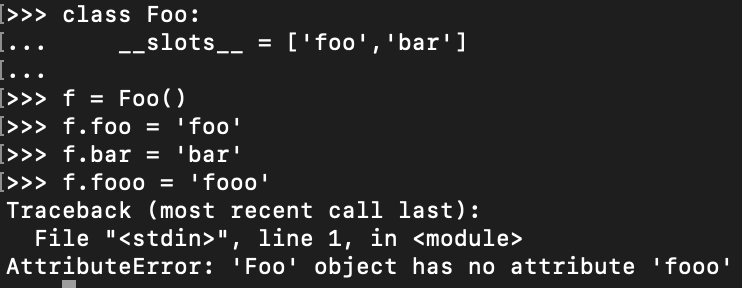
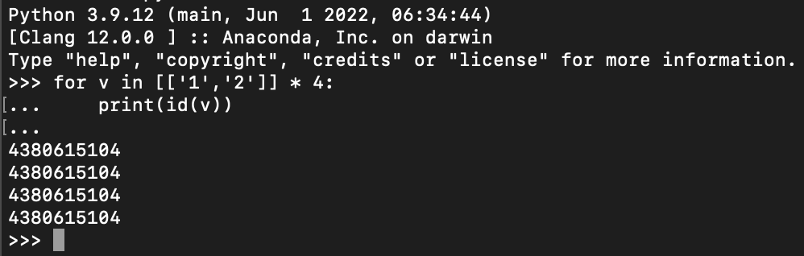
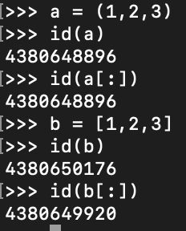
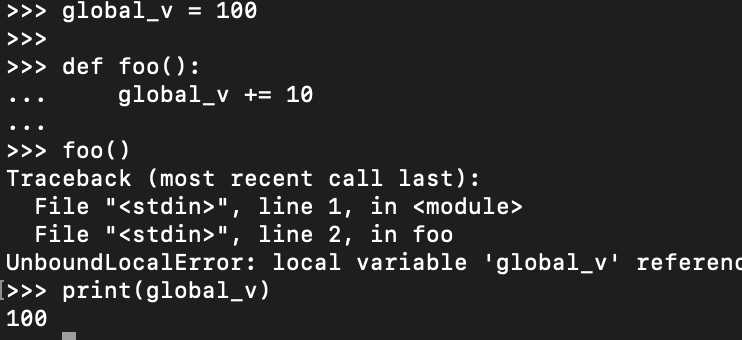
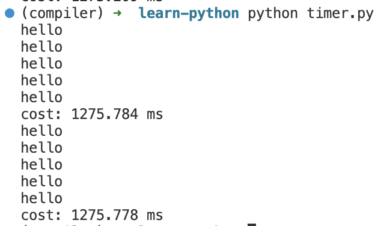
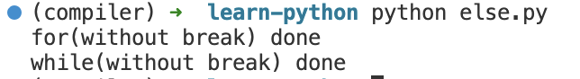
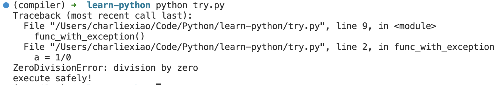

# Python 易错点整理

## 魔法方法和内置属性

### 容器类型

> 链接：https://www.nowcoder.com/questionTerminal/c2380f6992814490b7f5b6e446b72ed7
> 来源：牛客网

根据以下程序，下列选项中，说法正确的是（） 

```python
class Foo(): 
	def __init__(self): 
        pass 
	def __getitem__(self,pos): 
		return range(0,30,10)[pos] 
foo = Foo() 
```
1. `foo` 对象表现得像个序列
2. 可以使用 `len(foo)` 来查看对象 `foo` 的元素个数
3. 可以使用 `for i in foo:print(i)` 来遍历 `foo` 的元素
4. 不能使用 `foo[0]` 来访问对象 `foo` 的第一个元素

对于第一个选项，[Python文档](https://docs.python.org/3.9/glossary.html#term-sequence)中定义序列必须实现两个方法，`__getitem__` 以及 `__len__`，即支持通过整数的索引以及返回序列的长度，而 `Foo` 仅实现了整数索引功能，因此不是序列。

对于第二个选项，`len(foo)` 实际上会调用 `__len__` 方法来获取序列长度，类没实现该方法故不行

对于第三个选项，`for` 语句支持两种，一种为通过 `__iter__` 进行调用，另一种则为 `__getitem__`，因此**正确**

对于第四个选项，由于我们定义了 `__getitem__` 方法，我们是可以通过 `foo[0]` 来访问 `foo` 的第一个元素的

<!-- more -->

## `__slots__`

> [3. Data model — Python 3.9.17 documentation #__slots_](https://docs.python.org/3.9/reference/datamodel.html?highlight=__slots__#slots)_

`__slots__` 属性用来**显式指定对象所包含的属性**，相比 `__dict__` 效率更高，但是使用上有很多细节需要注意

只有 `__slots__` 中指定的属性可以被赋值，其他的会报错，示例如下

```python 
class Foo:
    __slots__ = ['foo','bar']
    
f = Foo()
f.foo = 'foo'   # ✓
f.bar = 'bar'   # ✓
f.fooo = 'fooo' # ✗
```



## `__init__` 和 `__new__`

> [3. Data model — Python 3.9.17 documentation #basic-customization](https://docs.python.org/3.9/reference/datamodel.html?highlight=__new__#basic-customization)

在 Python 中，对象的创建和初始化是两个分开的过程，

- `__new__` 负责对象的创建，为类的**静态方法**，其返回一个类实例对象
-  `__init__` 负责对象的初始化，**其不需要返回任何值**，当存在继承时，不会自动调用父类的 `__init__`，需要手动通过 `super()__init__([args...])` 进行调用

## 列表生成式和 `*` 

> 链接：https://www.nowcoder.com/questionTerminal/26cc96e5eb1f40dca9b1987a0944eff1
> 来源：牛客网

执行以下程序，输出结果为？

```python
a = [['1','2'] for i in range(2)]
b = [['1','2']] * 2
a[0][1] = '3'
b[0][0] = '4'
print(a,b) 
```

乍一看两个都可完成列表的重复，但关键在于复制的**深浅**，具体可以参考官方文档对于 [list 的介绍](https://docs.python.org/3.9/tutorial/datastructures.html?highlight=list)

- 使用列表生成式（Generator Statement）创建列表式会创建多个对象，使用时更灵活
- 使用 `*` 来重复对象时将**指向同一个内存地址**

我们可以测试 `*` 的效果

```python
for v in [['1','2']] * 4:
    print(id(v))
```

输出结果



因此上面的结果就显而易见了

`a[0][1]` 就仅会修改列表第一个元素，而 `b[0][0]` 由于两个元素实际上指向同一个内存地址，会同步进行修改

最终结果为 `[['1', '3'], ['1', '2']] [['4', '2'], ['4', '2']]`

## 切片

### 元组`[:]`和列表`[:]`

这个有点细节了，**由于元组是不可变的（immutable）**，其切片就是其本身，而列表可变，其切片将会复制一个列表



可以通过`id`来观察内存地址，其中元组切片内存地址不变，列表切片会复制一个，内存地址发生变化

## 类与继承


## 字符串操作

### strip

*str.strip([chars])*：删除字符串首尾所有在 `chars` 中的字符，例如 `'abbacabb'.strip('ab')` 就会删除首尾的 `a` 和 `b` 最终就只剩下 `c` 了

### split

*str.split(sep=None, maxsplit=-1)*：使用 `sep` 中指定的字符串分割字符串，`maxsplit` 用来限制分割字符串的数目

这个函数有点坑的在于首尾出现 `sep` 时，例如 `'<>A<>B<>C<>'.split('<>')`，其结果为 `['','A','B','C','']` 

不过这么输出也合理，因为 `sep` 需要用来分割两个字符串

## 布尔判断

除了显式的 `bool` 类型外，以下三种情况应用于条件判断语句时也为 `False`

> [Truth Value Testing](https://docs.python.org/3.9/library/stdtypes.html?highlight=strip#truth-value-testing)

- 值为 `None` 

- 任意一种数值类型的0：`0`，`0.0`，`0j`（复数），`Decimal(0)`，`Fraction(0,1)`
- 空序列/容器：`''`（空字符串），`()`（空元组），`[]`（空列表），`{}`（空字典），`set()`（空集合），`range(0)`（空范围）

这个还是值得注意的，下面表达式就是等价的，可以让代码看起来不那么冗余

```python
if Obj <==> if Obj is not None
if List <==> if len(List) != 0
```

## 运算符优先级


## 作用域

## nonlocal 和 global

当我们需要**修改全局或者外部作用域的变量**时，就需要使用 `global` 或 `nonlocal` 关键字来说明，否则就会报错，例如

```python
global_v = 100

def foo():
    global_v += 10

foo()
print(global_v)
```



## lambda 和函数闭包

可以通过函数闭包的方式实现静态变量（也可以使用`hasattr`、`setattr` 和 `getattr` 来设置），例如实现一个计数器（这个实际上有点像 `JavaScript` 的写法，函数式编程） 

```python
def counter():
    count = 0
    def increment():
        nonlocal count
        count += 1
    def count_value():
        return count
    return increment, count_value
```

在函数内使用外部变量是以**引用方式**读取（C++中的lambda可以指定不同变量捕获方式，比较灵活），因此会在**执行函数才会读取变量的值。**

## 函数默认参数

> 链接：https://www.nowcoder.com/questionTerminal/0f7fb713fb8f46548f38177c3b3d47ba
> 来源：牛客网

执行下列程序，输出结果为？  

```python
def fun(a=(),b=[]):
    a += (1,)
    b.append(1)
    return a,b

fun()
print(fun())
```

> [8. Compound statements — Python 3.11.4 documentation](https://docs.python.org/3/reference/compound_stmts.html#function)
>
> 参考官方文档：**Default parameter values are evaluated from left to right when the function definition is executed.** This means that the expression is evaluated once, when the function is defined, and that the same “pre-computed” value is used for each call. **This is especially important to understand when a default parameter value is a mutable object**, such as a list or a dictionary: if the function modifies the object (e.g. by appending an item to a list), the default parameter value is in effect modified. This is generally not what was intended. A way around this is to use `None` as the default, and explicitly test for it in the body of the function.
>
> 函数默认参数将在函数定义时就初始完成，然后在后续的调用中一直使用这个”预计算好的“默认值，这就会带来很多坑

对于不可变的对象，例如元组和字符串而言，**在函数中的修改并不会修改默认值**，因为他们的值是不可变的（immutable），但是对于列表和字典这样的可变对象而言，**就相当于全局变量一样会一直更新**。

虽然 `a` 为一个元组，但是 `a += (1,)` 等价于 `a = a + (1,)` 即我们对 a 重新设置了一个值（其实对b重新赋值的话也不会有影响，但是 append 是直接修改 b 的元素）

因此最终输出为 `((1,), [1, 1])`（函数多个返回值会合并为一个元组统一输出）


## 装饰器

> [Glossary — Python 3.11.4 documentation #term-decorator](https://docs.python.org/3/glossary.html#term-decorator)
>
> Decorator expressions are evaluated when the function is defined, in the scope that contains the function definition.

```python
@f1(arg)
@f2
def func(): pass
```

等价于

```python
def func(): pass
func = f1(arg)(f2(func))
```

上面例子可能有点抽象，举个实际一点的例子，计时器以及重复执行（带参数的装饰器如何实现）

```python
from time import perf_counter_ns
from functools import wraps

def Timer(func):
    @wraps(func)
    def wrapper(*args,**kwargs):
        # 统计函数的运行时间
        start = perf_counter_ns()
        func(*args,**kwargs)
        end = perf_counter_ns()
        print(f'cost: {(end-start)/1e6:03.3f} ms')
    return wrapper

def Repeat(count):
    def inner(func):
        @wraps(func)
        def wrapper(*args,**kwargs):
            # 将函数执行 count 次
            for _ in range(count):
                func(*args,**kwargs)
        return wrapper
    return inner
            
@Timer
@Repeat(count=5)
def test_func1():
    from time import sleep
    sleep(0.25)
    print('hello')

def test_func2():
    from time import sleep
    sleep(0.25)
    print('hello')

test_func1()

# 等价于
test_func2 = Timer(Repeat(count=5)(test_func2))
test_func2()
```

运行结果



## else 语句

这里的 else 语句并不是 `if ... else ...` 的 else，其为 `while ...`、`try ... except ...` 、`for ...` 语句的 else 语句

示例如下

对于 `while` 和 `for` 两个循环而言，`else` 语句将会在循环顺利执行完后调用（即不碰到 `break`，`return`就更不用说了）

```python 
for i in range(4):
    pass
else:
    print('for(without break) done')

for j in range(5):
    if j == 4:
        break
else:
    print('for(with break) done')
    
i = 5
while i > 0:
    i-=1
else:
    print('while(without break) done')
    
i = 5
while i > 0:
    i-=1
    if i == 0:
        break
else:
    print('while(with break) done')    
```

输出结果



对于 `try ... except ...` 语句而言，else 语句会在没有任何异常时执行

```python
def func_with_exception():
    a = 1/0

def func_without_exception():
    a = 0 / 1
    
try:
    func_with_exception()
except:
    import traceback
    traceback.print_exc()
else:
    print('execute safely!')   

try:
    func_without_exception()
except:
    import traceback
    traceback.print_exc()
else:
    print('execute safely!')
```

运行结果（第一个抛出异常，第二没有异常顺利执行）



## `finally` 作用

**无论什么情况都会执行！**

>If a [`finally`](https://docs.python.org/3/reference/compound_stmts.html#finally) clause is present, the `finally` clause will execute as the last task **before** the [`try`](https://docs.python.org/3/reference/compound_stmts.html#try) statement completes. The `finally` clause runs whether or not the `try` statement produces an exception. The following points discuss more complex cases when an exception occurs:
>
>- If an exception occurs during execution of the `try` clause, the exception may be handled by an [`except`](https://docs.python.org/3/reference/compound_stmts.html#except) clause. **If the exception is not handled by an `except` clause, the exception is re-raised after the `finally` clause has been executed.**
>- An exception could occur during execution of an `except` or `else` clause. **Again, the exception is re-raised after the `finally` clause has been executed.**
>- If the `finally` clause executes a [`break`](https://docs.python.org/3/reference/simple_stmts.html#break), [`continue`](https://docs.python.org/3/reference/simple_stmts.html#continue) or [`return`](https://docs.python.org/3/reference/simple_stmts.html#return) statement, exceptions are not re-raised.
>- If the `try` statement reaches a [`break`](https://docs.python.org/3/reference/simple_stmts.html#break), [`continue`](https://docs.python.org/3/reference/simple_stmts.html#continue) or [`return`](https://docs.python.org/3/reference/simple_stmts.html#return) statement, **the `finally` clause will execute just prior to the `break`, `continue` or `return` statement’s execution.**
>- If a `finally` clause includes a `return` statement, **the returned value will be the one from the `finally` clause’s `return` statement**, not the value from the `try` clause’s `return` statement.

引入 `finally` 后函数的执行流比较复杂，不熟情况少用，容易整蛊感觉

## 正则表达式