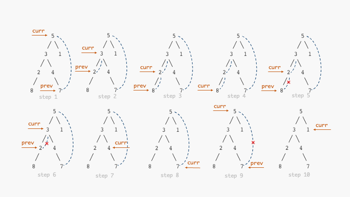

# 二叉树实现

不同语言实现起来都差不多，给出 C++ 版本的模版实现

```c++
template <typename T> struct TreeNode {
  using value_type = T;
  using ptr_type = TreeNode<T> *;

  value_type val{};
  ptr_type left{nullptr};
  ptr_type right{nullptr};
};

template <typename T>
std::ostream &operator<<(std::ostream &os, const TreeNode<T> &node) {
  return os << node.val;
}
```


# 递归遍历

由于二叉树本身的递归特性，通过递归函数可以很简单的遍历二叉树，根据访问根节点顺序不同可以分为前序、中序和后序，对应代码如下

首先定义访问函数以及递归遍历函数

```c++
template <typename T> void visit(TreeNode<T> *node) {
  std::cout << "visit: " << *node << std::endl;
}
std::function<void(node_ptr)> recursive;
```

<!-- more -->

## 前序

```c++
recursive = [&](node_ptr node) {
    if (!node) {
      return;
    }
    // 注意观察三个函数的执行顺序
    visit(node);
    recursive(node->left);
    recursive(node->right);
};
```

## 中序

```c++
recursive = [&](node_ptr node) {
    if (!node) {
      return;
    }
    recursive(node->left);
    visit(node);
    recursive(node->right);
};
```

## 后序

```c++
recursive = [&](node_ptr node) {
    if (!node) {
      return;
    }
    recursive(node->left);
    recursive(node->right);
    visit(node);
};
```


# 迭代遍历

在某些极端场景（或迭代器实现时）我们需要将递归函数转换成迭代实现，此时我们就需要通过**栈**模拟递归（针对前、中、后序遍历），同时还用**队列**实现层序遍历。

## 前、中、后序遍历

首先我们需要分析一下递归函数的执行过程（以中序遍历为例）：

```
recursive(5)          
  recursive(3)        
    recursive(2)      
      recursive(8)    
        visit(8)      
      visit(2)
    visit(3)
    recursive(4)
      visit(4)
      recursive(7)
        visit(7)
  visit(5)
  recursive(1)
    visit(1)
```

通过不同的缩进展示了不同函数之间的执行顺序以及所在的作用域

从递归函数的调用过程可以看出，每一个节点实际上都会访问两遍（`recursive` 以及 `visit`），而**函数调用顺序一定是按照先序遍历的顺序**，访问调用顺序则是我们预期的顺序。

对于先序遍历而言，其在进入`recursive`就执行`visit`，我们可以在出栈的同时执行 `visit` ，这样节省一次入栈

```c++
template<typename T> void preorder_iter(TreeNode<T>* root) {
  using node_ptr = typename TreeNode<T>::ptr_type;
  std::stack<node_ptr> stack;
  stack.emplace(root);
  while(!stack.empty()) {
    node_ptr curr = stack.top();
    stack.pop();
    visit(node_ptr);
    if(curr->right) {
      stack.emplace(curr->right);
    }
    // 此处左节点后入栈，确保下个循环开始时左节点位于栈首
    if(curr->left) {
      stack.emplace(curr->left);
    }
  }
}
```

对于中序遍历和后序遍历而言就稍微麻烦一点，因为我们必须要完成两次遍历（第一次入栈模拟的是`recursive`的调用，第二次入栈模拟的就是`visit` 的调用），为此我们除了存储节点外还需要添加一个状态标记 `first`，用来标识我们是否是第一次访问该节点，如果不是，就执行 `visit` 函数。

剩下就是如何确定入栈顺序了

先看中序遍历

```c++
template<typename T> void inorder_iter(TreeNode<T>* root) {
  using node_ptr = typename TreeNode<T>::ptr_type;
  std::stack<std::pair<node_ptr,bool>> stack;
  stack.emplace(root,true);
  while(!stack.empty()) {
    auto [curr,first] = stack.top();
    stack.pop();
    if(!first) {
      visit(node_ptr);
      continue;
    }
    // 等价于 recursive(curr->left)
    // 等价于 visit(curr);
    // 等价于 recursive(curr->right);
    if(curr->right) {
      stack.emplace(curr->right,true);
    }
    stack.emplace(curr,false);
    if(curr->left) {
      stack.emplace(curr->left,true);
    }
  }
}
```

理解起来很简单， 

- `(node_ptr,true)` 等价于一次 `recursive(node_ptr)` 调用，

-  `(node_ptr,false)` 等价于一次 `visit(node_ptr)` 调用


对于中序而言，其执行顺序为

```
recursive(node->left)
visit(node)
recursive(node->right)
```

根据等价关系等价于出栈顺序

```
pop (node->left,true)
pop (node,false)
pop (node->right,true)
```

为实现这样一个出栈顺序，我们就必须反着压栈，也就是

```
push (node->right,true)
push (node,false)
push (node->left,true)
```

对于后序遍历而言也是一样，只需要修改入栈顺序即可

```c++
...
stack.emplace(curr,false);
if(curr->right) {
	stack.emplace(curr->right,true);
}
if(curr->left) {
  	stack.emplace(curr->left,true);
}
...
```


## 层序遍历

前面介绍的前中后序遍历实际上都是 DFS（深度优先搜索）的特殊情况，都是用栈实现，而层序遍历则对应于 BFS（广度优先搜索），代码写起来和先序遍历的代码几乎一样，只不过数据结构从栈换成了队列

```c++
template<typename T> void level_order_iter(TreeNode<T>* root) {
  using node_ptr = typename TreeNode<T>::ptr_type;
  std::queue<node_ptr> queue;
  queue.emplace(root);
  while(!stack.empty()) {
    // 相应的替换成 queue 对应的队首和弹出函数
    node_ptr curr = queue.front();
    queue.pop();
    visit(node_ptr);
    if(curr->right) {
      stack.emplace(curr->right);
    }
    if(curr->left) {
      stack.emplace(curr->left);
    }
  }
}
```


# 🔥莫里斯遍历

前面介绍的遍历方法空间复杂度都为 $\mathcal{O}(n)$，迭代实现的比较好理解，因为我们使用了栈/队列存储中间结果，对于递归函数而言，多次的函数调用也是需要空间开销的（要不然哪来的 StackOverflow，相对于显式的使用栈，递归函数就等价于隐式使用栈，因此所有递归函数都可以改写成使用栈实现的迭代形式）。

而莫里斯遍历在同样时间复杂度情况下可以实现 $\mathcal{O}(1)$ 空间复杂度，代价就是时间复杂度的常数高一点（写起来复杂一点），但还是$\mathcal{O}(n)$

其核心思想就是**利用节点中的空闲指针**（指向`null`的那些），将二叉树转换成一个链表（近似），从而实现 $\mathcal{O}(1)$ 的空间复杂度。 

其更新规则如下：

1. 设 `curr` 为当前遍历的节点（初始为根节点 `root`）

2. 如果 `curr` 存在左子树：

   遍历左子树，找到其最右端的节点（也就是**中序遍历中位于根节点前面的那一个节点**），记为 `prev`，将该节点的右指针指向 `curr`，即 `prev.right = curr`，更新 `curr` 为其左节点 `curr = curr.left`（此处利用**最右端节点的右指针一定是空**性质）

   如果我们在遍历左子树过程中碰到 `prev.right == curr` 的情况，**说明我们已经遍历完 `curr` 的左子树**，清除副作用 `prev.right = null`，然后更新 `curr` 为其右节点 `curr = curr.right`

3. 如果 `curr` 不存在左子树，表示其此时为所在子树的最左节点，更新 `curr` 为其右节点 `curr = curr.right`

## 前、中序遍历

根据更新规则，可以写出前序遍历代码

```c++
template<typename T> void morris_inorder_traversal(TreeNode<T>* root) {
  using node_ptr = typename TreeNode<T>::ptr_type;
  node_ptr curr = root;
  while(curr) {
    if(!curr->left) {
      visit(curr);
      curr = curr->right;
    }
    node_ptr prev = curr->left;
    while(prev->right && prev->right != curr) {
      prev = prev->right;
    }
    if(prev->right == curr) {
      prev->right = nullptr;
      curr = curr->right;
    } else {
      prev->right = curr;
      // 第一次访问到中间节点时调用 visit
      visit(curr);
      curr = curr->left;
    }
  }
}
```

下图展示了莫里斯遍历的执行过程



其关键在于找到当前节点`curr`中序遍历下的前驱节点`prev`，这个操作是否是 $\mathcal{O}(n)$ ？

由于**树中每条边都会最多被遍历两次（一次建立连接，一次消除连接），而树中边的个数为 $n-1$，最终时间复杂度为 $\mathcal{O}(n)$，空间复杂度为 $\mathcal{O}(1)$**

图中所有非叶子节点都会被遍历2次，前序遍历会在第一次访问到该节点时调用 `visit`，而中序遍历会在第二次访问到该节点时调用 `visit`，因此前序和中序莫里斯遍历的写法基本一致，只是调用 `visit` 的时机不一样。

下面给出完整的中序遍历代码：

```c++
template<typename T> void morris_inorder_traversal(TreeNode<T>* root) {
  using node_ptr = typename TreeNode<T>::ptr_type;
  node_ptr curr = root;
  while(curr) {
    if(!curr->left) {
      visit(curr);
      curr = curr->right;
    }
    node_ptr prev = curr->left;
    while(prev->right && prev->right != curr) {
      prev = prev->right;
    }
    if(prev->right == curr) {
      prev->right = nullptr;
      // 第二次访问到中间节点时调用 visit
      visit(curr);
      curr = curr->right;
    } else {
      prev->right = curr;
      curr = curr->left;
    }
  }
}
```

## 后序遍历

对于后序遍历而言，情况稍微复杂点，我们无法直接得到后序遍历的结果，而是将后序遍历作为一个中序遍历执行特殊操作后得到的结果。

这个特殊操作就是**反转一部分中序遍历的结果**，具体而言，需要**反转中序遍历后从根节点左节点到左子树最后一个节点这一段路径**，这是一个递归规则，可以应用于任意子树中。

下面简单解释一下为什么这个特殊操作就可以得到后序遍历结果：

设二叉树的某一段呈这个形状

```
    a
   ╱ ╲
 s0   b
     ╱ ╲
   s1   c
       ╱ ╲
     s2   d
         ╱ ╲
       s3   e
           ╱ ╲
         s4   f
```

设子树的后序遍历序列为 $\text{post}(k)$，其中k为子树的根节点，根据后序遍历定义，我们可以得到子树 $a$ 的后序遍历序列的递推公式
$$
\text{post}(a) = \text{post}(s0) | \text{post}(s1) | \text{post}(s2) | \text{post}(s3) | \text{post}(s4)|fedcba
$$
其中 $|$ 表示拼接两个序列，由此我们可以写出另外一种形式的后序遍历

```c++
template<typename T> void post(TreeNode<T>* node) {
  using node_ptr = typename TreeNode<T>::ptr_type;
  std::stack<node_ptr> stack;
  // 先遍历所有的子树
  for(node_ptr curr = node;curr != nullptr;curr = curr->right) {
    post(curr->left);
    stack.push(curr);
  }
  // 再反向输出结果
  while(!stack.empty()) {
    visit(stack.top());
    stack.pop();
  }
}
```

此处我们用到了 **栈** 来进行反转，其空间复杂度为 $\mathcal{O}(n)$，也可以使用链表反转方法进行反转，这样的空间复杂度为 $\mathcal{O}(1)$，使用链表反转的后序遍历代码如下

```c++
// 头插法实现链表反转
template<typename T> TreeNode<T>* reverse_linked_list(TreeNode<T>* start) {
  using node = TreeNode<T>;
  using node_ptr = typename node::ptr_type;
  static node head{};
  head.right = nullptr;
  node_ptr curr = start;
  while(curr) {
    node_ptr temp = curr->right;
    curr->right = head.right;
    head.right = curr;
    curr = temp;
  }
  return head.right;
}

template<typename T> void post_linked_list(TreeNode<T>* node) {
  using node_ptr = typename TreeNode<T>::ptr_type;
  // 遍历完该链表上的所有左子树
  for(node_ptr curr = node;curr != nullptr;curr=curr->right) {
    post_linked_list(curr->left);
  }
  // 反转
  node_ptr reversed_head = reverse_linked_list(node);
  for(node_ptr curr = reversed_head; curr != nullptr; curr=curr->right) {
    visit(curr);
  }
  reverse_linked_list(reversed_head);
}
```

接下来我们可以将这个递归函数通过莫里斯遍历的形式改写成迭代形式。

从代码中可以观察到，每当我们知道已经遍历完左子树之后，就可以通过反转链表输出结果，而在莫里斯遍历中，每当 `prev->right == curr` 时，我们就刚好遍历完左子树，那么只需要在此处调用反转输出函数即可。基于莫里斯遍历的后序遍历方法代码如下：

```c++
template<typename T> void morris_postorder_traversal(TreeNode<T>* root) {
  using node = TreeNode<T>;
  using node_ptr = typename node::ptr_type;
  node_ptr curr = root;
    
  std::function<void(node_ptr)> add_path = [](node_ptr head) {
    node_ptr rhead = reverse_linked_list(head);
    for(node_ptr i = rhead; i != nullptr; i=i->right) {
      visit(i);
    }
    reverse_linked_list(rhead);
  };

  while(curr) {
    if(!curr->left) {
      curr = curr->right;
      continue;
    }
    node_ptr prev = curr->left;
    while(prev->right && prev->right != curr) {
      prev = prev->right;
    }
    if(prev->right == curr) {
      prev->right = nullptr;
      add_path(curr->left);
      curr = curr->right;
    } else {
      prev->right = curr;
      curr = curr->left;
    }
  }
  add_path(root);
}
```

代码最后单独添加了一个 `add_path(root)` 是因为莫里斯遍历完成后实际上还有根节点的输出没完成，需要遍历一遍添加这个输出。

（还有一种解决方案就是再添加一个根节点，将原来的根节点作为新根节点的左节点，这样就可以在一个循环内输出所有的结果了）

