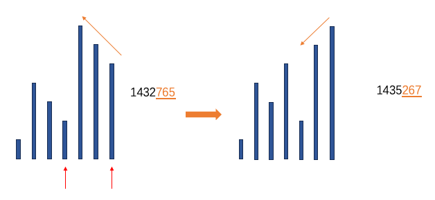

# 所有排列

由于排列本身的递归形式，可以通过回溯不断生成所有的排列。例如序列为 `[1,2,3,4]`，当我们确定第一个位置为 `1` 后，剩下三个位置，此时有效的排列就变成了 剩下三个数 `[2,3,4]` 在剩下三个位置上的全排列了，这样我们就从求 `[1,2,3,4]` 的全排列变成了求 `[2,3,4]` 全排列，当序列长度为 1 时其排列就为其本身，递归终止。

根据这个思路我们就可以写出所有的全排列了

```c++
void permutations(const std::vector<int>& numbers,
                  std::vector<int>& curr,
                  std::vector<int>& visited,
                  const std::vector<std::vector<int>>& output) {
    if(curr.size() == numbers().size()) {
        output.emplece_back(curr);
        return;
    }
    for(int i=0;i<numbers.size();i++) {
        if(visited[i]) {
            continue;
        }
        visited[i] = true;
        curr.emplace_back(numbers[i]);
        permutations(numbers,curr,visited,output);
        curr.pop_back();
        visited[i] = false;
    }
}
```

<!-- more -->

# 无重复元素的所有排列

如果所提供的序列中包含重复元素，我们通过上面的算法就可能生成重复结果，最简单的办法就是使用 `set` 去重了，但是这不是我们想要的，是否可以直接生成不包含重复元素的全排列呢？从原理进行分析：

例如序列 `[1,2,2,4]`，为便于展示，我们将两个 2 标上下标，根据前面的算法，我们首先确定位置1的元素
$$
[2_{a},]
$$
此时我们确定了编号为 a 的 2，此时还剩下三个元素 $[2_{b},1,4]$，其结果就应该是剩下三个的全排列。

如果我们确定位置1的元素为 
$$
[2_{b},]
$$
此时剩下 $[2_{a},1,4]$ 三个元素全排列，但是这个部分生成的结果和 $2_a$ 生成的完全一致，因此我们可以全部跳过。

因此，**如果我们知道当前位置该值已经设置过，就可以直接跳过了**，从而确保每次生成都是不一样的，我们可以使用一个 map 来进行计数，这样我们遍历每一个位置的时候都会使用不一样的元素，从而杜绝了重复元素。

代码如下：

```c++
void permutations(const std::vector<int>& numbers
                  std::vector<std::vector<int>>& output) {
    std::unordered_map<int,int> count;
    for(int i : numbers) {
        if(count.find(i) == count.end()) {
            count[i] = 1;
        } else {
            count[i] ++;
        }
    }
    std::vector<int> curr;
    std::function<void()> recursion;
    recursion = [&](){
        if(curr.size() == numbers.size()) {
            output.emplace_back(curr);
            return;
        }
        for(const auto& [key, value] : count) {
            if(value == 0) {
                continue;
            }
            count[key]--;
            curr.emplace_back(key);
            recursion();
            curr.pop_back();
            count[key]++;
        }
    };
    recursion();
    return output;
}
```


# 所有组合

从给定候选序列 `nums`(不包含重复元素) 中生成长度为 `k` 的组合序列，其生成过程十分类似于排列，区别就是组合中没有顺序信息，例如候选序列为 `[1,2,3,4]`，`k`等于2，`[1,2]` 和 `[2,1]` 实际上表示的是同一个组合，因此仅使用 `visited` 数组并不够用，还需要确保同一个组合仅生成一次，实现起来也很简单，我们只需要确保遍历时前面已经访问过的后面不再访问即可。例如 `[1,2,3,4]`，我们从 1 开始，所有的组合为

```
[1,2],[1,3],[1,4]
```

当从2开始的时候，可选范围为 [2,3,4]

```
[2,3],[2,4]
```

当从3开始的时候，可选范围为 [3,4]

```
[3,4]
```

相比于排列，越往后候选元素的个数越少，而排列在循环过程中候选元素个数不变。

```c++
void combination(const std::vector<int>& nums,
                 std::vector<std::vector<int>>& output) {
    std::vector<int> curr;
    std::function<void(int)> recursion;
    recursion = [&](int s){
        if(curr.size() == nums.size()) {
            output.emplace_back(curr);
            return;
        }
        for(int i=s;i<nums.size();i++) {
            curr.emplace_back(nums[i]);
            recursion(i+1);
            curr.pop_back();
        }
    };
    recursion(1);
    return output;
}
```


# 下一个排列

这个实际上是 C++ STL 中的 `next_permutation` 原理，对于一个支持比较（operator<）的序列，可以通过该函数得到下一个排列结果

例如 `[1,2,3,4]`，不断执行`next_permutation`的输出结果如下：

```c++
#include <algorithm>
#include <iostream>
#include <string>
 
int main()
{
    std::string s = "123";
    do std::cout << s << '\n';
    while (std::next_permutation(s.begin(), s.end()));
    std::cout << s << '\n';
}
```

输出结果为

```
123
132
213
231
312
321
```

其关键在于：**所有的排列中，升序序列为最小，降序序列为最大**，

我们可以从 123 的排列中看出来，123最小，321最大

对于任意一个序列，我们从后向前找到最大的升序序列（最大），位置从 `[j,n-1]`，然后从升序序列中找到第一个大于 `nums[j-1]` 的元素 `nums[k]`，交换两元素，再将升序序列反转即可。

下图展示了序列 `1432765` 的下一排列生成图示，其对应序列为 `1435267`



按照这三个步骤，我们可以很简单的写出代码：

```c++
void next_permutation(vector<int>& nums) {
    // 1. 找到 nums 的升序序列 
    int i = nums.size() - 1;
    while(i > 0 && nums[i] <= nums[i-1]) {
        i--;
    }
    // 已经是最大，返回最小（重新开始）
    if(i == 0) {
        std::reverse(nums.begin(),nums.end());
        return;
    }
    // 2. 找到稍微大一点的
    int j = i - 1;
    i = nums.size() - 1;
    while(i > j && nums[i] <= nums[j]) {
        i--;
    }
    std::swap(nums[i],nums[j]);
    // 3. 升序序列转降序序列
    std::reverse(nums.begin() + j + 1,nums.end());
}
```


# 随机排列

随机排列同样是一个递归问题，当我们确定位置1的元素后，剩下的结果就是后续元素的排列，一直递归下去就可以拿到结果。由于序列的序号是连续且有序的，我们可以使用二分法逐步确定。

通过随机数生成一个 `[0,nums.size()-1]` 范围的数 `m` 后，我们剩下两个方向，`[0,m-1]` 以及 `[m+1,nums.size()-1]`，之后分别在左右两侧生成，直到结束。

代码如下

```c++
void random_permutation(const std::vector<int>& nums,
                        std::vector<int>& output) {
    std::function<void(int,int)> recursion;
    recursion = [&](int l,int r) {
        if(l > r) {
            return;
        }
        int m = uniform_sample(l,r);
        output.emplace_back(nums[m]);
        recursion(l,m-1);
        recursion(m+1,r);
    }
    recursion(0,nums.size()-1);
}
```

对应 uniform_sample 的实现可自行百度，只要可以实现 `[l,r]` 区间的均匀采样即可。
