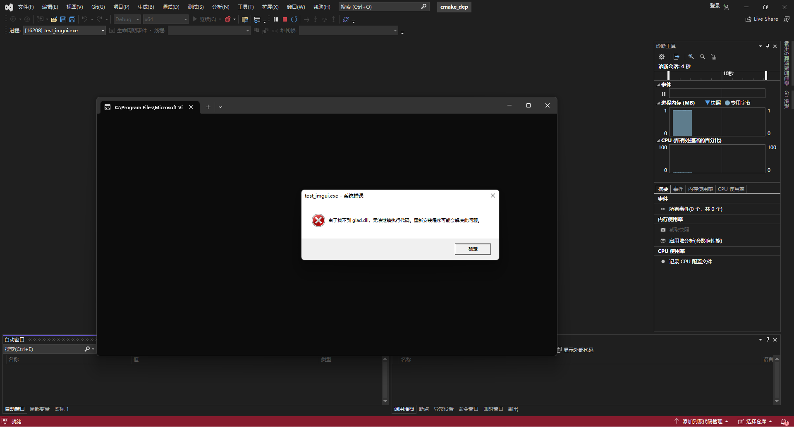

# Git Submodule 管理依赖 

由于 C++ 自身的特殊性，要想实现跨平台代码，只能使用源码分发（也有类似于 Conan 的 C++ 依赖解决方案，但是对于一些冷门的库可能就不支持，还是得自己写）。

最简单的办法就是通过 git 的子模块将其添加到项目中，这种依赖管理方式确保可以访问到源代码，其缺点也很明显，我们在下载库的时候需要通过下载依赖库（也就是子模块），如果子模块较大可能下载起来比较耗时。

前面一个笔记中也提到了，要想删除添加的 git submodule 十分麻烦，没有一个简单的命令可以直接删除，需要手动调整需要文件才能删除干净。


# FetchContent 模块添加依赖

而 FetchContent 是 CMake 提供的一种新式依赖管理方案（在 3.11 版本首次出现），其在 CMake 的配置过程中自动下载依赖项并配置（或者由用户自行配置）。这样可以保持我们的代码库整洁。

<!-- more -->

使用时首先引入这个模块

```cmake
include(FetchContent)
```

主要包含下面三个函数

- `FetchContent_Declare`：用来指定依赖库的下载路径（git 仓库地址或者 URL 链接，其会自动解压缩）

- `FetchContent_MakeAvailable`：自动配置依赖库（相当于调用了 `add_subdirectory`）

- `FetchContent_Populate`：手动配置依赖库，这个函数会帮我们配置好一系列变量，然后由使用者自行管理如何编译）

  其会设置一些常用的变量

  - `<lowercaseName>_SOURCE_DIR`，指定的库源代码地址
  - `<lowercaseName>_BINARY_DIR`，指定库的编译输出地址

  当我们使用的时候就可以通过 `add_subdirectory` 进行添加，也可以手写 `CMakeLists.txt` 来手动添加库

其中有点需要注意的就是 `FetchContent_MakeAvailable` 需要在所有的 `FetchContent_Declare` 声明完成后再写，这样可以确保我们依赖加载完全了，因为一个依赖有可能使用 `FetchContent` 添加另外一个依赖（隐式依赖）

> [FetchContent — CMake 3.27.4 Documentation](https://cmake.org/cmake/help/latest/module/FetchContent.html#fetchcontent)
>
> Projects should aim to declare the details of all dependencies they might use before they call `FetchContent_MakeAvailable()` for any of them. This ensures that if any of the dependencies are also sub-dependencies of one or more of the others, the main project still controls the details that will be used (because it will declare them first before the dependencies get a chance to).


# 实际使用

下面给出一个实际案例：

我们需要添加四个依赖：`fmt`，`glfw`，`imgui`，`glad`

对于前三个，我们都可以使用 `FetchContent` 来添加，由于 `glad` 是使用网站生成的，我们需要手动将其将其添加到源代码库中。

`fmt` 库的添加代码

```cmake
FetchContent_Declare(
    fmt
    GIT_REPOSITORY https://github.com/fmtlib/fmt.git
    GIT_TAG 10.1.0
    GIT_SHALLOW ON
)
FetchContent_MakeAvailable(fmt)
```

这里我们通过 `GIT_REPOSITORY` 指定了待下载库的 git 仓库连接，同时通过 `GIT_TAG` 指定我们需要的版本（也可使用 commit 号），最后的 `GIT_SHALLOW` 表示我们在 `git clone` 时设置 `--depth 1`，这样可以确保我们仅下载需要的部分，而不下载完整的 git 仓库，减少下载时间。

由于 `fmt` 库本身比较简单，且是一个 header-only 的库，我们直接通过 `FetchContent_MakeAvailable` 将其添加到代码中即可，当我们需要使用该库时直接链接即可，例如

```cmake
add_executable(test_fmt main.cpp)
target_link_libraries(test_fmt PRIVATE fmt::fmt)
```


`glfw` 库的添加代码

```cmake
FetchContent_Declare(
    glfw
    GIT_REPOSITORY https://github.com/glfw/glfw
    GIT_TAG 3.3.8
    GIT_SHALLOW ON
)
FetchContent_Populate(glfw)
set(GLFW_BUILD_TESTS OFF)
add_subdirectory(${glfw_SOURCE_DIR})
add_library(glfw::glfw ALIAS glfw)
```

由于 glfw 库包含一堆 tests 和 examples ，我们可能并不想生成这些文件，为此我们可以通过 `FetchContent_Populate` 来手动配置 glfw 的编译。

我们在添加 glfw 编译目标之前通过参数 `GLFW_BUILD_TESTS` 来取消生成 tests，然后将其添加到代码库中，最终由于 glfw 没有提供别名输出（`glfw::glfw`，可以用来防止打错名字，例如我们直接错写成 `glfv` 时，没有这个依赖库 cmake 也不会报错，但是写成 `glfw::glfv` 时没有这个依赖库 cmake 会报错，提示我们找不到这个依赖库），我们手动为其添加一个别名。


`imgui` 库的添加代码

```cmake
FetchContent_Populate(imgui)
add_imgui(
  USE_STD_STRING 
  USE_FREETYPE 
  IMGUI_DIR ${imgui_SOURCE_DIR}
)
```

对于 imgui 而言稍微复杂一点，因为其并没有提供开箱即用的 `CMakeLists.txt` 供我们使用，我们需要手动配置使用哪些文件进行编译，为此我们写了一个小函数 `add_imgui` 来辅助配置，完整代码如下

```cmake
function(add_imgui)
  set(options USE_STD_STRING USE_FREETYPE)
  set(one_value_args IMGUI_DIR)
  set(multi_value_args "")
  cmake_parse_arguments(ARGS "${options}" "${one_value_args}"
                             "${multi_value_args}" ${ARGN} )

  message(STATUS "add imgui (opengl3 + glfw) [ STATIC ] with c++17")

  list(APPEND CMAKE_MESSAGE_INDENT "  ")

  # Using dear imgui via a shared library is not recommended, 
  # because we don't guarantee backward nor forward ABI compatibility 
  # (also function call overhead, as dear imgui is a call-heavy API)

  # we should use imgui as static library
  add_library(imgui STATIC
    ${ARGS_IMGUI_DIR}/imgui_demo.cpp 
    ${ARGS_IMGUI_DIR}/imgui_draw.cpp 
    ${ARGS_IMGUI_DIR}/imgui_tables.cpp 
    ${ARGS_IMGUI_DIR}/imgui_widgets.cpp 
    ${ARGS_IMGUI_DIR}/imgui.cpp 
  )

  add_library(imgui::imgui ALIAS imgui)

  set_property(TARGET imgui PROPERTY CXX_STANDARD 17)
  set_property(TARGET imgui PROPERTY CXX_STANDARD_REQUIRED ON)

  target_include_directories(imgui PUBLIC 
    ${ARGS_IMGUI_DIR}
  )
  # backends
  target_sources(imgui PUBLIC     
    ${ARGS_IMGUI_DIR}/backends/imgui_impl_opengl3.cpp
    ${ARGS_IMGUI_DIR}/backends/imgui_impl_glfw.cpp
  )

  target_include_directories(imgui PUBLIC 
    ${ARGS_IMGUI_DIR}/backends
  )

  target_link_libraries(imgui PUBLIC 
    glfw::glfw
  )
  
  # extensions
  if ( ARGS_USE_STD_STRING )
    message(STATUS "enable std::string support for imgui::InputText")
    target_sources(imgui PUBLIC 
      ${ARGS_IMGUI_DIR}/misc/cpp/imgui_stdlib.cpp
    )
    target_include_directories(imgui PUBLIC 
      ${ARGS_IMGUI_DIR}/misc/cpp
    )
  endif()
  
  if ( ARGS_USE_FREETYPE )
    find_package(Freetype QUIET)
    if(Freetype_FOUND)
      message(STATUS "enable freetype for imgui")
      target_sources(imgui PRIVATE 
        ${ARGS_IMGUI_DIR}/misc/freetype/imgui_freetype.cpp
      )
      target_include_directories(imgui PRIVATE 
        ${ARGS_IMGUI_DIR}/misc/freetype
      )
      target_link_libraries(imgui PRIVATE 
        Freetype::Freetype
      )
      target_compile_definitions(imgui PRIVATE 
        IMGUI_ENABLE_FREETYPE
      )
    else()
    message(STATUS "disable freetype for imgui")
    endif()
  endif()
  
  list(POP_BACK CMAKE_MESSAGE_INDENT)

endfunction(add_imgui)
```

函数 `add_imgui` 通过提供 imgui 源代码目录以及一些配置项来简化配置流程，其默认使用 glfw + opengl 作为渲染后端。


然后对于 glad 库（用来加载 OpenGL 函数），其配置代码也十分简单

```cmake
# 配置为动态链接库
add_library(glad SHARED src/gl.c)
target_compile_definitions(glad PRIVATE -DGLAD_API_CALL_EXPORT_BUILD)
target_compile_definitions(glad PUBLIC -DGLAD_API_CALL_EXPORT)
target_include_directories(glad PUBLIC include)
add_library(glad::glad ALIAS glad)
```


# ExternalProject 添加依赖

这个也是 CMake 中下载依赖的一种方式，其早于 `FetchContent` 出现，可以提供和 `FetchContent` 类似的功能，主要通过一个巨大的函数进行依赖配置

```cmake
ExternalProject_Add
```

我们可以在其中指定编译的命令等，也可以使用 `ExternalProject_Add_Step` 来手动管理依赖的编译步骤，不过这种方式个人感觉没有 `FetchContent_Declare` 和 `FetchContent_Populate` 使用来的方便，就不过多介绍了，网上也有很多相关的教程。

> [ExternalProject — CMake 3.27.4 Documentation](https://cmake.org/cmake/help/latest/module/ExternalProject.html)


# 杂项

**在 Windows 下使用动态链接库时可能会因为找不到 dll 库的位置而无法启动应用**，我们需要手动将动态链接库（例如 `glad.dll` ）拷贝到可执行环境目录下，才可以正常运行，但是每次手动拷贝太麻烦了，cmake 也可以自动帮我们完成这一任务。

（图片太大可能看不清字，写的是：**由于找不到 glad.dll，无法继续执行代码，重新安装程序可能会解决此问题。**）

*比较坑的点在于 Windows 下使用 VSCode 完全看不到这个错误提示，而在 Visual Studio 中就可以看到，恶心坏了*



解决方案有很多：

- 强制所有编译输出到同一个目录下，这样就可以确保一定能找到了（个人感觉比较丑陋，只能算一个 workaround）
- 找到该应用所有的依赖库，将其拷贝到可执行文件输出路径下（**关键在于如何找到可执行文件的所有依赖库呢？**）

这个问题肯定不止我们一个人碰到过，cmake 给我们提供好了这个变量

```cmake
# %target-name% 对应的所有运行时依赖
$<TARGET_RUNTIME_DLLS:%target-name%>
```

以及 

```cmake
# %target-name% 的可执行文件输出路径
$<TARGET_FILE_DIR:%target-name%>
```

这样我们可以通过 `add_custom_command` 来进行自动拷贝了，完整代码如下

```cmake
add_custom_command(TARGET test_imgui POST_BUILD
  COMMAND ${CMAKE_COMMAND} -E copy -t 
  $<TARGET_FILE_DIR:test_imgui> 
  $<TARGET_RUNTIME_DLLS:test_imgui>
  COMMAND_EXPAND_LISTS
)
```

这一段代码来源于 cmake 官方文档（看来是需要这个功能的人太多了）

> [genex:TARGET_RUNTIME_DLLS](https://cmake.org/cmake/help/latest/manual/cmake-generator-expressions.7.html#genex:TARGET_RUNTIME_DLLS)

当然，这个功能要求 cmake 的版本比较新，需要在 cmake 版本高于 3.21，记得更新 `cmake_minimum_required`  

```cmake
cmake_minimum_required(VERSION 3.21)
```

