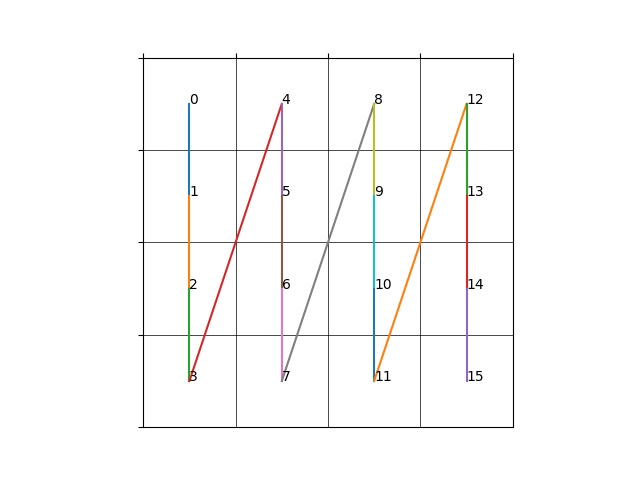
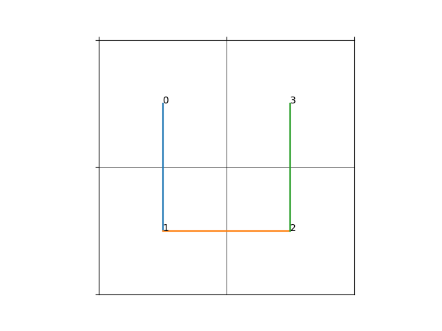
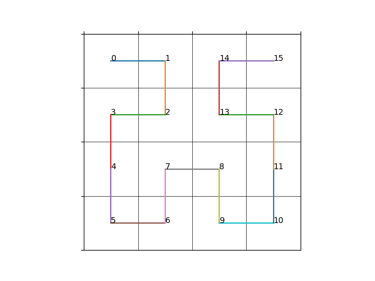
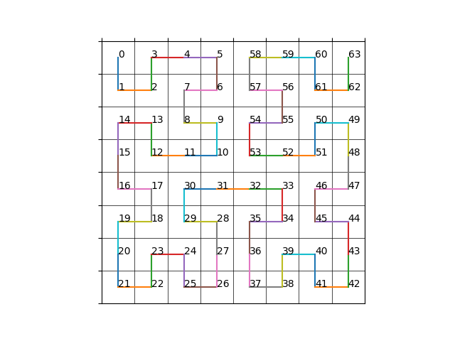

对于一个$2^n\times2^n$的二维网格由于地址空间都是一维的（例如`0x0000`到`0xffff`），其实际在计算机中会将多维压缩成一维，可以形式化表示为

$$
\begin{align}
M_{\text{2D}}&:(x,y)\to v \\
M_{\text{2D}}^{-1}&:v\to (x,y) \\
\end{align}
$$

对于$M_{\text{2D}}(x,y)$也可记作$\text{encode}(x,y)$，$M^{-1}_{\text{2D}}(v)$为$decode(v)$

# Linear Curve

一种最为简单的存储方式就是逐行地或逐列地存储二维数据，对于一个指定大小的二维方块（$w\times h$），从0开始的坐标$(x,y)$ 对应的一维地址为（一行包含$w$个元素）
$$
v = x \times w + y
$$
同理，将一维坐标$(v)$转换二维方块坐标也很简单，只需要对行/列进行整除和取余操作即可
$$
\begin{align}
x &= \lfloor v / w \rfloor \\
y &= v - x \times w
\end{align}
$$
上面这种方式在一般情况下足够使用，但是对于纹理/体素等数据的读取时，通常会利用到二维/三维坐标的局部性（即当我们访问坐标$(x,y)$时，我们有很大概率将访问该坐标周围的坐标），而使用线性存储方式则会丢失这种局部性。

例如对于一个$16 \times 16$的方块中坐标$(4,4)$和坐标$(6,6)$，其二维曼哈顿距离为
$$
(6-4)+(6-4) = 4
$$
而经过线性存储映射后距离为
$$
(6*16+6)-(4*16+4)=38
$$
，可以观察到经过一维映射后两个数据距离相差较远。

下图展示了 linear curve 的示意图

直接说距离似乎难以理解这种差距，考虑一个实际读取场景，假设CPU的cache一次可以存放16个数据，当我们读取纹理中$(4,4)$位置的数据后，下一个准备读取其周围$(6,6)$的数据，由于$(6,6)$的数据在内存中地址距离$(4,4)$数据地址较远，无法一次加载到cache中，即出现cache miss，这样我们就只能从内存中重新加载数据，无法利用高速缓存，影响数据读取性能。

针对这个问题，可以使用Hilbert曲线或者Morton曲线这类特殊的映射方式进行坐标映射

<!-- more -->

# Hilbert Curve 

每一个$2^n \times 2^n$的方块，都可以对应一个$n$阶的曲线，下图给出了1阶Hilbert Curve曲线的示意图

对于$2\times2$的方块（x轴向左，y轴向下），曲线是一个U字形，二维坐标顺序为：
$$
(0,0) \to (0,1) \to (1,1) \to (1,0)
$$
对应的一维坐标顺序（二进制形式）为：
$$
00_2\to01_2\to10_2\to11_2
$$

下面给出2阶Hilbert Curve曲线示意图

对于$4\times4$的方块，将其转换为4个$2\times 2$的小方块，然后观察每一个小方块的形状和朝向，会发现这几个小方块的形状完全一致（都是U型），只是朝向不同。块与块之间会额外添加直线连接，同样可以写出二维坐标和一维坐标的映射：

二维坐标
$$
\begin{align}
(0,0)\to(1,0)\to(1,1)\to(0,1)\\
\to(0,2)\to(0,3)\to(1,3)\to(1,2)\\
\to(2,2)\to(2,3)\to(3,3)\to(3,2)\\
\to(3,1)\to(2,1)\to(2,0)\to(3,0)
\end{align}
$$
一维坐标
$$
\begin{align}
0000_2\to0001_2\to0010_2\to0011_2\\
\to0100_2\to0101_2\to0110_2\to0111_2\\
\to1000_2\to1001_2\to1010_2\to1011_2\\
\to1100_2\to1101_2\to1110_2\to1111_2\\
\end{align}
$$
从二维坐标中可以发现，每一个$2 \times 2$子方块都是一组，可以写出四个方块的中心：
$$
(0,0) \to (0,2) \to (2,2) \to (2,0)
$$
此处可以观察到，**四个子方块的中心实际上就是一阶Hilbert曲线的放大两倍的结果**

然后将每个子方块的坐标减去方块中心，可以得到如下四组坐标：
$$
\begin{align}
(0,0)\to(1,0)\to(1,1)\to(0,1)\\
(0,0)\to(0,1)\to(1,1)\to(1,0)\\
(0,0)\to(0,1)\to(1,1)\to(1,0)\\
(1,1)\to(0,1)\to(0,0)\to(1,0)
\end{align}
$$
其中第1组和第4组的分别是一阶Hilbert曲线沿$y=x$和$y=1-x$直线翻转的结果，为便于表示，使用$F$和$FR$表示（$FR$表示沿$y=x$翻转后再旋转$180\degree$，由此可得二阶Hilbert曲线构造过程：

1. 

$$

$$

下面给出3阶Hilbert Curve曲线示意图

根据1、2和3阶的Hilbert Curve示意图，我们已经可以大概看出规律，对于每一个$2^n\times 2^n$的方块，其下一层（即4个$2^{n-1}{\times}2^{n-1}$块）也是Hilbert Curve，其存在自相似性。

# Morton Z Curve

# 后记

对于三维或者更高维度的数据存储，都可以采用Hilbert或者Morton方式进行存储，映射方式同二维映射类似（稍微复杂一点），这样在访问中存在空间局部性的应用较为友好，可以提高数据读写的性能。
