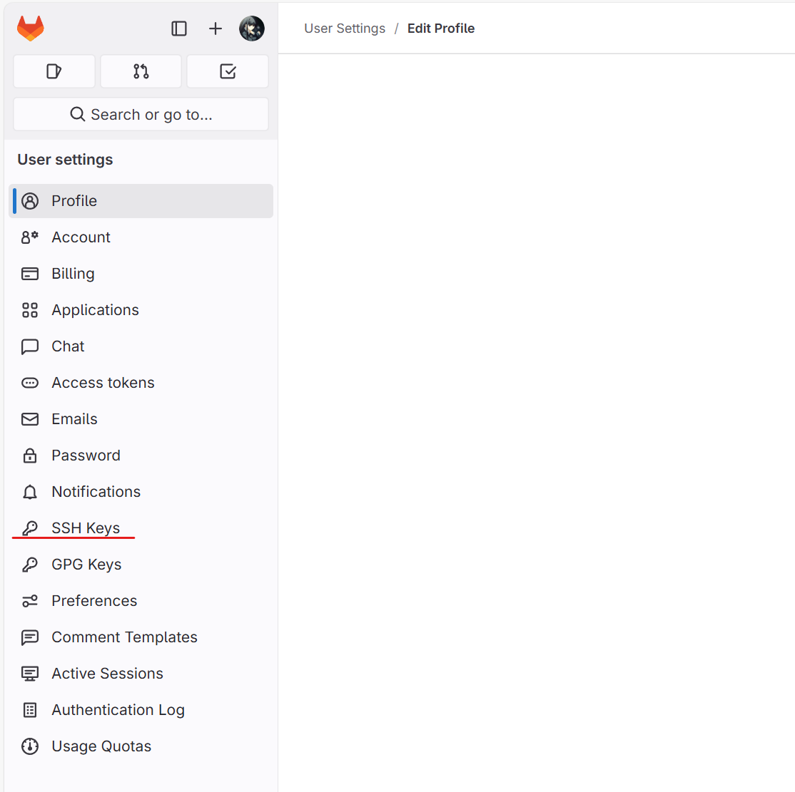
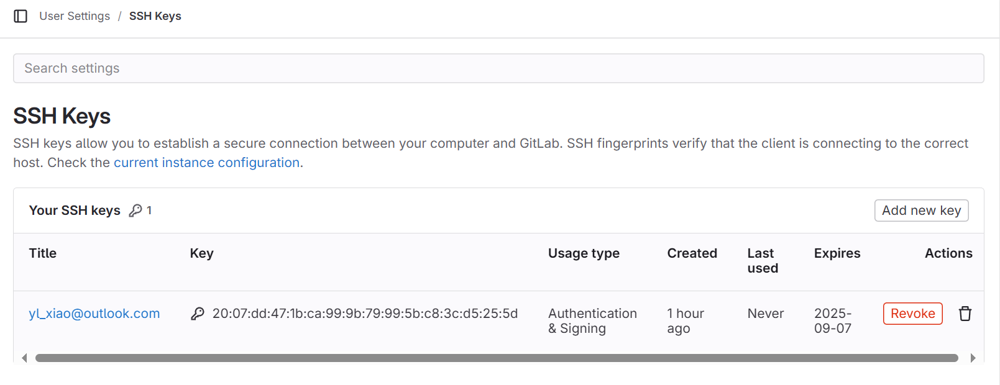
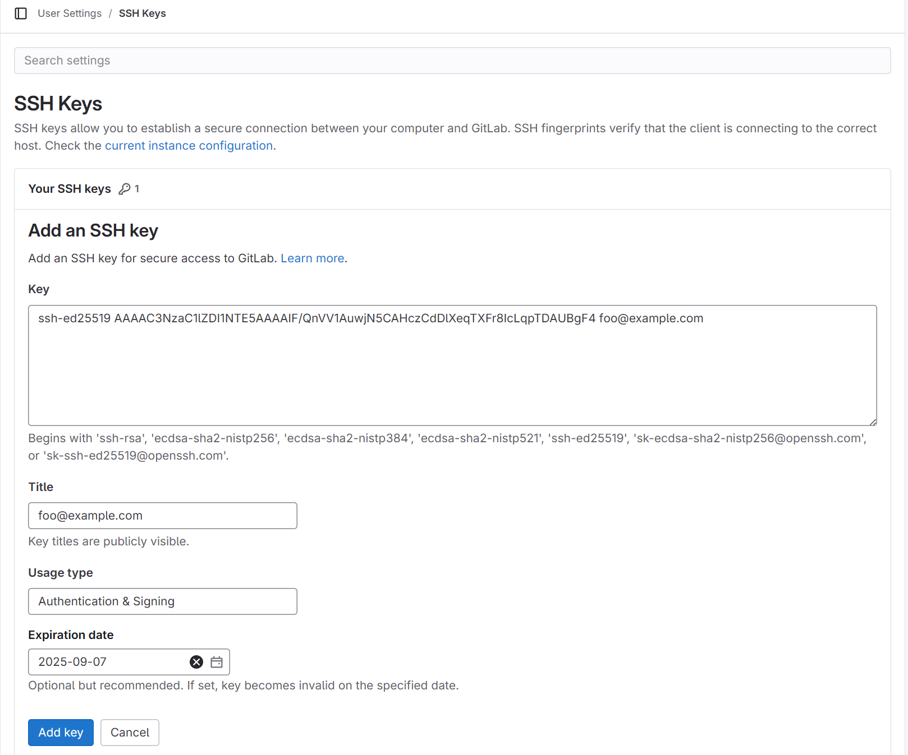
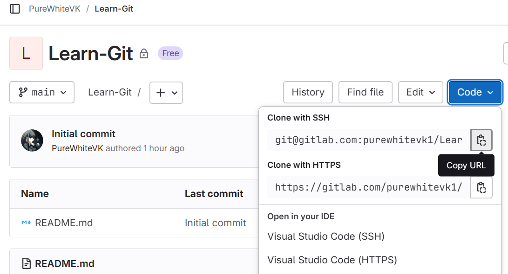

# git clone

```sh
git clone <repo-url>
```

示例命令如下

```sh
git clone https://github.com/boostorg/boost.git
```

一些常用的参数（全部参数选项可以通过 `git clone --help`  查看）

- `--recursive` 或 `--recurse-submodules`（在较新版本的 git 中使用，命令的语义更加清晰）：当要拉取的仓库中包含 submodule 时，是默认不会拉取子仓库的，而指定这个参数即可拉取所有的子仓库。

  如果我们在下载的时候忘记指定 `--recursive`，也可以通过下面命令重新拉取子仓库

  ```sh
  git submodule update --init --recursive
  ```

- `--depth`：当我们只想下载指定更新次数的分支（这样可以减少下载的大小，在我们只需要最新的提交记录时很有用，当然也可以直接下载 zip 或 tar.gz 等压缩文件来解决。

- `-b` 或者 `--branch`：指定要拉取的分支名称，例如下载 boost-1.86.0 （这个实际上是一个 tag，但也可以通过这种方式下载）。

  ```sh
  git clone https://github.com/boostorg/boost.git --branch boost-1.86.0
  ```

<!-- more -->


## 添加 SSH 密钥

1. 创建 ssh 密钥对，通过 `ssh-keygen` 创建即可

   ```sh
   ssh-keygen -t <加密方式> -C <密钥注释>
   ```

   示例如下

   ```txt
   PS D:\Code\Git> ssh-keygen -t ed25519 -C "foo@example.com"
   Generating public/private ed25519 key pair.
   Enter file in which to save the key (C:\Users\xiao/.ssh/id_ed25519):
   Enter passphrase (empty for no passphrase):
   Enter same passphrase again:
   Your identification has been saved in C:\Users\xiao/.ssh/id_ed25519.
   Your public key has been saved in C:\Users\xiao/.ssh/id_ed25519.pub.
   The key fingerprint is:
   SHA256:rJ2ufXZ93fAPNsdqBrdUsMSABhse7zBpo0ewRa3nn+s foo@example.com
   The key's randomart image is:
   +--[ED25519 256]--+
   |      ..*o ..o   |
   |       = *+   +  |
   |      . Xo.  . o |
   |       =.=.   . .|
   |      . So.    . |
   |       + .. . +. |
   |      . o  . *++=|
   |       o  o +.===|
   |      ..oo oE+..o|
   +----[SHA256]-----+
   ```

   会提示我们创建的密钥对已经放置在了 `C:\Users\xiao\.ssh` 路径下

2. 更新 ssh 的配置，修改 `~/.ssh/config`，添加如下内容

   ```c++
   Host gitlab.com
     HostName gitlab.com
     PreferredAuthentications publickey
     IdentityFile ~/.ssh/gitlab.private-key.pem
   ```

3. 在 gitlab 或者 github 上添加 SSH 密钥

   进入用户设置，点击 `SSH Keys`

   

   点击 Add new key

   

   将刚才创建的密钥对中公钥部分添加到此处，然后点击 Add 即可添加 SSH 密钥

   

4. 测试连接，在命令行中输入如下命令

   ```sh
   PS D:\Code\Git> ssh git@gitlab.com
   PTY allocation request failed on channel 0
   Welcome to GitLab, @PureWhiteVK!
   Connection to gitlab.com closed.
   ```

   如果有类似输出，则说明 SSH 密钥添加成功

5. 通过 SSH 方式下载源码

   

   复制 Clone with SSH 中给出命令，在命令行中执行即可拉取源码


# git branch

## 创建

直接使用 `git checkout` 创建分支，示例如下

```sh 
git checkout -b bugfix/my-bugfix-branch
```

（这个实际上等价于下面的两条命令）

```sh
git branch -f bugfix/my-bugfix-branch
git checkout bugfix/my-bugfix-branch
```

因此使用 `git checkout -b <branch>` 是最常用也最典型的操作方式


## 删除

通过下面命令删除分支

```sh
git branch -D <branch-name>
```

如果要删除远端分支（不推荐），需要通过 `git push` 命令完成，示例如下

```sh
git push origin --delete <branch-name>
```


## 重命名

通过下面命令重命名分支（实际上是移动或者拷贝，这两种方式都可以实现重命名效果）

```sh
git branch -m <old-branch> <new-branch>
```

此处的 `-m` 表示 move，和 Linux 上 `move` 命令一致，就是移动分支到新的标识符下。

也可以使用 `-c` ，其表示 copy，和 Linux 上 `cp` 命令一致，其好处就是不会丢弃原有的分支


# 合并

在 git 中有两种方式可以实现合并，merge 和 rebase，下面简单描述下二者区别：

- merge：**创建一条新的 commit**，将分支1的改动和分支2的改动合并，记录在此 commit 中

  优点是能完整的记录所有的改动历史

  缺点是主干的历史并不是完全线性的，在版本回退时不太方便（通过 github 的 PR 或者 gitlab 的 MR 都可以确保主干线性历史）

- rebase：将分支1中的相对于分支2不同的 commit 在 分支2 上重新提交一遍，**不会创建新的 commit**，但是分支1中改动部分的 commit 的哈希值会发生改变（因为相当于在分支2上重新做了一遍）

  优点是能保证改动历史完全线性

  缺点是记录的历史实际上是改动过的（因为哈希值发生变化）

对于这一部分的介绍推荐使用 [Learn Git Branching](https://learngitbranching.js.org/?locale=zh_CN) 网站通过图形化方式加深对 `git merge` 和 `git rebase` 的理解。


# 拉取

## git fetch

通过 `git clone` 下载到本地的分支，实际上`git` 会帮我们自动创建一个 `origin/xxx` 分支（可以通过 `git branch -a` 查看所有的分支），而 `git fetch` 做的就是将远端的更新同步到本地的 `origin/xxx` 分支中，如下所示

```c++ 
PS D:\Code\Git\Learn-Git> git branch -a
* main
  remotes/origin/HEAD -> origin/main
  remotes/origin/main
```

## git pull

`pull` 想对于 `fetch` 的区别就是其默认会将远端分支 merge 到本地分支（如果远端分支和本地分支存在冲突的话），如果没有的话就直接 fast-forward 即可

## 本地强行同步远端分支

当远端分支进行过 rebase 操作后，可能会导致本地分支和远端分支不一致，如果直接使用 `git pull` 会将远端的操作和本地操作都保留（即出现了两次历史），我们可能想避免这种行为，可以通过以下操作进行同步

```sh
git fetch
git reset --soft origin/<target-branch-name>
```

通过 reset 命令本地分支强行重置到指定的分支上，这里我们指定的是 origin 的分支（即远端分支），并通过 `--soft` 确保本地尚未提交的改动还能继续保留


# git push

这个命令没什么好说的，就一条

```sh
git push
```

如果本地创建了一个分支，想要将该分支也提交到远端的话，直接 `git push` 会出错，但是 git 也会给出解决方案

```sh
PS D:\Code\Git\Learn-Git> git push
fatal: The current branch new-branch has no upstream branch.
To push the current branch and set the remote as upstream, use

    git push --set-upstream origin new-branch

To have this happen automatically for branches without a tracking
upstream, see 'push.autoSetupRemote' in 'git help config'.
```

我们只需要执行上面提到的命令即可

```sh
git push --set-upstream origin new-branch
```

当然，也可以通过改变 push 的默认行为来自动创建，不过这个设置就看个人了

## 强行推送远端分支

当远端分支和本地分支有区别的时候（例如本地进行了 rebase 或者 reset 操作，导致 git 的记录出现问题时），我们可能需要强制将本地分支覆盖掉远端分支，就可以通过下面命令进行

```sh
git push -f
```

一般这个命令仅在个人的分支使用（例如 `bugfix/xxx`或`feature/xxx`）


# git stash

当我们本地分支有改动尚未提交（未通过 git add 和 git commit 时）但是需要切换分支时，git 会提示有改动未暂存，此时我们可以通过 `git stash` 命令暂存，其就使用起来就相当于一个栈，

1. 入栈操作：就是将当前所有的改动暂存起来

   ```sh
   git stash
   ```

2. 出栈操作：就是将当前暂存的改动释放出来，应用到当前分支中

   ```sh
   git stash pop
   ```

   

# 说明

上面介绍了一些常用的 git 命令，如果碰到其他的就直接使用 `git <command> --help` 查看相关文档，或者直接百度即可。

