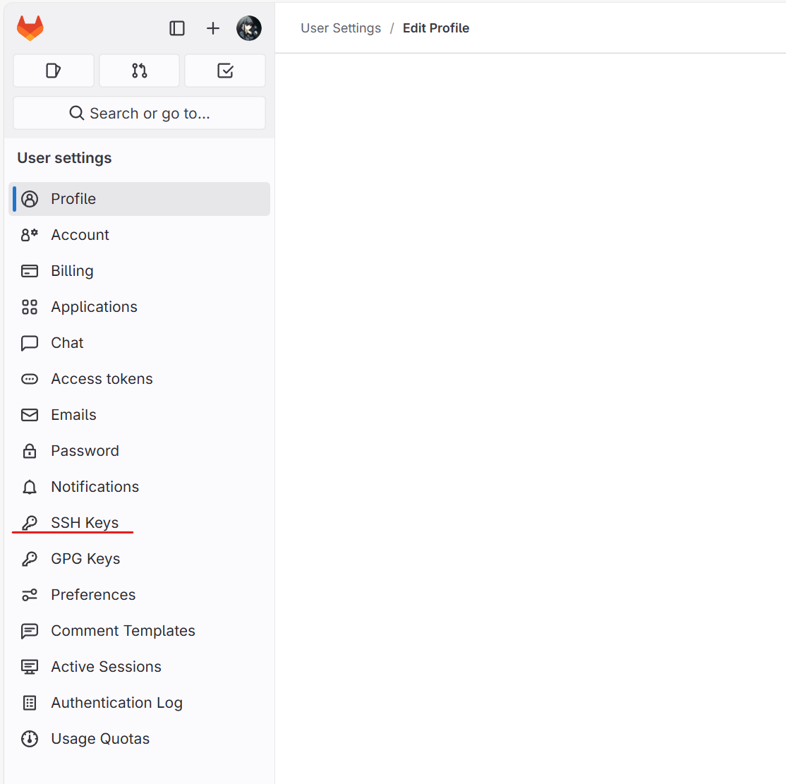
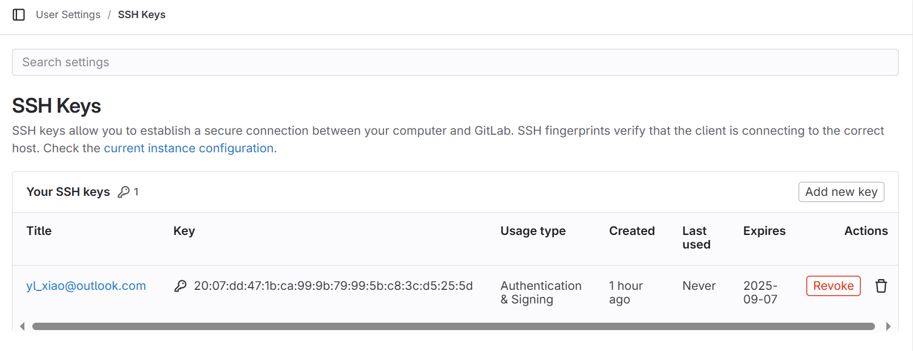
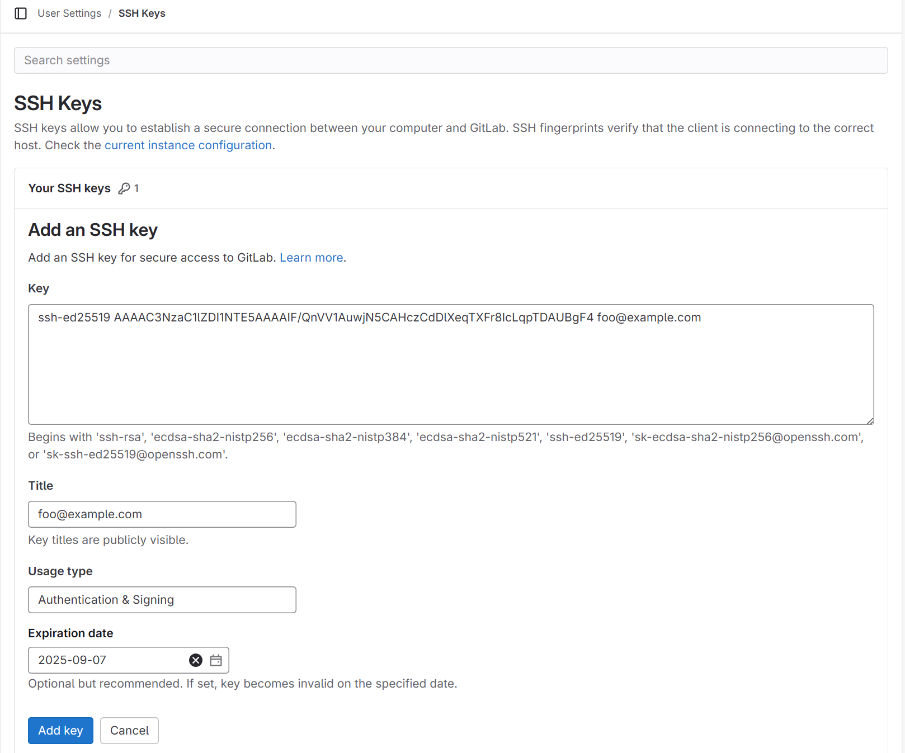
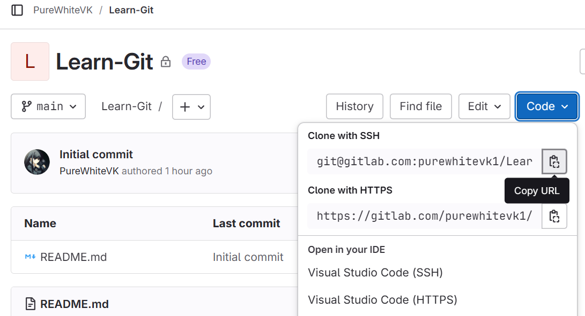

# git clone

```sh
git clone <repo-url>
```

示例命令如下

```sh
git clone https://github.com/boostorg/boost.git
```

一些常用的参数（全部参数选项可以通过 `git clone --help`  查看）

- `--recursive` 或 `--recurse-submodules`（在较新版本的 git 中使用，命令语义更加清晰）：当要拉取的仓库中包含 submodule 时，默认不会拉取子仓库，而指定这个参数即可拉取所有的子仓库。

  如果我们在下载的时候忘记指定 `--recursive`，也可以通过下面命令重新拉取子仓库

  ```sh
  git submodule update --init --recursive
  ```

- `--depth`：当我们只想下载指定数量的提交历史时，这个参数可以减少下载体积；如果只需要源码，也可以直接下载 zip 或 tar.gz 等压缩文件。

- `-b` 或者 `--branch`：指定要拉取的分支名称，例如下载 boost-1.86.0 （这个实际上是一个 tag，但也可以通过这种方式下载）。

  ```sh
  git clone https://github.com/boostorg/boost.git --branch boost-1.86.0
  ```

<!-- more -->

## 修改 refspec

使用 shallow clone 时，会出现无法下载远程其他分支的情况，此时需要重设 refspec，命令如下：

```sh
# 1) 查看当前 fetch 配置
git config --get-all remote.origin.fetch

# 2) 清理旧的 fetch 规则（有些 shallow clone 只会保留单分支规则）
git config --unset-all remote.origin.fetch

# 3) 重新设置为“拉取所有远程分支”
git config --add remote.origin.fetch "+refs/heads/*:refs/remotes/origin/*"

# 4) 重新拉取远程引用
git fetch origin
```

执行完成后，可以通过下面命令确认远程分支是否已经可见：

```sh
git branch -r
```

如果在克隆时就希望浅克隆但拉取所有分支，可以直接使用 `--no-single-branch` 选项，具体命令示例如下 ：

```sh
git clone --depth 1 --no-single-branch <repo-url>
```

## 重新拉取完整历史
如果仓库本身是浅克隆，想继续查看更完整历史，可以再执行：

```sh
# 拉取完整历史
git fetch --unshallow

# 或者仅补充到指定深度
git fetch --depth=1000
```

## 添加 SSH 密钥

1. 创建 ssh 密钥对，通过 `ssh-keygen` 创建即可

   ```sh
   ssh-keygen -t <加密方式> -C <密钥注释>
   ```

   示例如下

   ```txt
   PS D:\Code\Git> ssh-keygen -t ed25519 -C "foo@example.com"
   Generating public/private ed25519 key pair.
   Enter file in which to save the key (C:\Users\xiao/.ssh/id_ed25519):
   Enter passphrase (empty for no passphrase):
   Enter same passphrase again:
   Your identification has been saved in C:\Users\xiao/.ssh/id_ed25519.
   Your public key has been saved in C:\Users\xiao/.ssh/id_ed25519.pub.
   The key fingerprint is:
   SHA256:rJ2ufXZ93fAPNsdqBrdUsMSABhse7zBpo0ewRa3nn+s foo@example.com
   The key's randomart image is:
   +--[ED25519 256]--+
   |      ..*o ..o   |
   |       = *+   +  |
   |      . Xo.  . o |
   |       =.=.   . .|
   |      . So.    . |
   |       + .. . +. |
   |      . o  . *++=|
   |       o  o +.===|
   |      ..oo oE+..o|
   +----[SHA256]-----+
   ```

   会提示我们创建的密钥对已经放置在了 `C:\Users\xiao\.ssh` 路径下

2. 更新 ssh 的配置，修改 `~/.ssh/config`，添加如下内容

   ```c++
   Host gitlab.com
     HostName gitlab.com
     PreferredAuthentications publickey
     IdentityFile ~/.ssh/gitlab.private-key.pem
   ```

3. 在 gitlab 或者 github 上添加 SSH 密钥

   进入用户设置，点击 `SSH Keys`

   

   点击 Add new key

   

   将刚才创建的密钥对中公钥部分添加到此处，然后点击 Add 即可添加 SSH 密钥

   

4. 测试连接，在命令行中输入如下命令

   ```sh
   PS D:\Code\Git> ssh git@gitlab.com
   PTY allocation request failed on channel 0
   Welcome to GitLab, @PureWhiteVK!
   Connection to gitlab.com closed.
   ```

   如果有类似输出，则说明 SSH 密钥添加成功

5. 通过 SSH 方式下载源码

   

   复制 Clone with SSH 中给出命令，在命令行中执行即可拉取源码


# git branch

## 创建

直接使用 `git checkout` 创建分支，示例如下

```sh 
git checkout -b bugfix/my-bugfix-branch
```

（这个实际上等价于下面的两条命令）

```sh
git branch -f bugfix/my-bugfix-branch
git checkout bugfix/my-bugfix-branch
```

因此使用 `git checkout -b <branch>` 是最常用也最典型的操作方式


## 删除

通过下面命令删除分支

```sh
git branch -D <branch-name>
```

如果要删除远端分支（不推荐），需要通过 `git push` 命令完成，示例如下

```sh
git push origin --delete <branch-name>
```


## 重命名

通过下面命令重命名分支（实际上是移动或者拷贝，这两种方式都可以实现重命名效果）

```sh
git branch -m <old-branch> <new-branch>
```

此处的 `-m` 表示 move，和 Linux 上 `mv` 命令一致，就是移动分支到新的标识符下。

也可以使用 `-c` ，其表示 copy，和 Linux 上 `cp` 命令一致，其好处就是不会丢弃原有的分支


# 合并

在 git 中有两种方式可以实现合并，merge 和 rebase，下面简单描述下二者区别：

- merge：**创建一条新的 commit**，将分支1的改动和分支2的改动合并，记录在此 commit 中

  优点是能完整的记录所有的改动历史

  缺点是主干的历史并不是完全线性的，在版本回退时不太方便（通过 github 的 PR 或者 gitlab 的 MR 都可以确保主干线性历史）

- rebase：将分支1中相对于分支2不同的 commit 在分支2上重新提交一遍，**不会创建新的 commit**，但是分支1中改动部分的 commit 哈希值会发生改变（因为相当于在分支2上重新做了一遍）

  优点是能保证改动历史完全线性

  缺点是记录的历史实际上是改动过的（因为哈希值发生变化）

对于这一部分的介绍推荐使用 [Learn Git Branching](https://learngitbranching.js.org/?locale=zh_CN) 网站通过图形化方式加深对 `git merge` 和 `git rebase` 的理解。


# 拉取

## git fetch

通过 `git clone` 下载到本地后，实际上 `git` 会帮我们自动创建一个 `origin/xxx` 分支（可以通过 `git branch -a` 查看所有分支），而 `git fetch` 做的就是将远端更新同步到本地的 `origin/xxx` 分支中，如下所示

```c++ 
PS D:\Code\Git\Learn-Git> git branch -a
* main
  remotes/origin/HEAD -> origin/main
  remotes/origin/main
```

## git pull

`pull` 相对于 `fetch` 的区别是其默认会将远端分支 merge 到本地分支（如果远端分支和本地分支存在冲突的话），如果没有冲突就直接 fast-forward 即可

## 本地强行同步远端分支

当远端分支进行过 rebase 操作后，可能会导致本地分支和远端分支不一致，如果直接使用 `git pull` 会将远端的操作和本地操作都保留（即出现了两次历史），我们可能想避免这种行为，可以通过以下操作进行同步

```sh
git fetch
git reset --soft origin/<target-branch-name>
```

通过 reset 命令本地分支强行重置到指定的分支上，这里我们指定的是 origin 的分支（即远端分支），并通过 `--soft` 确保本地尚未提交的改动还能继续保留


# git push

这个命令没什么好说的，就一条

```sh
git push
```

如果本地创建了一个分支，想要将该分支也提交到远端的话，直接 `git push` 会出错，但是 git 也会给出解决方案

```sh
PS D:\Code\Git\Learn-Git> git push
fatal: The current branch new-branch has no upstream branch.
To push the current branch and set the remote as upstream, use

    git push --set-upstream origin new-branch

To have this happen automatically for branches without a tracking
upstream, see 'push.autoSetupRemote' in 'git help config'.
```

我们只需要执行上面提到的命令即可

```sh
git push --set-upstream origin new-branch
```

当然，也可以通过改变 push 的默认行为来自动创建，不过这个设置就看个人了

## 强行推送远端分支

当远端分支和本地分支有区别的时候（例如本地进行了 rebase 或者 reset 操作，导致 git 的记录出现问题时），我们可能需要强制将本地分支覆盖掉远端分支，就可以通过下面命令进行

```sh
git push -f
```

一般这个命令仅在个人的分支使用（例如 `bugfix/xxx`或`feature/xxx`）

## 删除远端分支

使用 `--delete` 可以删除远端分支，示例如下：

```sh
git push --delete origin old-branch
```


# git stash

当我们本地分支有改动尚未提交（未通过 git add 和 git commit）但需要切换分支时，git 会提示有改动未暂存，此时可以通过 `git stash` 命令暂存，其使用起来相当于一个栈。

1. 入栈操作：就是将当前所有的改动暂存起来

   ```sh
   git stash
   ```

2. 出栈操作：就是将当前暂存的改动释放出来，应用到当前分支中

   ```sh
   git stash pop
   ```

   也可以使用 `git stash apply`，这个相当于查看栈顶元素内容，但是不出栈。

   

# fork

fork 是 github 或 gitlab 等代码托管平台提供的一个功能，可以在托管平台上复制一份现有仓库，到自己账户下。

复制之后，我们会有两个基本操作，**同步** 和 **代码变更**。

直接讲有点干巴巴的，下面给一个实际案例来解释：

conan 包管理器中每一个包都有对应的构建脚本，这些构建脚本是开源的，维护在 [conan-center-index](https://github.com/conan-io/conan-center-index) 这个仓库里，但是这些构建脚本有时候更新不及时，在一些平台上可能出现编译问题，为了解决编译问题，就需要 fork conan-center-index 这个仓库，提交自己的改动。同时当 conan-center-index 出现其他更新的时候，我们 fork 的仓库也想同步这个改动。

## 同步远程仓库

还是以 conan-center-index 为例，将原始仓库记为 A 仓库，fork 之后的仓库记为 B 仓库。当我们拉取 B 仓库时，其 remote 链接对应的就是 B 仓库的 GitHub 远程链接，例如 https://github.com/conan-io/conan-center-index，此时我们想要拉取 A 仓库的代码更新，可以手动设置新的 remote，并手动拉取。

具体操作如下：

A. 添加 A 仓库的 remote 链接，并将其命名为 repoA：

```bash
git remote add repoA <remote-url-of-A>
```

B. 拉取 A 仓库的代码改动，使用 repoA 指定我们需要从 repoA 这个 remote 拉取代码：

```bash
git fetch repoA
```

C. 当我们需要保持代码一直是基于最新的 repoA 主干（master）时，可以使用 rebase 操作，将所做的改动应用到 repoA 上：

```bash
git rebase repoA/master
```

其中 `repoA/master` 就代表 repoA 的 master 分支上。

如果出现冲突就手动处理一下

D. 最后，当我们需要提交到自己的远程仓库 repoB 时，需要使用 `-f` 进行强制推送，因为我们执行了 rebase 操作：

```bash
git push repoB HEAD:master -f
```

其中 `HEAD:master` 表示将当前分支提交到 `repoB/master` 分支上。

# LFS

Git LFS（Large File Storage）用于管理大文件。仓库里保存的是**指针文件**（很小的文本），真实大文件存储在 LFS 对象存储中。

## 初始化 LFS

先安装 Git LFS，然后在本机初始化：

```sh
git lfs install
```

检查是否可用：

```sh
git lfs version
```

## 追踪大文件

比如我们希望把 `.zip`、`.mp4` 这类文件交给 LFS：

```sh
git lfs track "*.zip"
git lfs track "*.mp4"
```

执行后会更新 `.gitattributes`，需要把它一起提交：

```sh
git add .gitattributes
git add <large-file>
git commit -m "track large files with git lfs"
```

可以通过下面命令查看当前被 LFS 跟踪的文件：

```sh
git lfs ls-files
```

## 将大文件迁移到 LFS

如果某些大文件以前已经作为普通 Git 对象提交过，可以用 `git lfs migrate import` 改写历史，把它们转成 LFS 指针：

```sh
git lfs migrate import --include="*.zip,*.mp4"
```

也可以只处理某个分支：

```sh
git lfs migrate import --include="*.zip,*.mp4" --include-ref="refs/heads/main"
```

> [!CAUTION]
> 这个操作会改写 commit 历史，执行前建议先备份或在新分支验证。改写后通常需要强制推送：

```sh
git push --force-with-lease
```

## 把“LFS指针”还原为真实文件

正常情况下，`git clone` / `git pull` 会自动下载 LFS 文件。

如果你看到文件内容是这种文本（`version https://git-lfs.github.com/spec/v1`），说明当前工作区还是指针文件，可以执行：

```sh
git lfs pull
```

如果之前跳过了 LFS 文件下载（例如设置过 `GIT_LFS_SKIP_SMUDGE=1`），可以显式执行：

```sh
git lfs fetch
git lfs checkout
```

其中：

- `git lfs fetch`：下载 LFS 对象到本地缓存
- `git lfs checkout`：把工作区中的指针替换成真实文件

## 将 LFS 文件改回普通 Git 文件

如果后续不想让某类文件继续走 LFS：

1. 取消跟踪规则

   ```sh
   git lfs untrack "*.zip"
   ```

2. 重新加入文件并提交

   ```sh
   git add .gitattributes
   git add <file>
   git commit -m "stop tracking zip with lfs"
   ```

如果需要把**历史里**的 LFS 指针也导回普通 Git 对象，可使用：

```sh
git lfs migrate export --include="*.zip"
```

同样会改写历史，推送时通常需要 `--force-with-lease`。

## 本地拉取时不下载 LFS 文件

有时仓库已经启用 LFS，但本地磁盘空间紧张，只想保留代码和 LFS 指针文件，不保留真实大文件。可以按照如下方式进行设置：

```sh
# 1) 让当前仓库默认跳过 LFS smudge（仅本仓库生效）
git lfs install --local --skip-smudge

# 2) 重新检出当前提交，把工作区文件改写为指针形态
git reset --hard HEAD

# 3) （可选）清理未跟踪文件
git clean -fd

# 4) 清理本地 LFS 缓存对象，释放磁盘空间
git lfs prune
```

执行后，LFS 文件在工作区会显示为指针文本（例如包含 `version https://git-lfs.github.com/spec/v1`）。

如果你想用“删光工作区再恢复”的方式，也可以这样做：

```sh
# 注意：会删除未提交改动，请先确认
git lfs install --local --skip-smudge
git reset --hard HEAD
```

通常不需要手工逐个删除文件，`reset --hard` 已足够把已跟踪文件重写为指针。

后续如果要恢复真实 LFS 文件下载：

```sh
git lfs install --local
git lfs pull
```

# 说明

上面介绍了一些常用的 git 命令，如果碰到其他的就直接使用 `git <command> --help` 查看相关文档，或者直接问 AI 即可。

