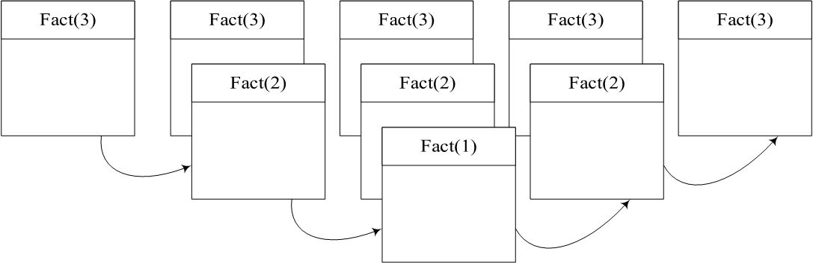
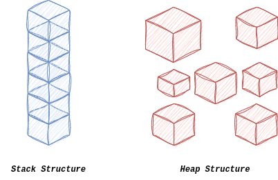

# C/C++ 程序内存布局

对于一个经典的 C/C++ 程序，其内存区域可划分为 5 大部分

- 代码段（Text Segment）：只读区域，存储汇编指令
- 数据段（Data Segment）：存储非0初始化的全局变量或静态变量、字符串常量
- BSS 段（**B**lock **S**tarting **S**ymbol Segment）：存储0初始化的全局变量或静态变量，**此段的作用在于减少可执行文件大小**，在可执行文件中通常只需要记录一个长度即可
- 堆区（Heap）：程序运行过程中进行动态内存分配的区域
- 栈区（Stack）：程序运行过程中存储函数调用栈帧（存储函数执行时的临时变量）

下图展示了这五块在内存上的排列顺序(图片来自^1^)


<!-- more -->

## 查看数据段大小

在 Linux 下可以通过 `size` 命令查看 C/C++ 程序的静态数据段大小情况

```c++
int main() {
  return 0;
}
```

使用 `size` 查看 text，data 和 bss 段大小

```sh
(base) ➜  Debug size memory_layout 
   text    data     bss     dec     hex filename
   1418     544       8    1970     7b2 memory_layout
```

此时分别添加字符串常量和0初始化的变量

```c++
int a{};
int b = 1230;

int main() {
  return 0;
}
```

再次使用 `size` 命令查看大小，输出如下

```sh
(base) ➜  Debug size memory_layout
   text    data     bss     dec     hex filename
   1418     548      12    1978     7ba memory_layout
```

可以观察到 data 段和 bss 段分别增加了 4 个 byte，分别对应 a 和 b。


## 为什么需要 Stack 和 Heap

Stack 和 Heap 原本是数据结构中的概念

- Stack 描述的是 **后进先出（LIFO）**数据结构
- Heap 可分为大根堆、小根堆和斐波那契堆等，描述的是一种具有特殊偏序关系的树状结构（父节点值一定大于或小于子节点值之类的）

在内存中，这两个概念稍微有点区别

下表展示了 Stack Memory 和 Heap Memory 的对比

| Stack Memory                                         | Heap Memory                                |
| ---------------------------------------------------- | ------------------------------------------ |
| 存储局部变量、函数参数和函数调用上下文（如返回地址） | 存储动态分配的数据                         |
| 自动分配和释放数据                                   | 手动管理，由程序员负责分配和释放           |
| 内存管理有效，大小有限，适用于生命周期较短的小数据   | 大小相对栈更大，适用于长生命周期和较大数据 |
| 内存地址由大到小                                     | 内存地址由小到大                           |

概念说起来有点干巴巴的，还是给一个示例和图表辅助说明一下

Stack Memory 的一个最经典的用途就是函数调用的栈，例如递归函数斐波那契数

```c++
int fact(int n) {
    if(n == 1) {
        return 1;
    }
    return n * face(n-1);
}
```

在调用 `fact(3)` 时，需要首先计算 `fact(2)` 的值才能继续计算，而计算 `fact(2)` 有需要进一步计算 `fact(1)`，此时满足递归终止条件，可直接返回。

可绘制出调用 `fact(3)` 并获取返回值的栈帧变化情况如下



Stack Memory 之所以取名为 Stack Memory 就是因为其在函数调用时先调用的函数最后退出，符合 LIFO 特性，因而称之为栈内存。

至于Heap Memory，首先其特点是数据在Heap中存储可以不连续（存在内存碎片），可以想象成不同数据随意的放在一起（书堆、杂物堆等），如下图所示（图片来自^2^）。




# 常见内存问题

在编写 C/C++ 程序时，一不留神会碰到 SEGFAULT（段错误），这是由于程序进行了异常的内存访问所导致的，常见的内存错误有

- 内存泄漏：动态分配内存而不释放
- 内存破坏
  - alloc/dealloc mismatch & new/delete type mismatch
  - double free
  - heap buffer out of range
  - use after free
  - use after scope
  - use after return
  - stack buffer out of range
  - global buffer out of range

下面分别列举一些例子

## memory leak

```c++
#include <stdio.h>
#include <stdlib.h>

const char *FuncThatCallMalloc() {
  char *data = reinterpret_cast<char *>(malloc(20));
  data[0] = 'h';
  data[1] = 'e';
  data[2] = 'l';
  data[3] = 'l';
  data[4] = 'o';
  data[5] = '\0';
  return data;
}

int main() {
  printf("%s\n", FuncThatCallMalloc());
  printf("%s\n", FuncThatCallMalloc());
  printf("%s\n", FuncThatCallMalloc());
  printf("%s\n", FuncThatCallMalloc());
  return 0;
}
```

每次调用 `FuncThatCallMalloc`，都会请求动态内存分配 20 bytes，但是并未释放，如果在程序运行过程中不断调用该函数，程序占用内存将不断增加，直达操作系统无法再分配内存，导致程序崩溃。


## alloc/dealloc mismatch

C++ 中除了 `malloc`  和 `free` 之外，可以使用 `new/delete` 或者 `new[]/delete[]`方式进行动态内存分配，使用 `new` 本质上编译器也会转而为我们调用 `malloc`，因此可以使用 `free` 进行释放，但是不匹配的 `malloc/free`或 `new/delete`调用也会造成内存泄漏或者内存破坏，下面例子展示了这种情况

```c++
#include <stdlib.h>

class Test {
  public:
  Test() {
    data = malloc(20);
  }

  ~Test() {
    free(data);
  }

  void* data{};
};

int main() {
  void* d = reinterpret_cast<void*>(new Test());
  free(d);
  return 0;
}
```

这段代码可以正常运行并返回0，但是通过 `free` 并不会调用 `~Test()`，因此不会释放类 `Test` 在构造过程中分配的 data 数据，这一段内存就再也无法释放了。


## double free

在 Linux 中，这一问题会出现在关闭两次文件上，如下所示

```c++
#include <stdio.h>

int main() {
  FILE* f = fopen("test.bin","wb");
  fclose(f);
  fclose(f);
}
```

运行时会直接abort，如下所示

```sh
(base) ➜  Debug ./memory_layout
free(): double free detected in tcache 2
[1]    13311 abort      ./memory_layout
```


## heap buffer out of range

这一问题也很常见，例如当我们动态分配了一个长度为 100 的 buffer，但我们访问其位置为 120 时出现越界访问，导致程序崩溃

```c++
#include <stdio.h>

int main() {
  int h = 320;
  int w = 320;
  char *buf = new char[h + w];
  for (int i = 0; i < h; i++) {
    for (int j = 0; j < w; j++) {
      buf[i * w + j] = 'a';
    }
  }
  delete[] buf;
  return 0;
}
```

执行结果如下

```c++
(base) ➜  Debug ./memory_layout
[1]    14048 segmentation fault  ./memory_layout
```


## use after free

当我们读取一个已经被释放掉的内存时，其结果是未知的，即使我们并没有再分配新的内存

```c++
#include <stdio.h>

int main() {
  int *a = new int{123};
  double *b = new double{0.123};
  printf("&a = %p, a = %d\n", a, *a);
  printf("&b = %p, b = %lf\n", b, *b);
  delete b;
  delete a;
  printf("&a = %p, a = %d\n", a, *a);
  printf("&b = %p, b = %lf\n", b, *b);
  return 0;
}
```

运行结果如下

```sh
(base) ➜  Debug ./memory_layout
&a = 0x55cba8191eb0, a = 123
&b = 0x55cba8191ed0, b = 0.123000
&a = 0x55cba8191eb0, a = -1474748720
&b = 0x55cba8191ed0, b = 0.000000
```


## use after return

这个问题也很常见，当我们返回一个栈上变量的地址，并再后续代码中使用时，其值是不确定的

```c++
#include <stdio.h>

int *ptr;

void A() {
  int data[2048];
  printf("this is in A!\n");
  ptr = data;
  data[0] = 1337;
  data[2047] = 13337;
}

void B() {
  double b = 0.1234;
  printf("this is in B!\n");
}

int main() {
  A();
  printf("%p = %d\n", ptr, *ptr);
  printf("%p = %d\n", &ptr[2047], ptr[2047]);
  B();
  printf("%p = %d\n", ptr, *ptr);
  printf("%p = %d\n", &ptr[2047], ptr[2047]);
}
```

运行结果如下

```c++
this is in A!
0x7ffff039b520 = 1337
0x7ffff039d51c = 13337
this is in B!
0x7ffff039b520 = 1337
0x7ffff039d51c = 21951
```

此处实际上并不会崩溃，因为函数执行完只会移动栈指针，并不会对内存做过多调整，此时栈内存数据仍会保留，在后续代码中也可以使用，但是不知道什么时候，读取到的值就不对了，从而导致程序执行结果出现异常。


## use after scope

这个和前一个效果类似，在 C++ 中引入 scope 可以更方便的管理对象生命周期，当对象离开 scope 时会自动调用析构函数，这也是 RAII（Resouce Acquisition Is Initialization） 实现的基本原理。

但是当我们在 scope 内取一个 scope 外的值时，其值也可能并非我们想的那样

```c++
#include <stdio.h>

class Test {
public:
  Test() { data = 1337; }
  ~Test() { data = 1238; }
  int data{};
};

int main() {
  Test *ptr1, *ptr2;
  {
    // enter scope
    Test t0{};
    ptr1 = &t0;
    {
      Test t1{};
      ptr2 = &t1;
    }
  }
  printf("ptr1->data = %d\n", ptr1->data);
  printf("ptr2->data = %d\n", ptr2->data);
  return 0;
}
```

由于 scope 内的对象也是栈上对象，访问时不容易出现崩溃，但是其值就可能并非我们想的那样了

```sh
(base) ➜  Debug ./memory_layout
ptr1->data = 1238
ptr2->data = 1238
```


## stack buffer overflow

```c++
#include <stdio.h>

void Func(void* buf,size_t size) {
  char* b = reinterpret_cast<char*>(buf);
  for(int i=0;i<size;i++) {
    b[i] = 'a';
  }
}

int main() {
  char buf[123];
  Func(buf,153);
  return 0;
}
```

运行结果如下

```sh
(base) ➜  Debug ./memory_layout
*** stack smashing detected ***: terminated
[1]    19730 abort      ./memory_layout
```

但是当 overflow 的数据并不大时，并不会造成显著的影响，但是会为程序埋下隐患。


## global buffer overflow

对于 global buffer overflow 也是同理，无非就是溢出的内存区域变了，这种情况下bug更为隐蔽，因为 global buffer 段通常溢出一点点也是无大碍，并不影响程序执行，但是拿到数据是否是我们所想就不为所知了（谁知道读写溢出段的值什么时候会被覆盖掉？）。

```c++
#include <stdio.h>

int global_buffer1[120];
int global_buffer2[120];

void Func(void *buf, size_t size) {
  char *b = reinterpret_cast<char *>(buf);
  for (int i = 0; i < size; i++) {
    b[i] = 'a';
  }
}

int main() {
  Func(global_buffer1, 153);
  printf("global_buffer1: %p~%p\n",global_buffer1,global_buffer1 + 120);
  printf("global_buffer2: %p~%p\n",global_buffer2,global_buffer2 + 120);
  return 0;
}
```

运行结果

```sh
(base) ➜  Debug ./memory_layout
global_buffer1: 0x562168281040~0x562168281220
global_buffer2: 0x562168281220~0x562168281400
```

从结果中我们可以看到，global_buffer1 和 global_buffer2 在内存的排列上时连续的，因此下溢 global_buffer1 会直接修改到 global_buffer2，如果在后续执行中设置 global_buffer2，将覆盖之前设置的值，引发未知的bug。


# 参考

1. [Memory layout of C program - Naukri Code 360](https://www.naukri.com/code360/library/memory-layout-of-c-program)
2. [What and Where Are the Memory Stack and Heap? | Baeldung on Computer Science](https://www.baeldung.com/cs/memory-stack-vs-heap#:~:text=Stack memory is a sort,longer lifespan than stack memory.)
3. [AddressSanitizer | Microsoft Learn](https://learn.microsoft.com/en-us/cpp/sanitizers/asan?view=msvc-170)

