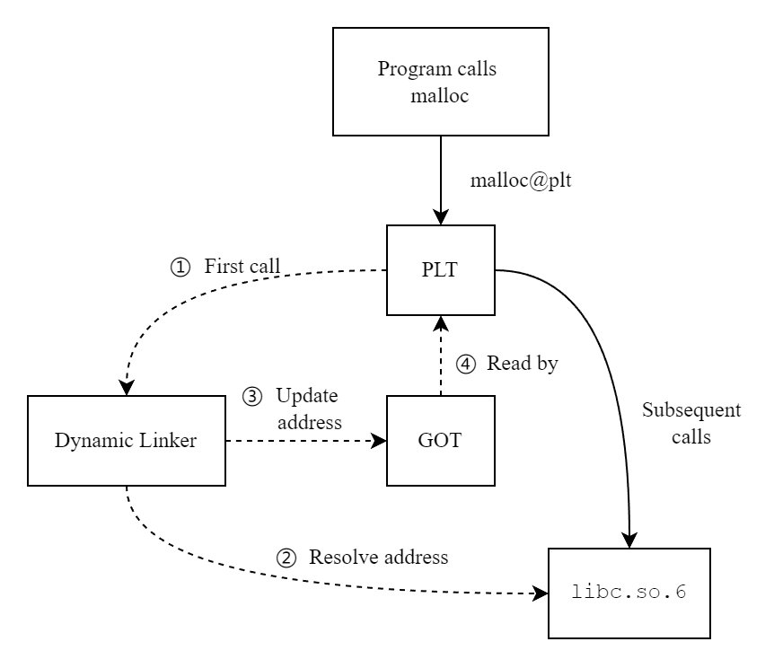
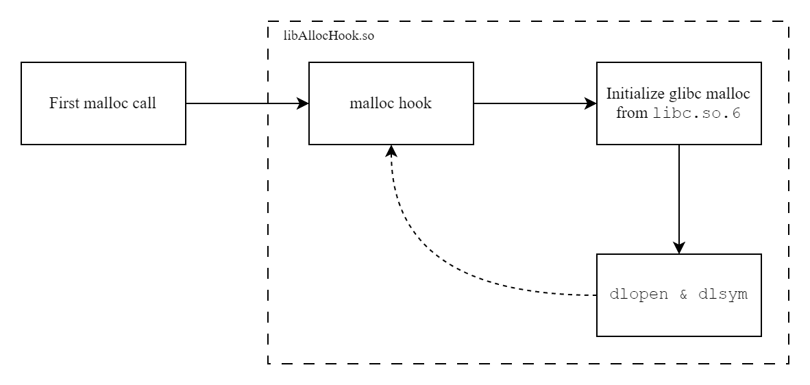
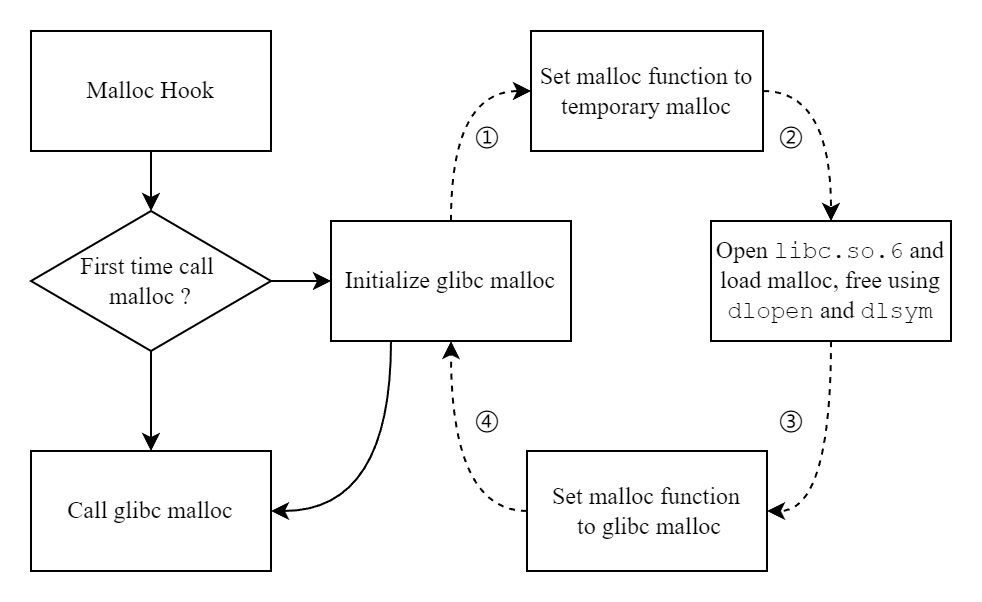
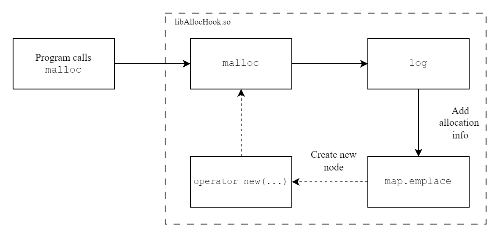
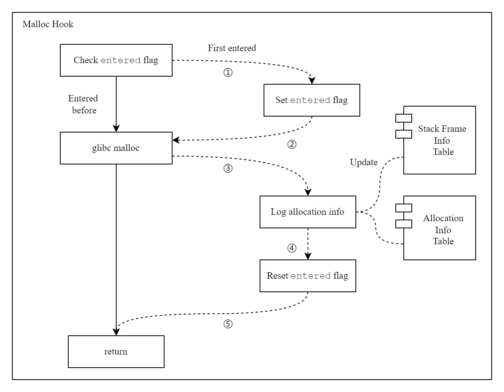

# 基本原理

内存泄漏是指**程序在运行时动态分配了内存，但是没有正确释放或者回收这些内存**，导致已分配的内存无法被重新利用。随着程序的运行，未释放的内存会逐渐累积，可能最终耗尽系统的可用内存。

内存泄漏检查工具的基本原理是通过**监控程序的内存分配和释放操作，来检查是否有未正确释放的内存**，其主要包含以下3个部分：

- 内存分配函数追踪
- 调用栈分析
- 内存泄漏报告

内存分配函数追踪可通过拦截（Hook）、插桩（Instrumentation）等方式实现，下面对比了几种常见内存泄漏检查方式

1. 函数拦截（Hook）

   原理：拦截CRT提供的内存管理函数，将其替换为自定义的内存管理函数，从而实现内存分配和释放的记录

   优点：可通过 `LD_PRELOAD`  等技术通过动态链接方式实现函数拦截，代码侵入性小

   缺点：由于在每一次内存分配/释放时都会记录，会带来一定的性能开销

2. 代码植入（Code Instrumentation）和影子内存（Shadow Memory）

   原理：将程序中每一个内存块的状态映射到另一块内存区域，并在每一次内存操作时更新状态信息（通过代码植入实现）

   优点：内存状态追踪结果精确，可实现其他内存检查功能

   缺点：编译期植入方法（Address Sanitizer）需要重新编译代码，而运行时植入方法（Valgrind）使用仿真器运行（Emulator），程序运行速度显著降低

下一节将详细介绍 ASAN 和 Valgrind 的实现原理和基本使用，本节将着重介绍通过函数拦截方式实现的内存泄漏检查工具。

<!-- more -->

# 通过 LD_PRELOAD 实现 malloc hook

在 Windows 下，可直接通过 `_CrtSetAllocHook` API 直接添加自定义的内存内存分配/释放函数，

在 Linux 下，GCC 也提供了类似的 Hook 函数，如 `__malloc_hook`、`__realloc_hook`、`__free_hook`、`__memalign_hook` 等，但其已经在 glibc 2.32 版本被弃用，并在 glibc 2.34 版本中将这些 hook 代码移除，将其放到了 `libc_malloc_debug.so.0` 中。目前更推荐的方式是通过 `LD_PRELOAD` 环境变量直接替换 `malloc` 等函数。

## LD_PRELOAD

在 Linux 系统下，`LD_PRELOAD` 环境变量的作用是**在动态链接库的加载过程中指定额外的动态库优先加载**。如果 `LD_PRELOAD` 中的库提供了与系统库（glibc）中相同名称的符号，动态链接器（ld）将会优先使用这些符号进行解析，从而实现对系统库函数的替换和劫持。

从 `LD_PRELOAD` 的作用可以看出，其仅适用于动态链接场景，对于静态链接的库无法应用，因为静态链接库的符号解析在编译期就已经完成，而动态链接库的符号地址将在函数第一次调用时解析。

我们要劫持的内存管理函数包含在 glibc （GNU C Library）中，因此需要确保编译的程序是动态链接 glibc 而不是静态链接 glibc 的，可以通过 `ldd` 命令查看程序依赖的动态链接库，如果包含 libc.so.6，则说明其动态链接到 glibc，我们便可以通过 `LD_PRELOAD` 方式替换 malloc 并进行内存分配/释放的追踪。

也可以直接使用 `file` 查看可执行程序的基本情况

```sh
(base) ➜  build file demo
demo: ELF 64-bit LSB shared object, x86-64, version 1 (SYSV), dynamically linked, interpreter /lib64/ld-linux-x86-64.so.2, BuildID[sha1]=9d1c40ef0056c0cd218526d4e4d0e177ccb0a783, for GNU/Linux 3.2.0, with debug_info, not stripped
```

在链接过程中指定 `-static` 可实现静态链接 glibc，再次使用 `file` 查看基本情况

```sh
(base) ➜  build file demo_static
demo_static: ELF 64-bit LSB executable, x86-64, version 1 (GNU/Linux), statically linked, BuildID[sha1]=771d155d3f1ff156c986dcc67d6e07e3e80a74b1, for GNU/Linux 3.2.0, with debug_info, not stripped
```

使用 `ldd` 是也将提示 "not a dynamic executable"，其不包含任何动态链接信息。

## 动态符号解析机制

动态符号解析机制是现代操作系统通过动态链接库（如 `glibc`）实现符号（函数和变量）在程序运行时的地址解析过程。它允许程序在不重新编译的情况下调用共享库中的符号。

在动态链接过程中，程序的符号（例如函数调用）在编译时并不知道最终的内存地址，而是在运行时由**动态链接器**负责解析。这种机制依赖于两张表：**GOT（Global Offset Table）** 和 **PLT（Procedure Linkage Table）**，它们协同工作，以便符号在首次调用时完成解析，并优化后续调用。

- 全局偏移表（GOT）

  是动态链接的二进制文件（可执行程序、动态链接库等）用于管理 **外部函数地址** 的机制。由于这些 **地址在运行时才会确定**（因为动态链接的存在），GOT 提供了一种 **在符号解析后动态更新这些外部符号地址** 的方式。

  GOT 中的每个表项都对应一个外部库中的符号，当 **函数第一次被调用时，动态链接器解析其实际地址并将其存储在 GOT 中**。随后的调用将直接使用存储在 GOT 中的地址，从而避免了每次调用时重新解析地址的开销。

- 过程链接表（PLT）

  **过程链接表（PLT）** 充当调用外部函数的跳板。当程序 **首次调用外部函数时，控制会转移到与该函数关联的 PLT 条目**。这个 PLT 条目负责调用动态链接器，以解析该函数的地址（如果尚未解析）。解析完成后，地址会被存储在 **GOT** 中。

  **因此，** 一旦外部函数或变量的地址被解析后，GOT 条目会被直接使用。**PLT 条目用于协助初次解析** 这些地址，通过动态链接器完成。

在 compiler explorer 中可以观察到这一点

样例代码

```c++
#include <stdlib.h>

int main() {
    void* data = malloc(20);
    return 0;
}
```

在 Output 菜单栏中勾选 “Link to binary”，编译参数为默认，可以看到其汇编代码如下

```asm
malloc@plt-0x10:
 push   QWORD PTR [rip+0x2fe2]        # 404008 <_GLOBAL_OFFSET_TABLE_+0x8>
 jmp    QWORD PTR [rip+0x2fe4]        # 404010 <_GLOBAL_OFFSET_TABLE_+0x10>
 nop    DWORD PTR [rax+0x0]
main:
 push   rbp
 mov    rbp,rsp
 sub    rsp,0x10
 mov    edi,0x14
 call   401030 <malloc@plt>
 mov    QWORD PTR [rbp-0x8],rax
 mov    eax,0x0
 leave
 ret
```

在调用 malloc 时，其并没有给出真正的地址，而是跳转到 plt 的对应表项 `malloc@plt`。

而当我们指定 `-static` 链接选项后，其部分汇编代码如下

```asm
...
main:
 push   rbp
 mov    rbp,rsp
 sub    rsp,0x10
 mov    edi,0x14
 call   4194e0 <__libc_malloc>
 mov    QWORD PTR [rbp-0x8],rax
 mov    eax,0x0
 leave
 ret
...
```

可以看到其直接调用的就是 `__libc_malloc`，节省了跳转 plt 获取实际地址的过程。

下图展示了程序（动态链接 glibc）调用 `malloc` 函数的过程



下面给出动态符号解析的伪代码

```c++
Map<FuncId,DynamicResolver> PLT{};
Map<FuncId,Function> GOT{};
// call malloc@plt
if(GOT.find(FuncId) == GOT.end()) 
{
    void* ptr = PLT[name].dl_runtime_resolve();
    GOT[name] = ptr;
}
GOT[name](...)
```

在代码中，也可以通过 `dlsym` 直接获取函数符号信息，如下所示

```c++
#include <assert.h>
#include <dlfcn.h>
#include <stdlib.h>

int main() {
  using Malloc = void *(size_t);
  Malloc *my_malloc = reinterpret_cast<Malloc *>(dlsym(RTLD_DEFAULT, "malloc"));
  assert(my_malloc == &malloc);
  return 0;
}
```


# 获取 stacktrace

> [!Note]
>
> 参考 [cpptrace](https://github.com/jeremy-rifkin/cpptrace) 中不同 unwind 方案

在内存检测工具中，一个很重要的功能就是获取函数的调用栈，这样我们才能定位到是在何时何地发生的内存泄漏。

其具体可以分为两步

1. 遍历栈帧列表，回溯每一层函数调用的程序计数器，构造函数调用链

   可以使用 libbacktrace、glibc自带的backtrace函数或 libunwind 进行获取

2. 根据程序计数器的值和调试符号信息，获取函数名、调用源码位置信息

   可以使用 libbacktrace 或者 addr2line 命令行工具获取


# 实现细节

> [!Note]
>
> 为便于说明，后续 malloc 指代 glibc 中相关的内存分配/释放函数，如 free、realloc、calloc 等，malloc hook为我们用于替换 glibc 相关内存分配/释放的函数。

根据 LD_PRELOAD 的功能描述，使用 malloc hook 替换 malloc 后，所有动态链接 malloc 的地方都将解析为 malloc hook 调用。

为不影响软件的正常执行，我们需要在 malloc hook 中调用 malloc，然后根据其返回结果记录相关信息。

那么如何在 malloc hook 中调用 malloc呢，直接通过 `void* data = malloc(20)` 这种肯定是不行的，前面提到的 `dlsym` 就发挥其作用了。

## 获取 glibc malloc 函数指针

我们只需要通过 `dlopen` 打开系统的 `glibc` 动态库，然后通过 `dlsym`  获取 malloc 函数指针即可。

**且这一加载步骤只能在第一次调用 malloc 时触发，因为第一次调用 malloc 的时机可能早于静态变量初始化时机**

但是在 `dlopen` 和 `dlsym` 内部执行过程中也可能调用 malloc，如下所示



但是此时我们还没有拿到 malloc 的函数指针，这样就会陷入死循环。

为解决这种情况，我们就需要提供一块临时内存区域供 `dlopen` 和 `dlsym` 使用（即实现一个静态内存池），以确保我们可以正确拿到 glibc 的 malloc 函数指针地址。实现如下

```c++
constexpr size_t BUFFER_SIZE = 1 << 14;
char buffer[BUFFER_SIZE];
size_t pos = 0;
size_t capacity = BUFFER_SIZE;

void* temp_malloc(size_t size) {
    if(capacity < size) {
        return nullptr;
    }
    void* ptr = buffer + size;
    pos += size;
    capacity -= size;
    return ptr;
}

void temp_free(void* ptr) {
    // do nothing
    return;
}
```

由此可以避免初始化 malloc 时的递归调用，下图展示了 Malloc Hook 中初始化 glibc malloc 的流程




## 避免递归调用

这是我们预想的 malloc hook 的基本功能伪代码

```c++
void* my_malloc(size_t size) {
    void* ptr = glibc_malloc(size);
    Log(ptr,size);
    return ptr;
}
```

其中 Log 函数将记录每一次内存分配的相关信息，为记录每一次内存分配/释放调用及其相关调用栈，我们需要准备两个 map，一个用于存储每一条分配信息，一个用于存储调用栈信息。第二个 map 是为了减少调用栈的重复存储，以尽可能减少内存占用。

两个 map 的定义如下

```c++
struct AllocInfo {
    uintptr_t ptr{};
    size_t size{};
    size_t frame_id{};
};

struct Frames {
    size_t length{};
    std::array<uintptr_t,127> pcs{};
};

using AllocMap = map<uintptr_t,AllocInfo>;
using FrameMap = map<size_t, Frames>;
```

AllocMap 的键为通过 malloc，calloc，realloc 等内存分配函数所分配的内存块的首地址。

FrameMap 的键为对 Frames 结构体通过 hash_combine（参考 boost 实现）后获取的 hash 值，以尽可能减少重复。

无论是使用 tree map 还是 hash map，其在插入过程中都有可能都有可能进行动态内存分配，即如下调用链



这样会导致 malloc hook 的递归调用，而在 malloc hook 内部发生的动态内存分配对于软件的内存泄漏检查而言毫无意义，可以直接忽略，因此需要添加一个递归标志位，以判断 malloc hook 是否发生递归调用。

如下图所示



写成伪代码如下所示

```c++
void* my_malloc(size_t size) {
    static entered = false;
    if(entered) {
        return glibc_malloc(size);
    }
    entered = true;
    void* ptr = glibc_malloc(size);
    Log(ptr,size);
    entered = false;
    return ptr;
}
```

**由于在 free、realloc、calloc 等内存分配/释放函数中也会调用到 malloc（因为 Log 记录的调用），因此全局状态标识位必须只有一个，其表示当前程序正在执行内存分配函数过程中。**


## 多线程记录

**内存分配函数可能会在多线程环境下使用，而上述递归标志位、AllocMap 和 FrameMap 都是全局变量，在并发读写时需要加锁。**

- 对于递归标志位而言，如果对其加锁，则同一时间内将仅有一个变量进入 malloc hook 执行，这样会极大的影响程序性能。但一个线程进入 malloc hook 执行并不应该阻碍另一个线程执行 malloc hook，**即 malloc hook 的递归标志位应该时每个线程独有的状态标志位**，将递归标志位从 `static` 转换为 `thread_local`，以避免频繁的进行线程同步。

- 而对于 AllocMap 和  FrameMap 而言，可以尝试使用 concurrent_hash_map 等数据结构**缩小加锁的范围**以尽可能提高 malloc hook 的执行效率。

最后章节中，我们将会对实现的 malloc hook 进行 benchmark，就可以发现不同设计下的性能差距。并给出最终完整版 malloc hook 实现。


# 参考

1. [WWW2Exec - GOT/PLT | HackTricks](https://book.hacktricks.xyz/binary-exploitation/arbitrary-write-2-exec/aw2exec-got-plt)
2. [_CrtSetAllocHook | Microsoft Learn](https://learn.microsoft.com/en-us/cpp/c-runtime-library/reference/crtsetallochook?view=msvc-170)
3. [ld.so(8) - Linux manual page (man7.org)](https://man7.org/linux/man-pages/man8/ld.so.8.html)
4. [AddressSanitizerAlgorithm · google/sanitizers Wiki (github.com)](https://github.com/google/sanitizers/wiki/AddressSanitizerAlgorithm)
5. [Valgrind](https://valgrind.org/docs/manual/design-impl.html)
6. [jeremy-rifkin/cpptrace: Simple, portable, and self-contained stacktrace library for C++11 and newer (github.com)](https://github.com/jeremy-rifkin/cpptrace)
