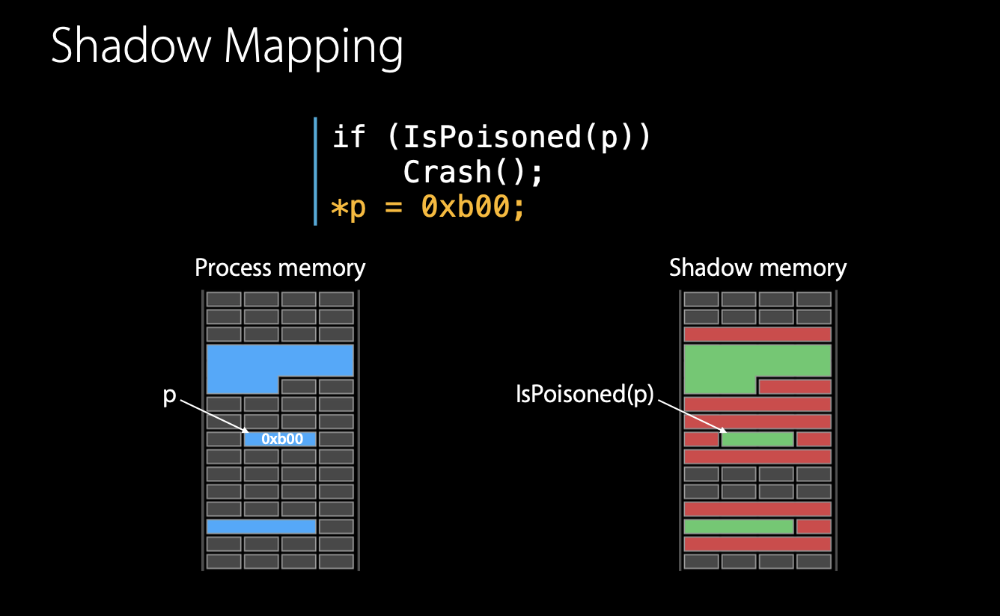
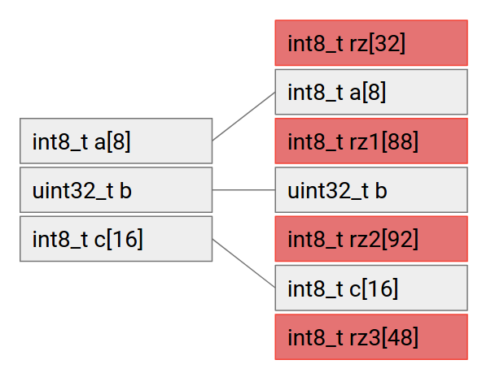
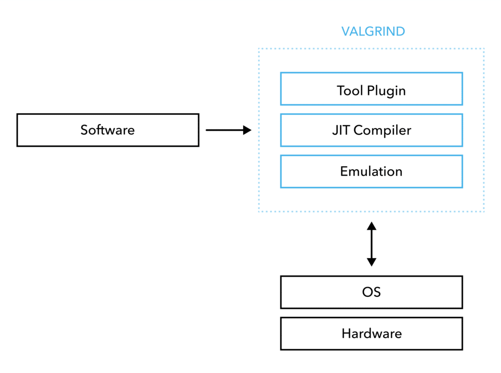
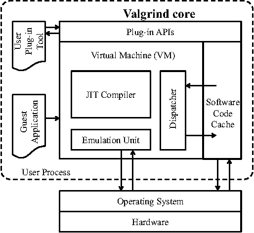
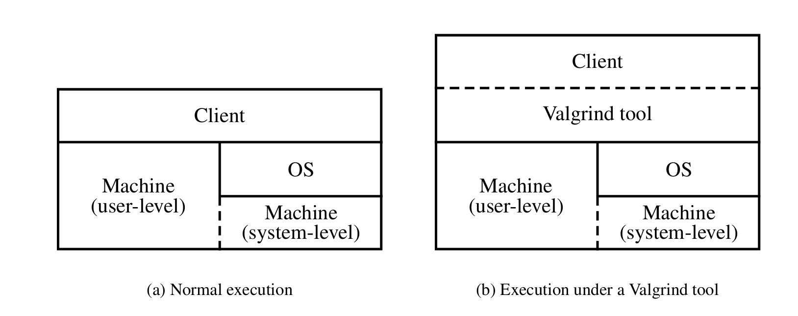

# 概述


<!-- more -->

# ASAN

## 基本原理







```c++
#include <stdlib.h>

int main() {
    char* data = reinterpret_cast<char*>(malloc(20));
    data[35] = 'a';
    return 0;
}
```


未开启之前的汇编代码

```c++
main:
        push    rbp
        mov     rbp, rsp
        sub     rsp, 16
        mov     edi, 20
        call    malloc
        mov     QWORD PTR [rbp-8], rax
        mov     rax, QWORD PTR [rbp-8]
        add     rax, 35
        mov     BYTE PTR [rax], 97
        mov     eax, 0
        leave
        ret
```


开启 ASAN 后汇编代码

```asm
main:
        push    rbp
        mov     rbp, rsp
        sub     rsp, 16
        mov     edi, 20
        call    malloc
        mov     QWORD PTR [rbp-8], rax
        mov     rax, QWORD PTR [rbp-8]
        lea     rcx, [rax+35]
        mov     rax, rcx
        mov     rdx, rax
        shr     rdx, 3
        add     rdx, 2147450880
        movzx   edx, BYTE PTR [rdx]
        test    dl, dl
        setne   sil
        mov     rdi, rax
        and     edi, 7
        cmp     dil, dl
        setge   dl
        and     edx, esi
        test    dl, dl
        je      .L2
        mov     rdi, rax
        call    __asan_report_store1
.L2:
        mov     BYTE PTR [rcx], 97
        mov     eax, 0
        leave
        ret
_GLOBAL__sub_I_00099_0_main:
        push    rbp
        mov     rbp, rsp
        call    __asan_init
        call    __asan_version_mismatch_check_v8
        pop     rbp
        ret
```


看一个 stack buffer overflow 的例子

```c++
#include <stdlib.h>

int main() {
    int array[10];
    array[0] = 0;
    array[1] = 0;
    array[2] = 0;
    array[3] = 0;
    array[4] = 0;
    array[5] = 0;
    array[6] = 0;
    array[7] = 0;
    array[8] = 0;
    array[9] = 0;
    array[10] = 0;
    array[14] = 0;

}
```


原始汇编

```asm
main:
        push    rbp
        mov     rbp, rsp
        mov     DWORD PTR [rbp-48], 0
        mov     DWORD PTR [rbp-44], 0
        mov     DWORD PTR [rbp-40], 0
        mov     DWORD PTR [rbp-36], 0
        mov     DWORD PTR [rbp-32], 0
        mov     DWORD PTR [rbp-28], 0
        mov     DWORD PTR [rbp-24], 0
        mov     DWORD PTR [rbp-20], 0
        mov     DWORD PTR [rbp-16], 0
        mov     DWORD PTR [rbp-12], 0
        mov     DWORD PTR [rbp-8], 0
        mov     DWORD PTR [rbp+8], 0
        mov     eax, 0
        pop     rbp
        ret
```


开启 ASAN 后的汇编


## 使用

前面提到，ASAN是一个


## ASAN 缺点


# Valgrind

> [!Note]
>
> How to pronounce "Valgrind" ?
>
> The "Val" as in the word "value". The "grind" is pronounced with a short 'i'  ie. "grinned" (rhymes with "tinned") rather than "grined" (rhymes with "find"). Don't feel bad: almost everyone gets it wrong at first.

## 基本原理










## 使用


# ASAN 和 Valgrind 功能对比


# 其他 Sanitizer

## MSAN（only on clang）

## TSAN

## UBSAN

detect undefined behavior

比较值得注意的几个

- float-cast-overflow

- float-divide-by-zero

- signed-integer-overflow

- integer-divide-by-zero

- return

  

# 参考

1. [AddressSanitizerAlgorithm · google/sanitizers Wiki (github.com)](https://github.com/google/sanitizers/wiki/AddressSanitizerAlgorithm)
2. [Valgrind](https://valgrind.org/docs/manual/design-impl.html)
3. [phd2004.pdf (valgrind.org)](https://valgrind.org/docs/phd2004.pdf)
4. [Welcome to Clang's documentation! — Clang 20.0.0git documentation (llvm.org)](https://clang.llvm.org/docs/index.html)
5. [Instrumentation Options (Using the GNU Compiler Collection (GCC))](https://gcc.gnu.org/onlinedocs/gcc-10.5.0/gcc/Instrumentation-Options.html)
6. [LLVM 工具系列 - Address Sanitizer 实现原理 (2) | 代码手工艺人 (xueshi.io)](https://xueshi.io/2023/01/08/LLVM-Tools-02-Address-Sanitizer-02-Algorithm/)
