[Conan](https://conan.io/) 作为一个 C++ 包管理工具，相对于之前介绍的 CMake FetchContent 或者 ExternalProject 方式添加第三方依赖会更加简单，但是<del>凡是碰上了 C++，都简单不到哪去，</del>学习成本还是有一点的，就用一篇笔记介绍一下 Conan 的基本使用。

# 安装 Conan

由于我们后面会大量使用 conanfile.py，且也可以借助 Python 插件实现 `conanfile.py` 的代码补全，直接使用 python 库的方式安装 conan，安装命令如下：

```bash
python -m pip install conan
```

安装之后例行检查一下版本

```bash
conan --version
```

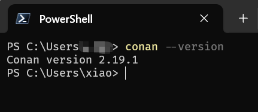

<!-- more -->

# Conan 模板项目

通过 `conan new` 命令可以快速创建 c++ 模板项目

对于基于 cmake 的 c++ 项目而言，可以使用 `cmake_exe` 和 `cmake_lib`，conan 也支持自行指定代码模板，在本文的最后会结合 VS Code 提供一个添加 vscode 支持的 conan cmake 模板。

```bash
conan new cmake_exe -d name=hello-conan
```

执行命令后，其会自动创建好一些必要的文件，如下图所示：

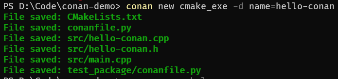

其目录结构如下所示：

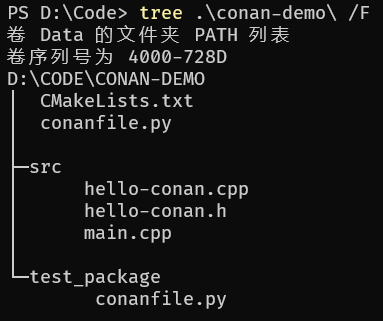

c++ 源码和头文件放在 `src` 目录下，同时还生成了一个 test_package 目录，用于测试当前包，暂时用不上。

# Hello World

依次输入以下命令，完成样例项目的编译和运行

```bash
conan profile detect --force
conan install . --building=missing
cmake --list-presets
cmake . --preset conan-default
cmake --list-presets build
cmake --build --preset conan-release
cmake --install build --prefix install
./install/bin/hello-conan.exe
```

简单介绍一下每一步在做什么

step1（代码行1）：生成编译工具链配置

step2（代码行2）：下载并安装三方库依赖

step3（代码行3~4）：查看当前 cmake configure 预设配置，并进行 configure，生成当前项目的编译配置

step4（代码行5~6）：查看当前 cmake 的编译预设配置，并进行编译

step5（代码行7）：执行 cmake 安装，将可执行文件安装到 `install` 目录

step6（代码行8）：执行程序

程序执行输出如下：

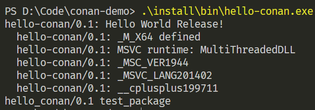


# VS Code 支持

目前我们都是使用命令行进行简单的操作，但是真正进行开发的时候还需要IDE的代码提示和调试功能才行，下面就介绍一下如何基于 VS Code 配置一个支持 conan 和 cmake 的 c++ 开发环境。

## 安装C++开发插件

- C/C++ Extension Pack
- CMake Tools
- clangd
- CodeLLDB

## 添加自定义 Tasks

> [!TIP]
>
> 如何在 vscode 中添加自定义 task 可以参考 [tasks 使用文档](https://code.visualstudio.com/docs/debugtest/tasks)

通过快捷键 <kbd>Ctrl</kbd>+<kbd>Shift</kbd>+<kbd>P</kbd> 打开配置面板，输入 `task`，选择 "***任务：配置任务***"

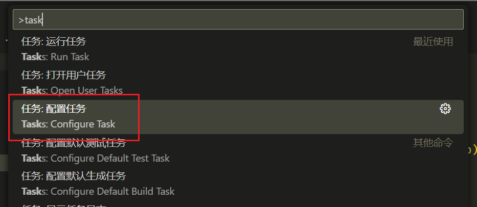

然后点击 "***使用模板创建 tasks.json 文件***" ，这样就会自动创建一个可用的 tasks.json 

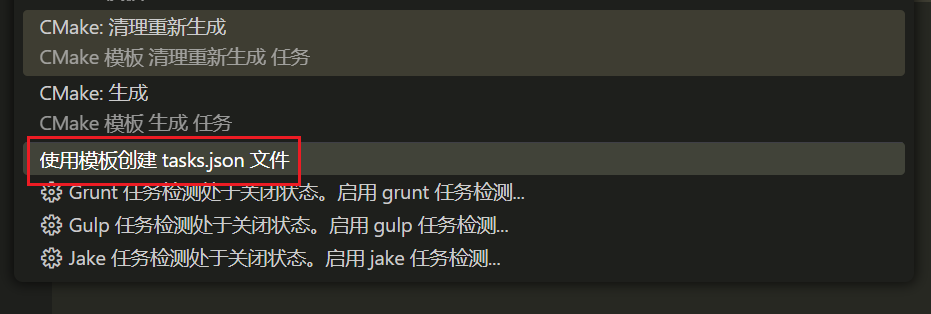

之后选择 tasks 的模板，这里直接选择 “***Others 运行任意外部命令的示例***”

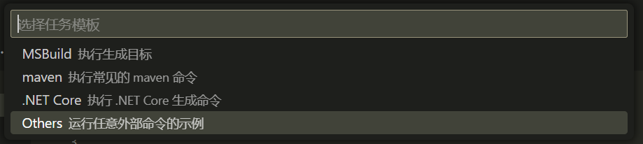

创建好的模板 tasks.json 内容如下

> [!TIP]
>
> 如果找不到创建 tasks.json 的入口，也可以直接手动创建 `.vscode/tasks.json` 文件，并填入下列内容

```json
{
    // See https://go.microsoft.com/fwlink/?LinkId=733558
    // for the documentation about the tasks.json format
    "version": "2.0.0",
    "tasks": [
        {
            "label": "echo",
            "type": "shell",
            "command": "echo Hello"
        }
    ]
}
```

根据前一节的操作步骤，可以将编译到运行的过程分为3个子步骤：

- Conan 准备
  - `conan profile detect`
  - `conan install`
- CMake 配置和编译
  - `cmake --preset <selected-configure-preset>`
  - `cmake --build --preset <selected-build-preset>`
  - `cmake --install`
- 程序运行
  - `.\hello-conan`

在 VS Code 中已经集成了 CMake 的插件，可以直接读取 Conan 生成好的 CMakePresets.json 进行配置和编译，那么我们只需要在 Tasks 中编写 Conan 的相关操作即可。对于 CMake 相关操作直接通过 <kbd>Ctrl</kbd>+<kbd>Shift</kbd>+<kbd>P</kbd> 调出命令面板执行即可，如下图所示：

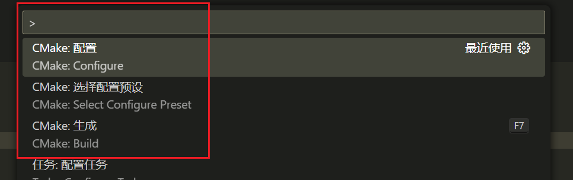

其中

- `CMake: 选择配置预设`  对应命令行 `cmake --list-presets`
- `CMake: 配置` 就对应命令行 `cmake . --preset <selected-configure-preset>`
-  `CMake: 生成` 就对应命令行 `cmake --build --preset <selected-build-preset>`

封装 Conan 工具链检查和依赖安装的 tasks.json 内容如下：

```json5
{
    // See https://go.microsoft.com/fwlink/?LinkId=733558
    // for the documentation about the tasks.json format
    "version": "2.0.0",
    "tasks": [
        {
            "label": "Conan: Detect Profile",
            "type": "shell",
            "command": "conan",
            "args": [
                "profile",
                "detect",
                "--force"
            ],
            "group": "build",
        },
        {
            "label": "Conan: Install Dependency [Debug]",
            "type": "shell",
            "command": "conan",
            "args": [
                "install",
                "-s='build_type=Debug'",
                "-of='${workspaceFolder}/build/Debug'",
                ".",
                "--build=missing"
            ],
            "hide": true
        },
        {
            "label": "Conan: Install Dependency [Release]",
            "type": "shell",
            "command": "conan",
            "args": [
                "install",
                "-s='build_type=Release'",
                "-of='${workspaceFolder}/build/Release'",
                ".",
                "--build=missing"
            ],
            "hide": true
        },
        {
            "label": "CMake: Select Configure Preset",
            "command": "${command:cmake.selectConfigurePreset}",
            "hide": true
        },
        {
            "label": "CMake: Configure",
            "command": "${command:cmake.configure}",
            "hide": true
        },
        {
            "label": "Conan: Install & CMake: Configure",
            "group": "build",
            "dependsOn": [
                "Conan: Install Dependency [Debug]",
                "Conan: Install Dependency [Release]",
                "CMake: Select Configure Preset",
                "CMake: Configure"
            ],
            "dependsOrder": "sequence"
        },
    ],
}
```

我们定义了 6 个 task：

- `Conan: Detect Profile`：对应 `conan profile detect --force`

- `Conan: Install Dependency [Debug]`：对应 `conan install`（安装 Debug 编译模式下的依赖）

- `Conan: Install Dependency [Release]`：对应 `conan install`（安装 Release 编译模式下的依赖）

- `CMake: Select Configure Preset`：通过 `${command:cmake.selectConfigurePreset}` 执行 CMake 插件提供的命令

- `CMake: Configure`：同上，通过 `${command:cmake.configure}` 执行 CMake 插件提供的命令

  > [!NOTE]
  >
  > 这里 `${command:cmake.configure}` 会执行插件提供的命令，并使用命令输出进行字符串替换，**中间可能会报错**，因为我们的目标是在 tasks 中执行 VS Code 的一些命令（有点邪道？），具体可以参考 VS Code 对变量替换的[说明文档](https://code.visualstudio.com/docs/reference/variables-reference#_command-variables)
  >
  > 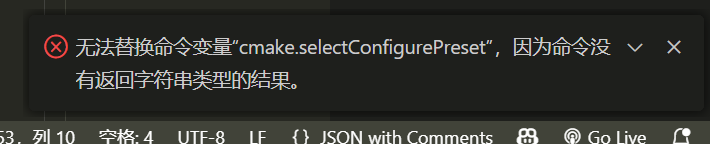

- `Conan: Install & CMake: Configure`，同时安装 Debug 和 Release 模式下的依赖，并选择预设配置进行生成

 由于我们设置 task 的 group 为 `build`，可以直接通过快捷键 <kbd>Ctrl</kbd>+<kbd>Shift</kbd>+<kbd>B</kbd> 快速调用（调用生成任务），如下所示

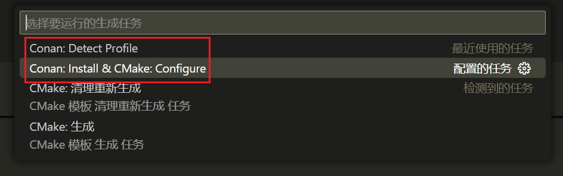

这样，使用 VS Code 进行开发时，只需要以下 3 个步骤，且都可以通过 VS Code 的 task 完成：

- **[可选]** Conan 检测工具链
- **[首次执行/更新三方库时]** 安装 Debug / Release 模式的三方库依赖
- 调用 CMake 配置和编译


***小插曲***

在 tasks.json 中配置 conan 的命令时，想通过 conan conf的 `tools.cmake.cmaketoolchain:extra_variables` 选项新增 `CMAKE_EXPORT_COMPILE_COMMANDS` （不要问我为什么不在 `conanfile.py` 中添加😎），让 cmake 自动导出 compile_commands.json 

但是发现怎么配置也配不好，搞了半天发现是命令行命令对引号的转义导致的，需要写成这样的形式：

```json
{
    "label": "Conan: Install Dependency [Debug]",
    "type": "shell",
    "command": "conan",
    "args": [
        "install",
        "--settings='build_type=Debug'",
        "--conf='tools.cmake.cmaketoolchain:extra_variables={\\\"CMAKE_EXPORT_COMPILE_COMMANDS\\\": \\\"True\\\"}'",
        "--conf='tools.cmake.cmaketoolchain:generator=Ninja'",
        ".",
        "--build=missing"
    ],
    "hide": true
},
```

查了[conan cmake conf 文档](https://docs.conan.io/2/reference/tools/cmake/cmaketoolchain.html#conan-cmake-toolchain-conf) 后发现，conan 对 `tools.cmake.cmaketoolchain:extra_variables` 要求输入一个字典字符串（即可以通过 `eval()` 函数进行解析的字符串），即输入的字符串必须是 `{"<key>":"<value>"}` 这种形式，且 `"` 是必须的，为了保证在输入是 `"` 不被字符串解析过程中吞掉（**命令行传递参数时会对引号做处理**），就需要额外添加 `\` 进行转义，也就是写成如下形式 `{\"<key>\":\"<value>\"}`，而将这个字符串写入 json 中，还需要进行一次转义，就变成了最终 tasks.json 上的那种形式

```
{\\\"<key>\\\":\\\"<value>\\\"}
```

这种丑陋的形式（在 c++ 中写正则表达式，也是需要多次转义，c++ 字符串本身的转义和正则表达式中的转义）


## 配置 clangd

为了实现多平台统一的开发体验，使用 clangd 进行代码补全，同样，还是需要一系列的配置，这一次主要修改 `.vscode/settings.json`，相关配置如下：

```json5
{
    "editor.tabSize": 2,
    "C_Cpp.intelliSenseEngine": "disabled",
    "C_Cpp.formatting": "clangFormat",
    "clangd.arguments": [
        "--compile-commands-dir=${workspaceFolder}/build",
        "--all-scopes-completion",
        "--background-index",
        "--background-index-priority=background",
        "--clang-tidy",
        "--completion-style=bundled",
        "--header-insertion=never",
        "--pch-storage=disk",
        "-j=8"
    ],
    "cmake.exportCompileCommandsFile": true,
    "cmake.copyCompileCommands": "${workspaceFolder}/build/compile_commands.json",
}
```

其中比较关键的配置项有 4 项：

1. `C_Cpp.intelliSenseEngine`：禁用 C/C++ 插件自带的代码提示引擎

   其会和 clangd 冲突，一般在安装 clangd 插件时就会自动提示禁用了

2. `cmake.exportCompileCommandsFile`：设置 cmake 插件在 configure 时导出 `compile_commands.json`

   这一步实际上是在 cmake configure 的时候添加 `-DCMAKE_EXPORT_COMPILE_COMMANDS` 选项，因为 clangd 依赖 compile_commands.json 进行代码补全

   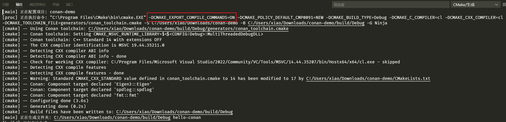 

3. `cmake.copyCompileCommandsFile`：将 compile_commands.json 拷贝到指定位置

   因为我们目前使用的是 Ninja 进行编译，其是单配置模式，**即 Debug 模式和 Release 模式的 compile_commands.json 会输出到不同的目录下**，通过该选项，可以将不同编译配置下的 compile_commands.json 输出到一个固定位置，便于 clangd 读取

   > [!TIP]
   >
   > 单配置模式：Debug 和 Release 需要单独的 CMake Configure，例如 Make 和 Ninja
   >
   > 多配置模式：Debug 和 Release 可以共用同一套 CMake Configure，例如 Visual Studio 的 Solution
   >
   > 具体可以参考 CMake 官方文档中对于[编译配置的说明](https://cmake.org/cmake/help/latest/manual/cmake-buildsystem.7.html#build-configurations)

4. `clangd.arguments` ：配置 clangd 如何进行代码补全


具体有哪些命令行选项可以通过 `clangd --help` 查看，这里配置的是个人觉得比较好用的一些配置，**其中比较关键的一个是 `--compile-commands-dir=${workspaceFolder}/build`**，该配置项指定了 `compile_commands.json` 所在目录，这一个需要与前一个配置的路径相对应，否则 clangd 将无法正确工作

> [!NOTE]
>
> `editor.tabSize` 和 `C_Cpp.formating` 是代码格式化的配置，可根据个人喜好进行配置

填写好相关配置后，可以重启 clangd（同样在命令面板中进行操作）

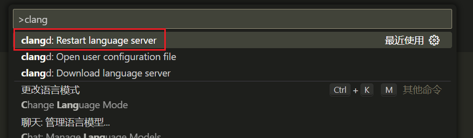

并在输出中观察 clangd 是否正常工作

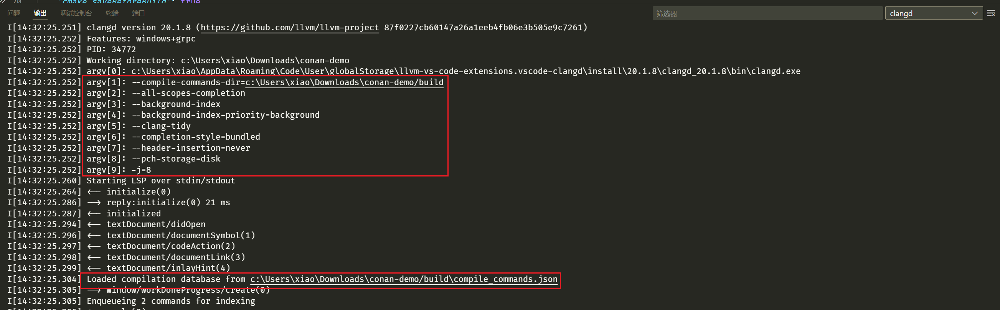

如果看到 clangd 的相关日志中包含刚才配置好的命令行选项，并成功加载了 compile_commands.json 文件，则说明已经配置完成。


## 配置调试

还有最后一步，代码调试（已经感觉有点累了😫，VS Code 的C++开发环境属实有点难配了），幸好，这一步只需要简单集成一下 cmake 的调用命令即可，创建 `.vscode/launch.json`，并填写下列内容

```json
{
  "configurations": [
    {
      "type": "lldb",
      "request": "launch",
      "name": "Launch CMake Target",
      "program": "${command:cmake.launchTargetPath}",
      "args": [],
      "cwd": "${workspaceFolder}"
    }
  ],
}
```

这里我们使用了`${command:cmake.launchTargetPath}` 来获取当前配置的启动程序，不用为每一个可执行程序都显式执行相应的运行配置，而且通过这个命令进行调试还可以在启动之前自动完成编译。

如果需要使用其他命令，可以在插件的详情面板查询插件提供的所有命令（不过当我们需要指定额外的运行参数时，还是直接创建新的 launch target 比较好）

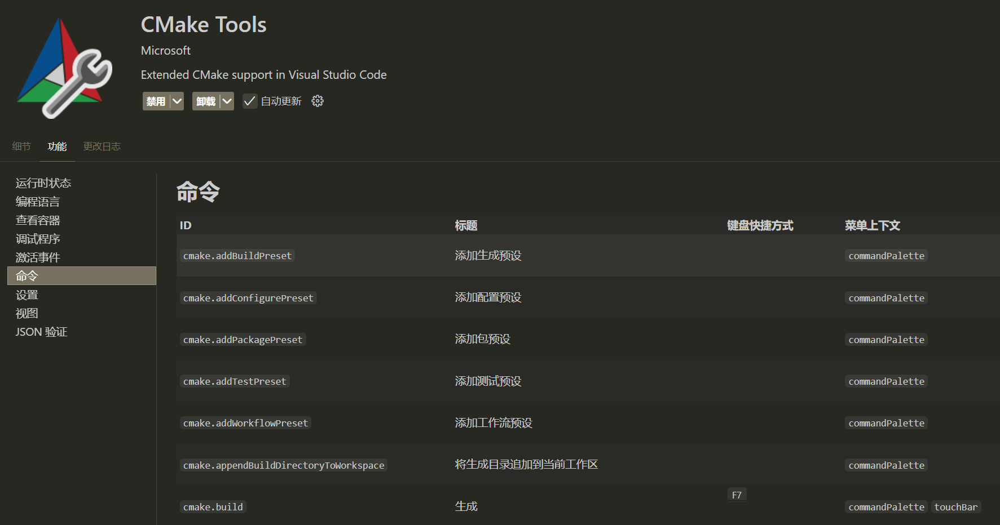


# 添加依赖

到这里，我们就可以开始修改代码（可算是进入正题了😓），添加一些想要的依赖了（<del>调包侠 yes！</del>），简单点，使用 Eigen 和 spdlog 做一个简单的矩阵运算吧。

首先在 [conan center](https://conan.io/center) 网站上查询需要使用包的版本

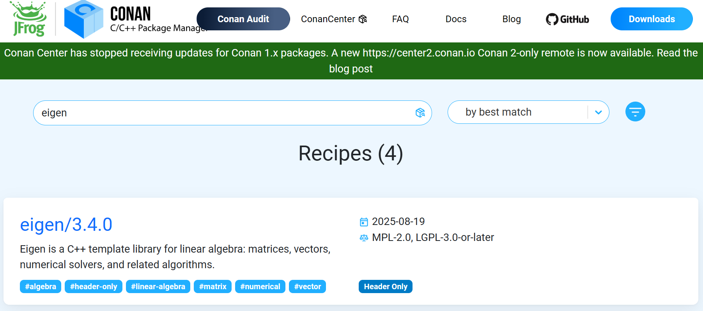

点击详情后，可以进一步查看如何在 `conanfile.py` 中引入这个包

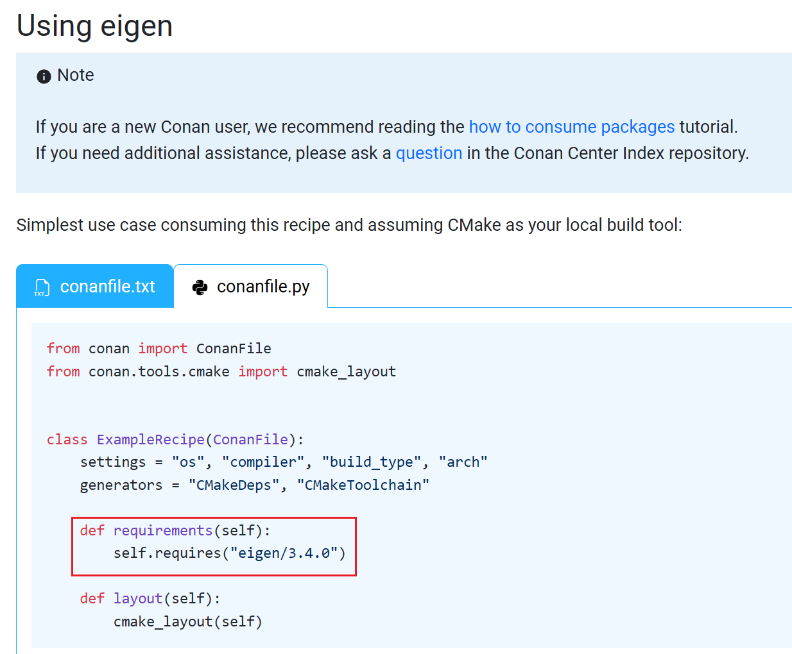

只需要修改 `conanfile.py`，创建 requirements 函数，并填写依赖即可，对于 spdlog 也是如此。

```python
def requirements(self):
    self.requires("eigen/3.4.0")
    self.requires("spdlog/1.15.3")
```

引入依赖后，需要重新调用一遍 conan install，会自动下载对应的包。

使用时，需要更改 CMakeLists.txt，通过 cmake 的 `find_package` 找到对应的包，将其链接到可执行程序上即可，在指引中也同样有写

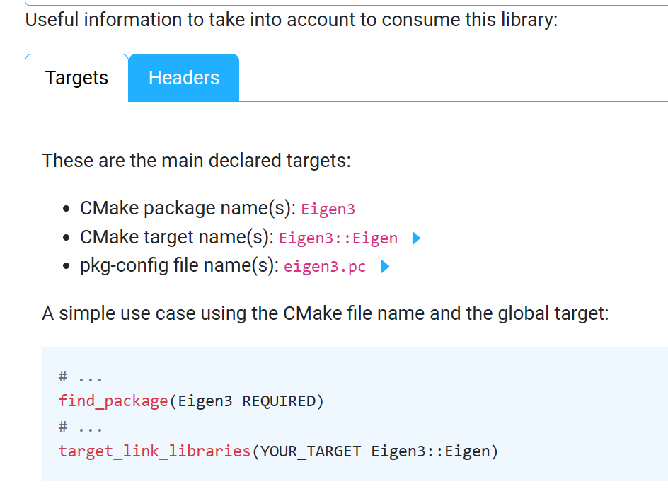

```cmake
find_package(Eigen3 REQUIRED)
find_package(spdlog REQUIRED)

target_link_libraries(${PROJECT_NAME} PRIVATE  Eigen3::Eigen spdlog::spdlog)
```

此时重新 configure 后，compile_commands.json 中包含了我们新引入了第三方依赖，就可以通过 clangd 进行代码补全了

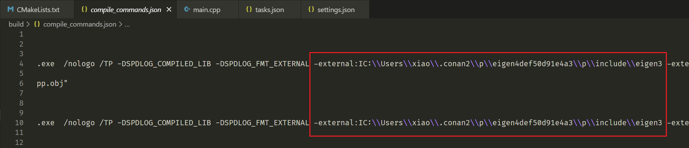


# 自定义 Conan 项目模板

从 VS Code 的配置过程可以发现，VS Code 作为一个文本编辑器，进行 C++ 的开发需要各种各样的配置，每次创建新项目十分繁琐，为了简化这一个配置过程，我们可以借助 conan 的模板项目，这样我们就可以减少重复操作，更加专注于代码本身了（想起了前端开发中各种代码模板生成工具）。

> 参考 Conan [创建项目模板文档](https://docs.conan.io/2/reference/commands/new.html#custom-templates)

conan 内置了一系列模板，这一部分是直接写在 conan 源码里的（具体路径为 `<Python安装目录>\Lib\site-packages\conaninternal\api\new`）

以 cmake_exe 为例，其模板目录结构如下（没错，**文件名也是可以时模板形式的**，便于使用 Jinja2 进行字符串替换）

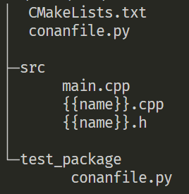

如果需要新增模板，**只需要拷贝整个模板目录文件夹至 `.conan2/templates/command/new` 目录下，然后使用模板目录的名称进行创建即可**。

例如我们创建了一个包含 vscode 相关配置的 cmake_exe 模板，命名为 `vscode_cmake_exe`，其目录结构如下

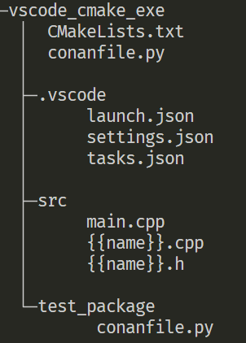

使用下面命令就可以导入模板并使用了

```bash
# step 1. 创建项目文件夹并切换到该目录
mkdir test_vscode_cmake_exe
cd test_vscode_cmake_exe
# step 2. 导入相关模板
conan new vscode_cmake_exe -d name=test
```

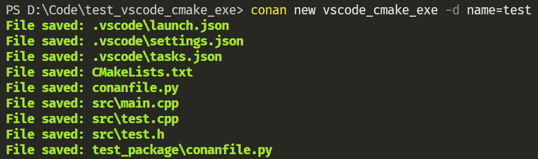

可以看到文件名中的 `{{name}}` 被替换成了指定的 `test`

> [!TIP]
>
> 个人也整理了一个自用的 VS Code CMake Conan 模板，并基于 Conan API 实现自动安装到对应路径。
>
> 仓库地址：https://github.com/PureWhiteVK/ConanTemplates.git

下载模板仓库后，使用命令 `python scripts/bootstrap_templates.py` 就可以自动创建VS Code的模板并拷贝模板到 Conan 用户目录下了

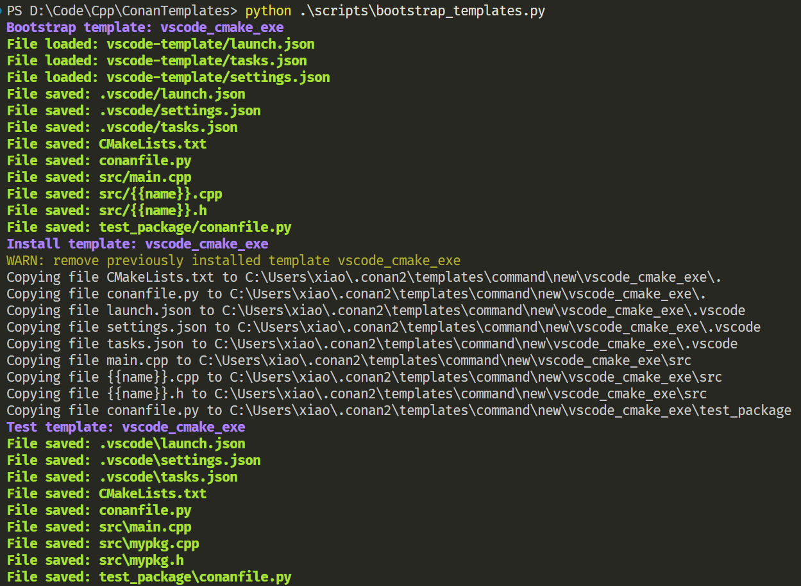
