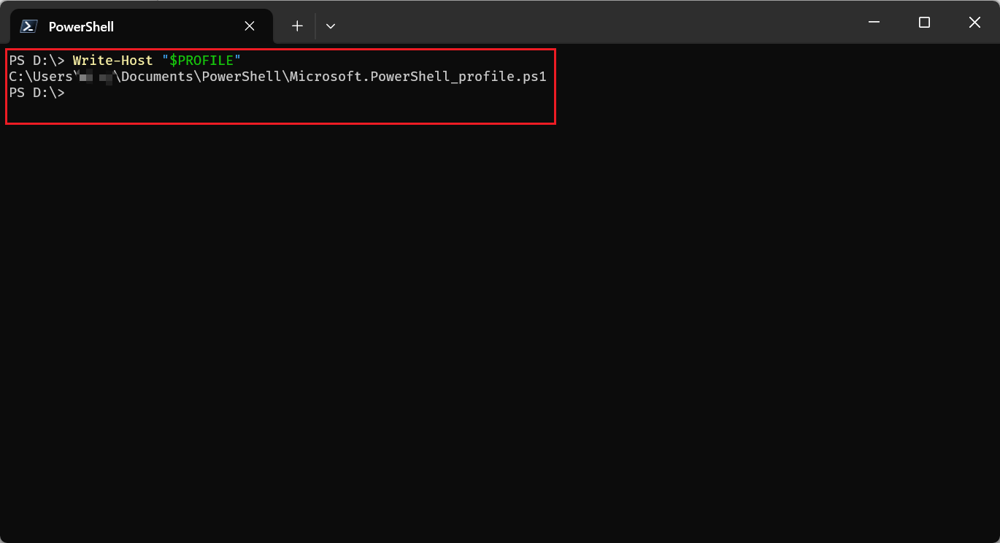
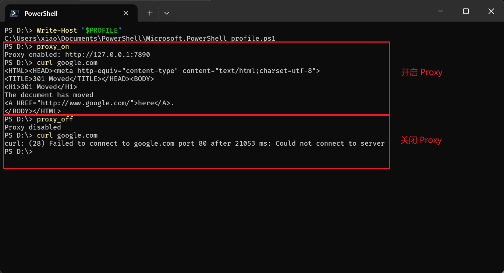
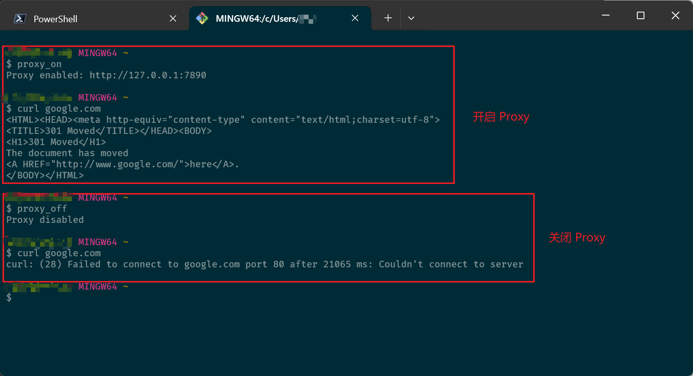
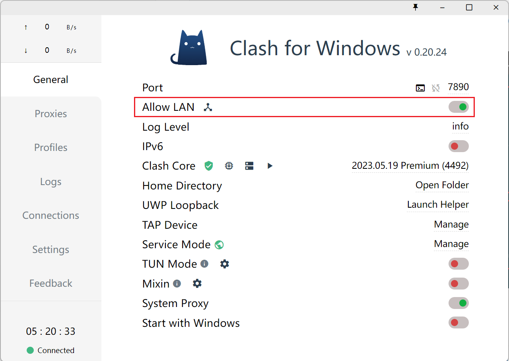
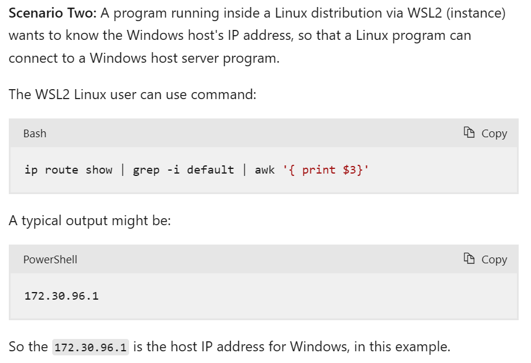

# Powershell 设置

通过 `$PROFILE` 变量，可以查询到 Powershell 默认加载的配置文件路径，如下所示



如果文件不存在，直接创建一个即可，然后填入下面两个预定义的函数（默认代理的地址为 `127.0.0.1:7890`，纪念天国的CFW🙏）

```powershell
function proxy_on {
    $proxy="http://127.0.0.1:7890"
    $Env:http_proxy = "$proxy"
    $Env:https_proxy = "$proxy"
    Write-Host "Proxy enabled: $proxy"
}

function proxy_off {
    Remove-Item Env:\http_proxy -ErrorAction SilentlyContinue
    Remove-Item Env:\https_proxy -ErrorAction SilentlyContinue
    Write-Host "Proxy disabled"
}
```

当更改完 `$PROFILE` 文件后，使用 `. $PROFILE` 加载更新后的配置文件，并通过简单的 `curl` 命令判断是否可用

<!-- more -->



（由于 cmd 并不支持 profile ，就无法编写类似的函数了，不过其基本思路也就是设置 `http_proxy` 和 删除 `http_proxy` 而已）

# Bash 设置

对于 bash 文件，也可以编写类似的脚本，修改 `~/.bashrc`，并插入如下内容

```bash
proxy_on() {
    local proxy="http://127.0.0.1:7890"
    export http_proxy="$proxy"
    export https_proxy="$proxy"
    echo "Proxy enabled: $proxy"
}

proxy_off() {
    unset http_proxy
    unset https_proxy
    echo "Proxy disabled"
}
```

更新完成后，使用 `source ~/.bashrc` （实际上也可以使用 `. ~/.bashrc`） 加载更新后的配置文件，并进行简单的验证




## WSL 设置

在 wsl 中设置代理和 bash 的设置十分相似，但是有一点区别，就是当我们在宿主机（Windows 机器）上开启了代理软件（例如 CFW）后，可以通过局域网走宿主机的代理，只需要CFW上开启了允许局域网代理即可，如下所示




之后要做的就是在 wsl 中查询到宿主机的局域网 ip 地址即可，这个在 [wsl 的官方文档](https://learn.microsoft.com/en-us/windows/wsl/networking#identify-ip-address)中已经给出示例



稍微修改一下 `proxy_on` 的代码就可以在 wsl 上也设置好代理了，如下所示

```bash
proxy_on() {
    local hostip="$(ip route show | grep -i default | awk '{ print $3}')"  
    local proxy="http://$hostip:7890"
    export http_proxy="$proxy"
    export https_proxy="$proxy"
    echo "Proxy enabled: $proxy"
}

proxy_off() {
    unset http_proxy
    unset https_proxy
    echo "Proxy disabled"
}
```


