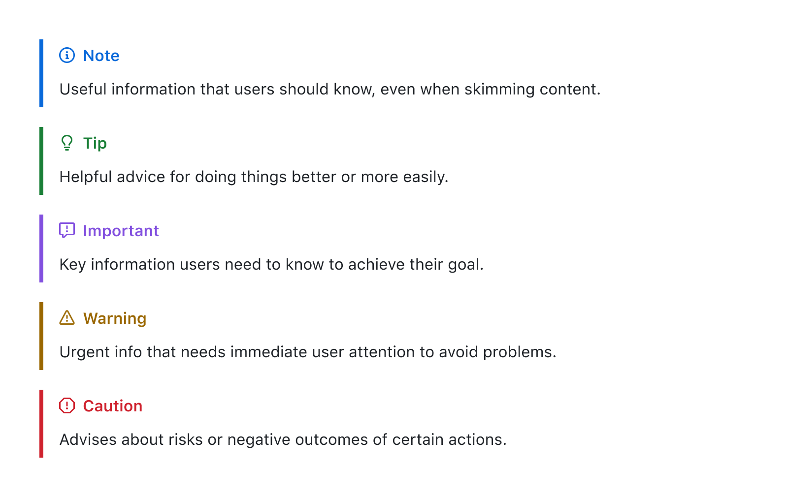
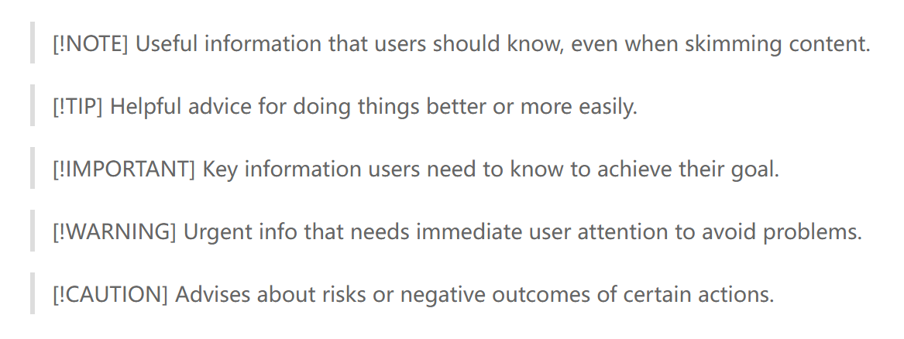
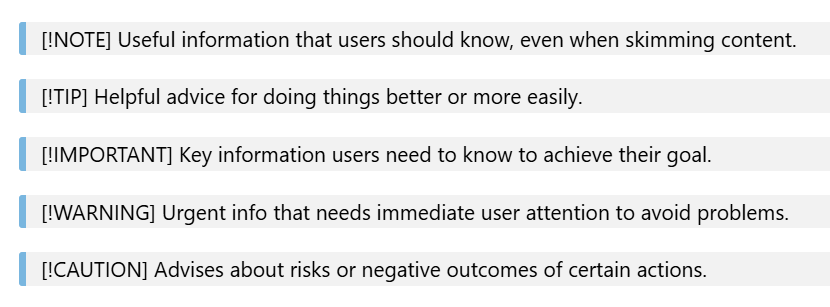
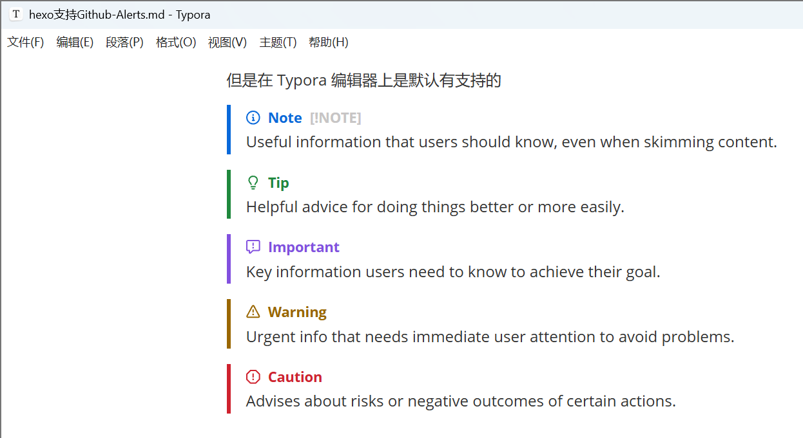
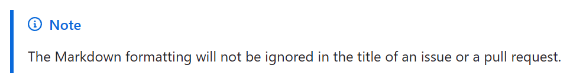
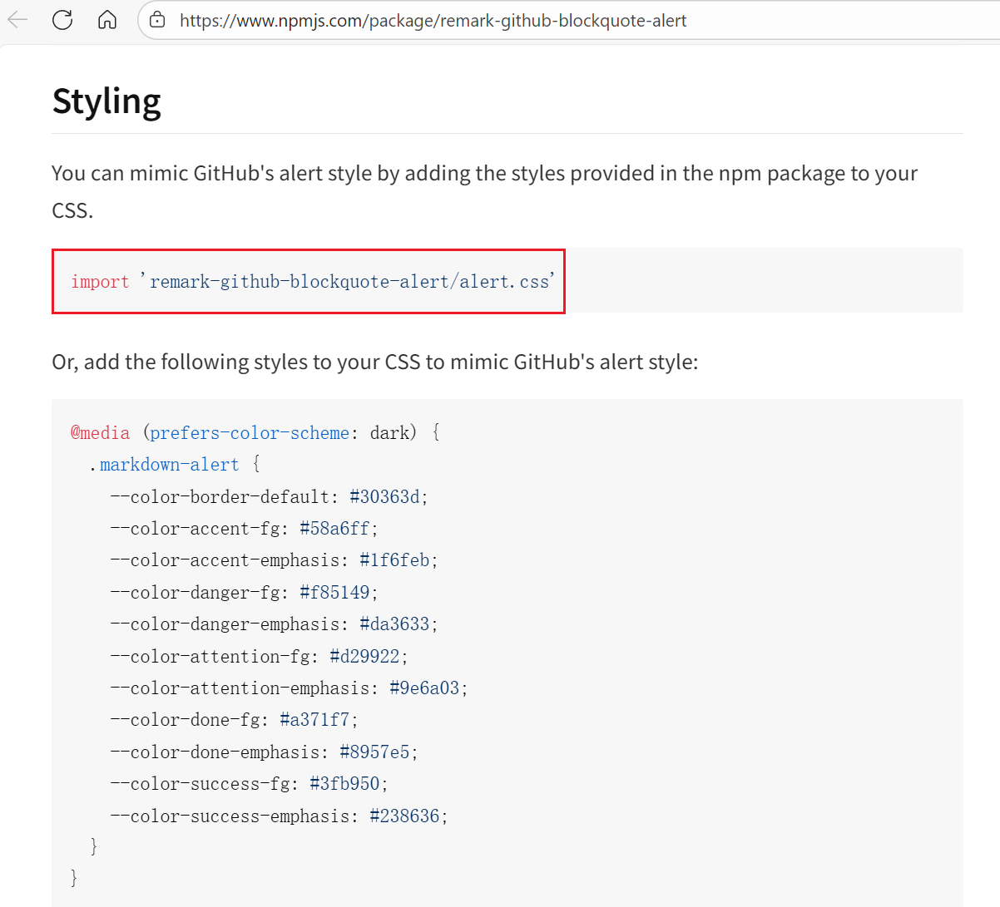
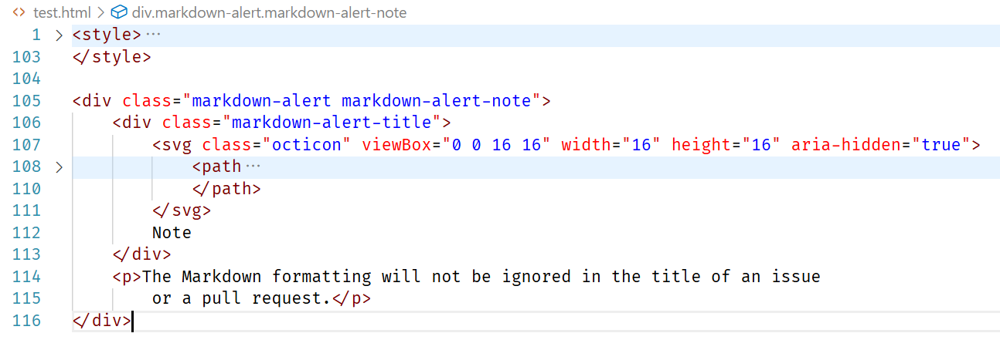
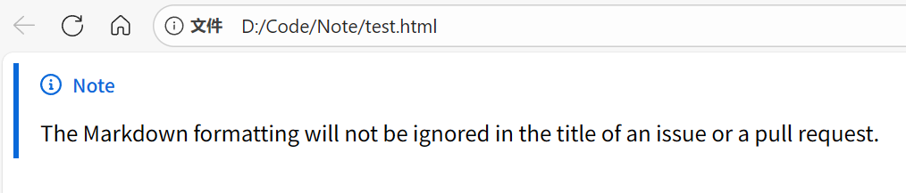

最近写博客时，我发现 GitHub Markdown 中提供的 [Alerts](https://docs.github.com/en/get-started/writing-on-github/getting-started-with-writing-and-formatting-on-github/basic-writing-and-formatting-syntax#alerts) 很有用，可以作为提示信息来展示。

它本质上是在 **引用文本（Quoting text）** 的基础上增加了一个特殊标记，从而在渲染时呈现出特殊的显示效果，对应的 Markdown 代码如下：

```markdown
> [!NOTE]
> Useful information that users should know, even when skimming content.

> [!TIP]
> Helpful advice for doing things better or more easily.

> [!IMPORTANT]
> Key information users need to know to achieve their goal.

> [!WARNING]
> Urgent info that needs immediate user attention to avoid problems.

> [!CAUTION]
> Advises about risks or negative outcomes of certain actions.
```

渲染结果如下：



本来我以为这是 [gfm（GitHub Flavored Markdown Spec）规范](https://github.github.com/gfm/)的一部分，后来才发现这其实是 GitHub 单独实现的功能，Hexo 默认并不支持。不过搜了一下，发现实现起来并不复杂，于是就用这篇博客记录一下实现过程。

<!-- more -->

# Alerts & Quoting

在 Hexo 中，如果直接添加 Alerts 的 Markdown 代码（使用的 Pandoc 版本为 3.0.1），渲染效果如下：



在 VS Code 中渲染时，情况也类似：



但是 Typora 编辑器默认支持这一语法（`[!NOTE]` 说明这个 Alert 仍然可编辑），渲染效果如下：



（正是因为 Typora 支持这种展示效果，才让我在编写文档时不自觉地加上了这个 Alert。结果发现 Hexo 和 VS Code 都不支持 😓，出于强迫症就把这个功能给它补上了，不然看着实在难受。）


# HTML 差异

既然想要支持类似的展示效果，首先要分析 Pandoc 转换得到的 HTML 代码与 GitHub 上展示的 HTML 代码之间有什么差异：

**原始 markdown 代码**

```markdown
> [!NOTE]
> The Markdown formatting will not be ignored in the title of an issue or a pull request.
```

渲染效果（[原始文章](https://docs.github.com/en/get-started/writing-on-github/getting-started-with-writing-and-formatting-on-github/basic-writing-and-formatting-syntax#ignoring-markdown-formatting)）：



**github alerts**

```html
<div class="ghd-alert ghd-alert-accent" data-container="alert">
    <p class="ghd-alert-title"><svg version="1.1" width="16" height="16" viewBox="0 0 16 16" class="octicon mr-2"
            aria-hidden="">
            <path
                d="M0 8a8 8 0 1 1 16 0A8 8 0 0 1 0 8Zm8-6.5a6.5 6.5 0 1 0 0 13 6.5 6.5 0 0 0 0-13ZM6.5 7.75A.75.75 0 0 1 7.25 7h1a.75.75 0 0 1 .75.75v2.75h.25a.75.75 0 0 1 0 1.5h-2a.75.75 0 0 1 0-1.5h.25v-2h-.25a.75.75 0 0 1-.75-.75ZM8 6a1 1 0 1 1 0-2 1 1 0 0 1 0 2Z">
            </path>
        </svg>Note</p>
    <p>
        The Markdown formatting will not be ignored in the title of an issue or a pull request.</p>
</div>
```

**pandoc generated（pandoc version 3.0.1）**

```html
<blockquote>
<p>[!NOTE] The Markdown formatting will not be ignored in the title of
an issue or a pull request.</p>
</blockquote>
```

此时 Pandoc 还不支持对 Alerts 的解析，仍然会将其按普通块引用来处理。

而根据 [Pandoc 最新版的 Markdown 文档](https://pandoc.org/MANUAL.html#extension-alerts)，只需要在转换时启用 `alerts` 扩展，就可以将其解析成上面 GitHub Alerts 的结构，转换命令如下（Pandoc version 3.8.0）：

```bash
pandoc -f gfm+alerts -t html5 -o test.html test.md
```

生成的 html 如下所示：

**pandoc generated (pandoc version 3.8.0)**

```html
<div class="note">
    <div class="title">
        <p>Note</p>
    </div>
    <p>The Markdown formatting will not be ignored in the title of an issue
        or a pull request.
    </p>
</div>
```

它会将整个 Alert 的内容放进一个 `div` 容器中，并将 `[!NOTE]` 这类类型标记转换为外层 `div` 容器的 class，同时单独为标题创建一个 `div` 容器，并将其 class 设置为 `title`。

对比 GitHub 版的 HTML，可以看到两个主要差异，都体现在 title 部分：

1. **外层容器不同**。GitHub 版 title 的外层容器是 `<p>`，而 Pandoc 版外层容器是 `<div>`。

    这是因为在 [Pandoc 的元素设计](https://pandoc.org/lua-filters.html#type-div)中，只有部分标签可以设置 class 属性，默认的 `Para` 元素并不支持附加 class 信息。好在 `<div>` 和 `<p>` 在这里的使用差异并不大，而且 Pandoc 版内部依然用 `<p>` 做了一层包裹。

2. Pandoc 版 **缺少 Alert 的 SVG 图标**。

第一个差异和 Pandoc 本身的设计有关，基本无法避免；但第二点可以结合 Pandoc 的 Lua filter 来处理。只要在转换过程中检测到 `<div class="title"><p></p></div>` 这一类结构，就可以在内部的 `<p>` 标签里插入 SVG 图标。

代码实现如下（[完整代码在这里](https://github.com/PureWhiteVK/PureWhiteVK.github.io/blob/c94115e285449cb8e644e0e466c000dde51cfe47/lua/image-asset.lua)）：

```lua
local function Div(div)
    -- check class list of <div> element
    local curr_alert_type, curr_icon = get_alert_type(div)
    -- check title element
    local title_element = get_title_element(div)
    if (curr_alert_type == nil or curr_icon == nil or title_element == nil) then
        return
    end
    -- override markdown-alert and markdown-alert-* class
    div.attr['classes'] = { 'markdown-alert', 'markdown-alert-' .. curr_alert_type }
    -- construct new title element
    div.content[1] = pandoc.Div(
        { 
            pandoc.RawInline('html', curr_icon), 
            pandoc.Str(capitalize_first(curr_alert_type)) 
        }, 
        {
            class = 'markdown-alert-title'
    	}
    )
    -- logging.temp('Div',div)
    return div
end
```

其中：

- `get_alert_type` 函数检查当前 `<div>` 标签的 class，判断是否有类似 `<div class="note">` 的类型声明，并根据 Alert 的类型返回对应类别的图标（原始的 SVG 代码）；
- `get_title_element` 函数遍历 `<div>` 标签下的子元素，返回包含 `<div class="title">` 的那个元素；
- `capitalize_first` 函数将单词的首字母大写，例如 `note` 转换为 `Note` 。

找到 Alert 块的根容器以及对应的 Alert 类型之后，就可以直接进行修改，插入 SVG 图标。这里必须使用 `pandoc.RawInline` 进行插入，否则 Pandoc 会把 SVG 解析成 base64 图片。之后再补上相应的 class 信息即可，具体如何使用见下一节。

应用 lua filter 后转换得到的 html 如下：

**pandoc generated (pandoc version 3.8.0 with lua-filter)**

```html
<div class="markdown-alert markdown-alert-note">
    <div class="markdown-alert-title">
        <svg class="octicon" viewBox="0 0 16 16" width="16" height="16" aria-hidden="true">
            <path
                d="M0 8a8 8 0 1 1 16 0A8 8 0 0 1 0 8Zm8-6.5a6.5 6.5 0 1 0 0 13 6.5 6.5 0 0 0 0-13ZM6.5 7.75A.75.75 0 0 1 7.25 7h1a.75.75 0 0 1 .75.75v2.75h.25a.75.75 0 0 1 0 1.5h-2a.75.75 0 0 1 0-1.5h.25v-2h-.25a.75.75 0 0 1-.75-.75ZM8 6a1 1 0 1 1 0-2 1 1 0 0 1 0 2Z">
            </path>
        </svg>
        Note
    </div>
    <p>The Markdown formatting will not be ignored in the title of an issue
        or a pull request.</p>
</div>
```

此时，Pandoc 生成的 HTML 与 GitHub 版之间就只剩下样式以及 title 外层容器类型的差异了，而 `<div>` 和 `<p>` 的区别可以暂时忽略，因此接下来只需要处理样式问题。

 

# 添加样式

原本我想直接照搬 GitHub 版的 Alert 样式，但里面似乎混杂了不少其他样式，而且我对 CSS 也不算熟，还是先看看有没有现成的库可以直接复用。

幸好，[remark-github-blockquote-alert](https://www.npmjs.com/package/remark-github-blockquote-alert) 可以满足我们的需求（好耶！💃）。



只需要在加载样式时一并引入 `remark-github-blockquote-alert/alert.css`，再补上指定的 class 即可。

有两处需要添加：

1. alert 最外层容器需要设置 `markdown-alert markdown-alert-<alert-type>` 两个类；
2. title 的最外层容器需要设置 `markdown-alert-title` 类。

先手动把 CSS 内容插入到 Pandoc 生成的 HTML 文件中，检查一下渲染效果。

**pandoc generated with css (pandoc version 3.8.0 with lua-filter)**

（代码太长直接贴图了，style 块中就是库提供的 css 内容）



渲染效果如下：

**pandoc generated with css**



**github alerts**


可以看到字体上还有一点细微差异，但整体已经足够满足需求了。（`<div>` 和 `<p>` 的差异，确实可以先不管了ね😀）

# Hexo 集成

最后一步，只需要让 Hexo 在渲染时自动加载这个 CSS 文件，就可以在网页上展示 Alert 了。这一步需要修改 Next 的配置文件 `_config.next.yml`，在 `custom_file_path` 中启用样式文件配置：

```diff
diff --git a/_config.next.yml b/_config.next.yml
index 796984f..dfde0a4 100644
--- a/_config.next.yml
+++ b/_config.next.yml
@@ -28,7 +28,7 @@ custom_file_path:
   #bodyEnd: source/_data/body-end.njk
   #variable: source/_data/variables.styl
   #mixin: source/_data/mixins.styl
-  # style: source/_data/styles.styl
+  style: source/_data/styles.styl
```

同时确保 `source/_data/styles.styl` 文件存在即可。为了避免手动拷贝，我又写了一个简单的 Hexo 插件来自动完成复制，代码如下：

***hexo-copy-alert-css.js***

```js
'use strict';

const fs = require('node:fs');
const path = require('node:path')

hexo.extend.filter.register("after_init", function () {
  const { log } = hexo;
  const alert_css_path = 'node_modules/remark-github-blockquote-alert/alert.css';
  const target_path = 'source/_data/styles.styl';
  const target_dir = path.dirname(target_path);
  log.debug(`Copy ${alert_css_path} to ${target_path}`);
  if (!fs.existsSync(target_dir)) {
    log.debug(`Create dir ${target_dir}`)
    fs.mkdirSync(target_dir);
  }
  fs.copyFileSync(alert_css_path, target_path);
});
```

这样一来，只要在 `package.json` 中安装了 `remark-github-blockquote-alert` 依赖，就可以直接拷贝包里提供的 alert.css，确保使用的是最新样式。（虽然感觉它大概率不会频繁变动，但有明确来源总归更安心一些。）

最后，直接在 Markdown 中写一段 Alert 内容，检查配置是否生效。


> [!NOTE]
> Useful information that users should know, even when skimming content.

> [!TIP]
> Helpful advice for doing things better or more easily.

> [!IMPORTANT]
> Key information users need to know to achieve their goal.

> [!WARNING]
> Urgent info that needs immediate user attention to avoid problems.

> [!CAUTION]
> Advises about risks or negative outcomes of certain actions.


如果能看到和文章开头一致的渲染效果，就说明配置成功了（😎）。