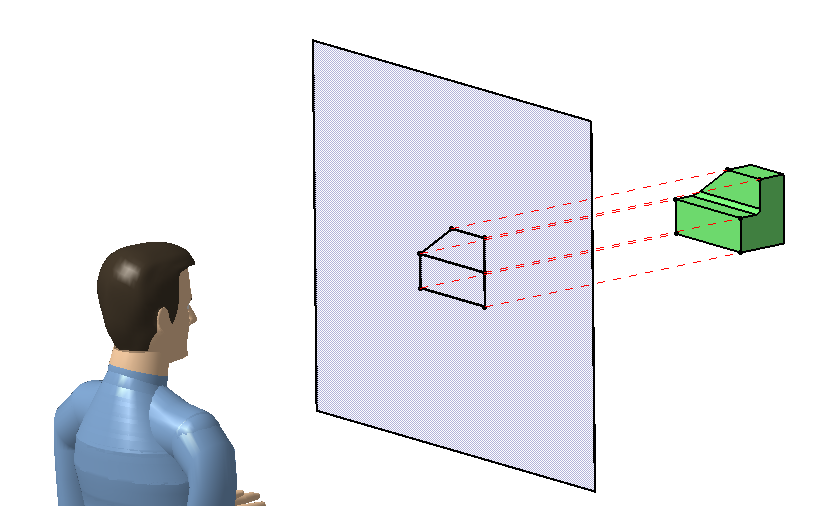
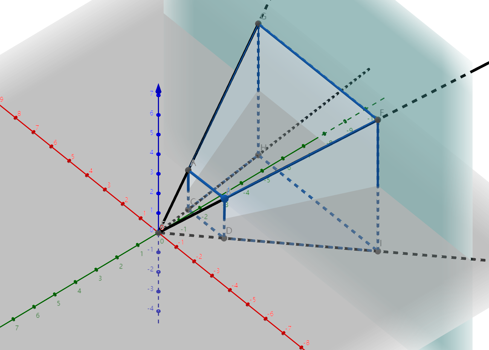
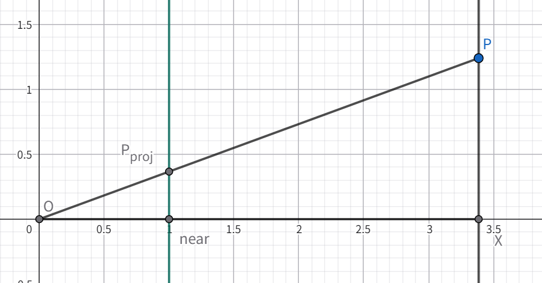
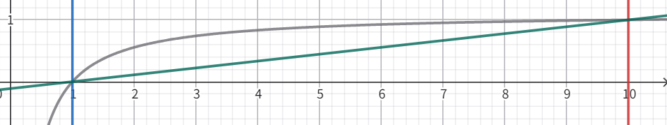

# Hello Projection

所谓投影，就是 **将高维空间中的对象，通过某种方式映射到低维或另外一个空间中**。如下图所示（图片来自网络）。

当在二维平面上展示三维物体时，其展示的是三维物体在二维空间上的一个投影，而这个三维到二维的转换过程就是投影变换。

如果投影过程是一个线性变换，则可以通过一个矩阵描述变换，如下式所示，其中 $M_\text{projection}$ 就称为投影变换矩阵。
$$
P^{\prime} = M_{\text{projection}} \cdot P
$$
<!-- more -->

# 正交投影

正交投影的一个特点就是不会改变线之间的平行关系，因此**待投影的区域一定会是一个长方体**，可以通过六个坐标信息 (l,r,t,b,n,f) 来代表这个长方体，分别代表 左，右，上，下，前，后 面的坐标（left,right,top,bottom,near,far) 。

满足（l<r,b<t,f<n，此处f小于n是因为我们从z轴的负向看去）。

**投影目标是将其将这个长方体中心移动至原点并转换成单位正方体**（也称为 NDC，normalized device coordinate）。

那么实际的正交投影矩阵就可由两个变换构成，平移变换和缩放变换。

单位正方体坐标为 (l,b,n) = (-1,-1,-1) ，(r,t,f) = (1,1,1)，此处n坐标就小于f坐标，符合我们正常的认知（从z轴正向看去，离得越远z坐标越大）

而实际待投影的长方体的长宽高和中心如下
$$
\begin{align*}
&(r-l,t-b,n-f) \\
&(\frac{r+l}{2},\frac{t+b}{2},\frac{n+f}{2})
\end{align*}
$$
因此我们首先将其中心移动至(0,0,0)，对应的转移矩阵为 
$$
T(\hat{t}) =
\left[
\begin{matrix}
	1 & 0 & 0 & -\frac{r+l}{2} \\
	0 & 1 & 0 & -\frac{t+b}{2} \\
	0 & 0 & 1 & -\frac{n+f}{2} \\
	0 & 0 & 0 & 1
\end{matrix}
\right]
$$
然后将长方体转换成标准正方体即可（正方体的边长为2）
$$
S(\hat{s}) = 
\left[
\begin{matrix}
	\frac{r-l}{2} & 0 & 0 & 0 \\
	0 & \frac{t-b}{2} & 0 & 0 \\
	0 & 0 & \frac{n-f}{2} & 0 \\
	0 & 0 & 0 & 1
\end{matrix}
\right]
$$
经过这两步之后实际上得到的单位正方体的前后坐标还是n大于f（n=1，f=-1），不太符合日常认知，可以对其z坐标做一个镜像将其转换成 n = -1,f = 1，只需要在z轴上取反即可
$$
M_z=
\left[
\begin{matrix}
	1 & 0 & 0 & 0 \\
	0 & 1 & 0 & 0 \\
	0 & 0 & -1 & 0 \\
	0 & 0 & 0 & 1
\end{matrix}
\right]
$$
最终组合这三个操作，就可以得到最终的正交投影矩阵
$$
\begin{align*}
P_O = M_zS(\hat{s})T(\hat{t}) & = 
\left[
\begin{matrix}
	1 & 0 & 0 & 0 \\
	0 & 1 & 0 & 0 \\
	0 & 0 & -1 & 0 \\
	0 & 0 & 0 & 1
\end{matrix}
\right]
\left[
\begin{matrix}
	\frac{2}{r-l} & 0 & 0 & 0 \\
	0 & \frac{2}{t-b} & 0 & 0 \\
	0 & 0 & \frac{2}{n-f} & 0 \\
	0 & 0 & 0 & 1
\end{matrix}
\right]
\left[
\begin{matrix}
	1 & 0 & 0 & -\frac{r+l}{2} \\
	0 & 1 & 0 & -\frac{t+b}{2} \\
	0 & 0 & 1 & -\frac{n+f}{2} \\
	0 & 0 & 0 & 1
\end{matrix}
\right]
\\ 
 & =
\left[
\begin{matrix}
	\frac{2}{r-l} & 0 & 0 & -\frac{r+l}{r-l} \\
	0 & \frac{2}{t-b} & 0 & -\frac{t+b}{t-b} \\
	0 & 0 & \frac{2}{f-n} & -\frac{n+f}{f-n} \\
	0 & 0 & 0 & 1
\end{matrix}
\right]
\end{align*}
$$

> [!NOTE]
>
> 上面写的稍微有点繁琐，因为 $n$ 和 $f$ 默认假设视角从原点看向 z 轴负向，坐标值都是小于 0 ，有 $f<n$。为保证长宽高的大小为正值，就会有 $n-f$ 为缩放长度。
>
> 实际上要确保 $n$ 在 ndc 下的 $z=-1$ 处，$f$ 在 ndc 下的 $z = 1$ 处，直接使用 $f-n$ 即可，其几何意义就是将 $[n,f]$ 区间直接缩放到 $[-1,1]$区间，二者是一样的，只不过这样一步到位隐含了一个方向反转的过程。

# 透视投影

和正交投影相比，透视投影满足近大远小的效果，平行的线在透视投影中将不再平行，会相交于一点，能体现出深度变化情况，让人看起来更有立体感。

因此，我们待投影的区域不再是一个长方体，而是一个平台锥（frustum，又称为视锥体），为了将这个锥体投影到2维平面中，我们首先需要将视锥体转换成长方体，之后再按照正交投影即可。

下面展示了视锥体的示意图：

简单推导一下如何将视锥体转换成长方体，从图中可以观察到3个性质：

1. 锥体中任意一点在n面上的投影为过原点和该点的连线同n面的交点，满足相似三角形性质，如下图所示：

   

2. 锥体的前面（n面，对应投影面）上的点坐标并不发生变化

3. 锥体的后面（f面）中心位置不会变化，即$(0,0,f)$投影后应该还是 $(0,0,f)$

首先根据**观察1：相似三角形**，满足如下公式
$$
\begin{align*}
\frac{x}{z} = \frac{x_{\text{proj}}}{n} & \quad x_{\text{proj}} = \frac{n}{z} \cdot x  \\
\frac{y}{z} = \frac{y_{\text{proj}}}{n} & \quad y_{\text{proj}} = \frac{n}{z} \cdot y\\
\end{align*}
$$
可以得出投影区域内任意一点 $(x,y,z,1)$ 在 n面上的投影为 $(\frac{n}{z}x,\frac{n}{z}y,?,1)$，同时乘上 $z$ 写成 $(nx,ny,?,z)$ ，此处投影后的 $z$ 值未知是因为投影到二维 $xy$ 平面上只需要$x$ 和 $y$ 即可，其 $z$ 值具体是多少还不知到，可以先写出转换矩阵的第1、2、4行：
$$
M_\text{perspective} =
\left[
\begin{matrix}
	n & 0 & 0 & 0 \\
	0 & n & 0 & 0 \\
	A & B & C & D \\
	0 & 0 & 1 & 0
\end{matrix}
\right]
$$
接下来就只剩下矩阵的第三行，使用前两个特点可以得出第三行取值：

由**观察2：n面上任意一点的坐标不会变化**，因此有
$$
\begin{align*}
P_1^{\prime} 
& = (x,y,n,1) \\ 
& = M_\text{perspective} P_1 \\ 
& = (nx,ny,Ax+By+Cn+D,n) \\
& = (nx,ny,n^2,n) 
\end{align*}
$$
可得出等式
$$
Ax + By + Cn + D = n^2
$$
又由于**该等式对投影区域内任意一点都成立**，因此A和B一定为0
$$
\begin{cases}
A = 0 \\
B = 0 \\
Cn + D = n^2
\end{cases}
$$
再由**观察3：f面中心坐标不变**，则有
$$
\begin{align*}
P_2^{\prime} 
& = (0,0,f,1) \\ 
& = M_\text{perspective}P_2 \\
& = (0,0,Cf+D,f)\\
& = (0,0,f^2,f)
\end{align*}
$$
即
$$
Cf + D = f^2
$$
联立两式可得
$$
\begin{cases}
Cn+D = n^2 \\
Cf+D = f^2
\end{cases}
$$
可得A和B如下
$$
\left\{
\begin{array}{ll}
C = n+f\\
D = -nf
\end{array}
\right.
$$
则可得完整的透视转换矩阵为
$$
\left[
\begin{matrix}
n & 0 & 0 & 0 \\
0 & n & 0 & 0 \\
0 & 0 & n+f & -nf \\
0 & 0 & 1 & 0
\end{matrix}
\right]
$$
经过转换之后，待投影区域已经变成一个长方体了，此时我们只需要使用正交投影将其转换为标准立方体即可
$$
P_P = P_OM_\text{perspective} = 
\left[
\begin{matrix}
\frac{2n}{r-l} & 0 & 0 & 0 \\
0 & \frac{2n}{t-b} & 0 & 0 \\
0 & 0 & \frac{f+n}{f-n} & -\frac{2nf}{f-n} \\
0 & 0 & 1 & 0
\end{matrix}
\right]
$$

此时矩阵的参数还有点多（6个），我们可以默认带投影区域是关于 $z$ 轴对称的，且观测点在原点，这样 $r-l$ 和 $t-b$ 就可以通过 aspect 和 fov 两个参数代替：
$$
\begin{align}
\text{w} & = r - l \\
\text{h} & = t - b \\
\text{aspect} & = \frac{\text{w}}{\text{h}} = \frac{r-l}{t-b} \\
\text{fov} & = 2 \arctan (\frac{\text{h}}{n}) \\
c &= \frac{2n}{t-b} = \frac{1}{\tan(\frac{\text{fov}}{2})} \\
a &= \text{aspect}
\end{align}
$$
这样，只需要 aspect，fov，near，far四个参数就可以得到最终的变换矩阵：

$$
P_P = P_OM_\text{perspective} = 
\left[
\begin{matrix}
\frac{c}{a} & 0 & 0 & 0 \\
0 & c & 0 & 0 \\
0 & 0 & \frac{f+n}{f-n} & -\frac{2nf}{f-n} \\
0 & 0 & 1 & 0
\end{matrix}
\right]
$$

通过矩阵计算后得到的是齐次坐标，执行透视除法得到投影后的三维NDC坐标：
$$
\begin{pmatrix}
x_\text{ndc}\\
y_\text{ndc}\\
z_\text{ndc}
\end{pmatrix}=
\begin{pmatrix}
{\tfrac {x_{c}}{w_{c}}}\\
{\tfrac {y_{c}}{w_{c}}}\\
{\tfrac {z_{c}}{w_{c}}}
\end{pmatrix}
$$

此时 $z_\text{ndc}$ 的取值范围为 $[-1,1]$，（原始 z 的取值范围为 $[n,f]$ ），如果需要变成 z-buffer 中实际存储的值，还需要进行一次线性变换（一般会自动在 viewport 变换中执行），将 $[-1,1]$ 区间转换到 $[0,1]$ 的区间内，变成 z-buffer 中实际存储的值，如下式所示：
$$
z_{\text{buffer}} = 0.5 * (z_{\text{ndc}} + 1)
$$

## 深度转换

在shader中常需要进行 $z_{\text{ndc}}$ 和原始坐标 $z$ 的转换，可以根据上面矩阵公式计算出其关系：
$$
\begin{align}
z_\text{ndc} & = 
\left(\frac{f+n}{f-n} \cdot z - \frac{2nf}{f-n}\right) 
\cdot \frac{1}{z} \\
		& = \frac{f+n}{f-n} - \frac{2nf}{(f-n) \cdot z} \\
z & = \frac{2nf}{f+n - (f-n)\cdot z_\text{ndc}}
\end{align}
$$

如果需要获得归一化的的线性深度，那么还需要将 $z$ 标准化到 $[0,1]$ 区间内，即
$$
z_{\text{depth01}} = \frac{z-n}{f-n}
$$
在实际情况下 n是一个很小的值，基本可以忽略不计，因此可以简化为 $\tilde{z}_{\text{depth01}} = z / f$ ，这样我们计算公式可以简化为
$$
\tilde{z}_\text{depth01} = \frac{2n}{f+n-(f-n) \cdot z_{ndc}}
$$
根据 $z_{\text{buffer}}$ 、$z_\text{depth01}$ 和 $z$ 之间的关系，可以绘制如下曲线（$n=1$，$f=10$） 

其中：

- 灰色曲线代表 $z_\text{buffer}$
- 绿色直线代表 $z_{\text{depth01}}$
- 蓝色和红色竖线代表 $n$ 和 $f$
- $x$ 轴对应原始的 $z$

从图中可以看出，$z$ 是线性增加的， 而 $z_\text{ndc}$ 并不是，而是随着 $z$ 的拉大，深度之间的差异越来越小。这也符合近大远小的要求（越近的物体对深度的精度要求更高）。

当我们需要进行深度比例的计算时，就需要使用线性深度值，此时可以将 $z_\text{ndc}$ 转换为 $z_\text{depth01}$ 后进行后续计算。