之前一直想知道各种三维软件中的虚拟网格是怎么绘制的，于是上网搜了一下相关实现。没想到里面的小细节还挺多，就用一篇博客记录一下吧 ( •̀ ω •́ )。

下图展示了 Blender 中网格的效果：

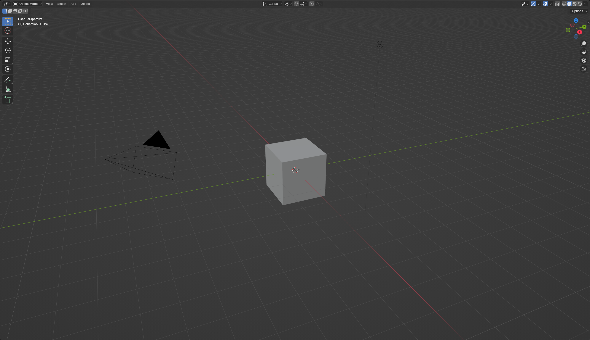

从图中可以看到几个基本特征：

1. 网格绘制在世界坐标系下的底面（在一般的右手系坐标系中，Z轴向上，X轴向前，Y轴向右），则对应 XY 平面；

   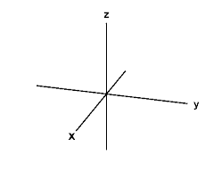

2. x 轴标记为红色 $(1,0,0)$，y 轴标记为绿色 $(0,1,0)$

3. 按照固定间隔绘制网格

<!-- more -->

$\require{physics}$

# 绘制二维网格

1. 在世界坐标系下添加一个超级大的三维实体平面（例如一个 $100 	\times 100$ 的平面），再通过网格图样生成平面的 texture，完成网格绘制。

2. 在屏幕空间中绘制一个虚拟平面，再在虚拟平面上绘制网格图样。

这两种思路都差不多，关键在于找到网格所在的平面，并在该平面上绘制网格样式。

两种方式最终都会回到网格图样本身的绘制，因此我们先考虑如何在二维平面上绘制网格。而在二维平面上绘制图样，这不是又回到了 [之前介绍的 Shader Toy](https://purewhitevk.github.io/posts/7ced/) 吗？在那篇文章中我们通过 Shader Toy 展示了二维网格的绘制效果，但并没有介绍其原理，这次就详细说明一下具体是如何绘制的。


## 绘制直线

网格是由一条条平行于坐标轴的直线构成的，每条直线的函数都类似于 $y=1$ 或 $x=2$。但要在二维空间中绘制 $x=1$ 这条直线，除了函数定义之外，还需要指定直线的宽度，例如 1 个像素、2 个像素，或者相对于屏幕宽度的百分比（例如 $0.1\%$）等。

设直线的宽度为 $w$，我们要绘制的实际上是由 $x=1-{w}/{2}$ 和 $x=1+w/2$  两条直线所围成的区域，即满足如下分段函数形式：
$$
L(x) = 
\begin{cases}
1, & 1-\frac{w}{2} \le x \le 1 + \frac{w}{2} \\[4pt]
0, & \text{else}
\end{cases}
$$
而在绘制直线时，只需要根据 $L(x)$ 的函数值进行绘制即可：值为 1 时绘制直线，值为 0 时不绘制。

对于 $x=1,w=0.02$，直线的可视化效果如下：

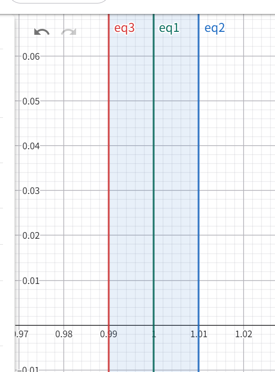

其中 eq1（中间绿色直线）为目标直线 $x=1$，eq2（右边蓝色直线）$x=0.99$ 和 eq3（左边红色直线）$x=1.01$ 是实际用于判断的边界直线。

对应到 fragment shader 中，直接根据 $w(x)$ 函数进行绘制即可，代码如下：

*2d_line.frag*

```glsl
#version 330 core
out vec4 FragColor;
uniform vec2 framebuffer_size;

void main()
{
  vec2 coord = gl_FragCoord.xy / framebuffer_size;
  float target_coord = 0.5;
  float line_width = 0.01;
  float draw_line = float(coord.x >= target_coord - line_width * 0.5 && coord.x <= target_coord + line_width * 0.5);
  FragColor = vec4(draw_line,0.0,0.0,1.0);
}
```

它在 $x=0.5$ 处绘制了一条宽度为 $0.01$ 的直线。这里的宽度是相对于屏幕宽度而言的，因此其实际像素宽度为 $\text{width} * 0.01$。在不同的 framebuffer 大小下，直线宽度也会随之变化。

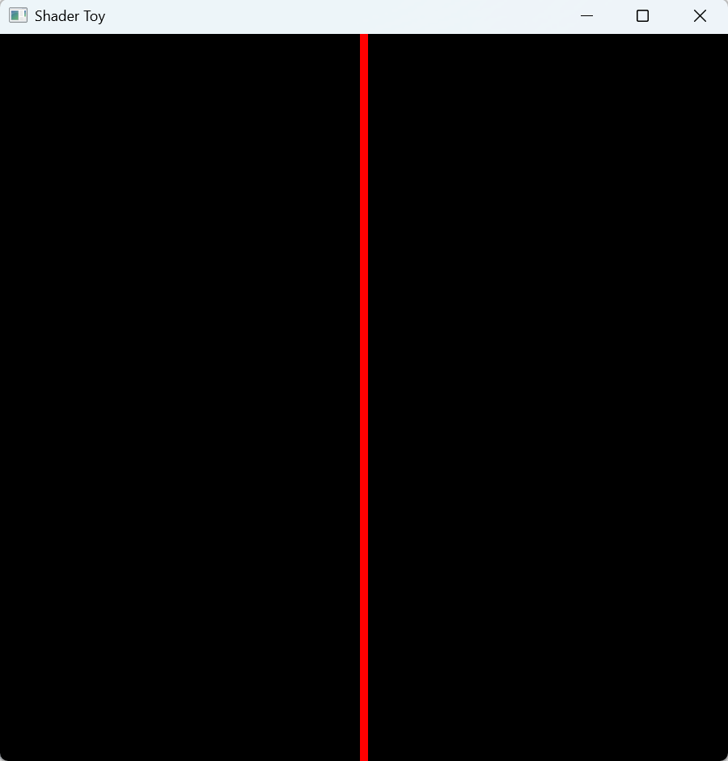

如果需要将其宽度指定为像素宽度，只需要在计算前将 line_width 的单位从百分比切换成像素宽度即可，如下所示：

*2d_line_fixed_width.frag*

```glsl
#version 330 core
out vec4 FragColor;
uniform vec2 framebuffer_size;

void main()
{
  vec2 coord = gl_FragCoord.xy / framebuffer_size;
  float target_coord = 0.5;
  float line_width = 1 / framebuffer_size.x;
  float draw_line = float(coord.x >= target_coord - line_width * 0.5 && coord.x <= target_coord + line_width * 0.5);
  FragColor = vec4(draw_line,0.0,0.0,1.0);
}
```

其中 `1 / framebuffer_size.x` 表示当直线宽度为 1 个像素时，对应的屏幕归一化宽度是多少，这样就可以确保直线宽度不随 framebuffer 大小变化。


## 绘制网格

网格的绘制本质上就是在 x 轴方向和 y 轴方向重复绘制多条直线，常见有两种实现方式。

第一种就是通过 for 循环方式，手动展开绘制，如下所示：

```
for X in [ 0.1,0.3,0.5,0.7,0.9 ]:
	draw_line x=X
for Y in [ 0.1,0.3,0.5,0.7,0.9 ]:
	draw_line y=Y
```

这种方式通过两个 for 循环，在 x 轴方向和 y 轴方向分别绘制 5 条直线，从而实现 grid 效果，对应的 shader 和渲染结果如下：

*2d_grid_for_loop.frag*

```glsl
#version 330 core
out vec4 FragColor;
uniform vec2 framebuffer_size;

float draw_x_line(vec2 coord,float x,float line_width) {
  return float(coord.x >= x - line_width * 0.5 && coord.x <= x + line_width * 0.5);
}

float draw_y_line(vec2 coord,float y,float line_width) {
  return float(coord.y >= y - line_width * 0.5 && coord.y <= y + line_width * 0.5);
}

void main()
{
  vec2 coord = gl_FragCoord.xy / framebuffer_size;
  float line_width = 4 / framebuffer_size.x;
  float draw = 0.0;
  draw += draw_x_line(coord,0.1,line_width);
  draw += draw_x_line(coord,0.3,line_width);
  draw += draw_x_line(coord,0.5,line_width);
  draw += draw_x_line(coord,0.7,line_width);
  draw += draw_x_line(coord,0.9,line_width);

  draw += draw_y_line(coord,0.1,line_width);
  draw += draw_y_line(coord,0.3,line_width);
  draw += draw_y_line(coord,0.5,line_width);
  draw += draw_y_line(coord,0.7,line_width);
  draw += draw_y_line(coord,0.9,line_width);

  
  FragColor = vec4(clamp(draw,0.0,1.0),0.0,0.0,1.0);
}
```

渲染结果如下：

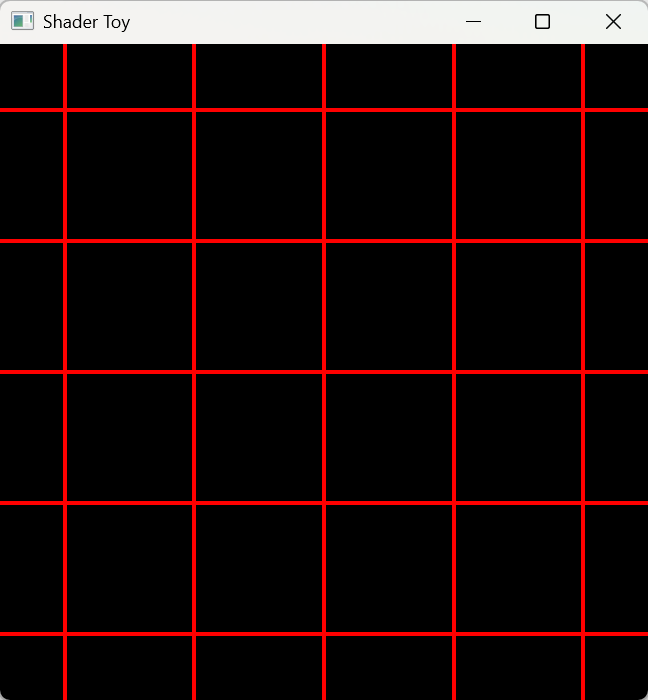

这种方式通过硬编码方式指定网格的分辨率，但写起来很臃肿，有没有其他办法呢？

当然是有的。我们假设网格间距固定为 $s = 0.1$（也就是两条 grid line 之间的距离为屏幕宽度的 10%），可以将 x 轴区间 $[-0.05,1.05]$ 划分成 11 个宽度为 0.1 的子区间，具体如下：

```
[-0.05,0.05] ,  [0.05,0.15] , [0.15,0.25],
[ 0.25,0.35] ,  [0.35,0.45] , [0.45,0.55],
[ 0.55,0.65] ,  [0.65,0.75] , [0.75,0.85],
[ 0.85,0.95] ,  [0.95,1.05]
```

可以推导出每个区间左右边界的统一表达式如下：
$$
[(k-0.5) \cdot s   ,(k+0.5) \cdot s] , k \in \mathcal{Z}
$$
而我们需要绘制的就是这些区间的中心，也就是 $x = k \cdot s$ 或 $y = k \cdot s$。因此直线的绘制区间可以写成如下形式，其中 $t$ 表示 $x$ 或 $y$，$w$ 表示直线宽度：
$$
k \cdot s - w \cdot 0.5 < t < k \cdot s + w \cdot 0.5
$$
> [!Tip]
>
> 此时绘制的 grid 会将 $[0,1]$ 均分为 $1/s$ 份，对应的直线坐标为 $[0,1/s,2/s,\cdots]$。
>
> 如果需要绘制经过 $(0.5,0.5)$ 的 grid，只需要将 $(x,y)$ 整体偏移 0.5 即可，也就是令 $x^{\prime} = x + 0.5, y^{\prime}=y+0.5$。

此时如果想判断一个已经归一化到 $[0,1]^2$ 的 fragment 坐标 $(x,y)$ 是否应该被绘制，本质上就是判断它是否落在任意一条直线的绘制区间内。对此，可以对上面的不等式做如下变形：
$$
\begin{align}
&k \cdot s - w \cdot 0.5 
< t <
k \cdot s + w \cdot 0.5 \\
\Rightarrow \; & - w \cdot 0.5 
< t - k \cdot s 
<
w \cdot 0.5  \\
\Rightarrow \; &
\left| t - k \cdot s \right|  < w \cdot 0.5
\end{align}
$$

下一步就是找到 $t$ 和 $k$ 的关系，把不等式进一步化成只关于 $t$ 的形式。还是沿用上面的例子，通过归纳不难发现，$t$ 和 $k$ 之间可以通过 floor 操作建立对应关系：

```
当 k = 0  时，t 位于 -0.05 到 0.05 间，中心为 0.0
当 k = 1  时，t 位于  0.05 到 0.15 间，中心为 0.1
当 k = 2  时，t 位于  0.15 到 0.25 间，中心为 0.2
当 k = 3  时，t 位于  0.25 到 0.35 间，中心为 0.3
...
当 k = 10 时，t 位于  0.95 到 1.05 间，中心为 1.0
```

$t$ 的取值范围为 $[0,1]$，$k$ 的取值范围为 $[0,1,\cdots,10]$，可以得到：
$$
k = \left\lfloor \frac{t}{0.1} + 0.5\right\rfloor
$$
其中 $\lfloor x \rfloor$ 表示向下取整操作，例如 $\lfloor0.1\rfloor=0$、$\lfloor2.1\rfloor=2$。对于任意指定的网格宽度，都可以将 $k$ 和 $t$ 的关系总结为：
$$
k = \left\lfloor\frac{t}{s} + 0.5\right\rfloor
$$
将 $k$ 和 $t$ 的关系代入上面的不等式，就可以得到最终的判定条件。令 $s^{\prime}=1/s$，有：
$$
\left| 
t \cdot s^\prime - 
\left\lfloor t \cdot {s^\prime} + 0.5\right\rfloor 
\right|  
< 
 w \cdot s^\prime
$$
最终在 2d 平面上的 shader 如下所示：

*2d_grid.frag*

```
#version 330 core
out vec4 FragColor;
uniform vec2 framebuffer_size;

void main()
{
  vec2 inv_scale = 1.0 / framebuffer_size;
  vec2 coord = gl_FragCoord.xy * inv_scale;
  float line_width = 2.0 * inv_scale.x;
  float draw = 0.0;
  vec2 grid_scale = vec2(20,20);
  vec2 range = line_width * grid_scale * 0.5;
  vec2 scaled_coord = (coord + 0.5) * grid_scale;
  vec2 coord_new = abs(scaled_coord - floor(scaled_coord + 0.5));
  draw = float(
    (abs(coord_new.x) < range.x) || 
    (abs(coord_new.y) < range.y)
  );
  FragColor = vec4(draw,0.0,0.0,1.0);
}
```

下图展示了 shader 的绘制效果：

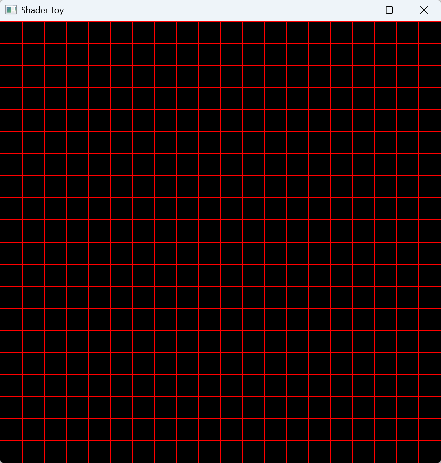


# 回到三维

在三维空间中，只需要准备一个三维平面，再配合 uv 坐标即可完成绘制。这个三维平面既可以在 shader 中生成，也可以通过一个长方形 mesh 来绘制。

## 绘制三维平面

直接绘制 mesh 的方式实现起来很简单，但是需要不断调整 mesh 的大小，才能确保它始终处于视野范围内。那么有没有更好的方式呢？

当然有。这种绘制方式通常称为 infinite grid，只需要一个 Draw Call 就可以绘制一个看起来无限大的网格。

其绘制过程包含 4 步：

1. 绘制一个 覆盖全屏幕的长方形
2. 对于屏幕空间上每一个像素点，构造一条从近平面经过该像素射向远平面的射线，并将其逆变换到世界坐标系下
3. 判断射线是否和世界坐标系下某个平面相交（例如 xz 平面）
4. 如果射线和平面相交，计算交点处的坐标和纹理坐标，通过二维网格绘制方法绘制网格

对于第 1 步和第 4 步，我们已经知道怎么做了。这里主要详细说明如何进行坐标逆变换，以及如何计算射线与平面的交点。

对于世界坐标系中的一点，在指定观察视角下通过透视投影绘制到屏幕空间时，会依次经过两个变换：视图变换（View transform）和投影变换（Projection transform），如下所示：
$$
p_{\text{NDC}} = P \cdot V \cdot p_{\text{world}}
$$
如果已知一个点在 NDC 下的坐标，就可以通过矩阵求逆来恢复它在世界坐标系中的坐标：
$$
p_{\text{world}} = V^{-1}\cdot P^{-1} \cdot p_{\text{NDC}}
$$
设屏幕空间（NDC）上一点的坐标为 $(x,y)$，则它在近平面上的齐次坐标可写为 $p_0=(x,y,-1,1)$，在远平面上的齐次坐标可写为 $p_1=(x,y,1,1)$。经过逆变换后，可得到它们在世界坐标系中的位置 $p^{\prime}_0=(x_0^\prime,y_0^\prime,z_0^\prime)$ 和 $p^{\prime}_1=(x_1^\prime,y_1^\prime,z_1^\prime)$。于是直线的参数方程为：
$$
l(t) = p^{\prime}_0 + t \cdot (p^{\prime}_{1} - p^{\prime}_{0})
$$
对于平面而言，其定义为：
$$
n \cdot (p-d) = 0
$$
其中 $n$ 表示平面的法向量，$d$ 表示平面上的一个已知点，$p$ 表示世界坐标系中的任意一点。

将直线的参数方程代入平面方程，就可以求出交点对应的参数 $t$：
$$
\begin{align}
n \cdot (p^{\prime}_0 + t & \cdot (p^{\prime}_{1} - p^{\prime}_{0})-d) = 0 \\
t& = \frac{d - n\cdot p^{\prime}_0}{p^{\prime}_{1} - p^{\prime}_{0}}
\end{align}
$$
以 XoZ 平面为例，它的法向量为 $(0,1,0)$，并且过原点 $(0,0,0)$。将其代入上式，可以得到交点 $p_{\text{i}}$ 对应的参数 $t_i$：
$$
t = - \frac{y^{\prime}_0}{y^{\prime}_1 - y^\prime_0} = \frac{y^{\prime}_0}{y^{\prime}_0 - y^\prime_1} \\
$$
这样我们就求出了射线与平面的交点，之后直接使用世界坐标进行绘制即可。以 XoZ 平面为例，可以将交点处的 xz 坐标作为 uv 值，再按照一定缩放比例套用前面提到的二维网格绘制方法。

下面给出第一版三维 grid 的完整代码。

*3d-grid-v1.vert*

```glsl
#version 330 core
uniform mat4 inv_view_proj;
// one giant triangle that covers the screen
const vec2 gridPlane[3] = vec2[3](
  vec2(-1.0,-1.0),
  vec2( 3.0,-1.0),
  vec2(-1.0, 3.0)
);
out vec3 near_point;
out vec3 far_point;
void main() {
    vec2 p = gridPlane[gl_VertexID];
    // near point in ndc coordinate
    vec4 point = inv_view_proj * vec4(p,-1.0,1.0);
    near_point = point.xyz / point.w;
    // far point in ndc corrdinate
    point = inv_view_proj * vec4(p,1.0,1.0);
    far_point = point.xyz / point.w;
    gl_Position = vec4(p,0.0, 1.0); // using directly the clipped coordinates
}
```

*3d-grid-v1.frag*

```glsl
#version 330 core
in vec3 near_point;
in vec3 far_point;
out vec4 out_color;

uniform mat4 proj_view;
uniform float near;
uniform float far;

uniform vec3 grid_color = vec3(0.1,0.1,0.1);
uniform float grid_size = 0.5;
uniform float grid_thickness = 1.5;

vec4 draw_grid(vec3 world_pos, float grid_size, float grid_thickness, bool draw_axis){
  vec2 grid_coord = world_pos.xz / grid_size;
  vec2 grid_dist_world = abs(grid_coord - floor(grid_coord + 0.5));
  float draw = float( 
    (abs(grid_dist_world.x) < grid_thickness) ||
    (abs(grid_dist_world.y) < grid_thickness)
  );
  return vec4(grid_color,draw);
}

void main() {
    float t = -near_point.y / (far_point.y - near_point.y);
    vec3 world_pos = near_point + t * (far_point - near_point);
    float draw_plane = float(t>0.0);
    vec4 color = draw_grid(world_pos,grid_size,grid_thickness,true);
    out_color = vec4(color.xyz,draw_plane * color.w);
}
```

C++ 侧的绘制部分只需要准备 shader 对应的 uniform 变量即可，如下所示：

```c++
if (draw_grid) {
  glm::mat4 proj_view = projection * view;
  glm::mat4 inv_view_proj = glm::inverse(proj_view);
  grid_shader.use();
  grid_shader.set_uniform("proj_view", proj_view);
  grid_shader.set_uniform("inv_view_proj", inv_view_proj);
  grid_shader.set_uniform("near", near);
  grid_shader.set_uniform("far", far);
  grid_shader.set_uniform("set_depth", static_cast<float>(set_depth));
  grid_shader.set_uniform("grid_size", grid_size);
  grid_shader.set_uniform("grid_thickness", grid_thickness1);
  glBindVertexArray(dummy_vao);
  glDrawArrays(GL_TRIANGLES, 0, 3);
}
```

由于我们在 vertex shader 中使用了一个覆盖整块屏幕的大三角形，因此这里只需要一个 Draw Call 就可以完成网格绘制。

最终效果如下图所示（固定 `grid_size` 为 0.5，`grid_thickness` 为 0.01）：

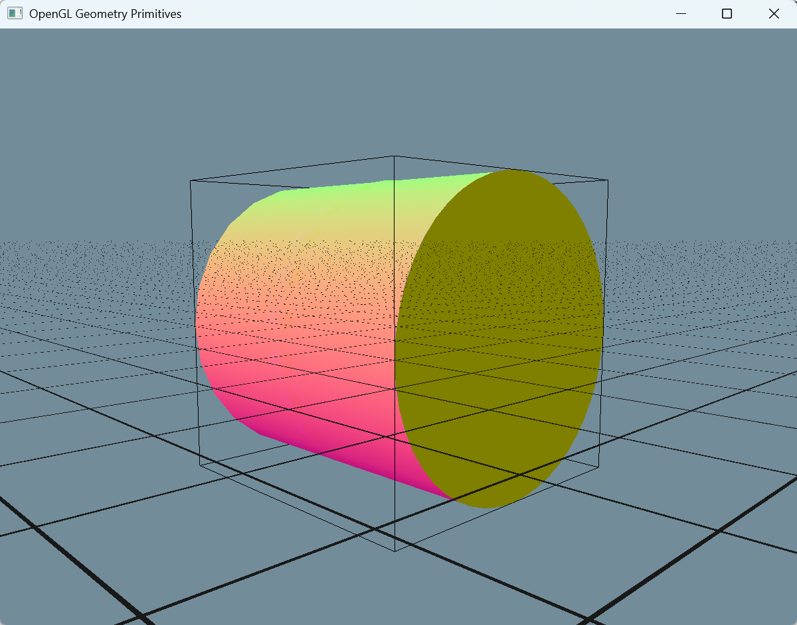

从图中可以看到还有几个需要改进的点：

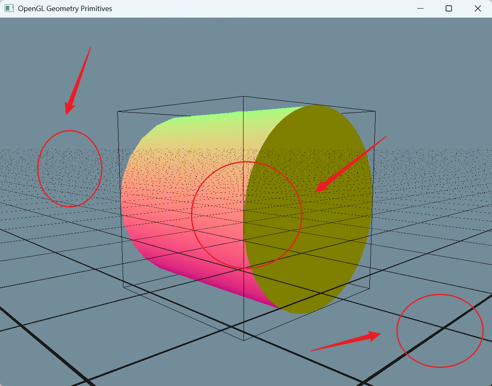

1. 线宽不统一，靠近相机的位置更粗，而远处几乎看不见。

2. 没有正确处理深度关系，立体感不强。


## 固定线宽

从二维网格的绘制原理可以知道，其关键在于下面这个公式：
$$
\left| 
c - 
\left\lfloor c + 0.5\right\rfloor 
\right|  
< 
d
$$
其中 $c$ 为某个二维坐标，而 $d$ 为网格的线宽。

为了更直观地理解这个公式，可以先画出函数 $y=\left|x-\left\lfloor{x}+0.5\right\rfloor\right|$ 的图像，如下图所示：

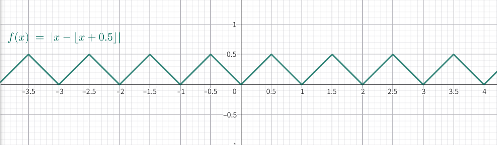

从图中可以看到，这是一个周期为 1 的锯齿状函数（后文简称为 $\text{grid}(x)$）。它的峰值为 0.5，而当 $y=0$ 时，对应的就是需要绘制 grid 的位置。

假设 $d=0.1$，我们实际需要绘制直线的区间就是下图中倒立的小三角形区域：

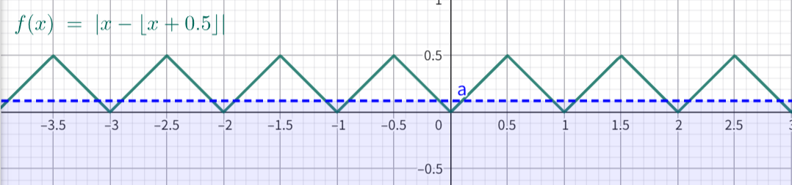

通过观察 $\text{grid}(x)$ 的函数图像，不难发现它的几何意义其实就是 **任意一点 $x$ 到最近整数（$0,1,\cdots$）的距离**。这也是为什么 $d$ 可以用来控制网格线宽的原因，因为实际线宽就是 $2d$。

那么为什么在三维场景下线宽看上去并不统一呢？

在透视投影下，天然有近大远小的特性，距离相机越近，看上去越大。对于网格也是一样，如果我们在近处和远处都使用相同的线宽，就会出现线宽不一致的问题。

为了让网格在当前观察视角下看起来始终保持一致，就需要根据视角动态调整线宽。**这就涉及屏幕坐标系和世界坐标系之间的尺度转换**，也就是要回答这样一个问题：

**在世界坐标系下的某一个点绘制直线时，需要绘制多宽的直线才能在屏幕上看起来宽度是 2 个像素？**

这个问题可以通过屏幕空间偏导数 $\frac{\partial f}{\partial u}$ 和 $\frac{\partial f}{\partial v}$ 来估计。以世界坐标 $(x,y,z)$ 为例，设 $f(x,y,z) = (x,y,z)$，则 $\frac{\partial f}{\partial u}$ 和 $\frac{\partial f}{\partial v}$ 分别表示沿屏幕空间 $u$、$v$ 方向变化一个像素时，世界坐标的变化情况。

反过来，利用它们的倒数就可以估计：当世界坐标变化一个单位时，屏幕空间上大约会变化多少个像素。

那么我们的目标函数 $\text{dist}$ 就可以转换成屏幕空间下的距离函数 $\text{dist}_{\text{s}}$ ：
$$
\text{dist}_\text{s} = 
\frac{\text{dist}}{
	\sqrt{ 
		\left(\frac{\partial f}{\partial u}\right)^2 + 
		\left(\frac{\partial f}{\partial v}\right)^2
	}
}
$$
其中 $\sqrt{ 
		\left(\frac{\partial f}{\partial u}\right)^2 + 
		\left(\frac{\partial f}{\partial v}\right)^2
	}$ 表示梯度 $\grad f = \left(\frac{\partial f}{\partial u},\frac{\partial f}{\partial v}\right)$ 的 $L^2$ 范数（梯度向量在二维空间上的长度，可以理解为是在梯度方向上的变化率是多少）。

在实际计算过程中，可以用差分方式近似，也就是利用相邻像素之间的值来计算：
$$
\begin{align}
\frac{\partial f}{\partial u} &\sim f(u+1,v) - f(u,v) \;\; \text{or} \;\; f(u,v) - f(u-1,v) \\
\frac{\partial f}{\partial v} &\sim f(u,v+1) - f(u,v) \;\; \text{or} \;\; f(u,v) - f(u,v-1)
\end{align}
$$
而 $\norm { \grad f}_2$ 可以通过 $\norm { \grad f } _1$ 进行近似：
$$
\norm { \grad f}_2 \sim \abs{\frac{\partial f}{\partial u}} +  \abs{\frac{\partial f}{\partial v}}
$$
这三个值分别可以在 shader 中通过 `dFdx`、`dFdy` 和 `fwidth` 来计算。利用 `fwidth`，就可以实现固定线宽的 grid 绘制，代码如下：

*3d-grid-v2.frag*

```glsl
#version 330 core
in vec3 near_point;
in vec3 far_point;
out vec4 out_color;

uniform mat4 proj_view;
uniform float near;
uniform float far;

uniform vec3 grid_color = vec3(0.1,0.1,0.1);
uniform float grid_size = 0.5;
uniform float grid_thickness = 1.5;

vec4 draw_grid(vec3 world_pos, float grid_size, float grid_thickness, bool draw_axis){
  vec2 grid_coord = world_pos.xz / grid_size;
  vec2 grid_dist_world = abs(grid_coord - floor(grid_coord + 0.5));
  vec2 grid_dist_screen = grid_dist_world / fwidth(grid_coord);
  float draw = float(
    (abs(grid_dist_screen.x) < grid_thickness) ||
    (abs(grid_dist_screen.y) < grid_thickness)
  );
  return vec4(grid_color,draw);
}

void main() {
    float t = -near_point.y / (far_point.y - near_point.y);
    vec3 world_pos = near_point + t * (far_point - near_point);
    float draw_plane = float(t>0.0);
    vec4 color = draw_grid(world_pos,grid_size,grid_thickness,true);
    out_color = vec4(color.xyz,draw_plane * color.w);
}
```

绘制效果如下：

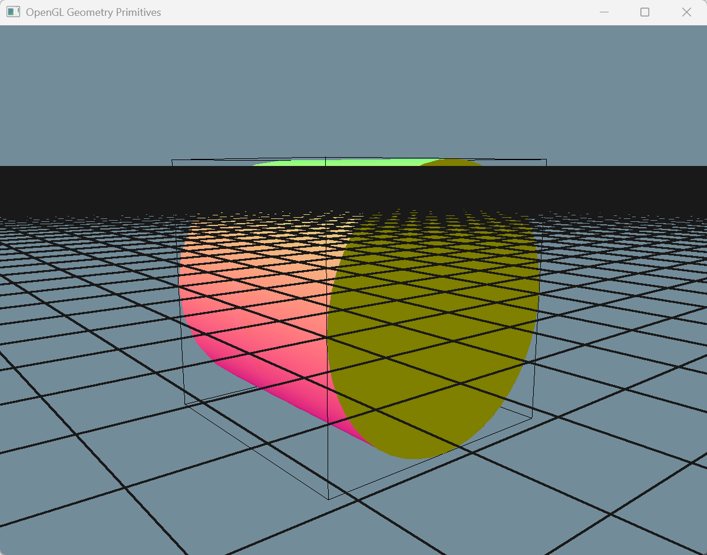

可以看到，此时线宽虽然固定了，但远处的 grid 直接变成了一片黑，看起来效果非常差。


## 深度处理

为了更好地呈现三维效果，我们需要确保网格能够被正常遮挡，不然看起来就和一张平面贴图差不多。

这就要求我们能够正确输出平面上的深度信息。做法也很直接，只需要在交点处重新计算深度即可：

按照正常的投影流程，先经过 View Transform 和 Project Transform 得到 NDC 坐标，再把深度信息写入 `gl_FragDepth`。

> [!Tip]
>
> 稍微需要注意的是，在 OpenGL 中，最终输出到深度缓冲的范围是 $[0,1]$，因此这里需要把 NDC 中的 z 坐标从 $[-1,1]$ 映射到 $[0,1]$。

相关 shader 代码如下：

```glsl
float compute_depth(vec3 pos) {
    vec4 clip_space_pos = proj_view * vec4(pos.xyz, 1.0);
    // re-arrange depth to 0~1
    return (clip_space_pos.z / clip_space_pos.w) * 0.5 + 0.5;
}
```

利用深度信息，还可以解决前面提到的“远处 grid 看起来一片黑”的问题。只需要把深度裁剪在一定范围内，并且为了避免过渡过于生硬，可以让 grid 的透明度随着深度逐渐变化。

由于默认输出的深度值并不是线性的，因此当我们需要基于深度做线性插值时，需要先把原始深度转换成线性深度，再进行计算。对应的 shader 代码如下：

```glsl
float compute_linear_depth01(float zndc) {
  float z01 = (2.0 * near) / (near + far - (far - near) * zndc);
  return z01;
}
```

> [!Note]
>
> 此处使用的是 NDC 坐标，也就是坐标范围为 $[-1,1]$。如果你手头的深度值已经被映射到了 $[0,1]$，则需要先重新缩放，确保输入仍然落在 $[-1,1]$。

对深度进行透明度插值的代码如下：

```
float depth_alpha = mix(max_depth,0.0,depth01);
```

最终完整代码如下：

*3d-grid-v3.frag*

```glsl
#version 330 core
in vec3 near_point;
in vec3 far_point;
out vec4 out_color;

uniform mat4 proj_view;
uniform float near;
uniform float far;

uniform vec3 grid_color = vec3(0.1,0.1,0.1);
uniform float grid_size = 0.5;
uniform float grid_thickness = 1.5;
uniform float max_depth = 0.5;
uniform float set_depth = 0.0;

float compute_depth(vec3 pos) {
    vec4 clip_space_pos = proj_view * vec4(pos.xyz, 1.0);
    // re-arrange depth to 0~1
    return (clip_space_pos.z / clip_space_pos.w) * 0.5 + 0.5;
}

float compute_linear_depth01(float zndc) {
  float z01 = (2.0 * near) / (near + far - (far - near) * zndc);
  return z01;
}

vec4 draw_grid(vec3 world_pos, float grid_size, float grid_thickness, bool draw_axis){
  vec2 grid_coord = world_pos.xz / grid_size;
  vec2 grid_dist_world = abs(grid_coord - floor(grid_coord + 0.5));
  vec2 grid_dist_screen = abs(grid_dist_world / fwidth(grid_coord));
  float min_grid_dist_screen = min(grid_dist_screen.x, grid_dist_screen.y);
  float draw = float(min_grid_dist_screen < grid_thickness);
  return vec4(grid_color,draw);
}

void main() {
    float t = -near_point.y / (far_point.y - near_point.y);
    vec3 world_pos = near_point + t * (far_point - near_point);
    float depth = compute_depth(world_pos);
    gl_FragDepth = set_depth * depth;
    float depth01 = compute_linear_depth01(depth * 2.0 - 1.0);
    float draw_depth = mix(max_depth,0.0,depth01);
    float draw_plane = float(t>0.0);
    vec4 color = draw_grid(world_pos,grid_size,grid_thickness,true);
    out_color = vec4(color.xyz,draw_depth * draw_plane * color.w);
}
```

可视化效果如下：

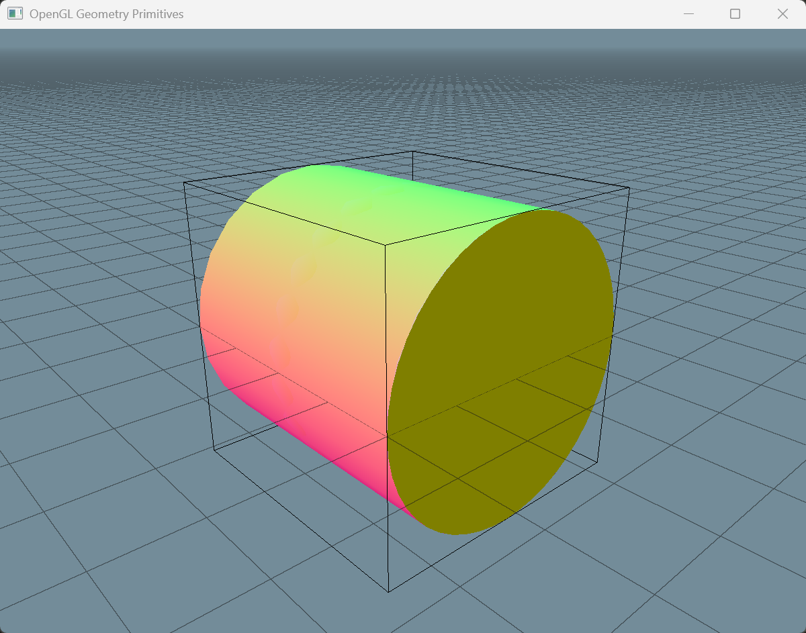


## 抗锯齿

可以看到，在远处的 grid 中出现了摩尔纹，局部放大后也能看到明显的锯齿状图样。

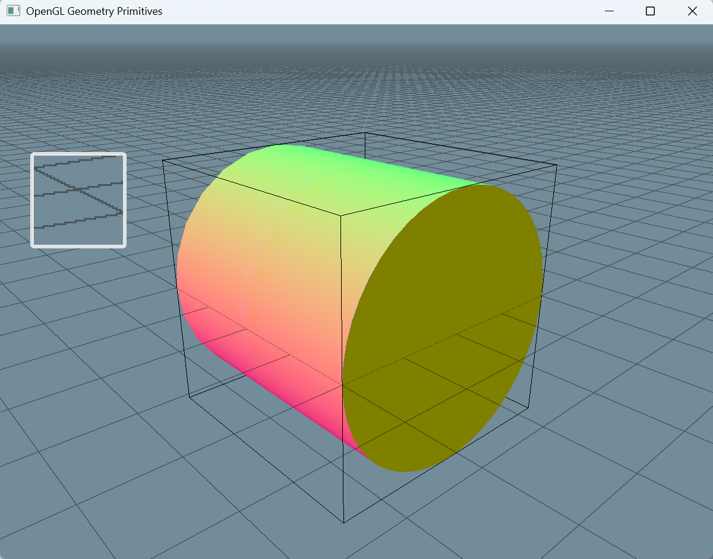

这是因为我们使用的是 clip 的方式进行绘制。只要 $\text{dist}_\text{s}$ 落在指定宽度范围内，就会把整个像素都绘制出来。如果实际绘制区域只覆盖了像素中的一部分，却把整个像素都点亮，就会出现锯齿（alias）；在高频区域中，则会进一步表现为摩尔纹。

要实现抗锯齿，本质上就是要估计网格在边界处对当前像素的覆盖率。当网格边界只覆盖了像素的一部分时，就把返回的颜色（或 alpha 值）设置为实际覆盖比例。

覆盖率计算如下图所示。在当前像素（红色方块）处，计算得到的距离为 2.7。由于这里使用的是像素中心点进行计算，因此实际像素对应的范围是 $(2.2,3.2)$。

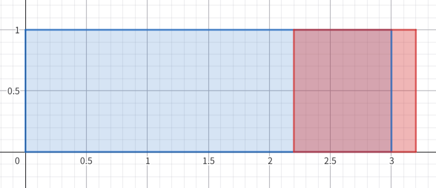

再结合网格线宽为 6，可以计算出该像素的覆盖率为 $6 \cross 0.5 - 2.7 + 0.5 = 0.8$。

这里额外加上的 0.5，对应的是像素自身被覆盖的那一部分。

将覆盖率的计算公式一般化，如下式所示：
$$
\text{cov} = \left(\frac{l}{2} -\text{dist}_{\text{s}} \right) + 0.5 \\
$$
当 cov 大于 1 时，说明像素一定被完全覆盖；当 cov 小于 0 时，说明像素一定不会被覆盖。

因此可以再加上一层 clamp 来限制结果范围。由于我们的 grid 同时包含两个方向的线，取两个方向中较大的 cov 作为最终覆盖率估计值，就可以写出加入抗锯齿之后的 shader 代码：

*3d-grid-v4.frag*

```glsl
#version 330 core
in vec3 near_point;
in vec3 far_point;
out vec4 out_color;

uniform mat4 proj_view;
uniform float near;
uniform float far;

uniform vec3 grid_color = vec3(0.1,0.1,0.1);
uniform float grid_size = 0.5;
uniform float grid_thickness = 2.0;
uniform float max_depth = 0.5;
uniform float set_depth = 0.0;

float compute_depth(vec3 pos) {
    vec4 clip_space_pos = proj_view * vec4(pos.xyz, 1.0);
    // re-arrange depth to 0~1
    return (clip_space_pos.z / clip_space_pos.w) * 0.5 + 0.5;
}

float compute_linear_depth01(float zndc) {
  float z01 = (2.0 * near) / (near + far - (far - near) * zndc);
  return z01;
}

vec4 draw_grid(vec3 world_pos, float grid_size, float grid_thickness, bool draw_axis){
  vec2 grid_coord = world_pos.xz / grid_size;
  vec2 grid_dist_world = abs(grid_coord - floor(grid_coord + 0.5));
  vec2 grid_dist_screen = grid_dist_world / fwidth(grid_coord);
  vec2 cov = clamp((grid_thickness * 0.5 - grid_dist_screen) + 0.5,0.0,1.0);
  float draw4 = max(cov.x,cov.y);
  return vec4(grid_color,draw4);
}

void main() {
    float t = -near_point.y / (far_point.y - near_point.y);
    vec3 world_pos = near_point + t * (far_point - near_point);
    float depth = compute_depth(world_pos);
    gl_FragDepth = set_depth * depth;
    float depth01 = compute_linear_depth01(depth * 2.0 - 1.0);
    float draw_depth = mix(max_depth,0.0,depth01);
    float draw_plane = float(t>0.0);
    vec4 color = draw_grid(world_pos,grid_size,grid_thickness,true);
    out_color = vec4(color.xyz,draw_depth * draw_plane * color.w);
}
```

和未开启抗锯齿之前的绘制效果对比如下：

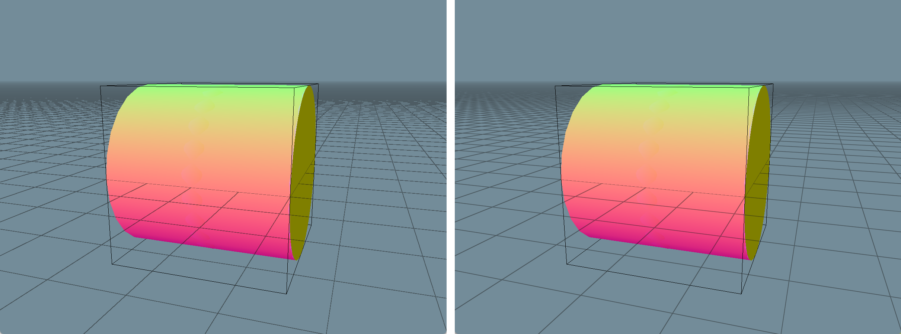

## 细节处理

到此为止，我们绘制的 grid 已经基本能看了。对比 Blender 中的网格效果，还剩下最后 3 个细节：

1. 在 $x = 0$ 和 $y = 0$ 处，grid 的颜色需要有所区别。
2. 每个大 grid 中包含若干小 grid，并且大 grid 的线宽更宽。
3. 远处的 grid 会逐渐消失，这一点不同于前面提到的 depth fading。

为了实现第一个效果，我们需要在绘制时判断当前直线是否位于特殊网格线上。以 $x=0$ 为例，只要判断当前世界坐标是否落在 $x=0$ 的绘制范围内即可，如下所示：
$$
\begin{align}
\frac{\abs{x}}{w} &< \frac{l}{2} \\
\abs{x} &< \frac{l}{2} \cdot w
\end{align}
$$
其中 $w$ 就是之前利用 `fwidth` 计算得到的“一个像素对应的 grid 长度”，$l$ 为线宽，单位是像素。

对于第二个效果，我们只需要分别绘制不同分辨率的 grid，再把结果通过 alpha 混合起来即可。

对于第三个效果，本质上是为了解决远处 grid 糊成一片的问题。由于远处的 grid 非常密，一个像素可能同时覆盖多条网格线，因此我们可以在绘制时判断 grid 在屏幕空间中的大小。如果 grid 太小（例如小于 1 px），就直接不绘制；当然，也可以通过 smoothstep 实现更平滑的过渡。

最终完整代码如下：

*3d-grid-v5.frag*

```glsl
#version 330 core
in vec3 near_point;
in vec3 far_point;
out vec4 out_color;

uniform mat4 proj_view;
uniform float near;
uniform float far;

uniform vec3 grid_color = vec3(0.1,0.1,0.1);
uniform float grid_size = 0.5;
uniform float minor_grid_scale = 5;
uniform float grid_fade_size = 5.0;
uniform float grid_thickness = 2.0;
uniform float max_depth = 0.5;

float compute_depth(vec3 pos) {
    vec4 clip_space_pos = proj_view * vec4(pos.xyz, 1.0);
    // re-arrange depth to 0~1
    return (clip_space_pos.z / clip_space_pos.w) * 0.5 + 0.5;
}

float compute_linear_depth01(float zndc) {
  float z01 = (2.0 * near) / (near + far - (far - near) * zndc);
  return z01;
}

vec4 draw_grid(vec3 world_pos, float grid_size, float grid_thickness, float fade_size){
  vec2 grid_coord = world_pos.xz / grid_size;
  vec2 grid_dist_world = abs(grid_coord - floor(grid_coord + 0.5));
  vec2 grid_size_scaler = fwidth(grid_coord);
  // grid size in screen space
  vec2 grid_size_pixel = 1.0 / grid_size_scaler;
  float min_spacing = min(grid_size_pixel.x,grid_size_pixel.y);
  float size_fade = smoothstep(0.0,fade_size,min_spacing);
  vec2 grid_dist_screen = grid_dist_world * grid_size_pixel;
  float half_grid_thickness = 0.5 * grid_thickness;
  vec2 cov = clamp((half_grid_thickness - grid_dist_screen) + 0.5,0.0,1.0);
  float draw = max(cov.x,cov.y);
  float x_axis = float(abs(grid_coord.x) < half_grid_thickness * grid_size_scaler.x);
  float z_axis = float(abs(grid_coord.y) < half_grid_thickness * grid_size_scaler.y);
  vec3 color = x_axis * (1.0 - z_axis) * vec3(1.0,0.0,0.0) + 
               z_axis * (1.0 - x_axis) * vec3(0.0,0.0,1.0) + 
               step(x_axis + z_axis,0.5) * grid_color;
  return vec4(color, draw * size_fade);
}

vec4 alpha_blend(vec4 fg, vec4 bg) {
  return vec4(
    fg.rgb * fg.a + bg.rgb * (1.0 - fg.a),
    fg.a + bg.a * (1.0 - fg.a)
  );
}

void main() {
    float t = -near_point.y / (far_point.y - near_point.y);
    vec3 world_pos = near_point + t * (far_point - near_point);
    float depth = compute_depth(world_pos);
    float linear_depth = compute_linear_depth01(depth * 2.0 - 1.0);
    gl_FragDepth = depth;
    float draw_depth = mix(1.0,0.0,max(linear_depth,max_depth));
    float draw_plane = float(t>0.0);
    // minor grid
    vec4 color1 = draw_grid(
        world_pos,grid_size, grid_thickness * 0.5, grid_fade_size);
    // major grid
    vec4 color2 = draw_grid(
        world_pos,grid_size * minor_grid_scale, 
        grid_thickness, grid_fade_size * minor_grid_scale);
    // alpha blend two color (color1 is base, and color2 is foreground)
    vec4 color = alpha_blend(color2, color1);
    out_color = vec4(
      color.rgb,
      draw_depth * draw_plane * color.a
    );
}
```

最后给一个完整效果：

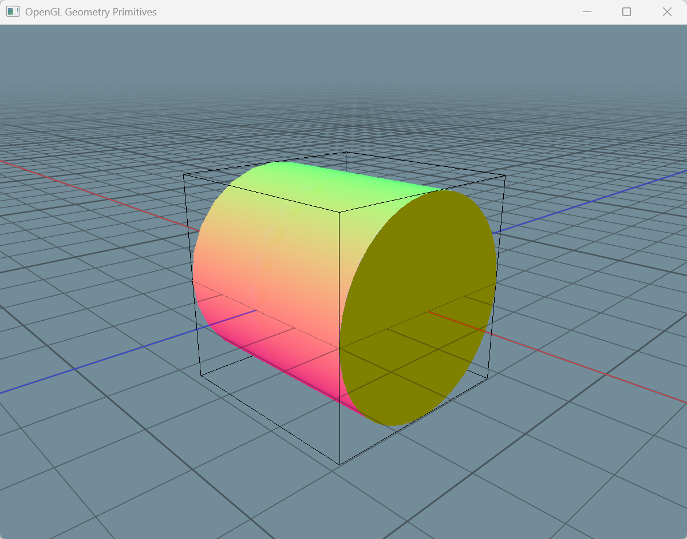

