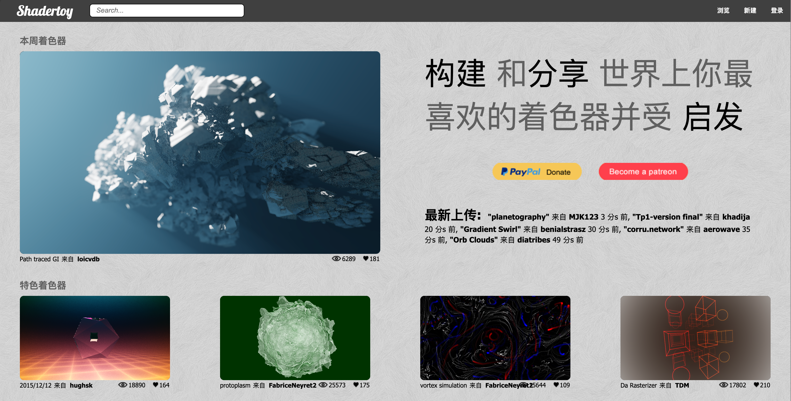
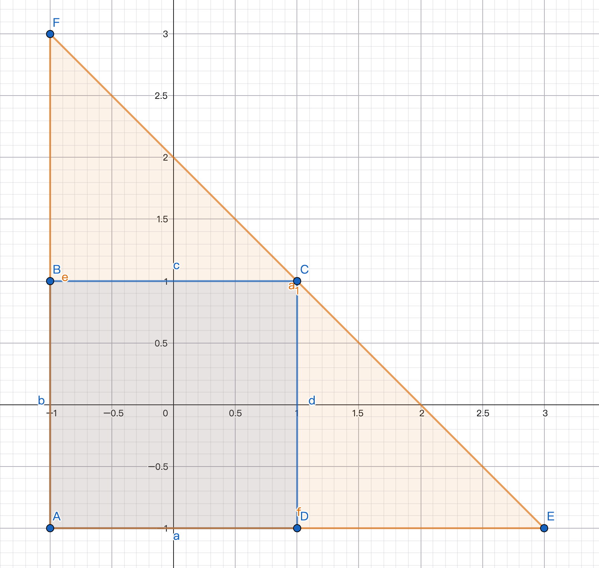
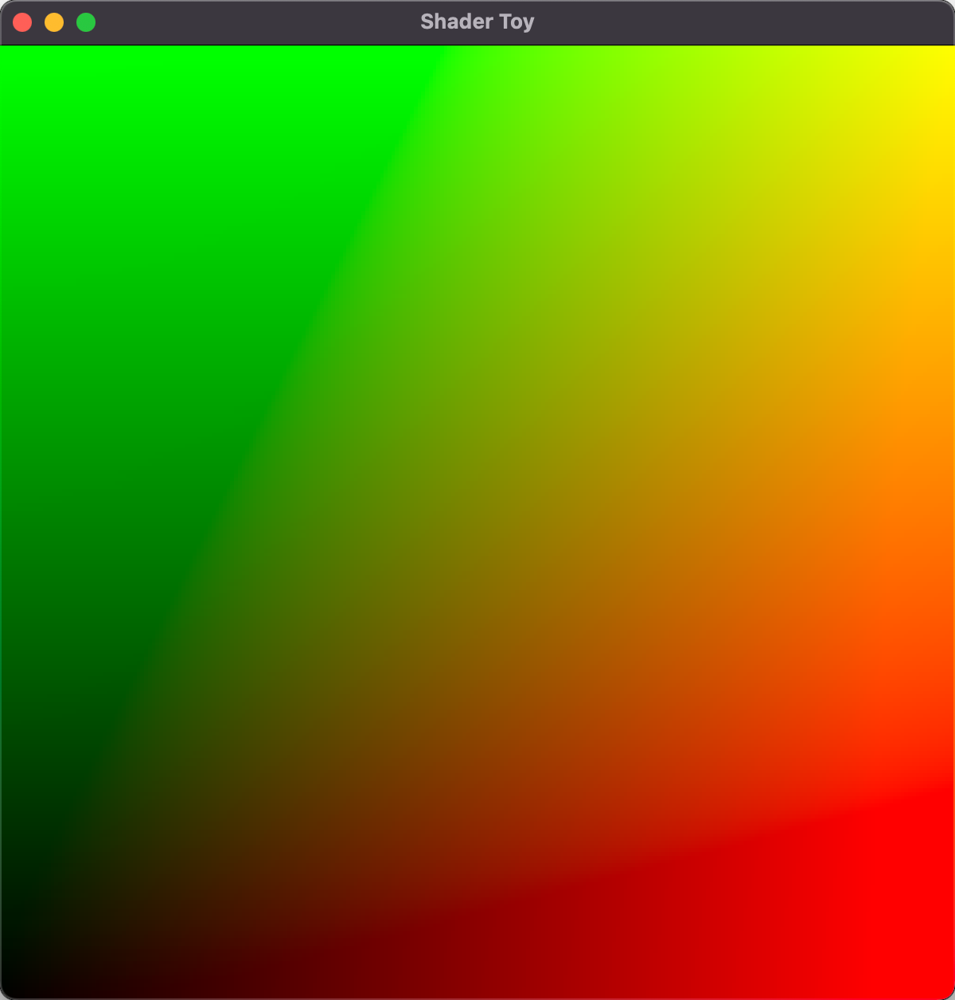
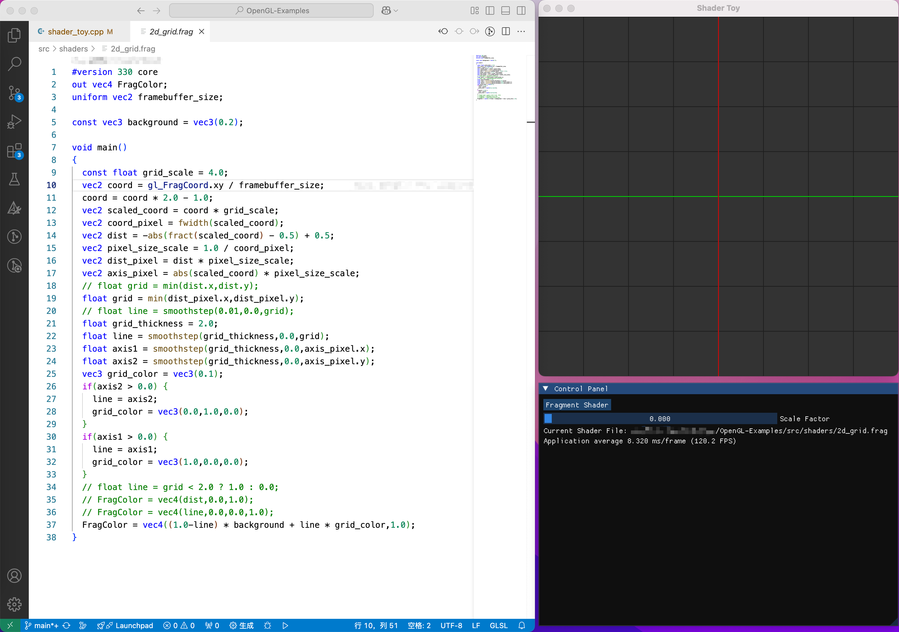

# Hello, Shader Toy

Shader（着色器）简单来说就是**运行在 GPU 上的一小段程序**，用于控制图形渲染的方式。

> 在传统渲染管线中，GPU 会自动执行一套固定流程，而 Shader 的出现让开发者能够自定义其中的一部分流程，从而实现更灵活、更复杂的图形效果。

[Shader Toy](https://www.shadertoy.com/) 是一个在线的 Shader 编写和展示网站，可以实时展示 Shader 编程效果。



在图形 API（OpenGL）中，支持多种 Shader 类型：

- Vertex Shader（顶点着色器）
- Tessellation Shader（细分着色器）
- Geometry Shader（几何着色器）
- Fragment Shader（片段着色器）
- Compute Shader（计算着色器）

而在 Shader Toy 中，所谓的 Shader 通常特指 Fragment Shader。它的输入可以理解为一个覆盖整个显示区域的平面，因此我们可以在 Fragment Shader 中决定显示区域内每一个像素的颜色（RGBA）。

<!-- more -->

# Full Screen Triangle

由于 OpenGL 会自动进行 clipping，也就是丢弃不在显示区域内的 fragment，因此绘制时并不一定真的需要一个四边形（也就是两个三角形），只要用一个足够大的三角形覆盖整个屏幕区域即可。在 NDC 坐标下，屏幕范围是 $[-1,1]^2$，可以用一个巨大的直角三角形覆盖，如下图中的 $\triangle{AEF}$ 所示：

其三个顶点坐标分别是：
$$
\begin{align}
A&=(-1,-1)\\
E&=(3,-1)\\
F&=(-1,3)
\end{align}
$$




使用这种大三角形还有一个好处，就是无需额外准备 VBO（但仍然需要 VAO），可以直接把三角形顶点坐标写在 Shader 代码里，如下所示：

*shader_toy.vert*

```glsl
#version 330 core
// one giant triangle that covers the screen
const vec2 gridPlane[3] = vec2[3](
  vec2(-1.0,-1.0),
  vec2( 3.0,-1.0),
  vec2(-1.0, 3.0)
);

void main() {
  vec2 p = gridPlane[gl_VertexID];
  gl_Position = vec4(p,0.0, 1.0); // using directly the clipped coordinates
}
```

通过 `gl_VertexID` 可以拿到当前顶点的索引。如果只绘制一个三角形，那么 `gl_VertexID` 的取值就是 $[0,1,2]$，分别对应三角形的三个顶点。

这里拿到三角形顶点坐标之后，直接通过 `gl_Position` 输出 NDC 坐标即可。至于 z 坐标，由于这里只是覆盖屏幕，它的具体取值并不重要，因此直接设为 0 即可。

> [!Tip]
>
> 通过 `glDrawArrays(GL_TRIANGLES, 0, 3);` 就可以绘制一个三角形，不过仍然需要提前分配一个空的 Vertex Array。


# Example Fragment Shader 

下面给出一个最简单的 Fragment Shader 示例。由于前面的 Vertex Shader 输出的是一个覆盖整个屏幕的大三角形，因此最直接的做法就是把坐标映射成颜色，也就是让 $(x,y,z)$ 对应到 $(r,g,b)$。

> [!Tip]
>
> 在 Fragment Shader 中，`gl_FragCoord.xy` 已经是经过透视除法、clipping 和 viewport transform 之后得到的坐标，其取值范围是 $[0,w]\times[0,h]$。而 Fragment Shader 输出的颜色值范围通常是 $[0,1]$，因此只需要把它除以 framebuffer 的大小，就可以得到 $[0,1]$ 范围内的归一化坐标。

*shader_toy.frag*

```glsl
#version 330 core
out vec4 FragColor;
uniform vec2 framebuffer_size;
void main()
{
  vec2 coord = gl_FragCoord.xy / framebuffer_size;
  FragColor = vec4(coord,0.0,1.0);
}
```

它的作用就是读取每个 Fragment 的坐标值，并在归一化之后将其可视化出来。

可视化效果如下（未经过 gamma 矫正）




# Live Preview

在 Shader Toy 中，还有一个很重要的功能就是实时预览。当我们修改 Fragment Shader 后，它会自动重新编译 Shader，并把变化立即展示在网页上。

在 OpenGL 中也可以实现类似的功能。如下图所示，左边是 Shader 代码编辑窗口，右边是实时预览的 OpenGL 程序。

（代码在 [这里](https://github.com/PureWhiteVK/OpenGL-Examples/blob/main/src/imgui-demo/shader_toy.cpp)）



它的核心思路就是**监听文件系统变更事件**。当指定的 Shader 文件发生变化时，重新加载 Shader 并显示到屏幕上，从而实现实时预览。

为了支持跨平台，这里使用 [libuv](https://libuv.org/) 来实现文件系统监控，整体流程如下：

1. 主线程（渲染线程）初始化 libuv 事件队列，并设置好文件系统变更的回调函数（即刷新 shader 文件的相关代码）；

   子线程（监控线程）初始化子线程事件队列，设置好所需事件和回调；

2. 用户点击主线程中的 Fragment Shader 按钮，弹出文件选择对话框，指定 Shader 文件路径。

3. 指定完成后，调用 watcher 对象的 `set_target_file` 函数，更新监听文件路径，并通过 `m_change_target_signal` 给子线程发送消息；

4. 子线程收到 `m_change_target_signal` 信号后，执行 `on_change_target` 回调，停止对旧文件的监控，并重新开始监听新的目标文件；

5. 当监听到文件系统变更后，会触发 `on_fs_event` 回调。为了避免短时间内多次修改导致 Shader 被频繁刷新，这里不会在 `on_fs_event` 中直接通知主线程，而是启动一个 `debounce_timer`。如果在 timeout 时间内又有新的文件变更，就重置 timer 并重新计时；

6. 当 `debounce_timer` 超时后，触发 `on_debounce_timer` 回调，并在其中向主线程事件队列发送消息；

7. 主线程事件队列收到 `shader_file_change_signal` 信号后，触发 `on_shader_file_change_callback` 回调，读取 Shader 文件并创建新的 Shader，完成预览；

8. 当主线程退出后，调用 watcher 的 `stop` 函数，向子线程任务队列发送 stop signal，通知子线程停止监控并退出。子线程会在 `on_stop_signal` 回调中关闭各个事件源，再关闭事件队列并退出线程。

源代码见 [这里](https://github.com/PureWhiteVK/OpenGL-Examples/blob/main/src/imgui-demo/shader_toy.cpp)