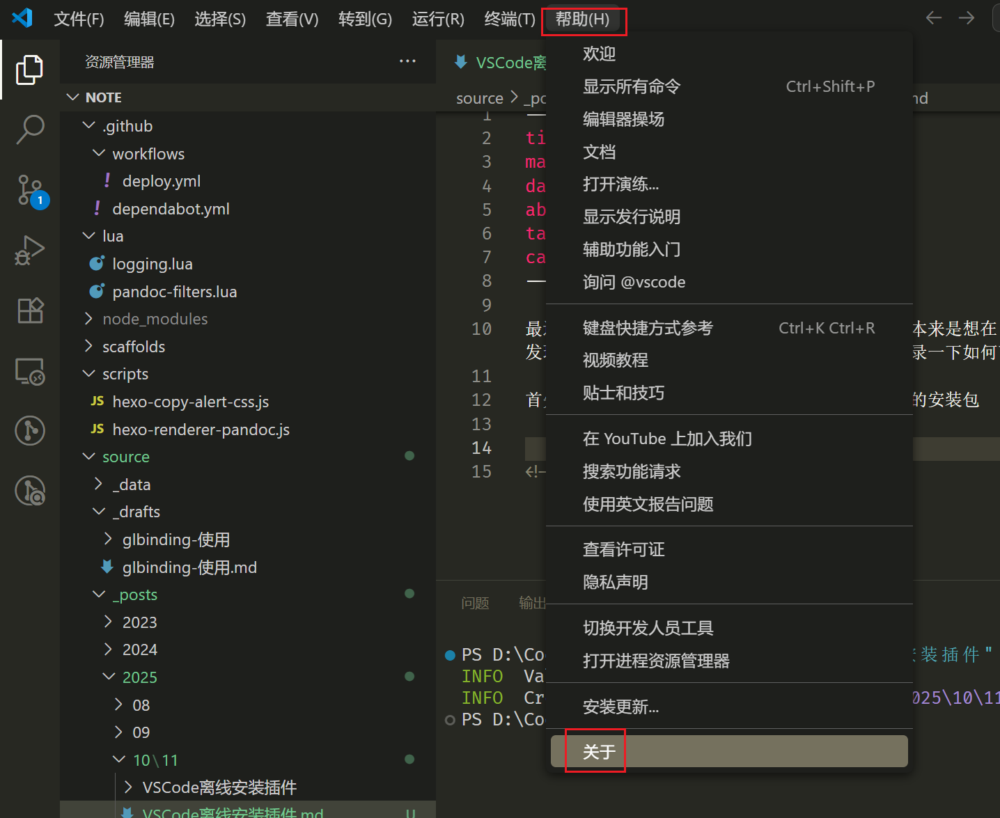
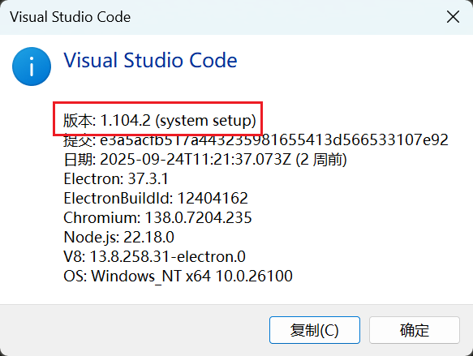
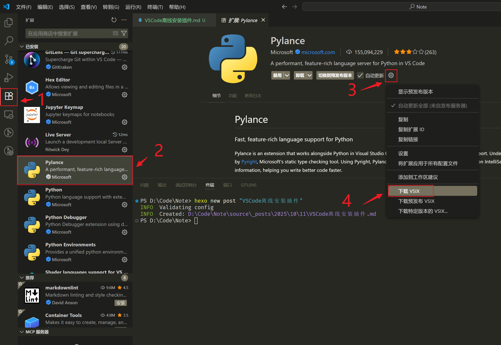
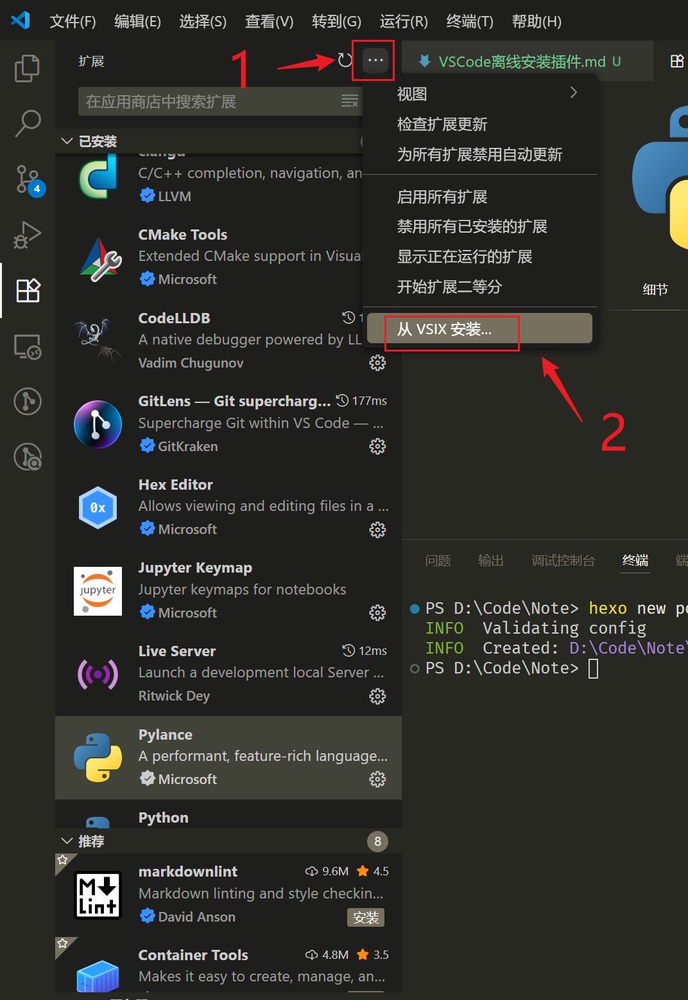

最近需要在离线开发环境中配置 VS Code。本来想在 [Visual Studio Marketplace](https://marketplace.visualstudio.com/VSCode) 网页上手动下载，再拿到 VS Code 里安装，结果发现有些插件无法直接下载打包好的 .vsix 文件。查了一下后发现，可以直接在 VS Code 的扩展面板里下载，所以这里记录一下具体做法。

# 准备安装包

首先在外网机器上准备好 VS Code 和对应版本的安装包（一般直接使用最新版即可）。可以通过下列方式查看 VS Code 版本：

可以在 [这里](https://code.visualstudio.com/Download) 下载到对应的安装包。

> [!CAUTION]
>
> **一定要确保安装包和外网机器安装的 VS Code 版本一致，否则下载的插件可能无法正常安装。**

<!-- more -->

# 下载插件

**先在外网机器上安装开发所需插件并确认可用，然后再下载对应版本的插件包。**

以 Pylance 为例，在 GitHub 上并没有对应的 VSIX 包可直接下载，只能在 VS Code 中下载，操作如下：

操作步骤如下：

1. 点击图标进入“扩展”面板；

2. 选择需要下载的插件，进入详细界面；
3. 右键单击齿轮图标，弹出操作菜单；
4. 选择“下载 VSIX”，即可下载插件的离线安装包。

# 离线安装

将所有插件的离线安装包准备好，发送至内网机器后，逐一进行安装：

同样进入扩展面板，点击右上角的 `...`，在弹出的菜单中选择“从 VSIX 安装...”，即可完成安装。

