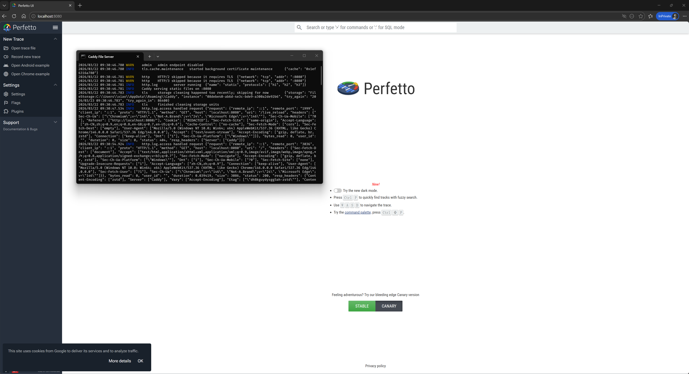

$\require{physics}$


# Profiling V.S. Tracing

先给结论：**Profile 负责回答“慢在哪里”，Trace 负责回答“为什么会慢”。**

参考 [Tracing 101](https://perfetto.dev/docs/tracing-101)，两者可以这样区分：

- **Profiling（采样/热点分析）**
  - 典型工具：VTune、Linux perf、pprof
  - 结果：热点函数、调用栈、CPU 占比、内存热点
  - 优势：开销相对小，便于长期趋势对比
  - 局限：上下文较弱，跨线程因果关系不直观

- **Tracing（时序/因果分析）**
  - 典型工具：Perfetto
  - 结果：时间线、线程切换、跨线程流转、阶段耗时、Counter 曲线
  - 优势：上下文完整，适合分析卡顿、抖动、排队、阻塞
  - 局限：数据量大，采集策略需要设计

<!-- more -->

## 什么时候该用哪一个

### CI 持续监控性能

优先使用 **Profile + 基准指标**，Trace 作为补充：

1. 在 CI 固定场景跑 benchmark（吞吐、延迟、峰值内存）
2. 配合采样 profiler 记录热点函数占比趋势
3. 指标回归时，再触发短时 Trace 采集做定位

核心原因：CI 更强调低开销、稳定和可比较。

### 性能问题分析

优先使用 **Trace**（必要时配合 Profile）：

1. 先用 Perfetto 看问题发生时刻的完整时序
2. 定位长耗时切片、线程等待、队列堆积
3. 再用 VTune/perf 深挖具体函数级热点

实践上常见组合是：

- 第一步 Profile：快速缩小范围
- 第二步 Trace：解释因果链路

# Perfetto C++ SDK

下面给一个基于官方 [example.cc](https://github.com/google/perfetto/blob/main/examples/sdk/example.cc) 思路整理的示例，覆盖 TrackEvent 的常见能力：

- Slice（作用域事件 / BEGIN-END）
- Instant（瞬时事件）
- Counter（数值曲线）
- Track（自定义轨道）
- Flow（跨阶段关联）
- Debug Annotation / lambda 自定义字段
- DynamicString（动态事件名）

> [!NOTE]
>
> SDK 使用方式可能随版本变化，若编译时报错，请以官方仓库当前版本的 `examples/sdk/example.cc` 为准。目前使用的 SDK 版本为 v50.1

```c++
#include <chrono>
#include <cstdint>
#include <fstream>
#include <string>
#include <thread>
#include <vector>

#include <perfetto.h>

// 1) 定义 category
PERFETTO_DEFINE_CATEGORIES(
    perfetto::Category("app")
        .SetDescription("General app events"),
    perfetto::Category("render")
        .SetDescription("Rendering pipeline events"),
    perfetto::Category("io")
        .SetDescription("I/O events"),
    perfetto::Category("app.debug")
        .SetDescription("Verbose debug events")
        .SetTags("debug"),
    perfetto::Category::Group("app,benchmark")
);

// 2) 在一个 .cc 文件里声明静态存储
PERFETTO_TRACK_EVENT_STATIC_STORAGE();

namespace {

void BusyWork(int ms) {
  std::this_thread::sleep_for(std::chrono::milliseconds(ms));
}

void RenderFrame(int frame_id, int queue_depth) {
  // Scope Slice：从宏位置开始，到当前作用域结束
  TRACE_EVENT("render", "RenderFrame", "frame", frame_id);

  // Counter：记录时变数值
  TRACE_COUNTER("app", "QueueDepth", queue_depth);

  // 带单位的计数器轨道
  static perfetto::CounterTrack fps_track("Framerate", "fps");
  TRACE_COUNTER("render", fps_track, 120);

  BusyWork(2);
}

void LoadingPhase() {
  // 手动 BEGIN/END
  TRACE_EVENT_BEGIN("io", "LoadAssets");
  BusyWork(3);
  BusyWork(2);
  TRACE_EVENT_END("io");
}

void HandleRequestCrossThread(uint64_t req_id) {
  // 自定义 Track：跨线程串联同一请求
  perfetto::Track req_track(req_id);

  TRACE_EVENT_BEGIN("app", "HandleRequest", req_track, "request_id", req_id);

  std::thread worker([req_track, req_id]() {
    TRACE_EVENT("app", "WorkerStage", req_track, "request_id", req_id);
    BusyWork(4);
    TRACE_EVENT_END("app", req_track);
  });
  worker.join();
}

void FlowDemo(uint64_t req_id) {
  // Flow：用箭头连接相关事件
  TRACE_EVENT("app", "DecodeBegin", perfetto::Flow::ProcessScoped(req_id));
  BusyWork(1);
  TRACE_EVENT("app", "DecodeEnd", perfetto::TerminatingFlow::ProcessScoped(req_id));
}

void AdvancedArgsDemo(std::string dynamic_name) {
  // DynamicString：动态事件名
  TRACE_EVENT("app", perfetto::DynamicString{dynamic_name});

  // Debug annotations + lambda
  TRACE_EVENT(
      "app", "UploadChunk", "chunk_bytes", 4096,
      [&](perfetto::EventContext ctx) {
        auto* ann = ctx.event()->add_debug_annotations();
        ann->set_name("note");
        ann->set_string_value("custom annotation from lambda");
      });
}

}  // namespace

int main() {
  // 3) 初始化 tracing
  perfetto::TracingInitArgs args;
  args.backends = perfetto::kInProcessBackend;
  perfetto::Tracing::Initialize(args);
  perfetto::TrackEvent::Register();

  // 4) 配置并启动 tracing session
  auto tracing_session = perfetto::Tracing::NewTrace();
  perfetto::protos::gen::TraceConfig cfg;

  cfg.add_buffers()->set_size_kb(1024);
  auto* ds_cfg = cfg.add_data_sources()->mutable_config();
  ds_cfg->set_name("track_event");
  ds_cfg->set_track_event_config_raw(R"pb(
    enabled_categories: "app"
    enabled_categories: "render"
    enabled_categories: "io"
    enabled_categories: "benchmark"
  )pb");

  tracing_session->Setup(cfg);
  tracing_session->StartBlocking();

  // 5) 产生事件
  TRACE_EVENT_INSTANT("app", "Startup");
  if (TRACE_EVENT_CATEGORY_ENABLED("app")) {
    TRACE_EVENT("app", "CategoryEnabledCheckPassed");
  }

  LoadingPhase();
  RenderFrame(1, 3);
  HandleRequestCrossThread(1001);
  FlowDemo(1001);
  AdvancedArgsDemo("DynamicStageName");

  // 6) 停止并导出 trace
  tracing_session->StopBlocking();
  std::vector<char> trace_data(tracing_session->ReadTraceBlocking());

  std::ofstream output("example.pftrace", std::ios::binary);
  output.write(trace_data.data(), static_cast<std::streamsize>(trace_data.size()));
  output.close();

  return 0;
}
```

对应的 `CMakeLists.txt`：

```cmake
cmake_minimum_required(VERSION 3.13)
project(PerfettoTrackEventDemo LANGUAGES CXX)

set(CMAKE_CXX_STANDARD 17)
set(CMAKE_CXX_STANDARD_REQUIRED ON)

find_package(Threads REQUIRED)

# perfetto/sdk 目录下放 perfetto.h 和 perfetto.cc
add_library(perfetto STATIC
  perfetto/sdk/perfetto.cc
)
target_include_directories(perfetto PUBLIC
  ${CMAKE_CURRENT_SOURCE_DIR}/perfetto/sdk
)

add_executable(example
  example.cc
)
target_link_libraries(example PRIVATE perfetto Threads::Threads)

if(WIN32)
  # perfetto.cc 编译单元符号很多，MSVC 下需要 /bigobj
  target_compile_options(perfetto PRIVATE /bigobj)

  # 避免 windows.h 的宏污染（min/max）和体积膨胀
  target_compile_definitions(perfetto PUBLIC WIN32_LEAN_AND_MEAN NOMINMAX)
  target_compile_definitions(example PUBLIC WIN32_LEAN_AND_MEAN NOMINMAX)

  # Perfetto 在 Windows 下依赖 WinSock
  target_link_libraries(example PRIVATE ws2_32)
endif()

if(MSVC)
  # 使用更严格、标准一致的编译模式
  target_compile_options(example PRIVATE /permissive-)
endif()
```

Windows 下使用 MSVC 的一些编译说明：

- 必须使用 C++ 17 标准
- 最好使用 vc142 工具链（VS 2019），vc143 不一定支持（能编过就能用）
- 头文件引入顺序也可能造成编译报错，例如自定义的宏影响，可以将 `perfetto.h` 放在第一个位置引入以规避这类问题
- `/bigobj`：Perfetto 的聚合源文件符号较多，MSVC 默认节数量上限容易触发编译错误
- `WIN32_LEAN_AND_MEAN` + `NOMINMAX`：减少 `windows.h` 宏污染，避免与 C++ 标准库冲突
- `ws2_32`：Windows 网络相关符号需要显式链接
- `/permissive-`：开启 MSVC 严格语法模式，更接近标准 C++ 的行为，减少编译器扩展导致的隐性兼容问题

> [!TIP]
>
> Perfetto [官方编译说明](https://perfetto.dev/docs/contributing/build-instructions#building-on-windows)里提到：Windows 下 `clang-cl` 路线通常更稳定（功能支撑 chrome://tracing ），纯 MSVC 属于 best-effort 维护（能编过就凑合用，不能也不会单独维护）。
>
> > clang-cl support is more stable because that build configuration is actively covered by the Chromium project (Perfetto rolls into chromium and underpins chrome://tracing). The MSVC build is maintained best-effort.

## 常用 Track Event 类型

- `TRACE_EVENT("cat", "name")`
  - 最常用，记录一个作用域的耗时（函数、阶段、任务）
- `TRACE_EVENT_BEGIN/TRACE_EVENT_END`
  - 手动控制切片边界，不依赖作用域结束，但必须成对存在！
- `TRACE_EVENT_INSTANT`
  - 打点型事件（点击、状态切换、关键分支命中），用于在 Time Line 中添加竖线 + 标签，让我们更清楚的了解函数执行到哪一步
- `TRACE_COUNTER`
  - 记录数值曲线，例如渲染帧率、内存占用率等，常用于事件循环（任务队列中待处理的任务数）、render loop 中（FPS值）

为区分 Track Event，还可以让 perfetto 在记录过程中记录每一次函数执行参数，便于理解函数在哪种输入场景下表现异常。


# Offline Perfetto-UI

在官网的[介绍文档](https://perfetto.dev/docs/)中提到：Perfetto 提供一个基于网页的 UI，用于可视化时序数据。

> - **Fully local, browser-based UI** for visualizing large amounts of complex, interconnected data on a timeline. Our UI works in all major browsers, doesn't require any installation, works offline, and can open traces recorded by other (non-Perfetto) tracing tools.

但是直接编译 UI 太过麻烦，而且在 Windows 完全无法编译。为此，可以通过脚本将 [https://ui.perfetto.dev/](https://ui.perfetto.dev/) 完整下载到本地，然后通过本地 HTTP Server 部署，实现 Perfetto-UI 离线使用。

整体流程如下：

1. 下载 `index.html`，解析最新稳定版本号

2. 根据稳定版本号下载对应 `manifest.json`

3. 根据 `manifest.json` 下载全部资源文件

4. 使用本地 HTTP Server 部署静态页面

5. 打开浏览器加载 Perfetto-UI

完整下载脚本（PowerShell，*generated by GPT 5.3 Codex*）如下：

```powershell
$Root = "D:\perfetto-ui-local"
$Base = "https://ui.perfetto.dev"

New-Item -ItemType Directory -Force -Path $Root | Out-Null
Set-Location $Root

Invoke-WebRequest "$Base/index.html" -OutFile "index.html"
Invoke-WebRequest "$Base/service_worker.js" -OutFile "service_worker.js"

$html = Get-Content "index.html" -Raw
$ver = ([regex]'"stable"\s*:\s*"([^"]+)"').Match($html).Groups[1].Value
if (-not $ver) { throw "无法从 index.html 解析 stable 版本号" }

$verDir = Join-Path $Root $ver
New-Item -ItemType Directory -Force -Path $verDir | Out-Null

Invoke-WebRequest "$Base/$ver/manifest.json" -OutFile (Join-Path $verDir "manifest.json")
$manifest = Get-Content (Join-Path $verDir "manifest.json") -Raw | ConvertFrom-Json
$files = $manifest.resources.PSObject.Properties.Name

foreach ($f in $files) {
  $dst = Join-Path $verDir $f
  New-Item -ItemType Directory -Force -Path (Split-Path $dst -Parent) | Out-Null
  Invoke-WebRequest "$Base/$ver/$f" -OutFile $dst
}

Write-Host "下载完成，版本: $ver"
```

本地部署静态页面时推荐使用 [Caddy](https://github.com/caddyserver/caddy/releases)，并搭配下面的启动脚本，实现开箱即用效果，避免繁琐的手动编译步骤（甚至在 Windows 下完全无法编译😅）：

```bat
@echo off
start "Caddy File Server" cmd /c "cd /d %~dp0 && .\caddy.exe file-server --root . --listen :8080 --browse --access-log"
timeout /t 1 /nobreak >nul
start "" "http://localhost:8080/"
```

在其他平台下部署静态页面也是同样原理，这里不再展开，最后给一张运行效果图：


