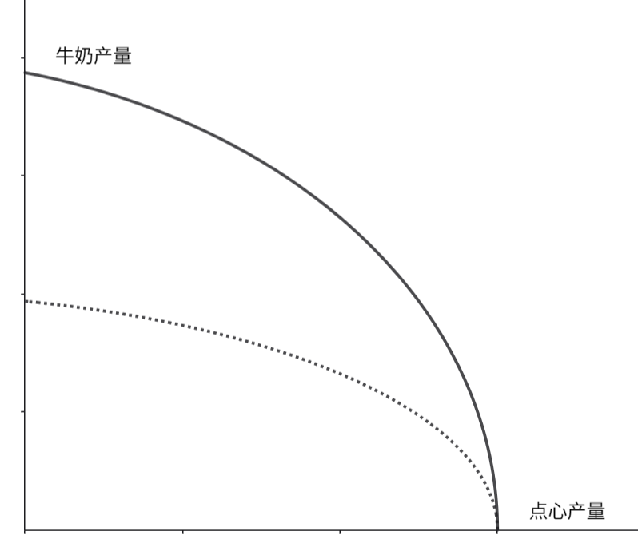
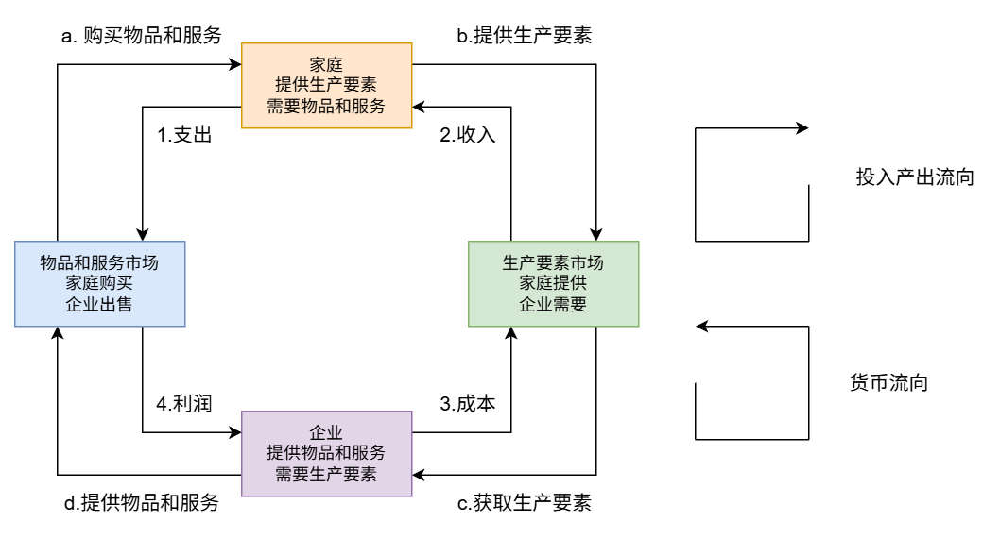

本次是第2章节 “像经济学家一样思考” 的部分问题和解答。

-----

***举出一种没有被包含在简化的循环流量图中的经济交易。***

在第2章介绍的简化的循环流量图中，仅包含两个角色——家庭和企业，忽略了政府、金融市场、国际贸易等角色参与下的经济交易：

1. 政府参与的交易

   税收、转移支付（社会福利、生育补贴）、政府采购

2. 金融市场的交易

   储蓄、借贷

3. 国际贸易

   进口、出口

$\require{physics}$
<!-- more -->

-----

***画出并解释一个生成牛奶与点心的经济的生产可能性边界。如果一场瘟疫使该经济中的一半奶牛死亡，这条生产可能性边界会发生怎样的变动？***

在这个场景下，**社会用于生产牛奶和点心的资源是有限的，且假设二者之间无任何联系**（例如牛奶有奶牛产奶加工而成，而点心通过面粉和糖加工而成）。

此时瘟疫只会影响奶牛的数量，进而影响牛奶的产量（变化成只有之前一半的产量），而点心并不会收到影响，因此在生产可能性边界上点心的端点不会发生移动，而牛奶的端点会移动至之前一半的点。如下图所示：

实线为瘟疫前的生产可能性边界，而虚线为瘟疫后的生产可能性边界。

> [!tip]
>
> 此时可以暂时假设制作点心时不包含黄油（黄油由牛奶制作而成），如果把点心使用黄油这一因素也考虑在内，问题会更复杂，而生产可能性边界就不适合在用来描述瘟疫所带来的变化了。
>
> 因为生产可能性边界的主要展示的就是“想要更多的 A，就必须舍弃一些 B”的权衡观点，如果再引入黄油作为中间品，就无法直观展现出在点心和牛奶之间的机会成本变化了。 

-----

***把下列话题分别归入微观经济学或宏观经济学：***

***a. 家庭把多少收入用于储蓄的决策。***

***b. 政府管制对于汽车废气排放的影响。***

***c. 高国民储蓄对经济增长的影响。***

***d. 企业关于雇佣多少工人的决策。***

***e. 通货膨胀率和货币量变动之间的关系。***

可以根据研究对象的**尺度**来划分：**微观经济学**研究**个体（家庭、企业）的行为**及在**特定市场**中的相互作用；**宏观经济学**研究**经济体整体**的运行趋势（如增长、通胀、失业）。

以下是具体归类：

1. 微观经济学 (Microeconomics)

这些话题关注的是特定决策者或特定市场的逻辑：

- **a. 家庭把多少收入用于储蓄的决策：**
  - **理由：** 这是一个典型的**个体行为分析**。它研究单一家庭单位如何根据自身目标、利率和收入水平，在“当前消费”与“未来消费”之间做权衡。
- **b. 政府管制对于汽车废气排放的影响：**
  - **理由：** 虽然是由政府实施的，但它针对的是**特定行业（汽车）和 特定外部性问题**。它研究这项管制如何改变汽车买卖双方的行为，以及对该市场均衡价格和产量的影响。
- **d. 企业关于雇佣多少工人的决策：**
  - **理由：** 属于**生产理论**范畴。它分析单一厂商（企业）如何根据劳动力成本（工资）和生产边际效益来最优化其资源配置。

2. 宏观经济学 (Macroeconomics)

这些话题关注的是国家或全球层面的总量与整体波动：

- **c. 高国民储蓄对经济增长的影响：**
  - **理由：** 这里研究的是**国民总储蓄**（全社会所有家庭、企业和政府储蓄的总和），以及它作为投资来源如何推动整个国家生产率和 **GDP（经济增长）** 的长期提升。
- **e. 通货膨胀率和货币量变动之间的关系：**
  - **理由：** **通货膨胀**是物价总水平的持续上涨，涉及整个经济体的购买力。研究货币供应量与物价水平的联系是宏观经济政策（货币政策）的核心课题。

💡 深度理解：a 和 c 的区别

注意到 **a** 和 **c** 都提到了“储蓄”，但视角完全不同：

- 在 **a** 中，我们关心的是：“由于利息涨了，**我家**今年是不是会多存钱？”（微观，某个个体）。
- 在 **c** 中，我们关心的是：“如果**全国**的人都开始存钱，这个国家的资本积累和十年后的总产出会有什么变化？”（宏观，全国整体）。

-----

***画出一张循环流量图。指出图中对应于下列活动的物品与服务流向和货币流向的部分。***

***a. Selena 向店主支付了 1 美元买了 1 瓶牛奶。***

***b. Stuart 在快餐店工作，每小时赚 8 美元。***

***c. Shanna 花 40 美元理发。***

***d. Salma 凭借她在 Acme Industrial 公司 10% 的股权赚到了2万美元。***

a. Selena 向店主支付了 1 美元买了 1 瓶牛奶

这项交易发生在**“物品和服务市场”**。

- **货币流向：** 对应图中左上角的 **1. 支出**。钱从家庭（Selena）流向物品和服务市场。
- **物品与服务流向：** 对应图中左上角的 **a. 购买物品和服务**。牛奶从物品和服务市场流向家庭（Selena）。

b. Stuart 在快餐店工作，每小时赚 8 美元

这项交易发生在**“生产要素市场”**（Stuart 提供了劳动力）。

- **货币流向：** 对应图中右上角的 **2. 收入**。工资从生产要素市场流向家庭（Stuart）。
- **物品与服务流向：** 对应图中右上角的 **b. 提供生产要素**。Stuart 的劳动力从家庭流向生产要素市场。

c. Shanna 花 40 美元理发

这项交易同样发生在**“物品和服务市场”**（理发是一种服务产出）。

- **货币流向：** 对应图中左上角的 **1. 支出**。40美元从家庭（Shanna）流向物品和服务市场。
- **物品与服务流向：** 对应图中左上角的 **a. 购买物品和服务**。理发服务从物品和服务市场流向家庭（Shanna）。

d. Salma 凭借她在公司 10% 的股权赚到了 2 万美元

这项交易涉及**资本（生产要素之一）**的回报，发生在 **“生产要素市场” **。

- **货币流向：** 对应图中右上角的 **2. 收入**。这笔分红作为家庭的收入，从生产要素市场流向家庭（Salma）。
- **物品与服务流向（投入流向）：** 对应图中右上角的 **b. 提供生产要素**。Salma 提供了“资本”这一要素（通过股权形式），从家庭流向生产要素市场。

💡 小总结

- **a 和 c** 是家庭在花钱买东西，属于图的**左半部分**。
- **b 和 d** 是家庭在出卖自己的资源（体力或资本）来赚钱，属于图的**右半部分**。

-----

***设想一个生产军用品和消费品的社会，并将他们称为“大炮”和“黄油”。***

***d. 假想这个社会有两个政党，称为鹰党（想拥有强大的军事力量）和鸽党（向拥有较弱的军事力量）。此时一个侵略性的邻国削减了军事力量。结果鹰党和鸽党都等量了减少了自己原来希望生产的大炮数量。用黄油产量的增加来衡量，哪一个政党会得到更大的“和平红利”？请解释。***

要回答这个问题，我们首先要明确一个核心经济学原理：**生产可能性边界通常是向外凸出的（Cowed-out）**。这意味着随着你生产某种产品的数量增加，你为此放弃另一种产品的“机会成本”也会随之递增。

------

1. 坐标轴上的位置分布

在 PPF 图形上（纵轴为大炮，横轴为黄油）：

- **鹰党（Hawks）：** 位于曲线的**上方**。他们生产大量的大炮和少量的黄油。
- **鸽党（Doves）：** 位于曲线的**右下方**。他们生产少量的大炮和大量的黄油。

2. “和平红利”的衡量：机会成本

当两个政党都决定减少**相同数量**（比如 $\Delta G$）的大炮生产时，我们看谁换来的黄油增加量（$\Delta B$）更多：

- **鹰党的处境：** 由于鹰党原本拥有极其庞大的军事规模，他们使用的资源（工厂、科研人员、原材料）很多是专门为了军事设计的。**当他们开始削减第一批大炮时，释放出来的资源往往是那些“最不适合造大炮、相对更适合造黄油”的资源**。
  - **结论：** 在大炮产量极高的地方，PPF 曲线非常**陡峭**。减少一单位大炮，能换回**很多**黄油。
- **鸽党的处境：** 鸽党本来就只有很少的军事力量，剩下的大炮生产线可能已经是极其核心、精密的军事工业。**如果再削减同样数量的大炮，释放出的资源在转化为民用的过程中效率较低**。
  - **结论：** 在大炮产量较低的地方（靠近横轴），PPF 曲线比较**平缓**。减少一单位大炮，只能换回**较少**的黄油。

3. 最终结论：谁的“和平红利”更大？

**鹰党会得到更大的“和平红利”。**

**解释：**

根据**机会成本递增规律**，当一个社会生产极多的大炮时，大炮的机会成本很高（即放弃这些大炮能换回大量黄油）。由于鹰党处于 PPF 曲线更陡峭的顶部，同样幅度的大炮减产（纵向位移）会导致水平方向（黄油产量）出现更大幅度的扩张。

💡 地道的经济学表述：

> “因为生产可能性边界（PPF）是凹向原点的，大炮产量越高，其边际机会成本就越大。由于鹰党最初维持着极高的军事水平，其减产所释放的资源在转化为民用生产时效率更高，因此在黄油产出的增量上，鹰党获得的**边际收益**远高于鸽党。”

-----

***第1章讨论的第一个经济学原理是人们面临权衡取舍。用生产可能性边界说明社会在两种“物品”——清洁的环境与工业产量之间的权衡取舍。你认为什么因素决定生产可能性边界的形状和位置？如果工程师开发出一种污染更少的发电方法，生产可能性边界会发生什么变化？***

我们可以通过 **生产可能性边界（PPF）** 来清晰地拆解这个逻辑。

1. 用 PPF 说明权衡取舍（Trade-off）

想象一个坐标轴，纵轴表示**清洁的环境**（环境质量），横轴表示**工业产量**（商品和服务）。

- **边界的含义：** PPF 曲线代表了在现有技术和资源下，社会所能达到的最佳组合。
- **权衡的体现：** 如果社会想要增加“工业产量”（从 A 点移动到 B 点），就必须投入更多的工厂、排放更多的废弃物，从而不得不放弃一部分“清洁的环境”。**这种“鱼与熊掌不可兼得”的关系，正是权衡取舍的几何表达。**
- **斜率：** 曲线的斜率反映了增加一单位工业产量所必须牺牲的环境质量（即机会成本）。

2. 什么决定了 PPF 的“形状”和“位置”？

这两个要素决定了该社会的“天花板”在哪里：

**位置（Location）：由资源总量决定**

- **自然资源：** 原始环境的承载能力、能源储备。
- **劳动力与资本：** 工程师的数量、工厂的规模、环保设备的先进程度。
- **位置移动：** 如果资源增加（如发现了新能源），整个边界会向外平移。

**形状（Shape）：由机会成本决定**

- **资源专用性：** 为什么 PPF 通常是**向外凸出**的？
  - 当处于环境极好的状态时，稍微牺牲一点环境就能换来巨大的工业增长（因为你可以先利用那些污染小、效率高的生产方式）。
  - 但已经是重工业社会时，为了再榨取一点点产量，可能需要砍掉最后一片森林，导致环境质量断崖式下跌。
- **这种“机会成本递增”导致了曲线的弧度。**

3. 如果开发出污染更少的发电方法，PPF 会发生什么？

这是一个典型的**技术进步**案例。在这种情况下，PPF 会发生**非对称性的向外扩张**。

- **横轴（工业产量）的变化：** 同样的资源投入，现在可以产出更多的工业品，因为发电更高效了，或者不再受制于严苛的排污配额。
- **纵轴（清洁环境）的变化：** 如果社会选择保持工业产量不变，现在的环境会比以前更清洁。
- **图形表现：**  PPF 曲线会向外（右上方）移动。
  - 重点在于，这种移动**并不是简单的平移**。它意味着社会现在可以拥有“更多的工业产量 **且** 更好的环境质量”，或者以比以前更低的环境成本来换取同样的工业增长。

💡 深度总结

这种技术进步实际上是**缓解了权衡取舍的痛苦**。

> **地道表达：** “低污染发电技术的出现，提升了该经济体的生产效率。它使社会能够在不牺牲环境质量的前提下，突破原有的生产约束，从而在更高的水平上实现环境与发展的平衡。”

-----

把下列表述分别归入实证表述或规范表述，并解释原因。

a. 社会面临通货膨胀与失业之间的短期权衡取舍。

b. 降低货币供给增长率将降低通货膨胀率。

c. 美联储应该降低货币供给率。

d. 社会应该要求福利领取者去找工作。

e. 降低税率可以鼓励人们更多地工作和更多地储蓄。

我们可以用之前讨论过的**“是什么（实证）”**与**“应该是什么（规范）”**作为判别标准。

以下是具体的归类与分析：

1. 实证表述 (Positive Statements)

这类表述描述世界的**运行机制**，可以通过数据和事实来检验其对错。

- **a. 社会面临通货膨胀与失业之间的短期权衡取舍。**
  - **原因：** 这是一个关于宏观经济变量之间**相关性**的描述（即著名的“菲利普斯曲线”）。我们可以通过观察不同历史时期的经济数据，验证当通胀上升时，失业率是否在短期内确实下降了。它描述的是一种客观存在的经济现象。
- **b. 降低货币供给增长率将降低通货膨胀率。**
  - **原因：** 这描述了一个**因果逻辑**。货币数量论认为货币供应与物价水平成正比。我们可以通过对比不同国家的货币政策和通胀表现来证实或伪造这一论断。
- **e. 降低税率可以鼓励人们更多地工作和更多地储蓄。**
  - **原因：** 这同样是一个关于**激励机制**的预测。它在讨论税率变动如何影响人的经济行为（替代效应与收入效应）。尽管经济学家对这种影响的大小有争议，但可以通过研究个税调整前后的劳动力供给和储蓄率变化来提供证据。

2. 规范表述 (Normative Statements)

这类表述包含了**价值判断**，涉及道德、公平或政治立场，无法仅靠数据证明。

- **c. 美联储应该降低货币供给率。**
  - **原因：** 关键词是**“应该”**。虽然表述 **b** 告诉我们降低货币供给能降通胀，但“降通胀”是否比“维持经济增长”更重要？这是一个政策选择。不同的人（如关注物价稳定的保守派和关注就业的激进派）会有不同的看法。
- **d. 社会应该要求福利领取者去找工作。**
  - **原因：** 这是一个关于**社会公正与责任**的道德判断。它反映了某种价值观——即认为福利不应是无条件的。无论数据证明这种政策是增加了就业还是加剧了贫困，关于“社会是否该提出这种要求”的争论本质上是哲学和政治性的，而非纯科学性的。

💡 总结对比表

| 表述        | 关键词/特征      | 判定     | 验证手段                   |
| ----------- | ---------------- | -------- | -------------------------- |
| **a, b, e** | 导致、面临、可以 | **实证** | 观察历史数据、统计学分析   |
| **c, d**    | 应该、要求       | **规范** | 伦理讨论、价值观博弈、投票 |

深度小技巧：

你会发现 **b** 和 **c** 是成对出现的。在经济决策中，**实证分析（b）通常是规范判断（c）的基础**。经济学家先通过实证研究告诉你“药效”（降低货币供给能降通胀），然后政策制定者再根据价值观决定“要不要吃这副药”（应该降低货币供给）。

