最近碰到一个需求是要在 Windows 上交叉编译 Linux 程序，用于做 Windows 代码的跨平台编译检查，发现里面弯弯绕绕还挺多的（主要是 Windows 和 Linux 系统层面的一些差异需要注意），就通过一篇博客记录一下整个交叉编译的流程，也加深对交叉编译流程的理解。

整个交叉编译包含2个主要步骤：sysroot 准备和交叉编译工具链的构建。

- sysroot 在 WSL 上使用 debootstrap 创建

- 交叉编译工具链通过 Cygwin 和 crosstool-ng 生成

<!-- more -->

# 安装 WSL

使用 WSL（**W**indows **S**ubsystem for **L**inux）主要是为了以下2件事：

1. 创建交叉编译的 sysroot

2. 验证交叉编译产物结果

通过 WSL 可以方便地与 Windows 文件系统进行交互

## 导入 WSL 镜像

可从清华源获取 Ubuntu 的 [WSL 镜像](https://mirrors.tuna.tsinghua.edu.cn/ubuntu-releases/20.04.6)（本次使用的是 Ubuntu 20.04.6）：

使用如下命令导入 WSL 镜像：

```powershell
wsl --import <发行版名称> <本机目录> <镜像路径>
```

完整命令示例如下：

```powershell
wsl --import Ubuntu-20.04 D:\VM\WSL\Ubuntu-20.04 D:\Download\ubuntu-20.04.6-wsl-amd64.wsl
```

导入完成后可通过如下命令启动指定 Linux 发行版：

```powershell
wsl -d <发行版名称>
```

> [!TIP]
>
> 直接 `--import` 的实例默认只有 `root`，与商店安装的「自动创建用户」不同，需要手动建普通用户并设为默认登录用户。

## （可选）创建普通用户

在 WSL 内执行如下命令创建用户

```bash
adduser <user-name>
usermod -aG sudo <user-name>
```

编辑 `/etc/wsl.conf` 设置默认用户：

```ini
[boot]
systemd=true

[user]
default=<user-name>
```

在 Windows 侧执行 `wsl --shutdown` 后重新进入 WSL，确认已以普通用户登录。

## （可选）更换软件源

参照[阿里云 Ubuntu 软件源](https://developer.aliyun.com/mirror/ubuntu/)说明，根据实际使用的 Ubuntu 版本替换 `/etc/apt/sources.list` 中地址即可

替换之后记得执行 update 和 upgrade

```bash
sudo apt update
sudo apt upgrade
```


# 准备 sysroot

> [!Note]
>
> sysroot（**sys**tem **root**） 是用于编译/交叉编译的“目标系统根目录视图”，**仅包含编译时需要的部分**（如头文件、库文件、动态链接器等），**无法通过 chroot 方式执行程序**。
>
> rootfs（**root** **f**ile**s**ystem）则是用于运行阶段的完整系统根目录，**包含完整的 Linux 系统结构**（`/bin`，`/sbin`，`/etc`，`/usr`，`/var` 等），**可以通过 chroot 方式进入并执行程序**。
>
> 对 rootfs 裁剪掉不必要的文件后可得到 sysroot。

## 安装依赖

```bash
sudo apt install debootstrap systemd-container qemu-user-static binfmt-support
```

- **debootstrap**：从镜像站拉取包并初始化 rootfs。
- **systemd-container**：以容器方式进入 rootfs，并自动挂载目录。
- **qemu-user-static**：用于支持在非本机 ISA（Instruction Set Architecture，指令集架构） 的 rootfs 里执行目标程序（例如做 **arm64 的 sysroot** 时很有用）
- **binfmt-support**：让 Linux 支持运行非本机 ISA 的 ELF 程序，可以自动调用 qemu 执行 arm 应用。

## 初始化 rootfs

通过如下命令初始化 rootfs

```bash
sudo debootstrap \
    --arch=amd64 \
    --variant=minbase \
    focal \
    /opt/rootfs-focal-amd64 \
    https://mirrors.aliyun.com/ubuntu/
```

执行完成后会提示 “Base system installed successfully”（基础系统成功安装）

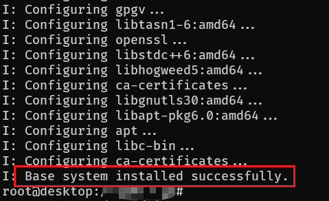

## 进入 rootfs

直接通过 chroot 可以进入 rootfs 安装程序，但是通常运行时需要手动挂载 dev、run、proc 等目录，为简化操作，通过 systemd-nspawn 以容器方式进入 rootfs，命令如下：

```bash
#!/bin/bash
set -euo pipefail

SYSROOT=/opt/rootfs-focal-amd64
SRC=/home/xiao/devenv

sudo systemd-nspawn \
        -D "$SYSROOT" \
        --bind="$SRC:/mnt/project" \
        --bind=/etc/resolv.conf \
        --setenv=HOME=/root \
        --setenv=TERM="$TERM" \
        --hostname=sysroot-env \
        --console=interactive \
        /bin/bash
```

将脚本保存到本地执行即可，成功进入 rootfs 后输出如下所示：

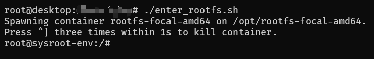

## 安装依赖

由于 debootstrap 创建 rootfs 时写入的默认软件源往往不完整，在安装依赖前需要重新调整软件源，命令如下所示：

```bash
tee /etc/apt/sources.list > /dev/null <<'EOF'
deb https://mirrors.aliyun.com/ubuntu/ focal main universe multiverse
deb https://mirrors.aliyun.com/ubuntu/ focal-updates main universe multiverse
deb https://mirrors.aliyun.com/ubuntu/ focal-security main universe multiverse
EOF
```

然后通过如下命令更新软件源和软件。

```bash
apt update
apt upgrade -y
```

为满足后续验证需要，我们在 rootfs 内安装下列依赖：

```bash
apt install -y \
    build-essential \
    pkg-config \
    ca-certificates \
    tzdata \
    locales \
    git \
    python3 \
    python3-pip \
    python3-venv
```

同时配置 pip 镜像并安装 conan、cmake 和 ninja（通过 pip 安装的 cmake 和 ninja 版本较新，便于使用）：

```bash
pip config set global.index-url https://mirrors.aliyun.com/pypi/simple/
pip install conan cmake ninja
```

若后续要在 sysroot 内编译或验证 GLFW 等依赖 X11/Wayland 的库，可额外安装开发包（体积较大，按需装）：

```bash
apt install -y libwayland-dev libxkbcommon-dev xorg-dev
```

配置完成后使用 `exit` 命令退出 rootfs。

## 创建 sysroot

rootfs 创建完成后，可拷贝 lib、include 和 pkgconfig 目录以生成 sysroot，具体命令如下：

```bash
#!/usr/bin/env bash
set -e

SRC=$1
DST=$2

if [ -z "$SRC" ] || [ -z "$DST" ]; then
  echo "Usage: $0 <rootfs> <sysroot>"
  exit 1
fi

mkdir -p "$DST"

echo "[1/3] Copy essential directories..."

rsync -aHAXm --numeric-ids \
  --include="/usr/***" \
  --include="/lib" \
  --include="/lib64" \
  --include="/lib32" \
  --include="/libx32" \
  --include="*/" \
  --exclude="*" \
  "$SRC"/ "$DST"/

fix_absolute_symlinks_for_sysroot() {
  local SYSROOT="$1"
  while IFS= read -r -d '' link; do
    tgt=$(readlink "$link")
    case "$tgt" in
      /lib/*-linux-gnu/*)
        base="${tgt##*/}"
        tri="${tgt#/lib/}"
        tri="${tri%%/*}"
        ln -sf "../../../lib/$tri/$base" "$link"
        ;;
      /usr/lib/*-linux-gnu/*)
        base="${tgt##*/}"
        ln -sf "$base" "$link"
        ;;
    esac
  done < <(find "$SYSROOT/usr/lib" -type l -print0 2>/dev/null)

  while IFS= read -r -d '' link; do
    tgt=$(readlink "$link")
    case "$tgt" in
      /lib/*-linux-gnu/*)
        base="${tgt##*/}"
        ln -sf "$base" "$link"
        ;;
    esac
  done < <(find "$SYSROOT/lib" -type l -print0 2>/dev/null)
}

ensure_lib64_ld_linux_symlink() {
  local SYSROOT="$1"
  mkdir -p "$SYSROOT/lib64"
  if [[ -f "$SYSROOT/lib/x86_64-linux-gnu/ld-linux-x86-64.so.2" ]]; then
    ln -sf ../lib/x86_64-linux-gnu/ld-linux-x86-64.so.2 \
      "$SYSROOT/lib64/ld-linux-x86-64.so.2"
  fi
}

ensure_lib64_ld_linux_symlink "$DST"
fix_absolute_symlinks_for_sysroot "$DST"

echo "[2/3] Ensure loader exists..."

find "$DST" -name "ld-linux*" || {
  echo "ERROR: dynamic loader not found"
  exit 1
}

echo "[3/3] Basic validation..."

echo "- libc:"
find "$DST" -name "libc.so*"

echo "- interpreter candidates:"
find "$DST" -name "ld-linux*"

echo "Done."
```

其中 `ensure_lib64_ld_linux_symlink` 和 `fix_absolute_symlinks_for_sysroot` 是必要的，因为 rootfs 通过 chroot 执行，其软链接指向根路径的地址是有效的，而在交叉编译中，不可能通过 chroot 方式执行，因此需要手动修正这些软链接的地址，将其转换为相对路径。

## 打包和解压

打包命令（在 WSL 中执行）

```bash
tar --numeric-owner \
    --xattrs \
    --acls \
    -czf sysroot-focal.tar.gz \
    -C "<sysroot 在 WSL 中的位置，例如 /opt/sysroot-focal>" .
```

解压命令（在 Cygwin 中执行）

```bash
sysroot_dir="<sysroot 在 Cygwin 中的位置，例如 /cygdrive/d/sysroot-focal>"
mkdir -p $sysroot_dir
tar -xzf sysroot-focal.tar.gz \
    --no-same-owner \
    --no-same-permissions \
    -C "$sysroot_dir"
```


# 安装 Cygwin

为在 Windows 上编译 Linux 的可执行程序，需要模拟出 Linux 运行环境（基本上就是模拟出 POSIX 接口），由于 MSYS2 的工具链更新太过激进且并不是完全兼容 POSIX 接口，这里选择 Cygwin 作为交叉编译的基础环境。

## 安装依赖

从官网下载 `setup-x86_64.exe`，在包列表中勾选下列依赖（具体版本参考下文的完整安装列表）：

- autoconf, automake, bison, flex, gawk, 
- help2man, texinfo, diffutils, patch, make, 
- cmake, ninja, gcc-g++, git, wget, xz, zip, unzip, 
- libtool, gperf, libncurses-devel, python312-devel

**完整安装列表**见：[cygcheck-c.txt](cygcheck-c.txt)（通过 `cygcheck -c` 输出）

> [!NOTE]
>
> 建议将 `setup-x86_64.exe` 放在 Cygwin 的安装目录下面，因为该程序将作为 cygwin 的包管理器，有可能需要频繁使用该程序安装包。

## 设置环境变量

在 **Cygwin 的 shell 配置文件**（如 `~/.bashrc`）末尾中加入下列内容：

```bash
export CYGWIN=winsymlinks:sys
export PATH="/usr/local/bin:/usr/bin"
export LANG=C.UTF-8
export LC_ALL=C.UTF-8
export http_proxy="http://127.0.0.1:7890"
export https_proxy="http://127.0.0.1:7890"
# 可选：少数工具只认 ALL_PROXY
# export ALL_PROXY="$https_proxy"
```

其中 **代理地址** 用于 crosstool-ng 编译时下载源码。

## （可选）卸载 Cygwin

仅删除安装目录时可能残留注册表项；可用下列 PowerShell 脚本（需 **PowerShell 7+**，删 `HKLM` 需管理员权限）。

保存为 `uninstall_cygwin.ps1` 后执行：

```powershell
#requires -Version 7.0
# uninstall_cygwin.ps1 — 仅删除安装目录 + 清理 Cygwin 相关注册表项
# 请用 PowerShell 7 运行: pwsh -NoProfile -File .\uninstall_cygwin.ps1
# 运行前请手动关闭所有 Cygwin / mintty 窗口，否则删除目录可能失败。
# 删除 HKLM 下项需要管理员权限。

Write-Host "== Cygwin 卸载（目录 + 注册表）=="

# -------- 可配置路径（若安装在其他盘符，请在此添加）--------
$cygwinPaths = @(
    "C:\cygwin64",
    "C:\cygwin"
)

$regPaths = @(
    "HKCU:\Software\Cygwin",
    "HKLM:\SOFTWARE\Cygwin",
    "HKLM:\SOFTWARE\WOW6432Node\Cygwin"
)

Write-Host "[1/2] 删除安装目录..."
foreach ($path in $cygwinPaths) {
    if (Test-Path -LiteralPath $path) {
        Write-Host "  正在删除: $path"
        Remove-Item -LiteralPath $path -Recurse -Force -ErrorAction Stop
    }
    else {
        Write-Host "  跳过（不存在）: $path"
    }
}

Write-Host "[2/2] 清理注册表..."
foreach ($reg in $regPaths) {
    if (Test-Path -LiteralPath $reg) {
        Write-Host "  正在删除: $reg"
        Remove-Item -LiteralPath $reg -Recurse -Force -ErrorAction Stop
    }
}

Write-Host "== 完成 =="
Write-Host "若曾把 Cygwin 加入系统 PATH，请自行在「环境变量」中删掉含 cygwin 的条目。"
```

---

# 构建交叉编译工具链

## 配置工作目录

执行下列命令设置文件夹路径大小写敏感（需要管理员权限，Win11 下使用开发者模式也可以设置）

```powershell
fsutil.exe file SetCaseSensitiveInfo "D:\workspace" enable
```

> [!TIP]
>
> 如果觉得路径太长，可以直接将该路径链接到 `~`
>
> ```bash 
> ln -s /cygdrive/d/workspace ~/workspace
> ```

## 安装 crosstool-ng

基于[版本 **1.28.0**](http://crosstool-ng.org/download/crosstool-ng/crosstool-ng-1.28.0.tar.xz)

解压后在源码目录外建 `build`：

```bash
mkdir build && cd build
../configure --prefix=<ct-ng 安装目录，例如 /cygdrive/d/ctng-build/install>
make -j
make install
```

将 `bin` 目录加入 `PATH`：

```bash
export PATH="<ct-ng 安装目录>/bin:/usr/local/bin:/usr/bin"
```

例如：

```bash
export PATH="/cygdrive/d/ctng-build/install/bin:/usr/local/bin:/usr/bin"
```

编译并安装完成后通过如下命令检查是否安装成功：

```bash
ct-ng version
```

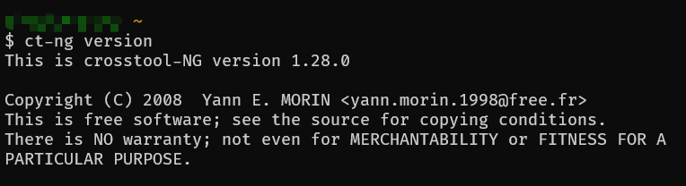

## （可选）配置工具链

使用菜单进行配置或直接使用已经配置好的 [`.config`](config.txt)：

```bash
ct-ng menuconfig
```

配置时的一些注意事项：

1. **Linux 头文件版本**：在满足程序需求的前提下尽量别追新，保持兼容性（本次选择的 Linux 内核版本为 4.4.302）。
2. **glibc / gcc / binutils** 组合要与目标环境匹配；一般直接对齐某个发行版即可（例如 Ubuntu 20.04：`glibc 2.31` + `gcc 9` + `binutils 2.34` 一类组合，具体以 sysroot 中 glibc 和 binutils 版本为准）。
3. 下载 tarball 慢时，可在配置里改为国内镜像（例如清华源）。

## 构建工具链

通过下列命令执行构建

```bash
ct-ng build
```

构建时间较长（1h~2h），日志里若出现下载失败，多半是网络或镜像问题。

构建完成后日志输出如下：

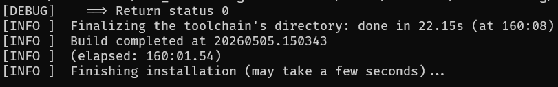

如果编译时碰到 internal compiler error 且位置随机，多半是 cygwin 并行执行时出现问题，建议将并行数降低或改为串行执行。可通过如下命令进行调整。

```bash
ct-ng build.1
```

## 基本功能验证

确认编译器版本（可先将 toolchain 的 bin 目录加入 Path 中）：

```bash
x86_64-linux-gnu-gcc --version
```

输出如下：

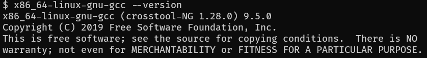

然后通过一个简单的 C 程序（`hello.c`）验证编译效果

```c
#include <stdio.h>
int main()
{
    printf("hello from Cygwin!\n");
    return 0;
}
```

通过 gcc 进行编译，会默认查找头文件并链接到 glibc

```bash
x86_64-linux-gnu-gcc hello.c -o hello
```

并通过 `file` 命令查看二进制情况

```bash
file hello
```

输出如下：

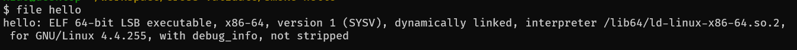

将 hello 程序拷贝至 WSL 中，通过 `ldd` 检查 libc 链接情况

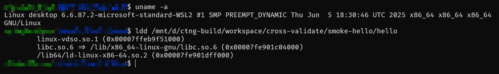

最后执行 hello，预期应该会观察到有 `hello from Cygwin!` 输出，同时返回值为 0

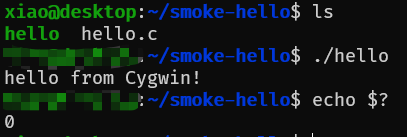


# 交叉编译验证

最后，我们需要结合 sysroot 和编译好的 toolchain，对 CMake 项目进行编译检查，并通过项目内置的单元测试检查功能是否正常。

对于 CMake 的 toolchain 文件，由于我们切换为 WSL 中生成的 sysroot，需要调整 toolchain.cmake 中部分路径和编译选项 ，完整内容如下（`toolchain-focal.cmake`）：

```cmake
set(CMAKE_SYSTEM_NAME Linux)
set(CMAKE_SYSTEM_PROCESSOR x86_64)

set(_P "${CMAKE_CURRENT_LIST_DIR}")
set(CMAKE_C_COMPILER "${_P}/bin/x86_64-linux-gnu-gcc")
set(CMAKE_CXX_COMPILER "${_P}/bin/x86_64-linux-gnu-g++")

set(_SYS "${_P}/x86_64-linux-gnu/sysroot-focal")
set(_LIB "${_SYS}/usr/lib/x86_64-linux-gnu")
set(CMAKE_SYSROOT "${_SYS}")
set(CMAKE_FIND_ROOT_PATH "${_SYS}")

set(CMAKE_C_FLAGS_INIT "-B${_LIB}")
set(CMAKE_CXX_FLAGS_INIT "-B${_LIB}")
set(CMAKE_EXE_LINKER_FLAGS_INIT "-pthread -Wl,-rpath-link,${_LIB}")
set(CMAKE_SHARED_LINKER_FLAGS_INIT "-pthread -Wl,-rpath-link,${_LIB}")

set(CMAKE_FIND_ROOT_PATH_MODE_PROGRAM NEVER)
set(CMAKE_FIND_ROOT_PATH_MODE_LIBRARY ONLY)
set(CMAKE_FIND_ROOT_PATH_MODE_INCLUDE ONLY)
set(CMAKE_FIND_ROOT_PATH_MODE_PACKAGE ONLY)
```

相比 ct-ng 自动生成的 sysroot，Ubuntu 下会多一层标识系统架构的三元组目录（<架构-系统-libc 类型>，例如 `x86_64-linux-gnu`），需要修正库文件的路径：

- 通过 `-B` 指定工具链组件位置（例如 `crt1.o`、`crti.o` 等），将 `/usr/lib` 转换为 `/usr/lib/x86_64-linux-gnu`
- 通过 `-Wl,-rpath-link,<lib-dir>` 指定链接时间接依赖搜索的系统库位置，将 `/usr/lib` 转换为 `/usr/lib/x86_64-linux-gnu`

在 CMake 配置阶段通过 `-DCMAKE_TOOLCHAIN_FILE=...` 指定上述 toolchain 文件路径即可。

为方便直接测试，可将 WSL 与 Cygwin 中的 workspace 用软链接对齐为同一路径，从而保证 ctest 记录的可执行文件路径一致（在 WSL 中运行位于 Windows 文件系统上的构建产物时，通常会有一定性能损耗）。

可通过如下命令创建软链接

```bash
cd ~
ln -s <workspace 在 Cygwin 或 WSL 上的实际路径> workspace
```


## {fmt}

源码：<https://github.com/fmtlib/fmt/releases/download/12.1.0/fmt-12.1.0.zip>

编译命令（Cygwin 中执行）：

```bash
cmake -S . -B build \
	-DFMT_DOC=OFF \
	-DFMT_INSTALL=OFF \
	-DFMT_TEST=ON \
	-DCMAKE_TOOLCHAIN_FILE=$toolchain_path \
	-G Ninja
cmake --build build
```

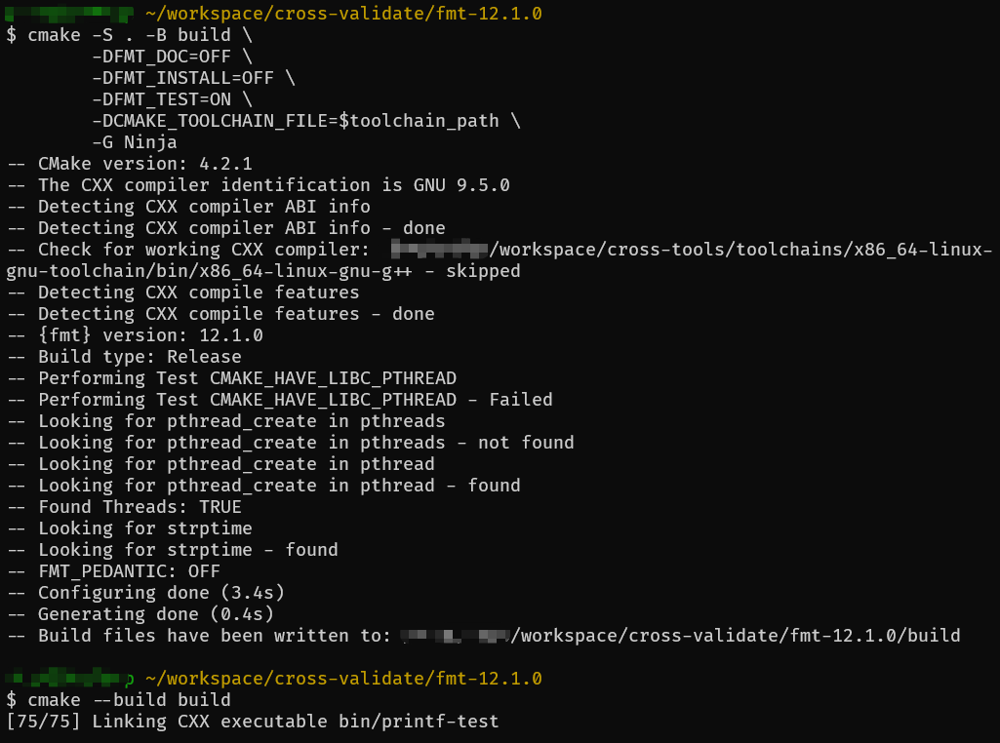

WSL 中 ctest 执行结果：

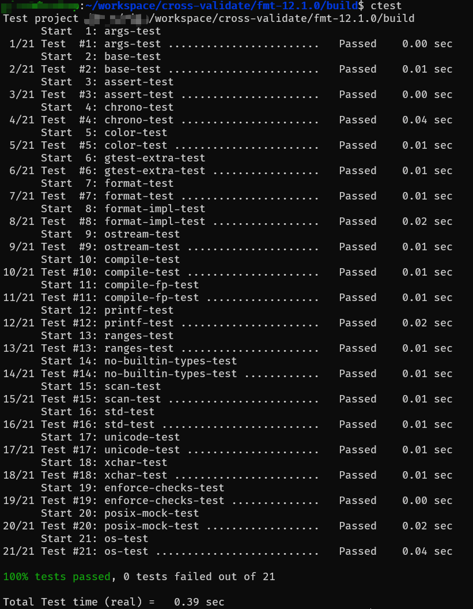

## Catch2

源码：<https://github.com/catchorg/Catch2/archive/refs/tags/v3.14.0.tar.gz>

编译命令（Cygwin 中执行）：

```bash
cmake -S . -B build \
	-DCATCH_DEVELOPMENT_BUILD=ON\
	-DCATCH_INSTALL_DOCS=OFF \
	-DCATCH_INSTALL_EXTRAS=OFF \
	-DCATCH_ENABLE_REPRODUCIBLE_BUILD=ON \
	-DCATCH_BUILD_TESTING=ON \
	-DCATCH_BUILD_EXAMPLES=ON \
	-DCATCH_BUILD_EXTRA_TESTS=ON \
	-DCATCH_BUILD_BENCHMARKS=ON \
	-DCMAKE_TOOLCHAIN_FILE=$toolchain_path \
	-G Ninja
cmake --build build
```

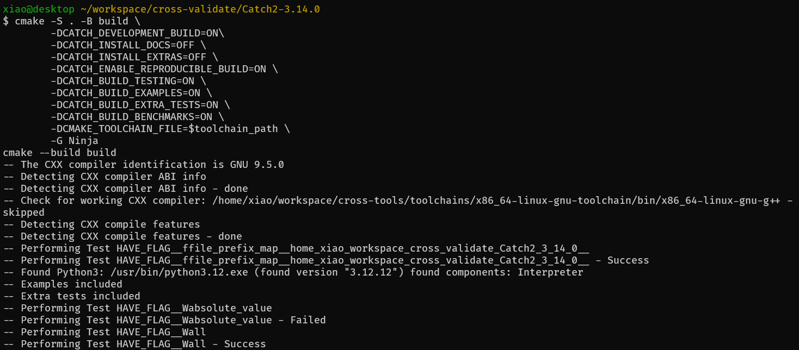

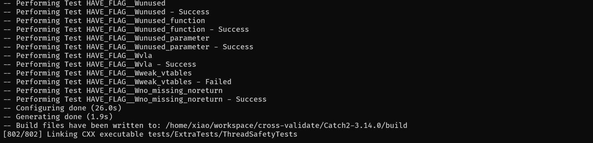

WSL 中 ctest 执行结果（CMake 配置阶段读取到了宿主机器上安装的 Python，但 WSL 内暂未安装 Python 3.12，导致 Catch2 的这几个测试用例无法运行，直接跳过）：

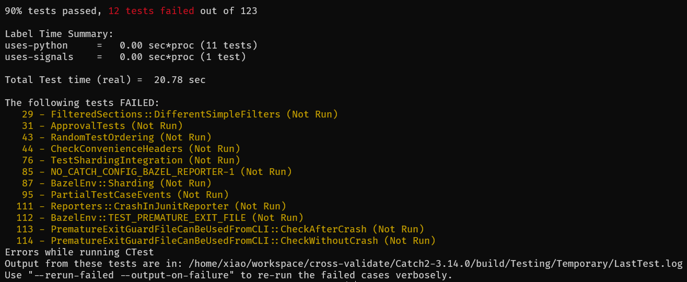


## sqlite

源码：https://sqlite.org/2026/sqlite-amalgamation-3530100.zip

由于 sqlite 的测试依赖 tcl，且需要编译 sqlite-tcl 插件才行，较为繁琐，这里仅做基本的功能验证。

准备一个 `CMakeLists.txt` 用于编译 sqlite

```cmake
cmake_minimum_required(VERSION 3.16)
project(sqlite3-amalgamation C CXX)

enable_testing()

set(CMAKE_C_STANDARD 99)
set(CMAKE_C_STANDARD_REQUIRED ON)

set(THREADS_PREFER_PTHREAD_FLAG ON)
find_package(Threads REQUIRED)

set(SQLITE_DIR ${CMAKE_SOURCE_DIR})

add_compile_definitions(
    SQLITE_THREADSAFE=1
    SQLITE_ENABLE_FTS5
    SQLITE_ENABLE_JSON1
)

add_library(sqlite3 STATIC
    ${SQLITE_DIR}/sqlite3.c
)

target_include_directories(sqlite3 PUBLIC
    ${SQLITE_DIR}
)

target_link_libraries(sqlite3 PUBLIC
    Threads::Threads
    dl
    m
)

add_executable(sqlite3_cli
    ${SQLITE_DIR}/shell.c
)

target_link_libraries(sqlite3_cli PRIVATE
    sqlite3
)

add_test(
    NAME sqlite_basic_test
    COMMAND sqlite3_cli :memory: ".read ${CMAKE_SOURCE_DIR}/test.sql"
)

set_tests_properties(sqlite_basic_test PROPERTIES
    PASS_REGULAR_EXPRESSION "ok"
)
```

测试的 sql 文件

```sqlite
CREATE TABLE t(x INTEGER);
INSERT INTO t VALUES(42);
SELECT 'ok';
```

编译命令（Cygwin 中执行）：

```bash
cmake -S . -B build \
	-DCMAKE_TOOLCHAIN_FILE=$toolchain_path
cmake --build build
```

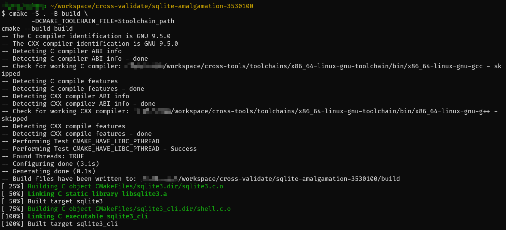

WSL 中 ctest 执行结果：

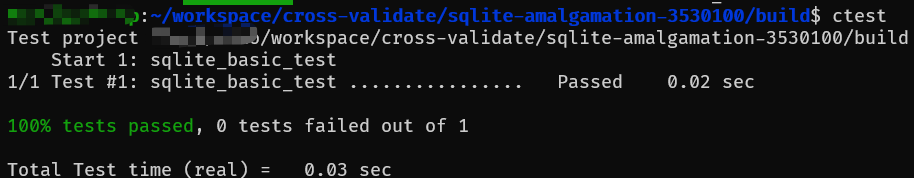

WSL 中 sqlite3_cli 调用输出示例：

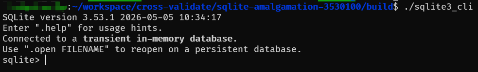

## Abseil

- Abseil 源码：<https://github.com/abseil/abseil-cpp/releases/download/20260107.1/abseil-cpp-20260107.1.tar.gz>
- GoogleTest 源码：<https://github.com/google/googletest/releases/download/v1.17.0/googletest-1.17.0.tar.gz>

Abseil 的测试依赖 GoogleTest，需要将两个源码都解压出来

编译命令（Cygwin 中执行）：

```bash
cmake -S . -B build -G Ninja \
  -DCMAKE_TOOLCHAIN_FILE=$toolchain_path \
  -DCMAKE_BUILD_TYPE=Release \
  -DCMAKE_CXX_STANDARD=17 \
  -DCMAKE_CXX_STANDARD_REQUIRED=ON \
  -DBUILD_TESTING=ON \
  -DABSL_BUILD_TESTING=ON \
  -DABSL_ENABLE_INSTALL=OFF \
  -DABSL_LOCAL_GOOGLETEST_DIR=../googletest-1.17.0
cmake --build build
```

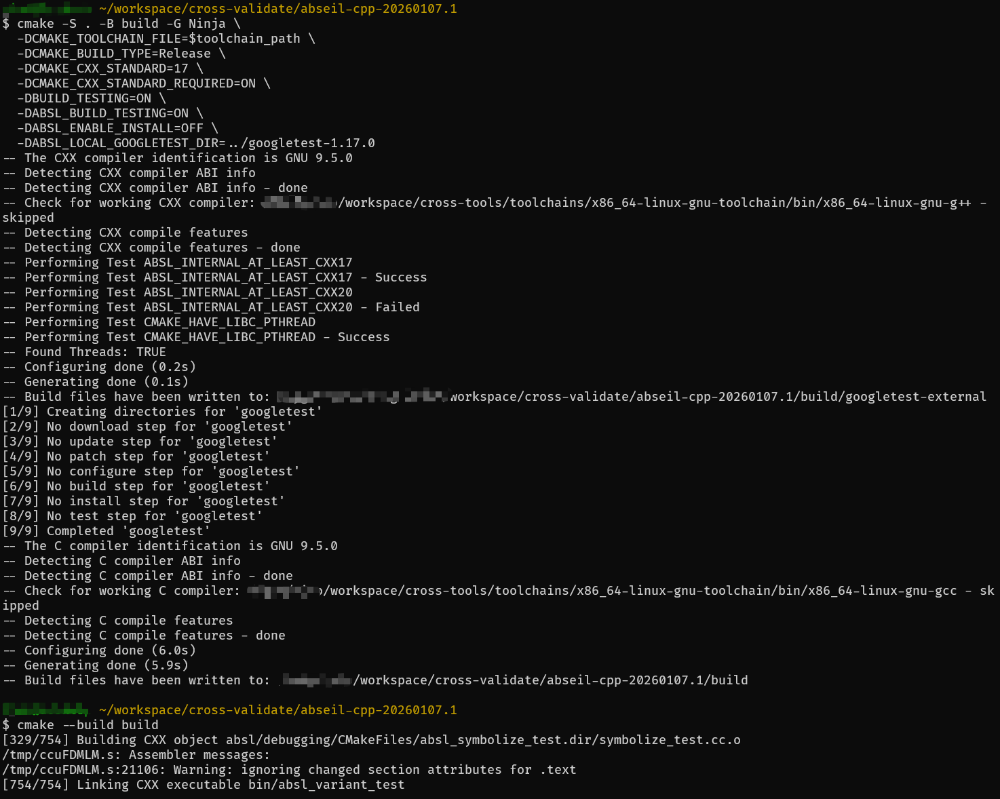

WSL 中 ctest 执行结果：

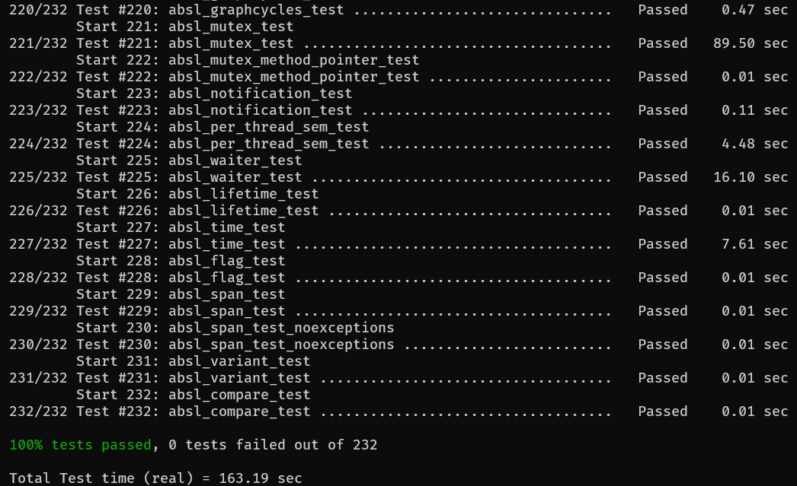

## GLFW

源码：<https://github.com/glfw/glfw/archive/refs/tags/3.4.tar.gz>

编译命令（Cygwin 中执行）：

```bash
cmake -S . -B build -G Ninja \
  -DCMAKE_TOOLCHAIN_FILE=$toolchain_path \
  -DCMAKE_BUILD_TYPE=Release \
  -DGLFW_BUILD_EXAMPLES=ON \
  -DGLFW_BUILD_TESTS=ON \
  -DGLFW_BUILD_DOCS=OFF \
  -DGLFW_BUILD_WAYLAND=OFF
cmake --build build
```

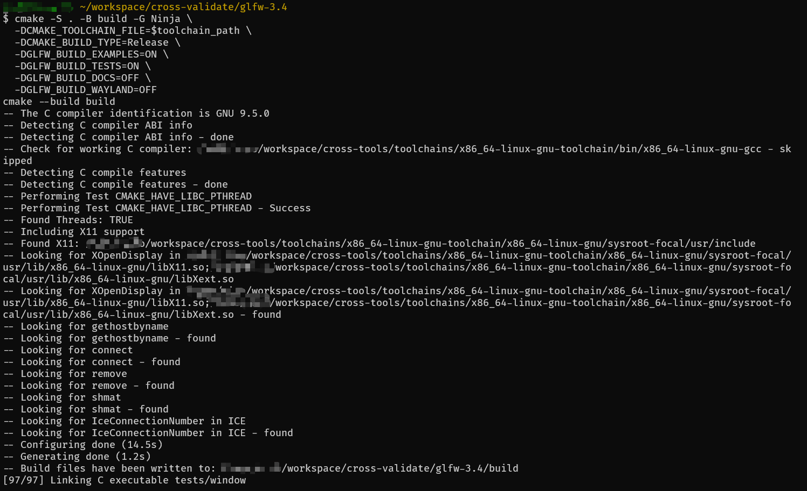

由于 GLFW 不支持 ctest，只能手动执行 `build/tests` 下的单元测试，而且必须手动关闭弹出的 GUI 窗口。

```bash
set -euo pipefail

# 将 BIN 设为测试可执行文件所在目录（请按实际构建输出修改，例如 GLFW 常为 build/tests）
BIN="${BIN:-build/tests}"

uname -a

if [[ ! -d "${BIN}" ]]; then
  echo "Not found: ${BIN}" >&2
  exit 1
fi

failed=0
n=0
shopt -s nullglob
for path in "${BIN}"/*; do
  [[ -f "${path}" && -x "${path}" ]] || continue
  echo "==> ${path}"
  set +e
  "${path}" > /dev/null 2>&1
  rc=$?
  set -e
  if [[ "${rc}" -ne 0 ]]; then
    echo "FAILED: ${path} (exit ${rc})" >&2
    failed=$((failed + 1))
  fi
  n=$((n + 1))
done

echo "==> Done: ${n} program(s), ${failed} failed."
[[ "${failed}" -eq 0 ]]
```

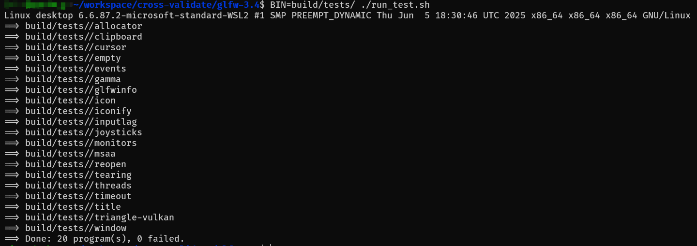

同时下图展示了 WSL 下运行 glfw heightmap 案例的效果：

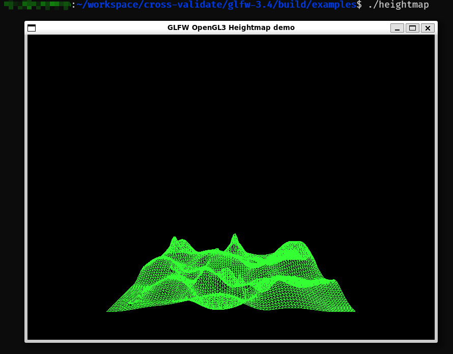